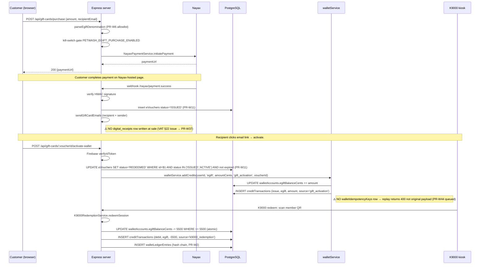
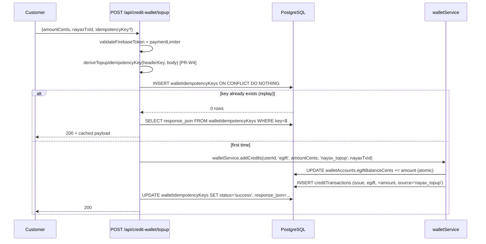
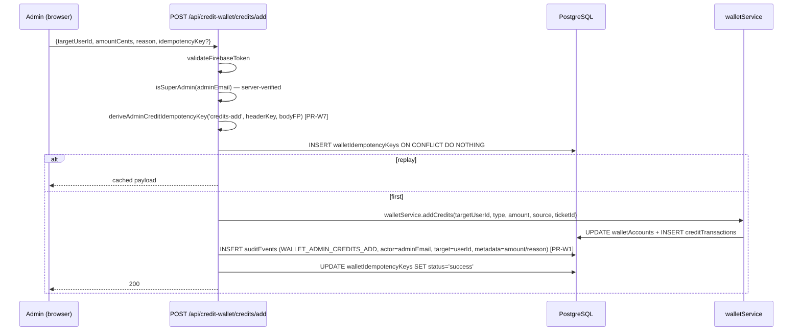
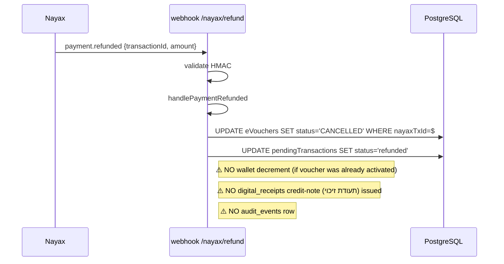
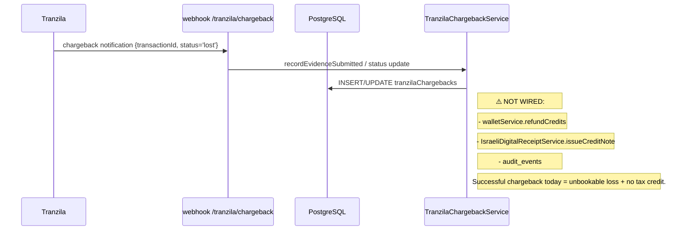
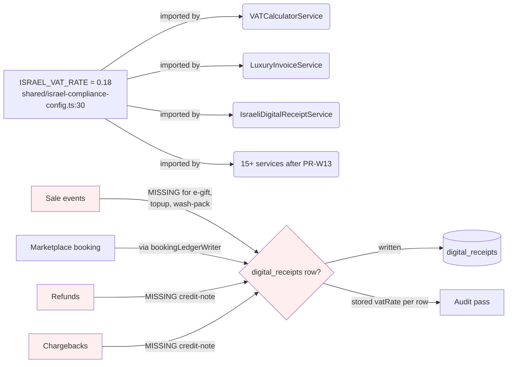
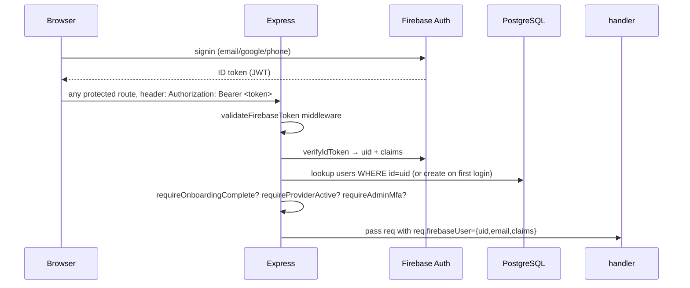
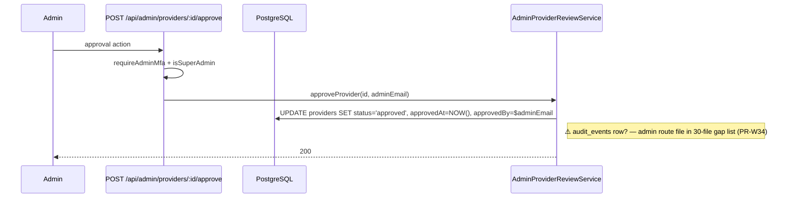

# Event Flow Map — PR-W21 (Mega Phase A.4)

**Status:** READ-ONLY architectural map. Mermaid sequence diagrams + per-flow trace.
**Scope:** 10 end-to-end flows annotated with route / service / table / idempotency / audit / external call / failure path.
**Date:** 2026-05-05

---

## 0. Action items extracted

(All findings already surfaced in PR-W18 / PR-W19 / PR-W20; this PR makes the relationships visual.)

| Severity | Finding | Tracked PR |
|---|---|---|
| 🔴 P0 | `/api/unified/wallet/deduct-funds` writes wallet, no ledger, no idempotency | PR-W47 |
| 🔴 P0 | 19 SQL table-name collisions (`bookings ×3`, `payments ×3`, …) | PR-W48 |
| 🔴 P0 | 30 admin route files write zero `audit_events` | PR-W34 |
| 🟠 P1 | `/api/loyalty/user-profile` leaks `user.giftCardBalance` | PR-W15 |
| 🟠 P1 | Tranzila chargeback never reverses wallet or issues credit invoice | PR-W28 (plan) → impl PR |
| 🟠 P1 | E-gift purchase writes no `digital_receipts` row at sale (VAT timing §22) | PR-W37 (plan) → impl PR |

---

## 1. Flow A — E-gift purchase → activation → spend

### Diagram



### Key facts

| Aspect | Value |
|---|---|
| Routes | `POST /api/gift-cards/purchase`, `POST /api/gift-cards/:voucherId/activate-wallet`, K9000 redeem |
| Services | `NayaxPaymentService`, `walletService`, `K9000RedemptionService` |
| Tables | `e_vouchers`, `wallet_accounts`, `credit_transactions`, `wallet_ledger_entries`, `pending_transactions` |
| Idempotency | Purchase: Nayax owns it. Activate-wallet: atomic UPDATE only (no response cache). K9000: per-session lock. |
| Audit | NONE on purchase / activation. ✅ on K9000 (via `creditTransactions` + `walletLedgerEntries`) |
| External | Nayax HMAC-signed webhook |
| Failure | Purchase fail → no eVoucher; activate-wallet replay → 400 "already activated" (P1 UX issue); K9000 short-balance → 409 RACE_CONDITION |
| Hard-stop adherence | OK — Nayax untouched; K9000 redemption locked |

---

## 2. Flow B — Wash package purchase → K9000 redeem

### Diagram

```mermaid
sequenceDiagram
  participant U as Customer
  participant API as Express
  participant N as Nayax
  participant DB as PostgreSQL
  participant W as walletService
  participant K as K9000 kiosk

  U->>API: POST /api/checkout {packageId}
  API->>DB: storage.getWashPackage(packageId)
  API->>N: NayaxOnlinePaymentService.createCheckoutSession
  N-->>API: paymentUrl
  API->>DB: insert washHistory status='pending'
  API-->>U: 200 {paymentUrl}

  N->>API: webhook /nayax/checkout-payment payment.success
  API->>API: verify HMAC + Redis dedup (24h)
  API->>DB: SELECT washHistory WHERE id=$id; idempotent return if already 'completed'
  API->>API: amount validation (1-agora tolerance)
  API->>W: walletService.addCredits(userId, 'wash_package', washCount, 'wash_package_purchase', washHistoryId)  [PR-W10]
  W->>DB: UPDATE walletAccounts.washPackageCredits += washCount
  W->>DB: INSERT creditTransactions (issue, wash_package, +N units)
  API->>DB: UPDATE users.totalSpent + loyaltyPoints (NOT washBalance — bleed sealed PR-W10)
  API->>DB: UPDATE washHistory status='completed'

  K->>API: K9000 redeem (member QR, source='wash_package')
  API->>API: K9000RedemptionService.redeemSession
  API->>DB: UPDATE walletAccounts.washPackageCredits -= 1 WHERE > 0 (atomic)
  API->>DB: INSERT creditTransactions (debit, wash_package, -1 unit)
  API->>DB: INSERT walletLedgerEntries (hash chain)
```

### Key facts

| Aspect | Value |
|---|---|
| Routes | `POST /api/checkout`, webhook `/nayax/checkout-payment`, K9000 redeem |
| Services | `NayaxOnlinePaymentService`, `walletService`, `K9000RedemptionService` |
| Tables | `wash_packages`, `wash_history`, `wallet_accounts`, `credit_transactions`, `wallet_ledger_entries`, `nayax_transactions`, `users` |
| Idempotency | Webhook: Redis SET NX (24h). DB: status='completed' check. K9000: per-session lock. |
| Audit | webhook log; ledger row gives auditable trail |
| External | Nayax (signed webhook) |
| Failure | Webhook signature fail → 401; amount mismatch → 400 + log; redeem race → 409 |
| Hard-stop adherence | ✅ PR-W10 sealed the bleed |

---

## 3. Flow C — Wallet topup

### Diagram



### Key facts

| Aspect | Value |
|---|---|
| Route | `POST /api/credit-wallet/topup` |
| Service | `walletService.addCredits` |
| Tables | `wallet_accounts`, `credit_transactions`, `wallet_idempotency_keys` |
| Idempotency | ✅ PR-W4 (header-key OR body-fingerprint) |
| Audit | NONE for `/topup` (only `/credits/add` writes audit). Ledger row covers replay. |
| External | None (Nayax tx ID is reference only) |
| Failure | INSERT key → DELETE on credit error so client can retry |
| Hard-stop adherence | OK |

---

## 4. Flow D — Admin credit inject

### Diagram



### Key facts

| Aspect | Value |
|---|---|
| Route | `POST /api/credit-wallet/credits/add` and `POST /api/credit-wallet/admin/inject` |
| Service | `walletService.addCredits` |
| Tables | `wallet_accounts`, `credit_transactions`, `wallet_idempotency_keys`, `audit_events` |
| Idempotency | ✅ PR-W7 |
| Audit | ✅ PR-W1 |
| External | None |
| Hard-stop adherence | OK |

---

## 5. Flow E — K9000 redemption (5 source types)

### Diagram

```mermaid
sequenceDiagram
  participant K as K9000 terminal
  participant API as POST /api/wallet/nayax/redeem-loyalty
  participant DB as PostgreSQL
  participant SvcK as K9000RedemptionService

  K->>API: {qrData, terminalId, stationId} + X-Terminal-Secret
  API->>API: NAYAX_TERMINAL_SECRET == header (fail-closed)
  API->>API: parse qrData; verify type='PETWASH_VIP_LOYALTY'
  API->>API: timestamp ≤ 5 min (anti-replay)
  API->>SvcK: validateSession + redeemSession(source)

  alt source=wash_package
    SvcK->>DB: UPDATE walletAccounts.washPackageCredits -=1 WHERE >0
  else source=wallet_balance
    SvcK->>DB: UPDATE walletAccounts.cashWalletBalanceCents -=5500 WHERE >=5500
  else source=gift_credit
    SvcK->>DB: UPDATE walletAccounts.egiftBalanceCents -=5500 WHERE >=5500
  else source=loyalty_benefit
    SvcK->>DB: UPDATE walletAccounts.loyaltyPointsBalance -=N WHERE >=N AND tier∈{gold..vip}
  else source=promo_coupon
    SvcK->>DB: UPDATE walletAccounts.promoBalanceCents -=5500 WHERE >=5500
  end

  SvcK->>DB: INSERT creditTransactions (debit, source, -amount)
  SvcK->>DB: INSERT walletLedgerEntries (hash chain, PR-W2)
  SvcK->>DB: INSERT eVoucherRedemptions
  SvcK-->>K: {success, remainingBalance, unit}
```

### Key facts

| Aspect | Value |
|---|---|
| Route | `POST /api/wallet/nayax/redeem-loyalty` |
| Service | `K9000RedemptionService.redeemSession` |
| Tables | `wallet_accounts`, `credit_transactions`, `wallet_ledger_entries`, `e_voucher_redemptions` |
| Idempotency | QR timestamp 5 min + status flip (per-session lock). NO `walletIdempotencyKeys` row but functionally equivalent. |
| Audit | ledger row covers it |
| External | Terminal HMAC (`NAYAX_TERMINAL_SECRET`) |
| Failure | Insufficient balance → 402 INSUFFICIENT_*; race → 409 RACE_CONDITION; expired QR → 410 |
| Hard-stop adherence | ✅ K9000 runtime locked, never modified |

---

## 6. Flow F — Refunds (Nayax-side)

### Diagram



### Key facts

| Aspect | Value |
|---|---|
| Route | `POST /api/webhooks/nayax/refund` |
| Service | `NayaxPaymentService.handlePaymentRefunded` |
| Tables | `e_vouchers`, `pending_transactions` |
| Idempotency | Webhook HMAC + Redis dedup |
| Audit | NONE |
| **Gaps** | (1) if voucher was already activated to wallet, the `walletAccounts.egiftBalanceCents` was credited but the refund leaves it untouched. (2) No credit invoice issued. (3) No audit row. |

→ **Action:** PR-W28 (Chargeback Framework Plan) covers this end-to-end. Implementation PR follows.

---

## 7. Flow G — Tranzila chargeback (architecture only, no live charge)

### Diagram



### Key facts

| Aspect | Value |
|---|---|
| Route | `POST /api/webhooks/tranzila/chargeback` |
| Service | `TranzilaChargebackService.recordEvidenceSubmitted` |
| Tables | `tranzila_chargebacks` |
| Idempotency | (TBD — verify in PR-W27 webhook forensics) |
| Audit | NONE |
| **Gap (P0 regulatory)** | The function `IsraeliDigitalReceiptService.issueCreditNote` exists at line `:889-984` but is NEVER called from the chargeback path. Israeli §47 obligation breached. |
| Hard-stop adherence | ✅ no live Tranzila charge in this PR |

→ **Action:** PR-W28 (Chargeback Framework Plan) makes this explicit; implementation needs CEO sign-off.

---

## 8. Flow H — VAT issuance (read-side trace)

### Diagram



### Key facts

| Aspect | Value |
|---|---|
| Canonical rate | `ISRAEL_VAT_RATE = 0.18` (`shared/israel-compliance-config.ts:30`) — single source after PR-W13 |
| VAT receipt service | `IsraeliDigitalReceiptService.issueReceipt` + `issueCreditNote` |
| Per-row VAT rate stored | YES (3 of 5 generators stash rate; 1 broken; 1 unknown — see PR-W13 audit) |
| **Gap A — VAT timing on prepaid vouchers** | Israeli VAT §22: output VAT recognised at SALE of stored-value voucher. Today: NO `digital_receipts` row at sale of e-gift / topup / wash-pack. **Output VAT not booked.** |
| **Gap B — credit invoice on refund** | `issueCreditNote()` exists; never called from Nayax refund or Tranzila chargeback paths. |
| **Gap C — env-driven defaults** | All `process.env.VAT_RATE || …` defaults now derive from `ISRAEL_VAT_RATE` (PR-W13). |

→ **Action:** PR-W37 (D.4 VAT/Compliance Map plan) → implementation PR with accountant sign-off.

---

## 9. Cross-cutting flows (auth, onboarding, provider approval, notifications)

### 9.1 Auth flow (Firebase + session)



### 9.2 Provider approval



### 9.3 Notification dispatch (booking confirmed → SMS/email)

(Skipped detailed sequence — see `BookingConfirmationEmailService` + `PetWashNotificationEngine`. Multi-channel: email/sms/whatsapp/push, each with `communicationPreferences` gating.)

---

## 10. Recommended next PRs (already queued)

| PR | Purpose |
|---|---|
| PR-W22 | Duplicate Constant Detector script (next this session) |
| PR-W23 | Dead Code Scanner script |
| PR-W43 | PR template + delivery checklist |
| PR-W34 | Wire `logAuditEvent` into 30 admin route files |
| PR-W47 | Fix `UnifiedWalletService.deductFunds` |
| PR-W48 | Collapse 19 duplicate table TS exports |
| PR-W28 | Chargeback Framework Plan |
| PR-W37 | VAT + Compliance Map (timing + credit-note) |
| PR-W44 | Idempotency-cache on gift-cards activate-wallet |
| PR-W45 | Idempotency on escrow release/refund/dispute/auto-release |
| PR-W46 | Idempotency on treasury mark-paid / reconcile-sweep |
| PR-W15 | Read-side migration to `walletAccounts.*` |
| PR-W16 | Orphan balance migration (CEO sign-off) |

---

End of map. All claims grep-cited from PR-W18/W19/W20. No code changed. No money moved.
