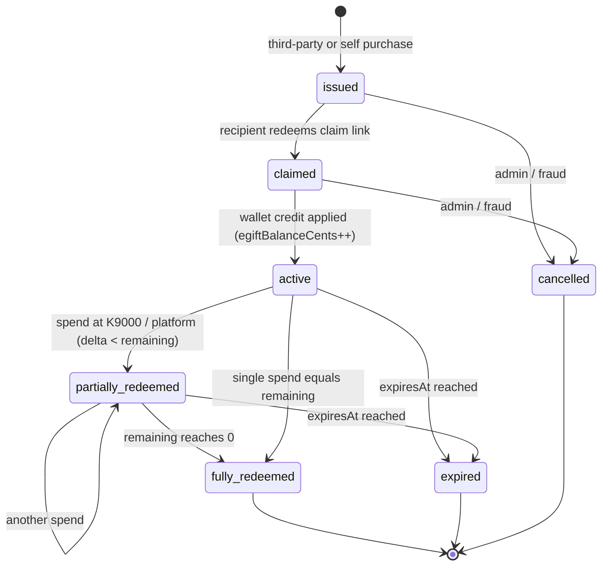
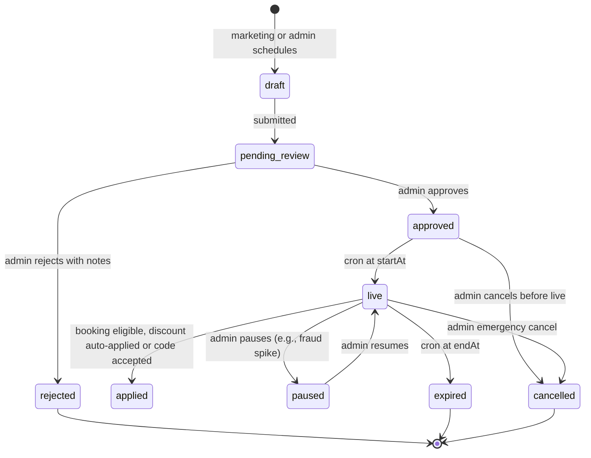

# SDD: Unified Commerce, Promotions & Pricing System (2026)

| | |
|---|---|
| **Status** | Draft (design only — no code, no PRs) |
| **Date** | 2026-05-25 |
| **Author** | SDD Writer Agent (PetWash) |
| **Feature flag (umbrella)** | `ff.commerce.unified.enabled` (default **OFF**) |
| **Sub-flags** | `ff.packages.v2`, `ff.promo.engine.v2`, `ff.pricing.dynamic`, `ff.events.engine`, `ff.shop.luxury` |
| **Method** | `.github/skills/sdd-writer-iterative/SKILL.md` |
| **Requested by** | CEO (nir.h@petwash.co.il) |
| **Strategic anchors** | docs/architecture/2026-petwash-octopus-vision.md, docs/architecture/00-master-roadmap.md, docs/architecture/OCTOPUS_ARCHITECTURE_RESET_RFC.md |

---

## 1. Executive summary

PetWash today has **five overlapping commerce primitives that were built at different times by different efforts**, with three different "ledgers" and at least three different "discount" code paths. Concretely:

- **Gift cards (תווי שי):** at least three parallel systems live in the schema — `eVouchers` (`shared/schema.ts:423`), `petWashVouchers2025` + `voucherUsageLedger` (`shared/schema.ts:464,523`), and `pendingTransactions.isGiftCard` (`shared/schema.ts:664`). Strategy already locked in prior turns: gift cards are wallet top-up by third party; VAT is recognised at SPEND not purchase (multi-purpose voucher per Israeli ITA / EU 2019 directive); ES256 signature lives in `voucherUsageLedger` (`shared/schema.ts:546`).
- **Wash packages (חבילות שטיפה):** `washPackages` table exists (`shared/schema.ts:410`) and a working customer-facing page exists (`client/src/pages/Packages.tsx`) hard-coding `WASH_PRICE = 55` and four bundle tiers (1/3/5/10 washes, 0/5/8/12 % discount). There is **no `user_package_balances` table** — units are tracked only as `walletAccounts.washPackageCredits` (single integer, `shared/schema.ts:11501`), which cannot model multi-package expiry or per-package validity.
- **Coupons / discounts we give:** `coupons` + `couponRedemptions` + `couponEligibilityRules` + `couponDeliveryEvents` (`shared/schema.ts:570-651`) plus a full `CouponService` with stackability matrix, abuse gate, atomic redemption, and 8-platform scope map (`server/services/CouponService.ts:1-280, 104-116`).
- **Event-based promotions:** `petAwarenessDays` + `promotionalCampaigns` + `campaignRedemptions` tables exist (`shared/schema.ts:6379-6500`) AND a parallel hard-coded TypeScript calendar `SPECIAL_DAYS_2026` lives in `server/services/globalPromotions.ts:38-232` with Black Friday at `2026-11-27` and `applyPromotionDiscount` enforcing a non-stacking rule (`globalPromotions.ts:288-303`). **Two sources of truth for the same calendar.**
- **Dynamic pricing:** there is NO `price_history` table; service prices live scattered across `pricingPackages` jsonb (`schema.ts:4054`), `intendedPricing` jsonb (`schema.ts:5209`), `petTypePricing` jsonb (`schema.ts:11000`), `addonPricing` jsonb (`schema.ts:11004`), `pricingRules` jsonb (`schema.ts:11009`), and (for K9000) a hard-coded `WASH_PRICE = 55` in the client (`Packages.tsx:16`). No audit trail of who raised a price, when, why.

What this SDD locks down: **one commerce engine** that treats all five primitives as composable inputs into one priced-quote pipeline, every quote settling through the canonical `walletLedgerEntries` ledger (`schema.ts:11675`), every customer-visible invoice issued through `FinancialDocumentService` (`server/services/FinancialDocumentService.ts:55-127`) so VAT is recognised correctly per the Israeli tax matrix already encoded in `VATCalculatorService` (`server/services/VATCalculatorService.ts:5`).

**What we are NOT building** in any of this SDD's PRs: a new wallet ledger, a new K9000/Nayax runtime, a new Tranzila integration, a new KYC system, a redesign of the Shop visual without an operator-approved reference image (§10). All five of those are crown-jewel runtime per `.claude/skills/petwash-platform/SKILL.md:194-200` and remain untouched.

The shop visual upgrade (§10) is a **separate, gated PR track**. Per PR #459, no implementation PR may open until the operator has committed an approved reference image at `client/public/design-reference/shop-approved.png`. The SDD lists requirements; the operator's PNG is the implementation specification.

## 2. Goals / Non-goals

**Goals**

- One commerce engine that resolves every order through a single priced-quote function with deterministic stacking rules.
- One canonical pricing source per service, with full append-only price-history audit.
- One canonical event-promotion calendar (the DB table `promotionalCampaigns`), with `SPECIAL_DAYS_2026` retired into a one-time seed.
- One canonical wash-package model that supports multiple concurrent active packages per user, per-package expiry, per-package wash-type eligibility, and per-package non-transferability rules.
- Every monetary debit/credit flows through `walletLedgerEntries`. Every customer-facing tax document flows through `FinancialDocumentService`.
- Israeli consumer-law compliance on discount advertising (genuine prior-price within prior 30 days; comparison-price rules — §9.1).
- Israeli VAT treatment correct per primitive (line-item discount vs reduced unit price — §9.2).
- Israeli refund/cancellation handling correct: lower of 5 % or 100 ILS cancellation fee; `חשבונית זיכוי` (credit note) issued; VAT reversed (§9.3).
- Admin can change prices, schedule events, issue codes, and freeze stacking — every change audited.
- The Shop surface is upgraded visually only after the operator drops an approved reference image (§10).
- All schema changes are additive and flagged **REQUIRES APPROVAL** per `petwash-platform/SKILL.md:194`.

**Non-goals (out of scope for this SDD and the first PRs)**

- No change to the wallet runtime, ledger schema, or hash-chain integrity (`shared/schema.ts:11718-11719` `previousHash` / `entryHash` stays as-is).
- No change to K9000 / Nayax runtime, polling, terminal IDs, or webhook handling. Visibility only (per `petwash-platform/SKILL.md:199`).
- No change to Tranzila behaviour (per `petwash-platform/SKILL.md:200`).
- No new payment processor in this SDD. The Sumit UPay rail decision is a separate Mission-5 prerequisite, referenced only at the integration seam.
- No KYC / identity changes — Au10tix and the identity-routing SDD (`docs/design/2026-05-25-smart-identity-routing.md`) handle that.
- No franchise / municipal portal redesign.
- No retroactive merge of existing duplicate voucher rows across `eVouchers` / `petWashVouchers2025` — that is a one-time, separately-approved data project (§14, open question).
- No code in this SDD. No PRs from this SDD. The Shop visual upgrade has its own precondition (§10).

## 3. Repository context (what exists today)

### 3.1 Money & ledger primitives (reuse — do not reinvent)

| Component | File:line | What it does | Reused as |
|---|---|---|---|
| `walletLedgerEntries` | `shared/schema.ts:11675` | Append-only, double-entry, hash-chained ledger with bucket discrimination (`cash_wallet`, `egift`, `promo`, `wash_package`, `loyalty`, `payment_clearing`, `service_revenue`, `provider_payout`) | Single canonical money mutation surface for every primitive in this SDD |
| `walletAccounts` | `shared/schema.ts:11493` | Cached balances per user/wallet, including `cashWalletBalanceCents`, `egiftBalanceCents`, `washPackageCredits`, `promoBalanceCents`, `loyaltyPointsBalance` | Read-side aggregate (already rebuilt from `walletLedgerEntries`) |
| `walletHolds` | `shared/schema.ts:11823` | Hold-before-capture for bookings (status: `active | captured | released | expired | cancelled`) | Used as-is for promo-locked bookings (e.g., "Black Friday rate held for 24h while user confirms") |
| `walletIdempotencyKeys` | `shared/schema.ts:11760` | Stores full response per idempotency key | Used as-is on every new commerce write endpoint |
| `walletJtiRegistry` | `shared/schema.ts:11777` | Token replay protection (kiosk_qr, egift, pass, topup) | New `promo_redeem` and `package_redeem` token types added (§7.5) |
| `walletFraudLog` | `shared/schema.ts:11795` | Suspicious-event audit (outcome: `allowed | flagged | blocked`) | All promo-abuse signals route here |
| `walletReconciliationRuns` | `shared/schema.ts:11735` | Daily proof-pass + reconciliation audit | Promo/package balances picked up by existing reconciliation — no new pipeline needed |

### 3.2 Existing commerce surfaces (extend, do not duplicate)

| Component | File:line | Status | Action |
|---|---|---|---|
| `washPackages` | `shared/schema.ts:410` | Production — 5 fields (name, nameHe, price, washCount, isActive) | **EXTEND** with bilingual descriptions already present + `validityDays`, `serviceEligibility`, `transferable`, `priceVersion` (§7.1) |
| `petWashVouchers2025` + `voucherUsageLedger` | `shared/schema.ts:464,523` | Production — ES256-signed, hash-chained, 7-star tier theming | **PRIMARY** gift-card system. Other voucher tables marked legacy (§14 open question) |
| `eVouchers` + `eVoucherRedemptions` + `eVoucherEvents` | `shared/schema.ts:423,444,455` | Production — earlier voucher generation | **LEGACY** — kept readable, no new writes (gated by feature flag in Phase 4) |
| `coupons` + `couponRedemptions` + `couponEligibilityRules` + `couponDeliveryEvents` | `shared/schema.ts:570-651` | Production — full engine fields (campaignName, discountType, stackable, scopeType, channelSource, minSpendCents) | **REUSED AS-IS** for promo-code primitive |
| `CouponService` | `server/services/CouponService.ts:129` | Production — atomic validation, stackability matrix, abuse gate, scope map | **REUSED AS-IS** as the promo-code execution engine |
| `petAwarenessDays` + `promotionalCampaigns` + `campaignRedemptions` | `shared/schema.ts:6379,6417,6475` | Production — 30+ fields including `targetSegments`, `discountType`, `promoCode`, `isAutoApply`, `maxRedemptions`, `requiresManualReview` | **PRIMARY** event-promotion system. `globalPromotions.ts` retired to seed-only (§5.5) |
| `SPECIAL_DAYS_2026` | `server/services/globalPromotions.ts:38` | Production — hard-coded TypeScript calendar with 12 events including Black Friday (2026-11-27, 25 %) | **MIGRATE** rows to `promotionalCampaigns` as a one-time seed, then retire (§5.5) |
| `walletAccounts.washPackageCredits` | `shared/schema.ts:11501` | Production — single integer credit count | **DEPRECATED** in favour of `user_package_balances` rows (§7.2). The aggregate field stays as a cached sum during cutover. |
| `washHistory` | `shared/schema.ts:556` | Production — per-wash record with `originalPrice` / `discountApplied` / `finalPrice` | **REUSED**; commerce engine populates the same fields |
| `Packages.tsx` (customer view) | `client/src/pages/Packages.tsx:16,29` | Production — hard-coded `WASH_PRICE = 55` + four-tier `packageOptions` | **REPLACED** by DB-driven render once §7.1 + admin CRUD exist; visual unchanged until §10 reference lands |
| `Shop.tsx` | `client/src/pages/Shop.tsx:1` | Production — categories preview with waitlist, **no invented prices** (per owner direction 2026-05-24, lines 4-15) | **VISUAL UPGRADE GATED BY §10** |

### 3.3 Tax & invoice primitives (reuse)

| Component | File:line | Use |
|---|---|---|
| `VATCalculatorService` | `server/services/VATCalculatorService.ts:5,46,52` | Single source of truth for Israeli VAT 18 %. K9000 (100 % revenue) vs marketplace (15 % commission) formulas already encoded. |
| `FinancialDocumentService` | `server/services/FinancialDocumentService.ts:55,83` | Document reference issuance (`PW-EGR` for eGift redemption, `PW-RFD` for refund, etc.). Idempotent per `idempotency_key`. |
| `IsraeliInvoiceGenerator` | `server/services/IsraeliInvoiceGenerator.ts` | Builds the Hebrew invoice payload |
| `SumitClient` + `SumitDispatcher` | `server/services/SumitClient.ts`, `SumitDispatcher.ts` | Sumit posting; one Sumit invoice at spend-time per the strategy lock |
| `providers.taxIdType` | `shared/schema.ts:9203,9356` | Currently a 2-value enum (`osek_patur | osek_murshe`); the operator brief and `petwash-platform/SKILL.md` §364 reference a 3-way classification (`patur | murshe | chevra | unknown`). **Open question — §12.7.** |

### 3.4 Gaps and defects found during review

| # | Gap | Evidence | Severity |
|---|---|---|---|
| C1 | Hard-coded wash price `55 ILS` in client | `client/src/pages/Packages.tsx:16` | Medium — must move to DB before any admin price-change PR |
| C2 | Two sources of truth for event-promotion calendar | DB `promotionalCampaigns` vs `SPECIAL_DAYS_2026` const | High — drift risk; the const has Black Friday at 2026-11-27, DB may have a different date if anyone uses the admin UI |
| C3 | Three parallel gift-card systems | `eVouchers`, `petWashVouchers2025`, `pendingTransactions.isGiftCard` | High — strategy is to pick one (`petWashVouchers2025` per §3.2) and freeze others |
| C4 | No `price_history` table; price changes leave no audit row | grep returns no `price_history`, no `service_price_history` | High — required for Israeli consumer-law "genuine prior price" compliance (§9.1) |
| C5 | No `user_package_balances` table | `walletAccounts.washPackageCredits` is one integer; can't model multiple packages with different expiries or eligibilities | High |
| C6 | "Pet World Day" / "World Pet Day" handling | grep returns no occurrence in `globalPromotions.ts` or DB seed; "International Dog Day" (Aug 26) exists but is not the operator's referent | Medium — operator open question (§12.1) |
| C7 | Coupon stackability is row-by-row JSONB (`stackable_with`) | `CouponService.ts:253` | Medium — works, but cross-primitive stacking (coupon ⊕ event ⊕ package ⊕ pricing) is undefined |
| C8 | Discount applied to a booking with VAT-inclusive Israeli price has no specification of whether it is a "line-item discount" or "reduced unit price" on the Sumit invoice | `VATCalculatorService.ts:12` is the gross-back-calc; no documentation of how the discount line maps | High — ITA-audit risk (§9.2) |
| C9 | `Packages.tsx` page exists but does not display real DB-backed `wash_packages` rows | `Packages.tsx` imports hard-coded `packageOptions` array | Medium — UX/data drift |
| C10 | Shop visual is intentionally minimal pending operator direction | `Shop.tsx:4-15` | Medium — operator has now requested luxury upgrade; precondition is the reference image (§10) |

## 4. Users & roles

Server-side authorization is enforced per existing pattern at every protected mount; role vocabulary fixed at `shared/schema.ts:12341`.

| Actor | May | May NOT |
|---|---|---|
| **Public visitor** | Browse the Shop catalog, see active event promotions (banner), view package list, validate a promo code anonymously (returns "valid if logged in" without revealing usage limits) | Redeem any code, purchase a package, see PII of any prior redemption |
| **Customer** | Purchase packages, hold balances, redeem promo codes, see own usage history, see own price quote breakdown | Change own price, see other users' redemption history, see admin tooling |
| **Provider** (`role=provider`) | View promotions that apply to bookings for their services (banner; no admin tooling) | Change platform-wide prices, create codes, schedule events |
| **Provider — own pricing edits** | Edit own service rate cards (existing `rateCards` / `intendedPricing`); change is logged to NEW `service_price_history` (§7.6) | Bypass commission split, bypass approval flow when `pricingApproved=false` (`schema.ts:10321`) |
| **Marketing** (sub-role of `staff`) | Create draft `promotionalCampaigns` (status `draft`); request review | Activate without admin approval |
| **Admin** (`role=admin`) | Approve marketing drafts; create/disable promo codes; freeze stacking; cancel event before start | Change wallet runtime; change Sumit credentials; change Nayax terminal config |
| **Finance** (sub-role of `staff` w/ `accessLevel='finance'`) | Read reconciliation reports; export Sumit reconciliation; trigger refunds via existing endpoints | Create promo codes; activate event campaigns; change service prices |
| **CEO / super-admin** | All admin powers + raise/lower service prices ≥ a threshold (`PRICE_CHANGE_REQUIRES_CEO_PCT`, default 20 %); change platform commission | Edit append-only audit history |
| **System (cron)** | Auto-activate `promotionalCampaigns` at `startAt`; auto-deactivate at `endAt`; expire stale package balances; emit reconciliation runs | Mint balances; issue invoices |

**Accessibility / localization.** Hebrew is the primary locale; English and Arabic are full peers. Every price string uses `Intl.NumberFormat('he-IL', { style: 'currency', currency: 'ILS' })`. Discount strings (`%` and `₪`) follow Hebrew typographic rules. Banners for event promotions use `contentLocales` jsonb already present at `schema.ts:6449`. No hard-coded English in new components.

## 5. Architecture

### 5.1 The five product primitives

This SDD treats commerce as **five composable inputs** to one priced-quote pipeline. Each primitive has a single source of truth and a single owner.

#### (a) Gift cards (תווי שי) — strategy locked

- **Owner table:** `petWashVouchers2025` (`shared/schema.ts:464`).
- **Ledger:** ES256-signed, hash-chained `voucherUsageLedger` (`shared/schema.ts:523`); genesis row at issue; redemption rows append-only.
- **Top-up model:** purchase by third party (or self); credit lands in the recipient's `walletAccounts.egiftBalanceCents` when claimed; the gift card is **fungible inside the wallet** across K9000 and platforms.
- **VAT recognition:** at SPEND, not at purchase (multi-purpose voucher per Israeli ITA guidance, mirrors EU 2019 directive). Implementation: `FinancialDocumentService.create({ documentType: 'egift_redemption_receipt' })` at the spend event; the purchase event creates only a `voucher_issued` record, no invoice.
- **Signature:** the existing `signedJws` field on `voucherUsageLedger:546` and the genesis chain at `seqNo=0` (`shared/schema.ts:528`) stay as-is.
- **Status in this SDD:** no schema change. **Read-only design decision**: this primitive's behaviour is already locked.

#### (b) Wash packages — NEW design

- **Owner tables:** existing `washPackages` (extended — §7.1) + NEW `user_package_balances` (§7.2).
- **Lifecycle:** purchase → activation (immediate on purchase or claim) → spend (one wash deducted per redemption) → expire (per `validityDays`, default 365).
- **Key design decisions:**
  - A user can hold **multiple active packages** at the same time (e.g., a 3-pack with 9-month expiry AND a 10-pack with 12-month expiry from a different campaign).
  - On redemption, the **earliest-expiring eligible package** is consumed first (LIFO by expiry — "expire-soonest wins"), matching consumer-friendly retail convention.
  - Each package row carries `serviceEligibility` (`['k9000', 'platform_basic']` — explicit allowlist of redemption surfaces).
  - VAT: **purchase price is the VAT-inclusive amount** the customer paid. Revenue is recognised at REDEMPTION (per wash), not at purchase — same multi-purpose-voucher reasoning as gift cards. The purchase is a wallet top-up; the redemption is the sale. **Confirm with CPA — §12.3.**
  - Transferability: `transferable` flag per package row (default false; the brief's Maison Collection card already says "Transferable" — see `Packages.tsx:54`).
- **Ledger entries:** purchase = credit to bucket `wash_package` + debit to bucket `payment_clearing`; redemption = debit to bucket `wash_package` + credit to bucket `service_revenue`.

#### (c) Discount engine — promo codes + automatic / tiered / loyalty

- **Owner tables + service:** `coupons` (`shared/schema.ts:570`), `couponRedemptions` (`schema.ts:619`), `couponEligibilityRules` (`schema.ts:608`), `couponDeliveryEvents` (`schema.ts:634`), `CouponService` (`server/services/CouponService.ts:129`). **Reused as-is** — the engine already does atomic validation with `SELECT FOR UPDATE`, idempotency, stackability matrix (6-benefit conflict), and abuse gate (`CouponService.ts:121-124`).
- **Three creation channels:**
  1. **Admin-created promo codes** (existing UI; gated by admin auth).
  2. **Automatic codes** issued by triggers — birthday (`couponEligibilityRules.ruleType='birthday'`, already supported at `schema.ts:612`), first-order, loyalty-tier-up, referral.
  3. **Tiered discounts** computed at quote time from `walletAccounts.loyaltyTier` (no code; auto-applied; reasoning written to quote breakdown).
- **Code lifecycle:** created → published (active) → user enters → validate (CouponService) → apply at quote → record `couponRedemptions` row → expire / disable.
- **Stacking:** governed by §5.4 and the existing `coupons.stackable` boolean + `stackable_with` jsonb (`CouponService.ts:253`).

#### (d) Dynamic pricing — admin can change prices flexibly

- **Owner table:** NEW `service_price_history` (§7.6).
- **Lifecycle:** admin proposes (form) → audit row written + new price stored on the service → **in-flight quotes that the user already started honor the OLD price for `PRICE_HOLD_MINUTES` (default 30 min)**; bookings already confirmed honor the price they were confirmed at (immutable via `pricingSnapshot` jsonb, `shared/schema.ts:13263`); new quotes pick up the new price.
- **Authorization tiers:**
  - Provider raises own rate card by ≤ 10 % → auto-approved, audited.
  - Provider raises by 10–20 % → admin approval required (existing `pricingApproved` boolean, `schema.ts:10321`).
  - Provider raises by > 20 % → admin approval + 14-day customer-notice gate (consumer protection law on price-increase notice for active subscriptions/passes — verify §9.1).
  - Platform service (K9000, e.g. the `55 ILS` per wash) → CEO only, both directions.
- **Israeli consumer law on advertising:** if a price was raised, the "original price" shown on a future discount banner must be a **genuine selling price within the prior 30 days** (§9.1). The price-history table makes this checkable.

#### (e) Event-based promotions — Pet World Day, Black Friday, etc.

- **Owner table:** `promotionalCampaigns` (`shared/schema.ts:6417`) — already supports `startAt`, `endAt`, `targetSegments`, `targetCountries`, `discountType`, `discountValue`, `maxDiscountAmount`, `promoCode`, `isAutoApply`, `maxRedemptions`, `requiresManualReview`, `status` (`draft|pending_review|approved|live|paused|expired|cancelled`).
- **The hard-coded `SPECIAL_DAYS_2026` calendar at `globalPromotions.ts:38` is retired** to a one-time seed migration into `promotionalCampaigns`, then deleted. The DB becomes the only source.
- **Lifecycle:** admin schedules → status `pending_review` → admin approves → status `approved` → cron flips to `live` at `startAt` → applied to eligible bookings → cron flips to `expired` at `endAt`.
- **Pet World Day / World Animal Day:** Israeli pet-celebration calendar — **operator confirmation needed (§12.1).** Likely candidates:
  - **World Animal Day** = 4 October (international).
  - **World Pet Day** = 11 April (commonly cited; not formally established).
  - **Yom HaChayot ("יום החיות")** in Israeli context typically aligns with one of the above.
  - Israeli pet-related promotional dates also include Tu Bishvat (trees/nature), pet-shop promotional weeks, and operator's own calendar.
  Operator picks the date and discount; the SDD enforces only the structure.

### 5.2 How each primitive interacts with the wallet (`walletLedgerEntries`)

Every primitive resolves to ledger movements. The ledger is **never bypassed** — this is the crown-jewel invariant from `petwash-platform/SKILL.md:194`.

| Primitive | Event | Debit bucket | Credit bucket | Notes |
|---|---|---|---|---|
| Gift card | Purchase (by third party) | `payment_clearing` | `egift` (recipient's wallet) | Recipient row only created on claim |
| Gift card | Redemption at K9000 / platform | `egift` | `service_revenue` | One Sumit invoice issued here |
| Wash package | Purchase | `payment_clearing` | `wash_package` (user's wallet, per-package row) | No revenue recognition yet |
| Wash package | Redemption (one wash) | `wash_package` | `service_revenue` | Revenue recognised here; one Sumit invoice |
| Promo code | Apply at quote | (no ledger entry until order settles) | (no ledger entry) | Discount reduces the `service_revenue` line at settlement |
| Promo code | Settle | `payment_clearing` (lower amount) | `service_revenue` (lower amount) | The discount appears as a line-item reduction (§5.3) |
| Event promotion | Same as promo code | (same) | (same) | The `campaignRedemptions` row links the ledger entry to the campaign |
| Dynamic price change | (no ledger entry) | — | — | Price changes are audit-only until a quote settles |

### 5.3 How each primitive interacts with Sumit

Two valid representations of "discount" on an Israeli VAT invoice. **The choice is per-primitive and must match what the ITA expects for that primitive (§9.2):**

- **Line-item discount** (`הנחה` line on the invoice) — used when the customer paid less than the catalog price for the same SKU. Invoice shows: line A (catalog price, VAT line), line B (`הנחה` negative amount), total (lower). VAT is computed on the **net of discount**.
- **Reduced unit price** — used when the catalog price itself is different (e.g., wash package gives a structurally cheaper per-wash price). Invoice shows the per-unit price actually paid; no `הנחה` line. VAT computed on the per-unit price.

Mapping (proposed; **REQUIRES CPA REVIEW** per §9.2):

| Primitive | Sumit representation |
|---|---|
| Gift card redemption | Line-item: line A (service catalog price, VAT line), line B "תשלום באמצעות שובר" (gift-card payment, no VAT). The redemption is treated as payment method, not discount. |
| Wash package redemption | Reduced unit price: the package's effective per-wash price (after the bundle discount) is the per-unit price; no `הנחה` line. Mirrors how a "10-pack movie tickets" invoice works. |
| Promo code (percent) | Line-item: line A (catalog price), line B `הנחה` (negative percent amount). |
| Promo code (fixed) | Line-item: line A (catalog price), line B `הנחה` (negative fixed amount). |
| Event promotion (percent) | Line-item: same as promo code percent; line label includes campaign name (`הנחת בלאק פריידי`). |
| Loyalty tier (auto) | Line-item: line label `הנחת מועדון`. |

The SDD records this mapping; the implementation PR encodes it in a `quoteToSumitLineItems(quote)` function. **The function is single-source-of-truth and tested against worked examples for each combination.**

### 5.4 Stacking rules — composition matrix

The repo already has a stackability matrix for **6 benefit types** at `CouponService.ts:252-260`. This SDD extends it to **all five primitives**, with a clear default: **highest single discount wins; no stacking unless explicitly marked stackable**.

| Combination | Default | Notes |
|---|---|---|
| Gift card + anything | **Stacks** (gift card is payment, not discount) | The gift card pays for whatever the post-discount price is |
| Wash package + promo code | **Does NOT stack** | Package is already a structural discount; promo code would double-dip |
| Wash package + event promotion | **Does NOT stack** | Same reason |
| Wash package + loyalty tier | **Does NOT stack** | Same reason |
| Promo code + event promotion | **Picks the larger** (default) | Operator can flip individual codes to `stackable=true` |
| Promo code + loyalty tier | **Stacks** if `coupon.stackable_with.loyalty_5_pct=true`; else "picks larger" | Existing field |
| Event promotion + loyalty tier | **Stacks if event has `stackable=true`** (proposed extension to `promotionalCampaigns`) | Operator decision — §12.2 |
| Dynamic price change | Is the **base price**; not a discount; everything else applies on top | The price-change audit row records the new base |

**Hard rule (cannot be overridden by admin):** the final price after all stacking must be ≥ the **provider's commission-floor** for marketplace bookings (existing `intendedPricing` minimum) and ≥ **net-VAT-zero** for platform services. The commerce engine rejects any quote that would go below these.

### 5.5 Component layout (proposed; built only in approved PRs)

```
server/services/commerce/
  CommerceEngine.ts            // The priced-quote pipeline (new)
  StackingResolver.ts          // §5.4 matrix (new)
  PriceQuoteService.ts         // Returns { lineItems, discounts, total, breakdown } (new)
  PackageRedemptionService.ts  // Earliest-expiring-first per §5.1(b) (new)
  PriceHistoryService.ts       // Writes service_price_history; reads "genuine prior price" (new)
  EventPromotionScheduler.ts   // Cron tick that activates/deactivates campaigns (new)
server/services/  // (existing — REUSED)
  CouponService.ts             // §5.1(c) — no change
  FinancialDocumentService.ts  // §5.3 — no change
  VATCalculatorService.ts      // §5.3 — no change
  SumitClient.ts / SumitDispatcher.ts  // No change

server/routes/commerce/
  packages.ts                  // GET /api/packages, POST /api/packages/:id/purchase
  quotes.ts                    // POST /api/quotes (returns priced quote; no settlement)
  redeem.ts                    // POST /api/quotes/:quoteId/settle (with idempotency key)
server/routes/admin/
  price-changes.ts             // POST /api/admin/services/:id/price (audit, gating per §5.1d)
  promotions.ts                // (EXISTS — extend with stacking field on create)

client/src/pages/auth-or-shop/  // GATED — §10
  Shop*.tsx                    // ONLY built after operator-approved reference image lands
```

## 6. State machines

### 6.1 Gift card lifecycle



States map directly to `petWashVouchers2025.valueRemaining` (`shared/schema.ts:481`) and `voucherUsageLedger.entryType` (`schema.ts:549`, values: `genesis | redemption | refund`). **No schema change.**

### 6.2 Wash-package lifecycle

```mermaid
stateDiagram-v2
    [*] --> purchased : customer buys via /shop or /packages
    purchased --> active : payment confirmed; user_package_balances row inserted
    active --> active : one wash redeemed (washes_remaining--)
    active --> depleted : washes_remaining reaches 0
    active --> expired : expires_at reached with washes_remaining > 0
    active --> refunded : within 14-day Israeli cooling-off window (§9.3)
    purchased --> payment_failed : Tranzila / Sumit decline
    payment_failed --> [*]
    depleted --> [*]
    expired --> [*]
    refunded --> [*]
```



Implementation: one row per active package in `user_package_balances` (§7.2); decrement on redemption inside `PackageRedemptionService`; expire by cron.

### 6.3 Promo-code lifecycle

```mermaid
stateDiagram-v2
    [*] --> draft : admin creates
    draft --> published : admin enables (validFrom <= now)
    published --> validated : user enters code, CouponService.validate OK
    validated --> applied : quote includes the discount line
    applied --> redeemed : order settles; couponRedemptions row inserted
    published --> exhausted : maxTotalRedemptions reached
    published --> expired : validUntil reached
    published --> disabled : admin disables
    redeemed --> [*]
    exhausted --> [*]
    expired --> [*]
    disabled --> [*]
    validated --> rejected : user abandons / abuse gate trips
    rejected --> [*]
```



Already fully encoded by `coupons.isActive`, `validFrom`, `validUntil`, `maxTotalRedemptions`, `totalRedemptions` (`schema.ts:576-596`). **No schema change.**

### 6.4 Event-based promo lifecycle



Already encoded by `promotionalCampaigns.status` (`schema.ts:6426`, values `draft|pending_review|approved|live|paused|expired|cancelled`). **No schema change.**

### 6.5 Dynamic price-change lifecycle

```mermaid
stateDiagram-v2
    [*] --> proposed : admin enters new price
    proposed --> auto_approved : change ≤ 10% AND actor is provider on own service
    proposed --> awaiting_admin : change 10–20% OR actor is staff
    proposed --> awaiting_ceo : change > 20% OR actor changes platform service
    auto_approved --> active : new price live; service_price_history row written
    awaiting_admin --> active : admin approves
    awaiting_ceo --> active : CEO approves
    active --> active : another change later
    awaiting_admin --> rejected : admin rejects
    awaiting_ceo --> rejected : CEO rejects
    proposed --> withdrawn : actor cancels before approval
    active --> superseded : another active price-history row replaces this one
    rejected --> [*]
    withdrawn --> [*]
    superseded --> [*]
```



In-flight quotes honor the **price as of quote-creation time** (the existing `pricingSnapshot` jsonb on confirmed bookings, `schema.ts:13263`; for unconfirmed quotes, a NEW `quote.price_version` field captures the row id of `service_price_history` used).

## 7. Data model (additive only — **REQUIRES APPROVAL** per crown-jewel rules)

Every new table is additive. No existing column is altered in any PR-1. Schema gate: `.claude/skills/petwash-platform/SKILL.md:194`.

### 7.1 `wash_packages` — extension (EXISTING table; ADD columns only)

Current shape (`shared/schema.ts:410`): `id, name, name_he, description, description_he, price, wash_count, is_active, created_at`.

Add (additive — **REQUIRES APPROVAL**):

```
ALTER TABLE wash_packages ADD COLUMN validity_days        integer NOT NULL DEFAULT 365;
ALTER TABLE wash_packages ADD COLUMN service_eligibility  jsonb   NOT NULL DEFAULT '["k9000"]'::jsonb;
                                              -- ['k9000', 'platform_basic', 'platform_premium', 'all']
ALTER TABLE wash_packages ADD COLUMN transferable         boolean NOT NULL DEFAULT false;
ALTER TABLE wash_packages ADD COLUMN price_agorot         integer; -- canonical integer price in agorot
                                              -- (the existing decimal `price` stays during cutover; new code reads price_agorot)
ALTER TABLE wash_packages ADD COLUMN tier_label           varchar(40);
ALTER TABLE wash_packages ADD COLUMN cancellation_policy  varchar(40) DEFAULT 'israeli_consumer_law';
ALTER TABLE wash_packages ADD COLUMN sort_order           integer NOT NULL DEFAULT 100;
ALTER TABLE wash_packages ADD COLUMN updated_at           timestamp DEFAULT now();
```

### 7.2 `user_package_balances` (NEW — replaces single `walletAccounts.washPackageCredits`)

```
user_package_balances
  id                     bigserial primary key
  user_id                varchar(128) not null references users(id)
  wallet_id              varchar(80)  not null   -- mirrors walletAccounts.walletId
  package_id             integer      not null references wash_packages(id)
  purchase_ledger_entry  varchar(80)             -- walletLedgerEntries.entryId for the purchase
  washes_initial         integer      not null
  washes_remaining       integer      not null   -- check (washes_remaining >= 0)
  price_paid_agorot      integer      not null   -- amount actually paid (after any promo at purchase time)
  service_eligibility    jsonb        not null   -- copied from wash_packages at purchase time
  transferable           boolean      not null default false
  purchased_at           timestamp    not null default now()
  activated_at           timestamp    not null default now()
  expires_at             timestamp    not null
  status                 varchar(20)  not null default 'active'
                         -- active | depleted | expired | refunded | cancelled
  refund_ledger_entry    varchar(80)             -- if refunded
  source                 varchar(40)             -- 'purchase' | 'gift' | 'promo_grant' | 'admin_credit'
  source_reference       varchar(120)            -- e.g. promo code, gift card id
  metadata               jsonb default '{}'

  INDEX (user_id, status) WHERE status = 'active'
  INDEX (wallet_id)
  INDEX (expires_at)      WHERE status = 'active'  -- for the expiry cron
  CHECK (washes_remaining <= washes_initial)
```

Redemption selects earliest `expires_at` among `status='active'` rows where `serviceEligibility` includes the requested service.

### 7.3 `promo_codes` — **DO NOT CREATE A NEW TABLE**

The existing `coupons` table (`shared/schema.ts:570`) already has every field this primitive needs: `code`, `discountType`, `discountAmount`, `discountPercent`, `validFrom`, `validUntil`, `maxTotalRedemptions`, `maxRedemptionsPerUser`, `totalRedemptions`, `currency`, `minSpendCents`, `scopeType`, `scopeValue`, `stackable`, `campaignName`, `channelSource`, `createdByUserId`. **REUSE.** No schema change.

### 7.4 `promo_code_redemptions` — **DO NOT CREATE A NEW TABLE**

The existing `couponRedemptions` table (`shared/schema.ts:619`) already has `couponId`, `userId`, `orderType`, `orderId`, `amountBeforeCents`, `discountAmountCents`, `amountAfterCents`, `currency`, `redeemedAt`. **REUSE.** No schema change.

### 7.5 `promotion_campaigns` — **DO NOT CREATE A NEW TABLE**

The existing `promotionalCampaigns` table (`shared/schema.ts:6417`) covers it. **One additive column proposed (REQUIRES APPROVAL):**

```
ALTER TABLE promotional_campaigns ADD COLUMN stackable        boolean NOT NULL DEFAULT false;
ALTER TABLE promotional_campaigns ADD COLUMN stackable_with   jsonb   NOT NULL DEFAULT '{}'::jsonb;
                  -- e.g. {"loyalty": true, "promo_code": false, "package": false}
ALTER TABLE promotional_campaigns ADD COLUMN priority         integer NOT NULL DEFAULT 100;
                  -- when multiple eligible campaigns exist, lower priority wins (or used as tiebreaker if same discount value)
```

Also add to `walletJtiRegistry.tokenType` enum (already a varchar — `shared/schema.ts:11779`): new logical values `promo_redeem`, `package_redeem`. **No DDL change** because the column is already `varchar(50)`; this is a value-space extension recorded here for review.

### 7.6 `service_price_history` (NEW)

```
service_price_history
  id                     bigserial primary key
  service_scope          varchar(40)  not null   -- 'k9000_wash' | 'platform_wash' | 'provider_rate_card' | 'package'
  service_ref            varchar(120) not null   -- service id (e.g. 'k9000_premium' or 'rate_card:<uuid>' or 'package:<id>')
  currency               varchar(3)   not null default 'ILS'
  old_price_agorot       integer                 -- null only for the initial row
  new_price_agorot       integer      not null
  change_reason          varchar(80)             -- 'admin_update' | 'campaign_seed' | 'provider_self_edit' | 'ceo_directive'
  change_pct             decimal(6,3)            -- e.g. 12.500 for +12.5%; null on initial row
  changed_by_user_id     varchar(128) not null
  approved_by_user_id    varchar(128)            -- null if auto-approved
  effective_from         timestamp    not null default now()
  effective_until        timestamp               -- null while active; set when superseded
  audit_event_id         bigint                  -- references audit_events.id
  rollback_of            bigint references service_price_history(id)
                                                 -- if this row is undoing a prior change
  metadata               jsonb default '{}'

  INDEX (service_scope, service_ref, effective_from)
  INDEX (effective_until) WHERE effective_until IS NULL
```

The "genuine prior price within 30 days" check (§9.1) becomes:

```sql
SELECT MAX(new_price_agorot) FROM service_price_history
 WHERE service_scope = ? AND service_ref = ?
   AND effective_from >= now() - interval '30 days'
   AND effective_from < <discount_advert_time>;
```

### 7.7 `wallet_ledger_entries` — **NO CHANGE**

This is the crown jewel (`shared/schema.ts:11675`). Every new commerce path writes to it via the existing wallet write APIs. The `bucket` enum (`schema.ts:11689`) already has `wash_package`, `egift`, `promo`, `loyalty`, `service_revenue`, `payment_clearing`. No new buckets. No new columns.

### 7.8 `audit_events` — **NO CHANGE**

New action types defined in §12; no schema modification.

## 8. APIs / interfaces

### 8.1 Admin endpoints (NEW)

| Method | Path | Purpose | Auth |
|---|---|---|---|
| POST   | `/api/admin/services/:scope/:ref/price` | Propose new price (writes `service_price_history`) | admin (≤10%); admin + admin-second (10-20%); CEO (>20%) |
| GET    | `/api/admin/services/:scope/:ref/price/history` | List price changes | admin |
| POST   | `/api/admin/promo-codes` | Create coupon (wraps existing `coupons` insert; emits audit) | admin |
| POST   | `/api/admin/promo-codes/:id/disable` | Soft-disable | admin |
| POST   | `/api/admin/campaigns` | Create event campaign (wraps `promotionalCampaigns` insert; status `draft`) | staff (marketing) |
| POST   | `/api/admin/campaigns/:id/submit` | Move to `pending_review` | staff (marketing) |
| POST   | `/api/admin/campaigns/:id/approve` | Approve campaign | admin |
| POST   | `/api/admin/campaigns/:id/pause` | Pause live campaign | admin |
| POST   | `/api/admin/campaigns/:id/cancel` | Emergency cancel | admin |
| POST   | `/api/admin/packages` | Create wash-package SKU | admin |
| POST   | `/api/admin/packages/:id/activate` | Toggle `isActive` | admin |
| POST   | `/api/admin/stacking-freeze` | Set a kill-switch flag to disallow all stacking system-wide (e.g., during fraud spike) | admin |

All admin POSTs:
- Carry an idempotency key (existing pattern; reuses `walletIdempotencyKeys` if money-affecting).
- Write an `audit_events` row via `logAuditEvent` (existing middleware).
- Return `{ ok: false, code, message }` with `code` from a fixed enum (§9.4).

### 8.2 Customer endpoints (NEW or extended)

| Method | Path | Purpose | Auth |
|---|---|---|---|
| GET    | `/api/packages` | List active packages (DB-backed; replaces hard-coded `Packages.tsx` array) | Public |
| POST   | `/api/quotes` | Build a priced quote `{ items[], promoCode?, userId? }` → returns full breakdown | Public or auth |
| POST   | `/api/quotes/:id/settle` | Settle quote against wallet + Tranzila; writes ledger; issues Sumit invoice | Auth |
| POST   | `/api/promo-codes/validate` | Validate code (without applying) — wraps `CouponService.validate` | Auth |
| GET    | `/api/me/packages` | List user's active `user_package_balances` rows | Auth |
| GET    | `/api/me/promotions` | List event promotions targeted to this user (banner data) | Auth |
| GET    | `/api/promotions/today` | EXISTING (`server/routes/promotions.ts:36`); migrated to read from `promotionalCampaigns` table not the hard-coded const | Public |

The single most important new endpoint is `POST /api/quotes`, which returns a fully-broken-down quote:

```jsonc
{
  "quoteId": "q_...",
  "expiresAt": "2026-05-26T12:30:00Z",
  "priceVersion": 4711,
  "lineItems": [
    { "kind": "service", "ref": "k9000_premium", "qty": 1, "unitAgorot": 5500, "subtotalAgorot": 5500 }
  ],
  "discounts": [
    { "kind": "package_consumption", "packageBalanceId": 88, "amountAgorot": -5500, "label": "5-pack" }
  ],
  "paymentMethods": [
    { "kind": "wash_package", "amountAgorot": 5500, "balanceIdAfter": 88, "washesRemainingAfter": 3 }
  ],
  "totals": {
    "grossBeforeDiscountAgorot": 5500,
    "discountAgorot": -5500,
    "grossAfterDiscountAgorot": 0,
    "vatAgorot": 0,
    "totalAgorot": 0
  },
  "stackingNotes": [
    "Wash package consumed in full; no promo or event discount applied (non-stacking default)."
  ],
  "complianceNotes": []
}
```

### 8.3 Internal: how booking flow consults the engine

Existing booking surfaces (e.g., `K9000StationBookingEngine.ts:141` `K9000PricingStrategy`) **call `PriceQuoteService.buildQuote(...)`** instead of computing their own price. The pricing strategy is now centralised; per-booking-engine code only declares its base service and any per-engine constraints. **This is the smallest behavioural change with the largest correctness payoff.**

## 9. Israeli legal / tax matrix

**All items below carry the caveat: verify with operator's CPA and lawyer before any live deployment.** This SDD records what the engineering team can build correctly given the constraints — not legal advice.

### 9.1 Consumer protection law on discount advertising

Israeli **Consumer Protection Law (חוק הגנת הצרכן)** restricts the wording "מחיר מבצע" / "מחיר השוואה" (sale price / comparison price). The genuine prior price shown on a discount banner must be a real selling price during a reference window (often cited as 30 days, but **exact rule changes year to year — confirm with CPA, §12.4**).

Engineering controls in this SDD:
- The `service_price_history` table (§7.6) makes the "genuine prior price" auditable.
- Any banner that asserts a "was/now" comparison must call `PriceHistoryService.assertGenuinePriorPrice(ref, claimedPrior, asOf)` and refuse to render if the claim doesn't match the DB.
- The Black Friday campaign engine must NOT push a price up the week before Black Friday in order to then "discount" it. The pricing-change authorization tier (§5.1(d)) and the `change_reason='campaign_seed'` audit value let finance flag any such pattern.

### 9.2 VAT treatment per discount type

Israel VAT 18 % (effective 2025-01-01 per `VATCalculatorService.ts:4`). Consumer prices are VAT-inclusive (Consumer Protection Law §17a — already noted at `VATCalculatorService.ts:12`).

| Discount form | VAT treatment | Sumit line behaviour |
|---|---|---|
| Promo-code percent | VAT computed on net of discount | line A (gross), line B (negative discount), VAT computed on (A+B) |
| Promo-code fixed | VAT computed on net of discount | Same as above |
| Wash-package per-unit | VAT computed on per-unit price | No discount line; unit price IS the per-package price |
| Gift card redemption | Gift card is **payment**, not discount | Service line at full price + VAT; gift-card line as "payment method" with no VAT effect |
| Event promotion percent | VAT computed on net of discount | Line label includes campaign name |
| Loyalty tier auto-discount | VAT computed on net of discount | Line label `הנחת מועדון` |
| Refund (cooling-off) | VAT reverses on the credit note (`חשבונית זיכוי`) | Credit note line equals the original VAT-inclusive amount minus the cancellation fee |

`VATCalculatorService.vatFromGross(grossAfterDiscount)` already does the back-calc (`VATCalculatorService.ts:69`).

### 9.3 Refund / cancellation handling per primitive

Israeli Consumer Protection Law on **online distance sales (מכר מרחוק)**: 14-day cooling-off; cancellation fee is the **lower of 5 % of the price or 100 ILS**. A **חשבונית זיכוי** (credit note) must be issued; VAT reverses.

| Primitive | Refundable? | Cooling-off | Cancellation fee | Notes |
|---|---|---|---|---|
| Gift card (unredeemed) | Yes within 14 days | Yes | Lower of 5% or 100 ILS | Refund to original payment method; voucher status → `cancelled` |
| Gift card (partially redeemed) | No (consumed value) | n/a | n/a | Unredeemed remainder may be refundable — **CPA confirms, §12.5** |
| Wash package (unused) | Yes within 14 days | Yes | Lower of 5% or 100 ILS | `user_package_balances.status='refunded'`; ledger reversal entry |
| Wash package (partially used) | Pro-rata refund of unused washes at the **per-wash list price** (not the bundle rate), minus the fee | Yes | Lower of 5% or 100 ILS | This is consumer-friendly and the standard Israeli reading; confirm CPA |
| Promo-code redemption (used) | Not the discount itself; refund the order at the post-discount price | n/a | Per the underlying order | The coupon usage may or may not be restored (existing `CouponService` cancellation path: `CancelReason` enum, `CouponService.ts:43`) |
| Event promotion (used) | Same as promo code | n/a | Same | The `campaignRedemptions` row is not deleted; refund creates a counter-entry |
| Dynamic price change (rolled back) | n/a | n/a | n/a | Bookings already settled keep their settled price; the rollback is forward-looking only |

### 9.4 Audit trail requirements

Israeli Tax Authority (ITA) audits may inspect:
- The genuine prior price for any advertised discount (`service_price_history`).
- The VAT amount per invoice (already in Sumit and `walletLedgerEntries`).
- The chain of who approved a price change > 20 % (`audit_events` + `service_price_history.approved_by_user_id`).
- Reconciliation between Sumit invoices, `walletLedgerEntries`, and Tranzila settlement (already covered by `walletReconciliationRuns` and `SumitSyncService`).

Audit `actionType` values added by this SDD (written via existing `logAuditEvent`, no schema change):
`PRICE_CHANGED, PRICE_CHANGE_PROPOSED, PRICE_CHANGE_APPROVED, PRICE_CHANGE_REJECTED, PACKAGE_PURCHASED, PACKAGE_REDEEMED, PACKAGE_EXPIRED, PACKAGE_REFUNDED, PROMO_CODE_CREATED, PROMO_CODE_DISABLED, CAMPAIGN_CREATED, CAMPAIGN_APPROVED, CAMPAIGN_PAUSED, CAMPAIGN_CANCELLED, CAMPAIGN_ACTIVATED_BY_CRON, CAMPAIGN_DEACTIVATED_BY_CRON, STACKING_FREEZE_ENABLED, STACKING_FREEZE_DISABLED, QUOTE_BUILT, QUOTE_SETTLED, QUOTE_EXPIRED_UNUSED, GENUINE_PRIOR_PRICE_VIOLATION`.

Error code enum for customer-facing errors:
`PROMO_INVALID, PROMO_EXPIRED, PROMO_EXHAUSTED, PROMO_NOT_FOR_USER, PROMO_NOT_FOR_ORDER, PROMO_STACK_CONFLICT, PACKAGE_NO_BALANCE, PACKAGE_NOT_ELIGIBLE_FOR_SERVICE, QUOTE_EXPIRED, PRICE_CHANGED_SINCE_QUOTE, STACKING_FROZEN, INSUFFICIENT_WALLET_BALANCE`.

## 10. Shop visual upgrade — separate concern (GATED)

### 10.1 Critical precondition

**No implementation PR may open until** an operator-approved reference image exists at:

```
client/public/design-reference/shop-approved.png
```

This is the locked-design rule from `client/public/design-reference/README.md` (PR #459). Today the file does NOT exist — the directory contains only `README.md`. Until it does, the Shop visual upgrade is a design conversation, not a coding task.

### 10.2 Honor the UI/UX skill canon

When the reference image is approved and an implementation PR opens, it must follow `.claude/skills/petwash-ui-ux/SKILL.md`: dark luxury palette, gold accent, fluid type, RTL-correct, mobile-first, no fake controls (no decorative buttons that don't do anything, no fake "I'm a luxury brand" checkboxes), no invented prices on products that do not exist (matching the `Shop.tsx:4-15` operator directive of 2026-05-24).

### 10.3 Requirements the SDD locks (what the reference must satisfy)

The operator brief says: "Luxury visual and buttons, no basic, even icons" and references LV / Rolex aesthetic.

- Hero with editorial photography of an actual PetWash service or product (no stock dog clipart).
- Typography hierarchy with display-weight headings + small-caps subtitles (luxury convention).
- Buttons are typographic CTAs ("הוסיפי לעגלה", "Add to cart"), not pill buttons with icons; if icons appear they are line, not filled, and have ≥ 28 px touch padding.
- Icon set: zero generic Lucide line icons for product-category badges. Custom monogram or a wordmark per category.
- Product cards: photograph-led, white space dominant; price typeset in tabular numerals; the discount badge (if any) is a subtle ribbon, not a red sticker.
- RTL mirroring: layout direction follows `dir="rtl"`, but the photographic content (right-facing dog, etc.) does NOT auto-mirror — `direction: ltr` carve-outs for images.
- Mobile is the same kit, scaled; per PR #459 it MUST NOT hide hero photos at narrow breakpoints.

### 10.4 What the SDD does NOT specify

The exact pixel positions, the exact colour values, the exact font (the operator's brand kit may already specify Optima / Didot / Centaur / etc. for the LV-feel; the SDD does not pick). The reference PNG, when it lands, IS the implementation specification.

### 10.5 The "Packages" page is the operator's first luxury shop surface

`Packages.tsx` is already the most shop-like surface in the repo (`Packages.tsx:11-14` already imports four physical card-photo assets — pink, green, black, gold). It is the natural first PR for the luxury aesthetic to land — but again: **only after the reference PNG is approved.** The DB-driven render (§5.5) is the data-side prerequisite; the visual upgrade is a separate, sequential PR.

## 11. Rollout / migration plan

`ff.commerce.unified.enabled` default **OFF**. Sub-flags default OFF. Existing flows remain live during all phases.

**Phase 0 — read-only audit (flag-independent)**
- PR-0a: Add `service_price_history` table seeded with current prices for K9000 and platform services (one row each, `change_reason='initial_seed'`). Read-only; no behaviour change. **REQUIRES APPROVAL** (schema).
- PR-0b: Add `user_package_balances` table; backfill one row per non-zero `walletAccounts.washPackageCredits` using a synthetic `package_id=0` "legacy" SKU row. Read-only; no behaviour change. **REQUIRES APPROVAL** (schema).
- PR-0c: One-time data migration: every row in `SPECIAL_DAYS_2026` becomes a `promotionalCampaigns` row with `status='approved'` (not auto-`live`) and `requiresManualReview=false`. Then a follow-up PR deprecates the const. **REQUIRES APPROVAL** (data).
- PR-0d: Extend `wash_packages` with new columns (§7.1). Existing rows get defaults; no behaviour change.
- PR-0e: Add `stackable`, `stackable_with`, `priority` to `promotional_campaigns` (§7.5). Defaults preserve current behaviour.

**Phase 1 — quote engine (flag-gated, read-only)**
- PR-1a: `PriceQuoteService.buildQuote()` built and exposed at `POST /api/quotes`. Behind `ff.commerce.unified.enabled`. Returns a quote; **does not settle**. K9000 / platform call sites still use their own pricing.
- PR-1b: `StackingResolver` implements §5.4. Unit-tested against worked examples.
- PR-1c: `PriceHistoryService.assertGenuinePriorPrice()` built and exposed.

**Phase 2 — settlement migration (cohort-flagged)**
- PR-2a: `K9000PricingStrategy` and platform pricing strategies migrated to call `PriceQuoteService.buildQuote()`. Flag-gated. Reconciliation runs after each cohort step.
- PR-2b: `PackageRedemptionService` reads `user_package_balances`. Writes flow through existing wallet APIs (no new ledger endpoints).
- PR-2c: `quoteToSumitLineItems()` built; `SumitDispatcher` invoiced from quote breakdown. Tested per worked example per primitive (§5.3).

**Phase 3 — admin tooling**
- PR-3a: Admin price-change UI + endpoint (§5.1d); approval tiers; audit row.
- PR-3b: Admin promo-code + campaign management UI.
- PR-3c: `EventPromotionScheduler` cron tick activates `promotionalCampaigns.status` from `approved` → `live` at `startAt`; from `live` → `expired` at `endAt`. **No client-side date calculation.**

**Phase 4 — visual upgrade (GATED on §10)**
- PR-4-prereq: Operator commits `client/public/design-reference/shop-approved.png`.
- PR-4a: `Packages.tsx` is migrated to DB-backed render (`/api/packages`). Visual unchanged.
- PR-4b: Shop visual upgrade per the approved reference image.

**Phase 5 — clean-up**
- PR-5a: Delete `globalPromotions.ts:SPECIAL_DAYS_2026` const. (After PR-0c migrated rows.)
- PR-5b: Mark `eVouchers` write-paths deprecated; reads remain. **REQUIRES APPROVAL**.
- PR-5c: Mark `pendingTransactions.isGiftCard` deprecated; reads remain. **REQUIRES APPROVAL**.
- PR-5d: Once `user_package_balances` is the only writer for ~30 days, drop `walletAccounts.washPackageCredits` (or convert to a cached aggregate of the per-row sum). **REQUIRES APPROVAL** — schema removal.

**Rollback safety:** flag flip per phase. Every additive table can be `DROP`ped if the phase reverts (no other code reads it yet). Phase 5 drops are explicitly gated behind their own approval.

## 12. Open questions (need a human decision)

1. **Pet World Day date.** Operator brief says "Pet World Day discount." Israeli pet-celebration calendar candidates: **World Animal Day (Oct 4)**, **World Pet Day (Apr 11)**, **International Dog Day (Aug 26 — already in `globalPromotions.ts:160`)**. Which date(s) does the operator want a campaign for, and at what discount? Or is "Pet World Day" the operator's own brand-day (e.g., the PetWash anniversary)?
2. **Stacking default for event × loyalty.** Default in §5.4 is "stacks if event marked stackable." Confirm or flip to "never stacks" globally.
3. **Wash-package VAT timing.** §5.1(b) proposes revenue recognition at REDEMPTION (multi-purpose voucher). CPA confirmation required because the bundle has a fixed wash-count (could be argued as a "single-purpose voucher" — service IS known at purchase — which would shift VAT to purchase time).
4. **"Genuine prior price" reference window.** Israeli Consumer Protection Law cites historically a 30-day window for comparison-price advertising. Has the law changed? CPA confirms the exact rule today, including whether the window is calendar-days, business-days, or "in the last sale period."
5. **Refund of partially-redeemed gift card.** Cooling-off-window refund of unredeemed remainder — is this lawful, or does partial use waive the cooling-off right? CPA confirms.
6. **Refund of partially-used wash package.** §9.3 proposes pro-rata at per-wash list price minus the fee. CPA confirms (the alternative — bundle-rate refund — would let users abuse by buying a bundle, using one wash, and refunding the rest at the lower per-wash price).
7. **`providers.taxIdType` widening.** Today the column is a 2-value enum (`osek_patur | osek_murshe`, `schema.ts:9203`). The operator brief, `petwash-platform/SKILL.md:364`, and a sibling `osek_classification` field on suppliers use a 4-value enum (`patur | murshe | chevra | unknown`). Should this PR widen `providers.taxIdType` for consistency? **REQUIRES APPROVAL** (schema).
8. **Legacy voucher tables.** §11 Phase 5 deprecates `eVouchers` and `pendingTransactions.isGiftCard`. Confirm there are no live integrations still writing to those tables (e.g., a Sumit webhook handler, an old Nayax purchase flow). Per `schema.ts:680-707`, `nayaxTransactions` references `pendingTransactions.id` — what is the cutover plan?
9. **Price-change authorization thresholds.** Defaults: ≤10 % auto, 10–20 % admin, >20 % CEO. Are these the right break points? Should there be a hard ceiling per service (e.g., "K9000 wash never above 80 ILS without a board decision")?
10. **Stacking freeze kill-switch (§8.1).** Where does the freeze live — a single boolean in env, a row in a `system_settings` table, or a feature flag? And who can flip it (admin or super-admin)?
11. **Mission-5 Sumit foundation.** The strategy lock says "Mission-5 (Sumit foundation) is the prerequisite." `SumitClient` exists. What is the actual blocking dependency for the commerce settlement path, and which PR closes it?
12. **First operator-approved Shop reference image.** When will the PNG land at `client/public/design-reference/shop-approved.png`? Until then, §10 is the only blocker on the luxury visual upgrade.

## 13. Test plan

| # | Test | Type | Layer |
|---|---|---|---|
| T1 | `PriceQuoteService.buildQuote()` returns correct totals for K9000 wash with no discounts | unit | service |
| T2 | Wash package consumed before promo code | unit + integration | StackingResolver |
| T3 | Promo code + loyalty tier stack only when `stackable_with.loyalty_5_pct=true` | unit | CouponService — REGRESSION |
| T4 | Earliest-expiring `user_package_balances` row consumed first | unit | PackageRedemptionService |
| T5 | Package redemption writes one ledger debit (`wash_package` bucket) and one credit (`service_revenue`) | integration | wallet ledger |
| T6 | Gift card payment + promo discount produces correct Sumit line items (gift-card line is payment method, not discount) | integration | SumitDispatcher |
| T7 | Price change > 20% rejected for admin user; accepted for CEO user; audit row written | integration | admin/price-changes |
| T8 | "Genuine prior price" guard refuses a banner that claims a price not in history | integration | PriceHistoryService |
| T9 | Event campaign `live` window: cron flips status at `startAt`, applies discount at quote time within window, deactivates at `endAt` | integration | EventPromotionScheduler |
| T10 | Israeli cancellation fee correctly = lower of 5% / 100 ILS on package refund within 14 days | integration | refund path |
| T11 | `חשבונית זיכוי` issued on refund; VAT reverses | integration | FinancialDocumentService |
| T12 | Quote expires (`expiresAt`) and settlement attempt returns `QUOTE_EXPIRED` | integration | settle endpoint |
| T13 | Settlement with mid-flight price change returns `PRICE_CHANGED_SINCE_QUOTE` | integration | settle endpoint |
| T14 | Stacking-freeze kill-switch ON: every quote disallows stacking; returns `STACKING_FROZEN` if multi-discount combination attempted | integration | StackingResolver |
| T15 | Concurrent redemption of same package balance (two clicks) — one wins, other gets `PACKAGE_NO_BALANCE` (idempotency + `SELECT FOR UPDATE`) | integration | PackageRedemptionService |
| T16 | Three users redeem same single-use promo code concurrently; `coupons.maxTotalRedemptions` honored exactly | integration | CouponService — REGRESSION |
| T17 | Hebrew RTL price formatting on Packages page (`Intl.NumberFormat('he-IL')`, ₪ symbol on the correct side, digits LTR) | UI | Packages.tsx |
| T18 | Reconciliation run sees no drift after a mixed-primitive day (purchases + redemptions + refunds across all five) | integration | walletReconciliationRuns |
| T19 | Auditor query: "how many bookings used a Black Friday discount within ±7 days of a price increase on the same service" returns the expected join shape (anti-abuse) | integration | analytics |
| T20 | Shop page renders only after `shop-approved.png` exists in the repo and the implementation visually matches (visual regression smoke) | UI (after PR-4) | Shop.tsx |

## 14. Risks

- **Largest commerce refactor in repo history.** Touches money paths. Every PR must be small and reversible.
- **Schema additions REQUIRE APPROVAL** per `petwash-platform/SKILL.md:194`. Three new tables (`service_price_history`, `user_package_balances`, plus three additive columns each on `wash_packages` and `promotional_campaigns`); plus one phase-5 column drop on `walletAccounts.washPackageCredits`. Call out to CEO before each migration.
- **Wallet ledger is crown jewel.** This SDD does NOT change `walletLedgerEntries`. Every ledger write goes through existing wallet write APIs. Any deviation is a stop-the-line bug.
- **K9000 / Nayax runtime untouched** per `petwash-platform/SKILL.md:199`. The commerce engine only changes what flows into the existing payment paths, not the paths themselves.
- **Two sources of truth for event calendar today** (DB + const). Drift is real. PR-0c retires the const; until then, the const wins (it's what the code actually reads).
- **Israeli Consumer Protection Law trap on "Black Friday discount" after a price increase.** The single biggest legal risk in this design. The price-history table closes it engineering-side; finance + CPA close it process-side.
- **Refund pro-rata of partially-used packages** is the operator-friendly reading but not the only one. Until CPA confirms, the refund path returns "manual review required" rather than auto-refunding partial packages.
- **Stacking explosion.** Five primitives in any combination = 2^5 = 32 raw combinations × per-primitive variants. The `StackingResolver` is one centralised function; if it gets complex, the SDD will need a v2 with a declarative rule table instead of nested conditionals.
- **Sumit invoice line-item mapping (§5.3) is the single highest-impact correctness surface.** Worked-example tests per primitive combination are mandatory in PR-2c.
- **Shop visual upgrade is the operator's most public-facing aesthetic decision** since the signup-page hero. PR #458 already happened; doing PR #458 again on the Shop would erode trust. **Reference image FIRST, code SECOND.**

## 15. First implementation PR (smallest safe slice)

**PR-1: Add `service_price_history` table (additive, read-only) and seed it with current K9000 and platform service prices.**

- One migration: `CREATE TABLE service_price_history (...)`.
- Seed: one row per known service with `effective_from = now()`, `old_price_agorot = NULL`, `change_reason = 'initial_seed'`, `changed_by_user_id = <CEO>`.
- One read-only service function `PriceHistoryService.getPriceAt(scope, ref, asOf)` and `assertGenuinePriorPrice(scope, ref, claimedPriorAgorot, asOf)`.
- No write endpoint, no flag flip, no behaviour change in any quote path yet.
- Tests: seed correctness; `getPriceAt` returns the latest row whose `effective_from <= asOf`.
- **REQUIRES APPROVAL** (schema). The table is dropped on rollback; no downstream reads exist yet.

**Why this first:** it makes price-change observability possible without touching any quote, ledger, or booking path. It is the prerequisite for both legal compliance (§9.1) and the dynamic-pricing primitive (§5.1d). It is reversible by reverting one commit + dropping one table.

**Next PRs (in order, each separately approved):**
- PR-2: `user_package_balances` table + backfill from `walletAccounts.washPackageCredits` (legacy synthetic SKU). Read-only. **REQUIRES APPROVAL**.
- PR-3: `wash_packages` additive columns (§7.1). Default values preserve current behaviour. **REQUIRES APPROVAL**.
- PR-4: One-time data migration `SPECIAL_DAYS_2026` → `promotionalCampaigns` rows.
- PR-5: `PriceQuoteService.buildQuote()` (read-only `/api/quotes`).
- PR-6: `StackingResolver` per §5.4 + unit-test matrix.
- PR-7: `quoteToSumitLineItems()` per §5.3 + worked-example tests per primitive combination.
- PR-8: K9000 + platform pricing strategies migrated to call `PriceQuoteService.buildQuote()`. Cohort-flagged.
- PR-9: Admin price-change endpoint + UI (§5.1d).
- PR-10: Admin campaign management UI (extends existing `/api/promotions/*`).
- PR-11: `EventPromotionScheduler` cron.
- PR-12 (gated): Shop visual upgrade, only after `client/public/design-reference/shop-approved.png` lands.

## 16. What's out of scope

- Wallet runtime, ledger schema, or hash-chain integrity changes.
- K9000 / Nayax runtime, polling, terminal IDs, or webhook handling changes.
- Tranzila behaviour changes.
- New payment processor selection (Sumit UPay decision lives in Mission-5).
- KYC, identity routing, signup flows (see `docs/design/2026-05-25-smart-identity-routing.md`).
- Franchise / municipal portal redesign.
- Provider commission split changes.
- Loyalty-tier algorithm changes (only consumption of `walletAccounts.loyaltyTier` at quote time).
- Multi-currency. Everything stays ILS for now (existing `currency` columns default to `'ILS'`).
- Cross-merging duplicate voucher rows across `eVouchers` / `petWashVouchers2025` (separate data project).
- Visual implementation of any Shop surface without an operator-approved reference image at `client/public/design-reference/shop-approved.png`.

## 17. Rollback plan

- Phase 0 PRs (additive schema, no writes): drop the new tables/columns; no downstream reads.
- Phase 1 PRs (quote engine behind flag): flip `ff.commerce.unified.enabled = false`; quote endpoint stops responding; legacy pricing strategies remain.
- Phase 2 PRs (settlement migration cohort-flagged): set cohort fraction to 0; legacy strategies resume; ledger entries already written are not unwound (they were correct).
- Phase 3 PRs (admin tooling): revert UI route; backend endpoints are no-ops without an admin caller.
- Phase 4 PRs (visual upgrade): revert client commit; data layer unchanged.
- Phase 5 PRs (clean-up): explicit per-PR rollback plan, especially for the `walletAccounts.washPackageCredits` column drop (requires pre-migration backup row-count export).

---

## Appendix A — Operator brief (verbatim)

> תקרא למועצה ותכין את התוכנית, אני אוהב את העיון שלך, תחשוב על התווי שי ובנוסף וחבילות שטיפה שונות זה הכול שונה, הנחות שאנחנו נותנים, שינוי מחיר, pet world day discount, Black Friday discount, if we like, increase of price should be flexible including our glamours new shop Luxury visual and buttons no basic even icons

**Translation + intent (operator confirmed in prior turn):**

- Gift cards (תווי שי) — already strategically locked: wallet-top-up by third party, fungible, VAT at spend.
- Wash packages (חבילות שטיפה) — DIFFERENT from gift cards — bundles like "10 washes for 250 ILS, save 20%".
- Discounts we give — promo codes + automatic / tiered / loyalty-based.
- Dynamic pricing — admin can change prices flexibly.
- Pet World Day discount — event-based promo (Apr 11 is World Pet Day; Israeli pet-celebration calendar may differ — verify).
- Black Friday discount — late November event.
- Price flexibility — admin can raise prices easily, with audit.
- Luxury new shop visual — NO basic icons; glamorous buttons; premium Rolex/LV aesthetic.
  **CRITICAL:** this is post-PR #458 territory. Per PR #459's locked-design rule, any visual implementation requires an operator-approved reference image in `client/public/design-reference/`. The SDD calls this out as a precondition for any visual implementation PR.

## Appendix B — Strategic conversation context (preserved)

The operator and Claude locked the architecture for the following in prior turns:
- E-gift cards = wallet top-up by third party. VAT recognized at SPEND not purchase (multi-purpose voucher per Israeli ITA guidance, mirrors EU 2019 directive). Fungible across K9000 (Nayax) and platforms (Sumit/UPay). Signed via existing ES256 voucher infrastructure (`voucherUsageLedger.signedJws`, `shared/schema.ts:546`).
- Payment rail strategy = Sumit's UPay for platforms; Nayax stays for K9000; one Sumit invoice at spend-time. Mission-5 (Sumit foundation) is the prerequisite.
- Unified wallet = `walletLedgerEntries` (`shared/schema.ts:11675`) is the single ledger. Every credit/debit flows through it. Crown-jewel — sacred runtime per `.claude/skills/petwash-platform/SKILL.md:194-200`.
- KYC = Au10tix recommended for Israeli IDs. Separate concern, not in scope here.
- Provider tax status enum already in schema (`providers.taxIdType`: `osek_patur | osek_murshe`, `shared/schema.ts:9203`); operator brief and `petwash-platform/SKILL.md:364` reference a 4-value enum (`patur | murshe | chevra | unknown`) for suppliers — widening for providers is open question §12.7.
- Israeli consumer law on cancellation/refund = lower of 5 % or 100 ILS; MUST issue חשבונית זיכוי; VAT reverses.
