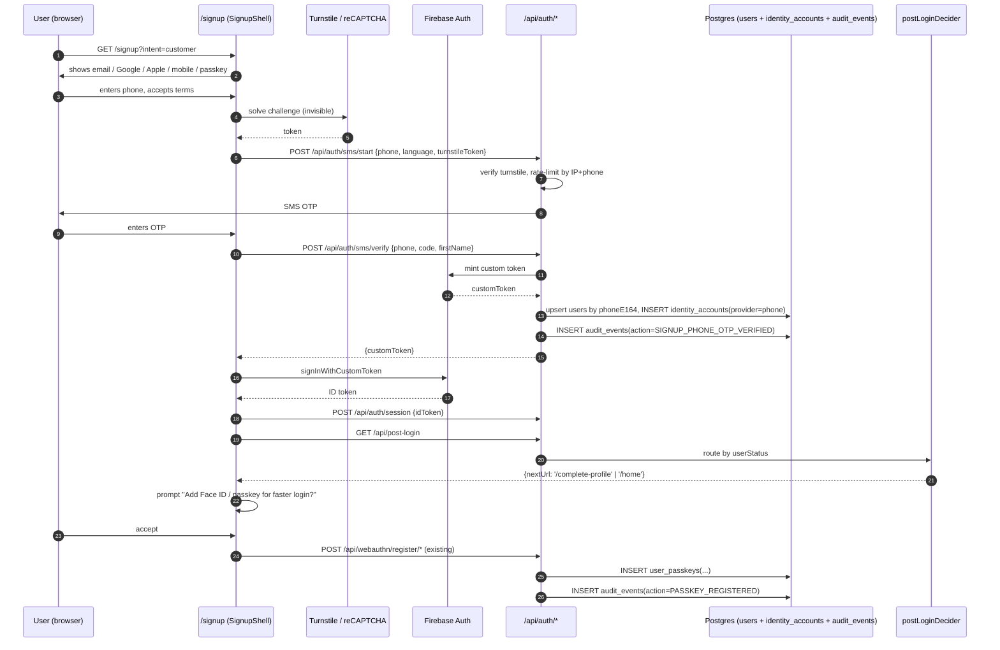
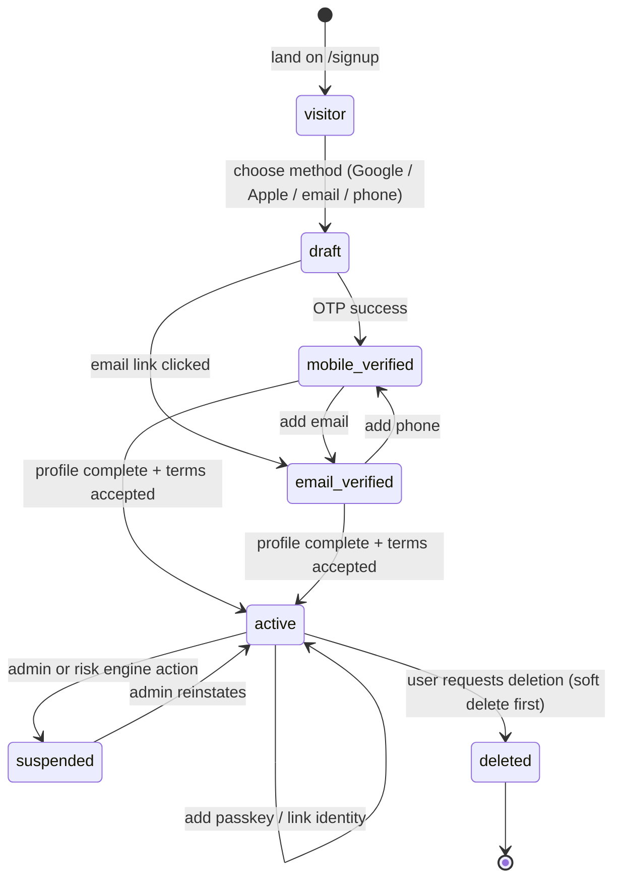
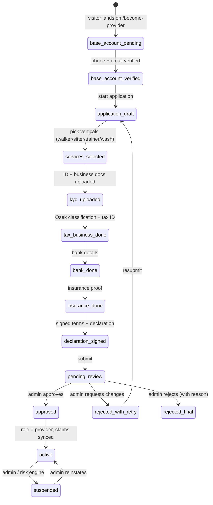
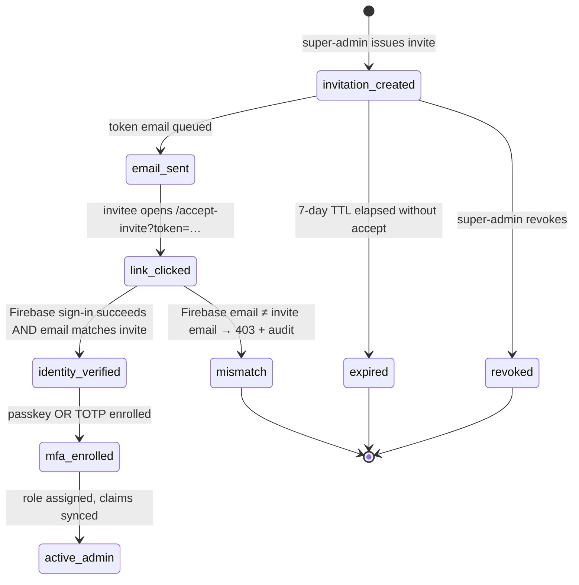

# SDD: Smart Identity & Routing System (2026)

| | |
|---|---|
| **Status** | Draft (design only — no code, no PRs) |
| **Date** | 2026-05-25 |
| **Author** | SDD Writer Agent (PetWash) |
| **Feature flag** | `ff.identity.unified.enabled` (default **OFF**) |
| **Method** | `.github/skills/sdd-writer-iterative/SKILL.md` |
| **Requested by** | CEO (nir.h@petwash.co.il) |

---

## 1. Summary

PetWash today has **at least eight public-facing signup surfaces** (`/signup`, `/become-provider`, `/provider-onboarding`, `/staff-application`, `/privilege-signup`, `/consent-onboarding`, `/join/{walker,sitter,trainer}`, `/loyalty/join`, plus dead aliases `/apply-provider`, `/join-team`, `/careers/apply`, `/forms/onboarding`, `/internal/onboard`, `/admin/staff-onboarding`). They share no identity model, no phone-input component, no captcha discipline, and no consistent post-login routing. The canonical customer signup page uses a **fake CSS "I'm not a robot" checkbox** (`client/src/pages/SignUpLuxury.tsx:126`). Passkey storage is split across **two incompatible implementations** (Firestore `authenticators` collection vs a non-existent `users.credentials` JSONB column). There is no `identity_accounts` linking table — a customer who signs in once with Google and once with Apple becomes two separate users.

This SDD replaces all eight surfaces with **one smart identity layer and four audience-segmented entry routes**:

1. `/signup` — single customer door (pet owner, walker/sitter/trainer customer, pet finder, loyalty join — all collapse here)
2. `/become-provider` — single provider application door (all verticals collapse here)
3. `/admin/login` — invite-only admin login (no public signup, MFA + passkey enforced)
4. `/staff/login` — staff/contractor backend access (invite-only, separate from admin)

The design reuses what already works: Firebase Auth, the existing `users` table with its `activationStatus` state machine (`shared/schema.ts:144-152`), `audit_events` (`shared/schema.ts:12344`), `staffAccessRequests` (`shared/schema.ts:12303`), the `PhoneInput` component with libphonenumber (`client/src/components/PhoneInput.tsx`), the `@simplewebauthn/server` library, `logAuditEvent` middleware (`server/middleware/auditLog.ts:57`), and the `postLoginDecider` server-side routing function (`server/routes/post-login.ts:203`). The new pieces are an `identity_accounts` linking table, a canonical `user_passkeys` table (replacing the split storage), an `admin_invitations` table, a global `EmailIdentity` component, hardening of the existing `PhoneInput`, and a unified post-login routing tree.

**No money behavior, no K9000/Nayax behavior, no Tranzila behavior changes.** All schema additions are additive and **REQUIRE APPROVAL** before any PR is opened.

## 2. Goals / Non-goals

**Goals**
- One identity layer with five canonical methods: email/password (or magic link), Google, Apple, mobile OTP, WebAuthn passkey.
- Identity linking so the same human is one `user_id` across all providers.
- Customers self-serve. Providers apply (admin approves). Admins/management are **invite-only** — no public path can create an admin.
- Server-side authorization is the only source of truth for role; client never selects role.
- Hebrew-first RTL throughout. Phone fields keep number digits LTR even inside RTL UI.
- E.164 storage for every phone, libphonenumber validation everywhere.
- Apple private-relay emails handled correctly.
- Append-only audit event for every identity-relevant state change.
- Bot/abuse protection on every signup and OTP path (real Turnstile or reCAPTCHA Enterprise — no CSS checkboxes).

**Non-goals (out of scope for this SDD and the first PRs)**
- No new payment provider, no wallet behavior change, no K9000/Nayax runtime change, no Tranzila change.
- No replacement of Firebase Auth as the identity provider. (Firebase stays as the ID-token issuer; we add a linking layer and a passkey verifier on top.)
- No new languages beyond Hebrew/English/Arabic (existing i18n keys reused).
- No KYC/biometric re-engineering — the existing `idVerification*` + `biometric*` columns on `users` (`schema.ts:73-82`) keep their current meaning.
- No migration of historical duplicate accounts in this design's first PRs. That is a separate, approval-gated data project (§14).
- No change to the Israeli tax / Sumit invoice path.
- No franchise/municipal portal redesign.

## 3. Repository context (what exists today)

### 3.1 Current signup surface — entry-point inventory

| Route (App.tsx line) | Page / file | Creates user as | Verdict |
|---|---|---|---|
| `/signup` (`App.tsx:696`) | `SignUpLuxury.tsx` | customer | **KEEP — refactor into unified door** |
| `/sign-in` (`App.tsx`) | `SignIn.tsx` | (login only) | KEEP (rename screens) |
| `/become-provider` (`App.tsx:2343`) | redirects to `/provider-onboarding` | n/a | **DELETE redirect, make it the real provider entry** |
| `/provider-onboarding` (`App.tsx:2361`) | `ProviderOnboarding.tsx` | provider_candidate | **REFACTOR — base account + application split** |
| `/provider-application/*` | `ProviderApplicationForm.tsx`, `ProviderApplicationStatus.tsx` | provider_candidate | KEEP (becomes phase 2 of `/become-provider`) |
| `/apply-provider`, `/join-team` (`App.tsx:2370,2373`) | redirects | n/a | **DELETE — already 302** |
| `/join/{walker,sitter,trainer}` (`App.tsx:1316-1322`) | redirects | n/a | **DELETE — already 302** |
| `/loyalty/join` (`App.tsx:869`) | Prestige Pass signup | customer + prestige | **REFACTOR — collapse into `/signup` with `intent=loyalty`** |
| `/consent-onboarding` (`App.tsx:808`) | `ConsentOnboarding.tsx` | customer | **DELETE — fold into `/signup` step 1** |
| `/internal/onboard` (`App.tsx:783`) | invited-only | staff/contractor | **REFACTOR — `/staff/accept-invite?token=`** |
| `/admin/staff-onboarding` (`App.tsx:2216`) | `AdminGoogleForms` | staff (admin-issued) | KEEP (admin UI to issue invites) |
| `/forms/onboarding` (`App.tsx:2326`) | `CustomerOnboardingForm` | customer | **DELETE — duplicates `/signup`** |
| `/careers/apply` (`App.tsx:2212`) | `StaffApplication` | staff_request | **DELETE — public path to staff is removed; staff is invite-only** |
| `/admin` → `/admin/login-v2` (`App.tsx:2720`) | `AdminLoginV2` | admin (login only) | **KEEP — promote to canonical `/admin/login`** |
| `/admin/login` (`App.tsx:2721`) | `AdminLoginV2` | admin (login only) | KEEP |
| `/privilege-signup` (in client/src/pages) | `PrivilegeSignup.tsx` | VIP customer | **DELETE — collapse into `/signup` with `intent=privilege`** |

### 3.2 Backend auth surface

| File | Role |
|---|---|
| `server/routes/auth.ts` (310 LOC) | Firebase session cookies, core login |
| `server/routes/auth-sms.ts` (137 LOC) | SMS OTP start/verify |
| `server/routes/publicAuthRoutes.ts` (1234 LOC) | Public auth surface, phone session, signup intent cookie |
| `server/routes/social-oauth.ts` (312 LOC) | TikTok/Instagram OAuth (marketing — **not identity**) |
| `server/routes/webauthn.ts` (415 LOC) | Passkey via Firestore `authenticators` collection |
| `server/auth/passkey.ts` | Passkey via Postgres `users.credentials` JSONB (**broken — column not in `shared/schema.ts`**) |
| `server/routes/mobile-biometric.ts` (697 LOC) | Mobile-app biometric variant |
| `server/routes/post-login.ts` (1165 LOC) | `postLoginDecider` — canonical post-login routing |
| `server/routes/access-requests.ts` (232 LOC) | Staff access request approve/deny |
| `server/routes/onboarding-verification.ts`, `onboarding.ts` | Verification flows |
| `server/routes/provider-onboarding.ts`, `provider-applications.ts`, `provider-intake.ts`, `provider-phone.ts`, `provider-trust.ts` | Provider apply paths |
| `server/routes/prestige-join.ts` | Loyalty signup |
| `server/routes/staff-onboarding.ts` | Staff invite flow |
| `server/routes/biometric-certificates.ts` | KYC biometric (separate from passkey) |

### 3.3 What is already correctly built and **must be reused, not rebuilt**

- **`users` table** (`shared/schema.ts:35-160`) already has the fields the new design needs: `email` (unique), `phone` (unique), `phoneE164`, `phoneCountry`, `authProvider`, `emailVerified`, `phoneVerified`, `role`, `userStatus`, `signupIntent`, `accessLevel`, `approvedBy`, `approvedAt`, `blocked`, `mfaRequired`, `mfaEnrolled`, `activationStatus` (`draft | mobile_verified | email_verified | active | suspended | deleted`, line 145), `riskLevel`, `lastLoginAt`, `referralCode`, `journeyState`.
- **`audit_events` table** (`shared/schema.ts:12344`) — already indexed on actor, action, trace, target. The `logAuditEvent` middleware (`server/middleware/auditLog.ts:57`) is the canonical writer.
- **`staffAccessRequests`** (`shared/schema.ts:12303`) — pending/approved/rejected lifecycle, indexed.
- **`userRegistrations`** (`shared/schema.ts:10479`) — registration-method stamping (already includes `"passkey"` as a method, line 10491).
- **`ALLOWED_ROLES`** + **`USER_STATUS_VALUES`** + **`ALLOWED_INTENTS`** enums (`shared/schema.ts:12329-12343`) — the role vocabulary is already defined.
- **`postLoginDecider`** (`server/routes/post-login.ts:203`) — already implements server-side routing by `userStatus`, including blocked → `/blocked`, unverified-email → `/verify-email`, no-role → `/choose-role`, missing-profile → `/complete-profile`, provider states → `/provider-onboarding` | `/provider/pending` | `/provider-os` | `/provider/rejected`, staff states → `/access-pending` | `/staff/rejected`, admin → `/admin/dashboard`. This is the routing tree the new design hardens — not replaces.
- **`PhoneInput`** component (`client/src/components/PhoneInput.tsx`) — already uses `react-phone-number-input` + `libphonenumber-js` (declared at `package.json:118`) with a 25-country `APPROVED_COUNTRIES` allowlist including IL, AU, US, GB, CA, and most of the EU. **No new dependency required.**
- **`@simplewebauthn/server`** already imported by both passkey paths.
- **Firebase customClaims sync** (`server/lib/syncFirebaseClaims.ts`, used at `access-requests.ts:160`) — already handles role-claim propagation.
- **`isSuperAdmin`** strict check (`access-requests.ts:33`) — already requires `email_verified === true` AND env-allowlist. This is the right pattern; the new design extends it with an invite-token gate.

### 3.4 Gaps and defects found during review

| # | Gap | Evidence | Severity |
|---|---|---|---|
| G1 | Fake CSS captcha on the canonical customer signup | `SignUpLuxury.tsx:126` — `const [robot, setRobot] = useState(false); // visual "I'm not a robot" — real reCAPTCHA v3 is invisible server-side` — but no server-side captcha verification call exists on the OTP-verify path | **High (security theater)** |
| G2 | Phone OTP verify does not capture `firstName` | `SignUpLuxury.tsx:166-191` — verify payload is `{phone, code, language, flow}` only | Medium (UX gap) |
| G3 | Passkey storage split | `webauthn.ts:80` writes to Firestore `authenticators`; `auth/passkey.ts:60-101` writes to `users.credentials` + `passkey_challenge` columns that do **not** appear in `shared/schema.ts` — these columns either exist out-of-schema (shadow drift) or the writes silently fail | **High (correctness)** |
| G4 | No identity linking table | Schema grep returns no `identity_accounts` | High (design gap) |
| G5 | No admin invitation table | Only `providerApplicants.invitationToken` exists (`schema-enterprise.ts:1742`) — for providers, not admins | High |
| G6 | `social-oauth.ts` mixes marketing OAuth (TikTok/Instagram) with identity-shaped code paths | `social-oauth.ts:29` — `pendingTokens` in-memory `Map`; would not survive Cloud Run restarts (line 19 calls this out as a known issue) | Medium |
| G7 | Multiple parallel "user attempted signup" surfaces with no shared captcha/rate-limit | See §3.1 — eight surfaces, no shared bot protection | High |
| G8 | Eight signup pages, six of which are dead 302 redirects | App.tsx:2370, 2373, 1316-1322, 2212, 2326, 783, 808 | Medium (debt) |
| G9 | `SUPER_ADMIN_EMAILS` is the only allowlist for admin promotion | `access-requests.ts:12-22` — env-string allowlist; no audit row for adding/removing a super-admin email | Medium |
| G10 | `VITE_TURNSTILE_SITE_KEY` missing in prod build env (per inspector brief, PR #447 pending) | env / PR #447 | High (degraded state) |
| G11 | `ADMIN_APPROVER_EMAIL` unset → admin-approval notifications silently no-op | per inspector brief | High |

## 4. Users, roles & accessibility scoping

**Actors and what each may / may not do.** Server-side authorization is enforced by inline role checks on every protected mount; the role vocabulary is fixed at `shared/schema.ts:12341` (`customer | loyalty | provider | staff | management | admin`).

| Actor | May (server-enforced) | May NOT |
|---|---|---|
| **Public visitor** | Visit `/signup`, `/become-provider`, `/admin/login`, `/staff/login`; create a customer account; apply as provider | Self-promote to provider, staff, or admin; select role from any frontend field |
| **Customer** | Use customer dashboard, wallet, bookings; add passkey; link Google/Apple/phone to own account | Touch admin endpoints, see provider applicants, change own role |
| **Provider candidate (`userStatus=provider_pending_approval`)** | View `/provider-application/status`; resubmit documents | Access provider dashboard, accept bookings, see customer PII |
| **Provider approved (`userStatus=provider_active`)** | Provider dashboard, accept bookings | Touch admin/staff endpoints |
| **Staff (`role=staff`, `userStatus=staff_active`)** | Admin support views permitted by their `accessLevel` and `roles[]` | Approve providers without admin clearance; mint admin invites |
| **Admin (`role=admin`)** | Approve/reject providers; issue staff invites; view audit events | Issue admin invites (only super-admin); change wallet/finance state (separate approval per crown-jewel rules) |
| **Super-admin (`role=super_admin`, email in `SUPER_ADMIN_EMAILS` AND `email_verified`)** | Issue admin invites; promote/demote admins; view chain-of-custody | Edit audit history (append-only) |
| **System / cron** | Token expiry sweeps, abuse-detection scoring, reconciliation | Mint identities, change roles |

**Accessibility / localization (RTL-first)**
- Hebrew is the primary locale; English and Arabic are full peers. Every visible string is a translation key — **no hard-coded English** in new components.
- Phone input keeps the country selector visually on the leading side: **left in LTR, right in RTL** (the existing `PhoneInput` uses logical CSS that handles this; the new design adds explicit RTL acceptance tests).
- Phone-number digits themselves stay **LTR even inside RTL containers** (CSS `direction: ltr; unicode-bidi: embed;` on the input's number portion).
- Numeric OTP screens use `inputmode="numeric"` + `autocomplete="one-time-code"` so iOS Safari surfaces the OS-level OTP prompt.
- Passkey prompts use the platform-native dialog (Face ID / Touch ID / Windows Hello / Android biometric) — never a custom modal mimicking a vendor's UX.
- Country search supports localized country names (Hebrew "ישראל", Arabic "إسرائيل", English "Israel") and dial codes.
- All error toasts and consent strings come from `i18n` keys; the audit row records the displayed `language` code so support can reproduce.

## 5. Architecture

### 5.1 Target route map (exactly four audience-segmented entry points)

```
/signup           → SignupShell.tsx  (customer; intent ∈ {customer, loyalty, privilege})
/become-provider  → ProviderApplyShell.tsx  (provider_candidate, all verticals)
/admin/login      → AdminLoginV2.tsx  (invite-only; no public sign-up)
/staff/login      → StaffLoginV2.tsx  (invite-only; no public sign-up)
```

Everything else in §3.1 either (a) becomes a **301 to one of the four**, or (b) is deleted outright in the cleanup PR. The "no random new signup pages" rule from the brief is enforced by an ESLint rule (proposed) banning new `pages/Signup*.tsx` files outside `pages/auth/`.

### 5.2 Component layout

```
client/src/pages/auth/
  SignupShell.tsx          // customer entry; one screen, one CTA, one phone input
  ProviderApplyShell.tsx   // provider entry; base account + multi-step application
  AdminLoginV2.tsx         // invite-only admin
  StaffLoginV2.tsx         // invite-only staff
  AcceptInvite.tsx         // /accept-invite?token=…  (admin OR staff path)
  VerifyEmail.tsx
  VerifyPhone.tsx
  ChooseRole.tsx           // legacy fallback; only when intent is missing
  PasskeyPrompt.tsx        // "Make next login faster" post-success modal

client/src/components/auth/
  EmailIdentity.tsx        // global email field (normalize, link-to-existing detection)
  PhoneInput.tsx           // EXISTS — harden (RTL tests, abuse-rate UI)
  SocialLoginButtons.tsx   // Google / Apple buttons; Google One Tap on returning visit
  PasskeyButton.tsx        // "Sign in with Face ID / Passkey" — uses conditional UI
  CaptchaGate.tsx          // wraps Turnstile (primary) + reCAPTCHA Enterprise (fallback)
```

### 5.3 Happy path — first-time customer



### 5.4 Happy path — provider apply (states are formalized in §6.2)

```
visit /become-provider
  → SignupShell.tsx in "provider_candidate" mode
  → create base user (phone + email verified, same as customer)
  → users.signupIntent = 'provider'
  → users.role stays 'customer' (NEVER 'provider' until approval)
  → users.userStatus = 'kyc_pending'
  → redirect to /provider-application/step-1
  → multi-step: services → KYC docs → tax/business → bank → insurance → declaration
  → on submit: provider_applications.status = 'pending_review'
  → users.userStatus = 'provider_pending_approval'
  → redirect to /provider-application/status (read-only)
  → (admin approves out-of-band)
  → on approve: users.role = 'provider', userStatus = 'provider_active'
  → syncFirebaseClaims() so the next ID token carries role=provider
  → postLoginDecider routes to /provider-os
```

### 5.5 Happy path — admin invite-only

```
super-admin → /admin/team-invitations → "Invite admin"
  → POST /api/admin/invitations {email, role: 'admin' | 'staff', scope}
  → server: only super-admin may set role='admin'; only admin/super may set role='staff'
  → INSERT admin_invitations(email_norm, token_hash, role, invited_by, expires_at)
  → INSERT audit_events(action=ADMIN_INVITATION_CREATED, target=email_norm)
  → email to invitee: link to /accept-invite?token=…
  → invitee clicks link
  → /accept-invite verifies token, runs Firebase sign-in (Google or email + passkey)
  → server: cross-check Firebase email matches admin_invitations.email_norm
  → on match: mark invitation accepted_at; users.role = invited role; mfaRequired = true
  → syncFirebaseClaims()
  → audit_events(action=ADMIN_INVITATION_ACCEPTED)
  → redirect to /admin/dashboard or /staff/dashboard
```

**The only way to become an admin is to be invited.** No frontend field, no API parameter, no public path. The role enum on the frontend never includes `admin`.

### 5.6 Failure / edge paths

| Case | Response |
|---|---|
| User exists (by normalized email or phone) attempts signup | `/signup` server returns `409 ACCOUNT_EXISTS` with the available login methods (NOT the full PII — see §7); UI routes to `/sign-in?hint=email_known` |
| User signs in with Google then later with Apple using the same `normalized_email` | Server detects via `identity_accounts.normalized_email`, links the Apple identity to the existing `user_id`, writes `audit_events(action=IDENTITY_LINKED)` |
| Apple private-relay email (`*.privaterelay.appleid.com`) | Stored as the canonical email; matched only against other Apple-relay rows; never used for cross-provider linking by email |
| OTP rate-limit hit | 429 with retry-after; UI shows generic "try again later"; audit row `OTP_RATE_LIMIT_HIT` |
| Forged Firebase ID token | `validateFirebaseToken` rejects; 401; audit row `AUTH_TOKEN_INVALID` |
| Passkey challenge expired | 5 min TTL (`auth/passkey.ts:99`); user retries; no account created |
| Suspended / blocked user attempts login | `postLoginDecider` returns `/blocked`; audit row `BLOCKED_LOGIN_ATTEMPT` |
| Provider candidate tries to GET `/api/provider/dashboard` before approval | 403; audit row `UNAUTHORIZED_PROVIDER_ACCESS_ATTEMPT` |
| Unknown email attempts `/admin/login` | 401 with constant-time response; audit row `ADMIN_LOGIN_UNKNOWN_EMAIL` (severity=warning); rate-limited |
| Invite token reused | UNIQUE on `(token_hash, accepted_at IS NULL)` — second use returns 410; audit row `INVITE_REPLAY_ATTEMPT` |
| Browser does not support WebAuthn | Hide passkey button (feature-detect on `navigator.credentials`); fall back to email + OTP |

## 6. State machines

### 6.1 Customer onboarding



Already encoded by `users.activationStatus` (`schema.ts:145`): `draft | mobile_verified | email_verified | active | suspended | deleted`. The new design uses these states unchanged.

### 6.2 Provider candidate → provider



Maps to existing `providerApplicants.status` enum (`schema-enterprise.ts:1722`: `pending, approved, rejected, withdrawn`) extended to `pending_resubmission` (already referenced at `post-login.ts:93`). Users **stay `role=customer`** until `approved` — the role flip is the single moment of truth and must always be paired with `syncFirebaseClaims()` (pattern at `access-requests.ts:160`).

### 6.3 Admin invitation → admin



## 7. Data model (additive only — **REQUIRES APPROVAL** per crown-jewel rules)

All new tables are additive. **No existing column is altered.** Schema changes touching `shared/schema.ts` are gated by the repo policy at `.claude/skills/petwash-platform/SKILL.md:194` ("No schema migrations unless separately approved. Adding a column counts.").

### 7.1 `identity_accounts` (NEW)

```
identity_accounts
  id                  bigserial primary key
  user_id             varchar(128) not null references users(id)
  provider_type       varchar(20)  not null  -- 'email' | 'google' | 'apple' | 'phone' | 'passkey'
  provider_subject    varchar(255) not null  -- Firebase UID variant for that provider:
                                             --   email   → normalized email
                                             --   google  → Google `sub`
                                             --   apple   → Apple `sub` (relay-stable)
                                             --   phone   → E.164 number
                                             --   passkey → credential_id_hash
  normalized_email    varchar(320)
  normalized_phone    varchar(20)
  email_is_relay      boolean default false   -- Apple private-relay marker
  verified_at         timestamp
  created_at          timestamp default now()
  last_used_at        timestamp
  revoked_at          timestamp
  metadata            jsonb default '{}'

  UNIQUE (provider_type, provider_subject)        -- one (provider, subject) ↔ one row
  INDEX  (user_id)
  INDEX  (normalized_email)  WHERE normalized_email IS NOT NULL
  INDEX  (normalized_phone)  WHERE normalized_phone IS NOT NULL
```

### 7.2 `user_passkeys` (NEW — replaces the two split passkey storages)

```
user_passkeys
  id                    bigserial primary key
  user_id               varchar(128) not null references users(id)
  credential_id_hash    varchar(128) not null  -- SHA-256 of credential ID (do not store raw)
  credential_id_b64     text         not null  -- base64url of credential ID (for WebAuthn excludeCredentials)
  public_key            bytea        not null  -- COSE public key
  sign_count            bigint       not null default 0
  device_name           varchar(120)            -- "iPhone 16 Pro", from UA + AAGUID lookup
  authenticator_type    varchar(20)             -- 'platform' | 'cross-platform'
  backup_eligible       boolean default false
  backup_state          boolean default false
  aaguid                varchar(40)
  transports            jsonb default '[]'
  created_at            timestamp default now()
  last_used_at          timestamp
  revoked_at            timestamp

  UNIQUE (credential_id_hash)
  INDEX  (user_id) WHERE revoked_at IS NULL
```

### 7.3 `admin_invitations` (NEW)

```
admin_invitations
  id                bigserial primary key
  email_norm        varchar(320) not null
  invited_role      varchar(20)  not null   -- 'admin' | 'staff' | 'management'
  scope             jsonb default '{}'      -- e.g. {"departments":["support"]}
  token_hash        varchar(128) not null   -- SHA-256 of single-use token
  invited_by_user   varchar(128) not null references users(id)
  created_at        timestamp default now()
  expires_at        timestamp    not null   -- default now() + interval '7 days'
  accepted_at       timestamp
  accepted_by_user  varchar(128) references users(id)
  revoked_at        timestamp
  revoked_by_user   varchar(128) references users(id)

  UNIQUE (token_hash)
  -- partial unique: only one OPEN invitation per email
  UNIQUE (email_norm) WHERE accepted_at IS NULL AND revoked_at IS NULL AND expires_at > now()
  INDEX  (email_norm)
  INDEX  (expires_at) WHERE accepted_at IS NULL
```

### 7.4 No change to `audit_events`

Already exists at `shared/schema.ts:12344` with all needed columns. New event types defined in §10.

### 7.5 Columns to be REMOVED from shadow schema

`server/auth/passkey.ts:60-101` references `users.credentials`, `users.passkey_challenge`, `users.passkey_challenge_expires`, `users.passkey_enabled`, and joins on `users.firebase_uid` (the `users` table primary key is `id`, not `firebase_uid`). These columns are not in `shared/schema.ts`. They may exist out-of-schema in the live DB or the writes may silently fail. The migration plan (§11) explicitly drops `server/auth/passkey.ts` in favor of `server/routes/webauthn.ts` + the new `user_passkeys` table. **REQUIRES APPROVAL** because removing the column path may surface a hidden production data dependency.

## 8. Security & fraud model

| Threat | Control (existing primitive where possible) |
|---|---|
| Bot signup floods on `/signup` | **Real captcha**: Turnstile (primary) + reCAPTCHA Enterprise (fallback). Server verifies token on every OTP-start, OTP-verify, password-signup, provider-application-submit. Replaces fake CSS checkbox (`SignUpLuxury.tsx:126`). |
| OTP enumeration / abuse | Rate-limit OTP send: max 3 / 10 min / phone, 10 / hour / IP, 50 / day / IP-block. Lockout after 5 failed verifies. (Today: `auth-sms.ts` has partial limits — extend.) |
| Replay of OTP code | Single-use, 5-min TTL; bind to phone + flow + sessionId. |
| Duplicate-account creation | Normalize email (lowercase + Gmail dot-strip variant for matching only, **not for storage**); normalize phone to E.164; check `identity_accounts.normalized_email` and `normalized_phone` before INSERT. |
| Cross-provider linking abuse (Mallory uses Alice's email at Apple) | Require provider-side `email_verified=true` (Google: always; Apple: provided in token; email/password: explicit verification) before linking via email. If unverified, create a new user; only merge when verification arrives. |
| Apple private-relay collision | `email_is_relay=true` rows never auto-link by email; they only link by `apple.sub`. |
| Forged Firebase ID token | `validateFirebaseToken` middleware (existing) verifies signature and audience. No bypass headers. |
| Forged passkey assertion | `@simplewebauthn/server.verifyAuthenticationResponse` with origin + RPID pinned to `WEBAUTHN_RP_ID` / `WEBAUTHN_ORIGIN` (existing at `webauthn.ts:42-47`). Reject if challenge expired or `userVerification !== 'required'`. |
| Sign-count rollback (cloned authenticator) | Reject if `assertedCounter <= storedCounter` and storedCounter > 0; raise `audit_events(action=PASSKEY_COUNTER_ROLLBACK, severity=critical)`. |
| Client picking own role | Backend ignores any `role` / `accountType` field on signup payloads. The role-assignment paths are: `/api/admin/invitations/accept` (admin/staff/management) and `/api/access-requests/:id/approve` (staff). Anything else only writes `role='customer'`. |
| Admin self-promotion | `admin_invitations` UNIQUE on `(email_norm)` partial; only super-admin may create role=admin; super-admin is gated by `email_verified=true` AND env allowlist (`access-requests.ts:33`) AND now also by an explicit `super_admin` row in `admin_invitations` history. |
| Provider self-activation | `users.role` flip to `provider` may only happen inside `provider-applications` approve route under admin auth + audit. (Already enforced — covered by `post-login.ts:144` and admin review route — confirm at code time.) |
| Stolen invite token | Token stored hashed (SHA-256); 7-day expiry; single-use; UNIQUE constraint blocks replay (§7.3). |
| Cross-site request forgery on session APIs | Existing `webauthn/csrfProtection.ts` pattern (`webauthn.ts:28`) extended to all auth POSTs. |
| Session fixation | Session cookies are HTTP-only, Secure, SameSite=Lax for top-level, regenerated on login (existing Firebase session cookie behavior). |
| Account takeover via email link | Magic-link tokens 15-min TTL, single-use, bound to issuing IP /24 (warning, not block, on mismatch). |
| PII leak in "account exists" response | Server returns generic "this method is unavailable for this account, try another method" — does NOT confirm which method exists. (Pattern visible at `post-login.ts:280`: "Just say 'an account exists' + recovery path.") |

**Backend is source of truth.** Frontend route guards in `App.tsx` are UX only — they hide buttons but enforce nothing. Every protected mount has `validateFirebaseToken` + inline `requireAdmin` / `requireBrainAccess` / `isSuperAdmin` (rule at `petwash-platform/SKILL.md:206`).

## 9. APIs / interfaces

The design **adds three new endpoint families** and **consolidates two existing ones**. No existing endpoint is removed in PR-1.

### 9.1 New endpoints

| Method | Path | Purpose | Auth |
|---|---|---|---|
| POST | `/api/identity/link` | Link a verified identity to current user | Authenticated |
| GET | `/api/identity/me` | List identity accounts attached to current user | Authenticated |
| DELETE | `/api/identity/:id` | Revoke (soft) one identity link | Authenticated; cannot revoke the last one |
| POST | `/api/admin/invitations` | Issue admin/staff/management invite | super-admin (admin) / admin (staff) |
| GET | `/api/admin/invitations` | List | admin |
| POST | `/api/admin/invitations/:id/revoke` | Revoke | super-admin |
| POST | `/api/invitations/accept` | Accept invite (token in body) | Authenticated, email must match |
| GET | `/api/invitations/preview?token=` | Show role/scope before accepting | Public (token-gated, single-read OK) |

### 9.2 Consolidated endpoints (unchanged signatures, hardened internals)

- `POST /api/auth/sms/start` — now requires `turnstileToken`; rate-limited per §8.
- `POST /api/auth/sms/verify` — accepts optional `firstName`; on first verify, upserts user with `activationStatus='mobile_verified'`.
- `POST /api/auth/session` — unchanged.
- `POST /api/webauthn/register/options` and `/verify` — already exist at `webauthn.ts:55+`; the verify step now writes to `user_passkeys` (Postgres) instead of Firestore `authenticators` (Firestore writes deprecated in PR-3).
- `GET  /api/post-login` — already exists via `postLoginDecider`; returns the full routing tree from §5. **No change to response shape** so the frontend redirect logic continues to work.

### 9.3 Idempotency and error semantics

- Every POST that mutates identity carries an idempotency key (already a repo convention — see SDD-2026-05-22).
- Errors return `{ ok: false, code, message }` with `code` from a fixed enum:
  `ACCOUNT_EXISTS, INVALID_TOKEN, OTP_RATE_LIMIT, INVITE_EXPIRED, INVITE_EMAIL_MISMATCH, ROLE_FORBIDDEN, PASSKEY_CHALLENGE_EXPIRED, PASSKEY_COUNTER_ROLLBACK, CAPTCHA_FAILED, EMAIL_UNVERIFIED, PHONE_UNVERIFIED`.

## 10. Identity linking algorithm

```
function loginOrLink(providerType, providerSubject, providerEmail, providerEmailVerified, providerPhone):
  # Step 1 — match by (provider_type, provider_subject)
  identity = SELECT * FROM identity_accounts
             WHERE provider_type = providerType AND provider_subject = providerSubject
             LIMIT 1
  if identity:
    UPDATE identity_accounts SET last_used_at = now() WHERE id = identity.id
    return identity.user_id            # straight login

  # Step 2 — match by verified normalized_email (NOT for Apple private-relay)
  if providerEmail and providerEmailVerified and not isAppleRelay(providerEmail):
    existing = SELECT user_id FROM identity_accounts
               WHERE normalized_email = normalize(providerEmail)
                 AND verified_at IS NOT NULL
               LIMIT 1
    if existing:
      INSERT identity_accounts (user_id, provider_type, provider_subject,
                                normalized_email, verified_at)
        VALUES (existing.user_id, providerType, providerSubject,
                normalize(providerEmail), now())
      logAuditEvent(action='IDENTITY_LINKED_BY_EMAIL', target=existing.user_id, metadata={providerType})
      return existing.user_id

  # Step 3 — match by verified normalized_phone
  if providerPhone:
    e164 = toE164(providerPhone)
    existing = SELECT user_id FROM identity_accounts
               WHERE normalized_phone = e164 AND verified_at IS NOT NULL
               LIMIT 1
    if existing:
      INSERT identity_accounts(...) VALUES (existing.user_id, providerType, providerSubject, ...)
      logAuditEvent(action='IDENTITY_LINKED_BY_PHONE', target=existing.user_id, metadata={providerType})
      return existing.user_id

  # Step 4 — no match: create new user
  newUserId = INSERT INTO users(...) RETURNING id
  INSERT identity_accounts (user_id=newUserId, provider_type=providerType,
                            provider_subject=providerSubject, ...)
  logAuditEvent(action='SIGNUP_NEW', target=newUserId, metadata={providerType})
  return newUserId
```

**Crucial:** linking by email/phone only happens when the *new* provider has independently verified that email/phone. Otherwise an attacker who controls `alice@gmail.com` at "Acme OAuth" but not at Google could trivially hijack Alice's PetWash account.

**Conflict resolution:** if two existing users hold the same normalized email or phone (legacy duplicates from §3.1's eight surfaces), do NOT auto-merge — flag for manual review, fall through to "no match → create new" with `metadata.duplicate_review_needed = true` and severity=warning.

## 11. Routing logic (server-side, post-login)

Already implemented at `server/routes/post-login.ts:119-200` (`buildRoutingResponse`). The decision tree, restated and hardened:

```
1. user.blocked              → /blocked
2. authProvider='email' & !emailVerified
                             → /verify-email
3. !role || role==='new'     → /choose-role  (or /signup if not authenticated)
4. missingProfileFields > 0  → /complete-profile
5. role==='customer' & userStatus==='profile_complete'
                             → /home  (customer dashboard)
6. role==='customer' & signupIntent==='provider'
   & userStatus∈{kyc_pending, profile_incomplete}
                             → /provider-onboarding
7. userStatus==='provider_pending_approval'
                             → /provider/pending
8. userStatus==='pending_resubmission'
                             → /provider-application/status
9. userStatus==='kyc_rejected'
                             → /provider/rejected
10. role==='provider' & userStatus==='provider_active'
                             → /provider-os
11. userStatus==='staff_pending_approval'
                             → /access-pending
12. userStatus==='staff_rejected'
                             → /staff/rejected
13. role∈{staff, admin, super_admin, management}
   & userStatus==='active' & mfaEnrolled
                             → /admin/dashboard
14. role∈{staff, admin} & !mfaEnrolled
                             → /admin/enroll-mfa
15. inviteToken in session   → /accept-invite (continue invitation)
16. fallback                 → /home
```

The decider is the **only** place these decisions are made. Frontend `App.tsx` route guards are UX hints; they call `/api/post-login` and follow `nextUrl`. **No client-side role decision is trusted.**

## 12. Security & audit event matrix

Every event listed below is a row in `audit_events` (`shared/schema.ts:12344`) written via `logAuditEvent` (`server/middleware/auditLog.ts:57`). The middleware already requires `actorUserId`, `actionType`, and supports `targetType/targetId`, `ip`, `userAgent`, `traceId`, `metadata`, `severity`.

| Action type | Fires when | Severity | Required metadata |
|---|---|---|---|
| `SIGNUP_NEW` | new `users` row | info | `{provider, intent, lang}` |
| `SIGNUP_EMAIL_VERIFIED` | email link confirmed | info | `{email_norm}` |
| `SIGNUP_PHONE_OTP_SENT` | OTP issued | info | `{phone_e164, ip_hash}` |
| `SIGNUP_PHONE_OTP_VERIFIED` | OTP code accepted | info | `{phone_e164}` |
| `LOGIN_SUCCESS` | session cookie issued | info | `{provider, mfa_used}` |
| `LOGIN_FAILED` | bad credential / forged token | warning | `{reason}` |
| `OTP_RATE_LIMIT_HIT` | 429 returned | warning | `{phone_e164, count}` |
| `CAPTCHA_FAILED` | Turnstile / reCAPTCHA reject | warning | `{provider, score}` |
| `PASSKEY_REGISTERED` | new row in `user_passkeys` | info | `{aaguid, device_name}` |
| `PASSKEY_REVOKED` | user removes a passkey | info | `{credential_id_hash}` |
| `PASSKEY_LOGIN_SUCCESS` | assertion verified | info | `{credential_id_hash}` |
| `PASSKEY_COUNTER_ROLLBACK` | counter regressed | **critical** | `{credential_id_hash, asserted, stored}` |
| `IDENTITY_LINKED_BY_EMAIL` | identity merged via email | info | `{new_provider, email_norm}` |
| `IDENTITY_LINKED_BY_PHONE` | identity merged via phone | info | `{new_provider, phone_e164}` |
| `IDENTITY_LINK_CONFLICT` | two existing users share normalized email/phone | **warning** | `{user_id_a, user_id_b, dimension}` |
| `PROVIDER_APPLICATION_SUBMITTED` | candidate submits | info | `{application_id, verticals}` |
| `PROVIDER_APPROVED` | admin approves | info | `{application_id, approver}` |
| `PROVIDER_REJECTED` | admin rejects | info | `{application_id, reason}` |
| `ADMIN_INVITATION_CREATED` | super-admin invites | info | `{email_norm, role, scope}` |
| `ADMIN_INVITATION_ACCEPTED` | invitee accepts | info | `{invitation_id, role}` |
| `ADMIN_INVITATION_REVOKED` | super-admin revokes | info | `{invitation_id}` |
| `INVITE_REPLAY_ATTEMPT` | token reuse | **critical** | `{invitation_id}` |
| `INVITE_EMAIL_MISMATCH` | invite vs Firebase email differ | **critical** | `{invitation_id, fb_email}` |
| `ROLE_CHANGED` | `users.role` updated | info | `{from, to, reason}` |
| `UNAUTHORIZED_PROVIDER_ACCESS_ATTEMPT` | candidate hits dashboard | warning | `{path}` |
| `ADMIN_LOGIN_UNKNOWN_EMAIL` | unknown email at `/admin/login` | warning | `{email_norm}` |
| `BLOCKED_LOGIN_ATTEMPT` | suspended user attempts login | warning | `{user_id}` |

Rate-limit table (initial defaults; tunable per IP-block via env):

| Endpoint | Limit | Window | Scope |
|---|---|---|---|
| `/api/auth/sms/start` | 3 | 10 min | per phone |
| `/api/auth/sms/start` | 10 | 1 hour | per IP |
| `/api/auth/sms/verify` | 5 failed | 10 min | per phone (then lock 30 min) |
| `/api/auth/email/start` | 5 | 1 hour | per email |
| `/api/auth/email/start` | 20 | 1 hour | per IP |
| `/api/webauthn/authenticate/options` | 20 | 1 min | per IP |
| `/api/admin/login` | 5 | 15 min | per IP (then 1 hour soft block + alert) |
| `/api/admin/invitations` | 50 | 1 hour | per super-admin |
| `/api/provider-applications` (submit) | 3 | 24 h | per user |

## 13. Rollout / migration plan

`ff.identity.unified.enabled` default **OFF**. Existing flows remain live during all phases.

**Phase 0 — defect fixes (flag-independent, low risk)**
- PR-0a: Replace fake CSS captcha on `/signup` with real Turnstile (covers G1, G10). Frontend only. Backend already rejects on missing token if `VITE_TURNSTILE_SITE_KEY` is set.
- PR-0b: Phone OTP verify accepts `firstName` (G2). Backend: extend `auth-sms.ts` verify payload schema; frontend: pass it from `SignUpLuxury.tsx:166`.
- PR-0c: Set `ADMIN_APPROVER_EMAIL`, `SUPER_ADMIN_UID`, `VITE_TURNSTILE_SITE_KEY`, `VITE_FIREBASE_APPCHECK_SITE_KEY` in prod env (G10, G11). Env-only, no code.

**Phase 1 — additive schema (REQUIRES APPROVAL)**
- PR-1: Migration adds `identity_accounts`, `user_passkeys`, `admin_invitations` tables. No write paths yet. Backfill `identity_accounts` from existing `users` (one row per user mapping current `authProvider` → identity record). Backfill `user_passkeys` from Firestore `authenticators` (one-way copy). Both backfills are idempotent and read-only against existing tables.

**Phase 2 — write paths behind flag**
- PR-2a: `/api/identity/*` endpoints, gated by `ff.identity.unified.enabled`. When ON, every Firebase login writes to `identity_accounts`. When OFF, no-op.
- PR-2b: Webauthn verify writes to BOTH Firestore `authenticators` AND `user_passkeys` (shadow write). When flag ON for a user, reads come from `user_passkeys`.
- PR-2c: `/api/admin/invitations` endpoints and `/accept-invite` page. Independent of flag — admin invites are net-new behavior.

**Phase 3 — frontend consolidation**
- PR-3a: `SignupShell.tsx` replaces `SignUpLuxury.tsx` body (same `/signup` route, different inner component). Keeps the existing brand layout.
- PR-3b: `ProviderApplyShell.tsx` replaces `ProviderOnboarding.tsx` body at `/become-provider` → `/provider-onboarding`.
- PR-3c: Delete dead aliases (`/apply-provider`, `/join-team`, `/join/{walker,sitter,trainer}`, `/forms/onboarding`, `/careers/apply`, `/privilege-signup`, `/consent-onboarding`). Replace with 301s for 90 days, then remove.
- PR-3d: `EmailIdentity` component, `SocialLoginButtons` consolidation, `PasskeyButton` with conditional UI / autofill.

**Phase 4 — flip and clean up**
- Enable `ff.identity.unified.enabled = true` per cohort (10% → 50% → 100%) with audit-event volume monitoring.
- Deprecate Firestore `authenticators` writes (read-only for 30 days, then delete collection).
- Delete `server/auth/passkey.ts` and the `users.credentials`/`passkey_*` shadow columns (G3, requires explicit approval per schema rule).
- Delete `social-oauth.ts` identity-shaped code (the TikTok/Instagram marketing OAuth stays — it is not identity).

**Migration safety**
- All schema changes are ADD-ONLY in Phases 1-3.
- Drops only happen in Phase 4 and require a separate approval gate.
- No live user is forcibly logged out — Firebase session cookies remain valid; the unified design surfaces from the next post-login call.
- Rollback at any phase: flip the flag OFF; the legacy flow remains intact until Phase 4.

## 14. Open questions (need a human decision)

1. **Apple Team ID / Services ID** for "Sign in with Apple" Web — what is the configured Services ID? Where is the JWT signing key stored (Secret Manager path)?
2. **Google OAuth client ID for Web vs iOS vs Android** — confirm the three IDs (Web for One Tap, iOS native, Android native) match what's in Firebase Auth project console.
3. **Turnstile vs reCAPTCHA Enterprise** — both are wired but `VITE_TURNSTILE_SITE_KEY` is missing in prod (per inspector brief PR #447 pending). Pick **one** as primary; what's the rationale?
4. **Countries supported by `PhoneInput` on day one** — the existing `APPROVED_COUNTRIES` list (`PhoneInput.tsx:11-37`) has 25 countries including IL/AU/US/GB/CA + most of EU. Keep all, or trim to IL/AU/US/UK initially? (The brief says "any future language" but the list is country-not-language.)
5. **Passkey backfill from Firestore** — how many `authenticators` documents are in production today? (Determines whether Phase 1's backfill is a 10-min job or a multi-hour job.)
6. **`server/auth/passkey.ts` shadow columns** — do `users.credentials`, `users.passkey_challenge`, `users.passkey_challenge_expires`, `users.passkey_enabled`, `users.firebase_uid` exist in the live DB outside of `shared/schema.ts`? If yes, who put them there and what migration drops them?
7. **Legacy duplicate accounts** — how many `users` rows share a normalized email or phone today? (Determines whether the §10 "no auto-merge" warning path will be noisy.)
8. **Admin role vocabulary** — the enum at `schema.ts:12341` is `customer | loyalty | provider | staff | management | admin`. Is `super_admin` a separate row or just an `accessLevel` value? (Today it's email-allowlist based — see `access-requests.ts:33`.)
9. **MFA second factor for admins** — passkey only, or also TOTP? The spec says "passkey preferred, MFA required" — interpreted here as "passkey IS the MFA"; confirm.
10. **Apple private-relay forwarding** — do we keep using the relay address as the canonical user email, or attempt to resolve to the real address (Apple's "communication address sharing" requires app review)?
11. **Existing `social-oauth.ts`** (TikTok/Instagram) — keep as marketing OAuth (separate from identity) or remove entirely? In-memory `pendingTokens` (line 29) won't survive Cloud Run restarts.
12. **Where do we mount admin login** — `/admin/login` (clean) or keep `/admin/login-v2` (current)? The redirect at `App.tsx:2720` sends `/admin` → `/admin/login-v2`.

## 15. Test plan (maps to the 12 required tests in the brief)

Each row maps directly to one bullet in the user's brief. Tests live alongside the existing repo conventions (Vitest + integration).

| # | Test | Type | Layer |
|---|---|---|---|
| T1 | Customer cannot become provider without admin approval | integration | `POST /api/provider-applications/:id/approve` denied for non-admin; `users.role` stays `customer` after candidate submits |
| T2 | Provider candidate cannot access `/api/provider/dashboard` before approval | integration | 403 + `UNAUTHORIZED_PROVIDER_ACCESS_ATTEMPT` audit row |
| T3 | Public user cannot create admin account | integration | POST `/api/users` with `role='admin'` → 400; POST `/api/access-requests` with `requestedRole='admin'` → 403 (already enforced at `access-requests.ts:62`) |
| T4 | Unknown admin email cannot login to `/admin/login` | integration | 401 + `ADMIN_LOGIN_UNKNOWN_EMAIL` audit row |
| T5 | Invited admin can accept invitation only once | integration | Second POST `/api/invitations/accept` with same token → 410 + `INVITE_REPLAY_ATTEMPT` audit row |
| T6 | Phone number stores as E.164 | unit + integration | `users.phoneE164` matches `^\+[1-9]\d{1,14}$` after signup; libphonenumber-js parse round-trips |
| T7 | RTL Hebrew layout keeps country code and phone number readable | UI test + iPhone Safari manual | Playwright RTL viewport snapshot of `PhoneInput` in `lang=he` (digits LTR inside RTL container) |
| T8 | Google/Apple/email/phone identities link to same user safely | integration | Sign in Google + Apple with same verified email → one `users` row + two `identity_accounts` rows + one `IDENTITY_LINKED_BY_EMAIL` audit |
| T9 | Passkey login routes user to correct dashboard | integration | Customer passkey → `/home`; provider-approved passkey → `/provider-os`; admin passkey → `/admin/dashboard` |
| T10 | Suspended/blocked user cannot access protected routes | integration | `users.blocked=true` → every `/api/*` returns 403; `postLoginDecider` returns `/blocked` |
| T11 | OTP is rate-limited | integration | 4th OTP request within 10 min → 429 + `OTP_RATE_LIMIT_HIT` audit row |
| T12 | Existing user attempting signup is routed to login/account linking, not duplicate account | integration | POST `/api/auth/sms/verify` for a phone already linked to a user → returns existing `user_id`; no second `users` row |

Plus fraud/abuse and edge tests:
- Forged Firebase ID token → 401 + audit
- Passkey counter rollback → `PASSKEY_COUNTER_ROLLBACK` critical audit + assertion rejected
- Apple private-relay email never links by email to a Google account with the same string
- Invite token tampering (token mutated by one byte) → 401
- Concurrent invite-accept (two browsers, same token) → one wins, other gets 410
- Browser without WebAuthn (feature-detect) → passkey button hidden, no console error
- Hebrew, English, Arabic UI all show localized country names in `PhoneInput` country search

## 16. Risks

- **Largest auth overhaul in repo history.** Touches the single most security-critical surface. Every PR must be small and reversible.
- **Schema additions require approval** per `petwash-platform/SKILL.md:194`. Three new tables (`identity_accounts`, `user_passkeys`, `admin_invitations`) and the eventual drop of shadow columns in `users` (G3) — call out to CEO before any migration is written.
- **Passkey storage cutover** (Firestore → Postgres) carries data-loss risk if Firestore docs are not faithfully copied. Mitigated by shadow-write phase.
- **Eight current signup surfaces** mean every cohort flip in Phase 4 can break a flow nobody remembers exists. Run a 404/redirect audit before each cohort step.
- **Firebase Auth dependency** — Firebase remains the ID-token issuer. If Firebase is down, the whole identity layer is down. (This is true today; the new design does not change it.)
- **Apple Sign-In private relay** — if Apple changes relay address policy, identity-linking heuristics may need to follow.
- **Crown-jewel adjacency:** wallet, K9000, Tranzila are NOT touched here. But identity is the foundation under all three — any regression in role assignment can secondarily break wallet/finance authorization. Mitigation: every PR runs the wallet authorization integration suite as a smoke test.

## 17. First implementation PR (smallest safe slice)

**PR-1: Replace the fake CSS captcha with real Turnstile on `/signup` (G1, G10).**

- File: `client/src/pages/SignUpLuxury.tsx` (single file)
- Remove the visual `robot` state at line 126 and the corresponding CSS checkbox.
- Add a `<CaptchaGate>` component that wraps `@marsidev/react-turnstile` (already in the dep tree per inspector brief — confirm; if not, **REQUIRES APPROVAL** for dependency add).
- Backend: confirm `/api/auth/sms/start` already verifies `turnstileToken` (it does per the existing CAPTCHA verification path in `publicAuthRoutes.ts`). If not, add the verification call inside the existing handler.
- Env: set `VITE_TURNSTILE_SITE_KEY` in prod Cloud Run env (env-only).
- Tests: T11 (rate limit) + a new "submit with no Turnstile token → 400" assertion.

**Why this first:** it closes a live security-theater bug (visible to users today as a "checkbox that does nothing") without touching the schema, identity linking, or roles. It is reversible by reverting one commit. It is the smallest safe slice that demonstrably reduces real risk.

**Next PRs (in order, each separately approved):**
- PR-2: Phone OTP verify accepts `firstName` (G2).
- PR-3: Set `ADMIN_APPROVER_EMAIL`, `SUPER_ADMIN_UID`, `VITE_TURNSTILE_SITE_KEY`, `VITE_FIREBASE_APPCHECK_SITE_KEY` in prod env (G11).
- PR-4: Schema migration adding `identity_accounts`, `user_passkeys`, `admin_invitations` (**REQUIRES APPROVAL**).
- PR-5: `/api/admin/invitations/*` endpoints + `/accept-invite` page (no flag dependency).
- PR-6: Backfill `identity_accounts` from `users` rows (idempotent).
- PR-7: Shadow-write passkeys to `user_passkeys` (read from Firestore still).
- PR-8: `SignupShell.tsx` behind flag; legacy `SignUpLuxury.tsx` untouched.
- PR-9: Delete dead alias routes (six 302s already there).

## 18. Rollback plan

- Phase 0 PRs: revert the single commit. No data drift.
- Phase 1 PRs (additive schema): drop the new tables; no existing tables affected.
- Phase 2 PRs (write paths behind flag): set `ff.identity.unified.enabled = false`; new tables stop receiving writes; legacy paths continue unaffected.
- Phase 3 PRs (frontend consolidation): swap the `App.tsx` route back to the legacy component; the legacy components are kept (not deleted) during Phase 3.
- Phase 4 PRs (Firestore deprecation, shadow-column drop): explicit rollback plan in each PR; Firestore collection is archived (not deleted) for 90 days; shadow column drop carries a separate pre-migration backup step.

---

## 19. Appendix — Original request (verbatim)

> Upgrade PetWash signup/auth into a 2026 Smart Identity & Routing System.
>
> Do not create random new signup pages. Do not create many disconnected signup flows. Create one smart identity layer with clear journeys and strong routing.
>
> Core principle:
> Customers can self-signup.
> Providers can apply.
> Admins/management can only be invited.
> No public admin signup.
> No provider self-activation.
>
> Required identity methods:
> 1. Email/password or passwordless email link
> 2. Google sign-in / Google One Tap where appropriate
> 3. Apple sign-in
> 4. Mobile phone OTP
> 5. Passkeys / Face ID / Touch ID / device biometrics using WebAuthn/FIDO2
> 6. Returning-user smart login using passkey autofill where supported
>
> Face ID / Touch ID requirement: Implement as passkeys/WebAuthn, not as a fake Face ID feature. On Apple devices this may use Face ID or Touch ID through the system passkey prompt. On Android it may use device biometrics. On desktop it may use platform authenticator, security key, or synced passkey.
>
> Smart auth options by journey:
>
> PUBLIC CUSTOMER / MEMBER:
> - Allowed: Google, Apple, email, mobile OTP, passkey after first verification
> - Flow: /signup or /join -> create customer account -> verify email or phone -> offer "Add Face ID / passkey for faster login" -> redirect to customer dashboard / membership / wallet / pet profile
> - No admin approval
>
> PROVIDER CANDIDATE:
> - Allowed: Google, Apple, email, mobile OTP, passkey after base account creation
> - Flow: /become-provider -> create base user as provider_candidate -> verify email and phone -> continue to provider application -> collect selected services, ID/KYC, business/tax status, bank details, insurance, documents, signed terms, declaration -> status pending_review -> redirect to application-status page -> no provider dashboard until admin approval
>
> ADMIN / MANAGEMENT:
> - No public signup
> - Only /admin/login
> - Allowed only if email exists in admin invitation or approved admin user table
> - Require strong authentication: passkey preferred, MFA required, email domain/allowlist if applicable, device/session risk checks
> - Never allow selecting admin role from frontend
> - Every admin login and permission change must create audit event
>
> Phone number input: Build one global phone input component used everywhere.
> - Country selector on the left in LTR languages
> - Country selector remains visually correct in RTL languages like Hebrew and Arabic
> - Phone number field should preserve correct typing direction for numbers
> - Store phone numbers in E.164 format
> - Validate using libphonenumber or equivalent
> - Display local format to user, store normalized format in DB
> - Support country search by name, dial code, and localized country name
> - Default country from locale/device/IP only as a suggestion, never as trusted identity
> - Separate fields internally: country_code, national_number, e164_phone, phone_verified_at
> - Prevent duplicate accounts by normalized phone
> - Rate-limit OTP sending
> - Add abuse protection for repeated OTP requests
>
> Email field: Build one global email identity component.
> - Lowercase/normalize email for matching
> - Keep original display email separately if needed
> - Detect existing account and route to login instead of duplicate signup
> - Support Gmail and Google Workspace via Google sign-in
> - Support Apple private relay emails correctly
> - Do not rely only on email for high-risk provider/admin access
> - Email verification required for normal accounts
> - Admin emails must be pre-approved/invited
>
> Identity linking: If the same user signs in with Google, Apple, email, phone, or passkey, link identities safely instead of creating duplicates.
> Use a user_id as the stable internal identity.
> Create identity_accounts table: id, user_id, provider_type (email/google/apple/phone/passkey), provider_subject, normalized_email, normalized_phone, verified_at, created_at, last_used_at
>
> Passkey table: id, user_id, credential_id_hash, public_key, sign_count, device_name, backup_eligible, backup_state, created_at, last_used_at, revoked_at
>
> Routing logic after login:
> - If blocked or suspended: access denied
> - If admin: admin dashboard, only after server-side role validation
> - If provider_candidate pending: provider application status
> - If provider approved: provider dashboard
> - If customer: customer dashboard
> - If incomplete customer profile: onboarding/pet profile
> - If provider missing documents: provider application step
> - If invite token present: continue invitation acceptance flow
>
> Language and RTL/LTR:
> - Support Hebrew, English, Arabic, and any future language
> - Layout must not break phone fields
> - Country code should be clear and accessible
> - Numbers must remain readable left-to-right even inside RTL UI
> - Error messages must be localized
> - All buttons and legal consent text must support translation keys
> - Avoid hard-coded English strings
>
> Security:
> - Server-side authorization only
> - Frontend route guards are UX only
> - Never trust role from client
> - CSRF/session protection where applicable
> - Secure cookies
> - Rate limits for login, OTP, provider applications, and admin attempts
> - Bot protection on public signup and provider application
> - Audit events for: signup, login, failed login, OTP sent, passkey added/removed, provider application submitted, provider approved/rejected, admin invitation created/accepted, role changed
>
> Fraud and duplicate prevention:
> - Prevent duplicate accounts by normalized email, phone, Google subject, Apple subject
> - Detect suspicious repeated signups
> - Detect provider using same phone/email/bank details across rejected accounts
> - Do not block automatically unless high confidence; route to manual review
>
> UX:
> - One clean signup screen: Continue with Google / Continue with Apple / Continue with Email / Continue with Mobile / Use Face ID / Passkey if returning user
> - Clear journey selector only where needed: "I'm a pet owner" / "I want to become a provider"
> - Admin login is separate and hidden from public signup
> - Do not show admin option on public signup
> - After first successful login, prompt: "Make next login faster with Face ID / passkey"
> - Use progressive disclosure: do not ask customers provider questions
>
> Implementation deliverables:
> 1. Smart Identity SDD
> 2. Updated auth route map
> 3. Data model migration plan
> 4. Global PhoneInput component spec
> 5. Global EmailIdentity component spec
> 6. Passkey/WebAuthn implementation plan
> 7. Google and Apple sign-in integration plan
> 8. Admin invite-only access design
> 9. Provider onboarding state machine
> 10. Customer onboarding state machine
> 11. Security and audit event matrix
> 12. Test plan
>
> Tests required:
> - Customer cannot become provider without approval
> - Provider cannot access provider dashboard before approval
> - Public user cannot create admin account
> - Unknown admin email cannot login to admin
> - Invited admin can accept invitation only once
> - Phone number stores as E.164
> - RTL Hebrew layout keeps country code and number readable
> - Google/Apple/email/phone identities link to same user safely
> - Passkey login routes user to correct dashboard
> - Suspended/blocked user cannot access protected routes
> - OTP is rate-limited
> - Existing user attempting signup is routed to login/account linking, not duplicate account
>
> Do not code first. Produce the SDD and route/state diagrams first.
