# SDD: PetWash Shop Module — Physical-Goods Commerce Extension

| | |
|---|---|
| **Status** | Draft (design only — no code, no PRs) |
| **Date** | 2026-05-26 |
| **Author** | SDD Writer Agent (PetWash) |
| **Feature flag (umbrella)** | `ff.shop.physical_goods.enabled` (default **OFF**) |
| **Sub-flags** | `ff.shop.catalog.read`, `ff.shop.cart.persist`, `ff.shop.checkout.live`, `ff.shop.admin.editor`, `ff.shop.shipping.provider_stub`, `ff.shop.luxury.visual` |
| **Method** | `.github/skills/sdd-writer-iterative/SKILL.md` |
| **Requested by** | CEO (nir.h@petwash.co.il) on 2026-05-26 |
| **Sibling SDDs** | `docs/design/2026-05-25-commerce-promotions-pricing.md` (locks the commerce/promo/pricing/wallet/VAT plumbing this shop will use — **READ THAT FIRST**) |
| **Companion SDD (deferred)** | A follow-up SDD will own shipping integration (Israel Post / Datalogics REST + israelpost.co.il business-subscriber service). Operator's stated sequence: **"full shop module first, shipping after."** |

---

## 1. Executive summary

PetWash today has a Shop surface that is intentionally a waitlist stub: `client/src/pages/Shop.tsx:1-292` lists six product categories (Personalised, Treats, Wash + care, Wash credits + e-gifts, Apparel + branded, Station consumables) with an honest "no invented prices, no fake Buy Now buttons" disclosure per owner direction 2026-05-24 (`Shop.tsx:4-15`). The page submits interest via `mailto:shop@petwash.co.il` (`Shop.tsx:138-139`) — there is **no products table, no orders table, no cart, no checkout, no shipping** in the codebase.

This SDD designs the **physical-goods commerce extension** that turns Shop.tsx into a real store, while reusing every commerce primitive locked in the merged sibling SDD `docs/design/2026-05-25-commerce-promotions-pricing.md`:

- `PriceQuoteService.buildQuote()` already defined as the single source of truth for effective price (sibling SDD §8.2). Shop line items become a new `LineItemKind = 'product'` input to the same pipeline — **no second pricing engine**.
- `StackingResolver` already implements the five-primitive stacking matrix (sibling §5.4). Shop promo codes pass through it unchanged.
- `coupons` + `CouponService` reused as-is (sibling §5.1(c), §7.3, §7.4) for promo codes on products. **No new coupon engine.**
- `walletLedgerEntries` (`shared/schema.ts:11675`) is the single canonical ledger. Product purchases settle through it via the existing `payment_clearing` → `service_revenue` buckets, mirroring how the sibling SDD settles services (sibling §5.2). The ledger and its hash chain (`schema.ts:11718-11719`) are **not touched** — crown-jewel per `.claude/skills/petwash-platform/SKILL.md:194-200`.
- Gift cards (`petWashVouchers2025`, sibling §5.1(a)) and wash packages (`user_package_balances` per sibling §7.2) are **out of scope here** — they remain owned by the sibling SDD. The shop accepts gift-card payment via the wallet's `egiftBalanceCents` (`schema.ts:11501`); it does not re-implement the voucher primitive.
- Israeli VAT plumbing — `VATCalculatorService` (`server/services/VATCalculatorService.ts:5,46,52`) and `FinancialDocumentService.create({ documentType: 'booking_receipt' | ... })` (`server/services/FinancialDocumentService.ts:55,75,83`) — is reused unchanged. A **new** `documentType` value `product_order_receipt` is the only invoicing extension (§9.2).
- The Sumit PSP rail (`SumitClient`, `SumitDispatcher`, sibling §3.3) is the **only** payment processor wired here. **No new PSP, no new Tranzila path.** Per `petwash-platform/SKILL.md:200`, Tranzila behaviour is sacred and untouched.

What this SDD owns — the **physical-goods gap**:

1. A canonical product catalog: `products` + `product_variants` + `product_images` + `product_categories`. Bilingual (Hebrew + English) per the bilingual-content pattern already used at `kioskProducts` (`schema.ts:3416-3461` — `name` / `nameHe`, `description` / `descriptionHe`).
2. A stock-and-location model that prevents oversell, with a single-warehouse default and a plug-point for multi-location.
3. A persistent cart usable by guest sessions and logged-in users, that calls `PriceQuoteService.buildQuote()` for every line total.
4. A physical-goods checkout flow distinct from booking/service checkout: Israel-shaped address capture (reusing `userAddresses`, `schema.ts:163-186`), a shipping-rate stub, payment via Sumit/UPay, and a Sumit invoice generated per the line-item rules already specified in sibling SDD §5.3 + §9.2.
5. An order lifecycle (`pending_payment → paid → picked → packed → shipped → delivered → returned/refunded`) with a state machine, audit trail per `petwash-platform/SKILL.md:208-212`, and refund path that reuses `FinancialDocumentService` document type `refund_receipt` (`FinancialDocumentService.ts:63`).
6. A mobile-friendly admin product editor under `/api/admin/shop/*`, gated by the standard admin stack (`requireAdmin` per `server/middleware/rbac.ts:398`, with `adminRouteHardening` already mounted at `server/routes.ts:413-436`). The operator runs the business from a phone — the admin UI is a mobile-first surface, not a desktop console.
7. Customer surfaces: product list (replacing the waitlist stub at `Shop.tsx:1-292`), product detail, cart, checkout, order confirmation, "my orders", order detail. RTL + Hebrew-first per `.claude/skills/petwash-ui-ux/SKILL.md:188-215`. iPhone Safari first.
8. An explicit `ShippingProvider` plug-point — the shipping SDD slots into it without changing any of this SDD's code. Two candidate providers are documented but **not implemented here** per the operator's stated sequence.
9. Israeli legal/compliance: 14-day cooling-off (חוק הגנת הצרכן — distance sales / מכר מרחוק; same rule used in sibling §9.3), receipt-number continuity reusing existing Sumit numbering, return-policy disclosure required at checkout.
10. A PR sequencing plan: every PR small, reversible, behind a feature flag where it touches money. First PR is schema-only with no UI. Last PR is the shipping plug-point that the follow-up SDD picks up.

What we are **not** building (defer to sibling SDD or future SDD):
- Wash packages, K9000 wash redemption, gift-card issuance, gift-card claim flow — sibling SDD §5.1(a)–(b), §5.1(e).
- Dynamic service pricing — sibling §5.1(d).
- Event-based promotions, automatic / tiered / loyalty discounts — sibling §5.1(c)–(e).
- The luxury Shop visual upgrade in pixels — sibling §10 holds the "operator-approved reference image" precondition at `client/public/design-reference/shop-approved.png`. This SDD specifies the **information architecture** of the new surfaces; the **luxury aesthetic** lands only after the PNG.
- Shipping integration itself — separate SDD. The operator pasted two candidate provider URLs (preserved verbatim in Appendix A); §8 below documents the abstraction they will slot into.

## 2. Goals / Non-goals

**Goals**

- Stand up a physical-goods commerce path on top of the existing locked primitives (wallet ledger, Sumit invoicing, `PriceQuoteService`, `StackingResolver`, `CouponService`).
- Replace the waitlist stub at `client/src/pages/Shop.tsx` with a real, DB-backed catalog **only after** the schema, services, and admin tooling are live.
- Make every product mutation (price, stock, status) audited via the existing `logAuditEvent` (`server/middleware/auditLog.ts:57`).
- Israeli compliance: 14-day cooling-off, return policy disclosed at checkout, Sumit invoice issued per the existing VAT-inclusive line-item rules.
- Mobile-first / RTL / bilingual: every new customer and admin surface ships RTL on day one per `petwash-ui-ux/SKILL.md:22, 188-215`.
- A shipping `ShippingProvider` interface that lets the shipping SDD plug in without modifying order code paths.
- All schema changes are additive and flagged **REQUIRES APPROVAL** per `petwash-platform/SKILL.md:194`.

**Non-goals**

- No change to `walletLedgerEntries` schema, bucket enum, or hash chain (`schema.ts:11675-11719`). Crown jewel.
- No change to K9000 / Nayax runtime. Shop products do not appear in K9000 vend slots (those live in `kioskProducts` / `kioskInventory`, `schema.ts:3416,3464` — a separate physical-vending primitive that is unrelated to e-commerce shipping).
- No change to Tranzila behaviour.
- No new payment processor; Sumit/UPay is the rail per sibling SDD §3.3 — already locked.
- No second pricing engine. Every product line goes through `PriceQuoteService.buildQuote()` (sibling §5.5).
- No shipping integration in this SDD — only the interface.
- No KYC / identity changes — see `docs/design/2026-05-25-smart-identity-routing.md`.
- No franchise / municipal portal redesign.
- No customs/cross-border logic. Israel-domestic only for v1; multi-country opens after operator demand.
- No retroactive merge with `kioskProducts` (`schema.ts:3416`). That table models vending-machine SKUs (slots, NFC, voucher codes — `kioskSales.voucherCode`, `schema.ts:3507`) and stays untouched. The shop's `products` table is a separate primitive for e-commerce SKUs; the two are intentionally not unified to avoid coupling vending hardware to retail commerce.
- No code from this SDD. The Shop visual upgrade has its own precondition (sibling SDD §10).

## 3. Repository context (what exists today)

### 3.1 Primitives this SDD reuses (do not reinvent)

| Component | File:line | Reused as |
|---|---|---|
| `walletLedgerEntries` (append-only, hash-chained, bucket-discriminated) | `shared/schema.ts:11675-11719` | Single ledger for every product purchase, refund, and shop-credit movement. New writes go through existing wallet write APIs only. |
| `walletIdempotencyKeys` | `shared/schema.ts:11760-11772` | Idempotency on every shop write endpoint (`POST /api/shop/checkout`, `POST /api/shop/orders/:id/refund`, all admin mutations). |
| `walletJtiRegistry` | `shared/schema.ts:11777-11792` | Replay-protection if shop tokens (e.g., a signed checkout link) are introduced; not used in v1 but available. |
| `walletFraudLog` | `shared/schema.ts:11795-...` | Suspicious-event audit (e.g., card test patterns, address mismatch fraud) routes here. |
| `walletReconciliationRuns` | `shared/schema.ts:11735` | Daily reconciliation already covers any new ledger rows the shop writes — no new pipeline needed. |
| `userAddresses` | `shared/schema.ts:163-186` | Israeli address shape (`street`, `streetNumber`, `apartment`, `city`, `postalCode`, optional `lat`/`lng`) — already exists with 28 call sites per `petwash-ui-ux/SKILL.md:154`. Reused as the customer's shop shipping address. |
| `GooglePlacesAutocomplete` (UI) | `client/src/components/ui/google-places-autocomplete.tsx` | IL-only by default; 28 call sites. The shop checkout's address field wraps it — does not duplicate. |
| `PriceQuoteService.buildQuote()` | sibling SDD §8.2 (proposed `server/services/commerce/PriceQuoteService.ts`) | Computes the full quote breakdown for any combination of line items + discounts. Extended with a new `LineItemKind = 'product'`. |
| `StackingResolver` | sibling SDD §5.4 (proposed `server/services/commerce/StackingResolver.ts`) | Five-primitive stacking matrix; product orders pass through unchanged. |
| `CouponService` | `server/services/CouponService.ts:129` | Coupon validation, atomic redemption, stackability matrix, abuse gate. Reused as-is for shop promo codes. |
| `couponEligibilityRules.scopeType` | `shared/schema.ts:608` (existing `coupons.scopeType` / `scopeValue`) | New scope value `product` / `product_category` / `shop_order` slots into the existing JSONB without DDL. |
| `FinancialDocumentService.create(...)` | `server/services/FinancialDocumentService.ts:55,83,140` | Issues the Sumit-backed receipt for each order. New `documentType` value `product_order_receipt` added (§9.2). |
| `VATCalculatorService` | `server/services/VATCalculatorService.ts:5,46,52,69` | Israeli VAT 18% (post 2025-01-01). Computes VAT-inclusive line items and back-calc. Reused unchanged. |
| `SumitClient` / `SumitDispatcher` | `server/services/SumitClient.ts:158,191` | One Sumit invoice per shop order at settle time, matching sibling §5.3 line-item rules. |
| `logAuditEvent(...)` | `server/middleware/auditLog.ts:57` | Every admin mutation + every money mutation writes here. |
| `requireAdmin` + admin route hardening | `server/middleware/rbac.ts:398`; mounted at `server/routes.ts:413-436` (`adminLimiter`, `verifyAppCheckTokenOptional`, `optFirebase`, `ipRiskScoring`, `sessionAgeGuard(14400)`, `adminRouteHardening`, `requireRole(...ADMIN_ROLES_ARRAY)`, `requireStaffApproved`, `requireMfaEnrolled`) | All `/api/admin/shop/*` endpoints inherit this stack. |
| `requireAuth` | `server/middleware/gates.ts:56` | Customer-side `/api/shop/checkout`, `/api/shop/orders/*`, `/api/me/shop/orders` use this. |
| `multer` memory-storage pattern | `server/routes/avatars.ts:8-23` | Existing image upload pattern. The shop's `POST /api/admin/shop/products/:id/images` reuses the same configuration. |
| Bilingual content pattern (`name` / `nameHe`, `description` / `descriptionHe`, `ingredients` / `ingredientsHe`) | `kioskProducts`, `schema.ts:3416-3447` | Direct precedent. Shop products follow the same column layout for bilingual fields. |
| `auditEvents` table | `shared/schema.ts:12344` | All shop mutation actionTypes written here. |

### 3.2 Surfaces the shop displaces (extend, do not duplicate)

| Component | File:line | Status | Action |
|---|---|---|---|
| `client/src/pages/Shop.tsx` | `Shop.tsx:1-292` | Waitlist stub; mailto submission; six `CATEGORIES` with `status: 'in_development' \| 'concept'`; honest "no invented prices" disclosure | **REPLACED** by the new shop surfaces (§7). Behaviour-equivalent waitlist path stays available for categories still in `concept` state. |
| `client/src/pages/Packages.tsx` (sibling SDD §10.5) | `Packages.tsx:11-14` | Production — already imports four card-photo assets (pink, green, black, gold) | **NOT TOUCHED HERE.** Owned by sibling SDD. Listed only because the operator may want a unified luxury aesthetic across both surfaces — sequencing belongs to sibling §11 Phase 4 + §10. |

### 3.3 Gaps and defects found during review

| # | Gap | Evidence | Severity |
|---|---|---|---|
| G1 | No `products` / `product_variants` / `product_images` table | `grep -nE "pgTable\(['\"](products\|product_variants\|product_images" shared/schema.ts` returns zero | **Blocking.** This SDD's first PR creates it. |
| G2 | No `shop_orders` / `shop_order_items` table | Same grep — no such tables | **Blocking.** Created in PR-3. |
| G3 | No persistent `cart` / `cart_items` table | Same grep — no such tables | **Blocking.** Created in PR-2. |
| G4 | No shipping address capture in checkout flow; `userAddresses` exists but isn't wired to anything called "shipping address" | `schema.ts:163-186` exists; no shop usage | Medium — checkout flow wires it (§7). |
| G5 | No `documentType = 'product_order_receipt'` in `FinancialDocumentService` enum | `FinancialDocumentService.ts:20-37` lists 11 types; product receipt is absent | Medium — additive change (§9.2). |
| G6 | `Shop.tsx` waitlist submits via `mailto:` not API | `Shop.tsx:138-139` | Low — honest stub; replaced in PR-7. |
| G7 | `kioskProducts` (`schema.ts:3416`) has bilingual fields, ingredients, nutrition columns, but is **physically scoped to vending machines** (refs `kioskMachines.id`, `schema.ts:3466`); it is **not** an e-commerce SKU table | `kioskInventory.slotNumber`, `kioskInventory.kioskId` make it slot-and-machine bound | Medium — we deliberately do **not** unify; we **do** reuse its bilingual-column pattern. |
| G8 | No shipping abstraction; no precedent for label printing, rate quoting, or carrier integration | `find server -name "*shipping*"` → empty | Medium — this SDD defines the interface (§8), the shipping SDD owns the implementation. |
| G9 | No Israeli return-policy disclosure surface anywhere in the codebase | `grep -nE "cooling.off\|14.day\|distance.sale" client/src` → no UI strings | Medium — must be added at checkout per §9.4. |
| G10 | `client/src/pages/Shop.tsx` lifecycle status `status: 'concept'` for Apparel + Station consumables (`Shop.tsx:104, 118`) | Per operator direction 2026-05-24 | Honest stub — preserved; PR-7 keeps a waitlist sub-page for `concept` categories alongside the live shop. |

## 4. Users & roles / accessibility

Role vocabulary fixed at `shared/schema.ts:12341` and enforced per `server/middleware/rbac.ts`. Admin routes inherit the full hardening stack at `server/routes.ts:413-436`.

| Actor | May | May NOT |
|---|---|---|
| **Public visitor** | Browse the product catalog (status `active`), see prices, see categories, view product detail, add to a guest cart (session-cookie scoped), join waitlist for `concept` categories | Place an order (must authenticate at checkout), see admin tooling, see stock counts beyond `in_stock` / `low_stock` / `out_of_stock` banding |
| **Customer** (`role=customer`) | Everything the visitor can plus: place an order, see own orders, request a refund within 14 days (§9.4), save shipping addresses, apply a promo code | See other users' orders, change own price, see admin tooling, see another user's address |
| **Provider** | Same as customer for the shop surface (providers are also customers of the shop; no provider-specific shop capability in v1) | Edit products, see other providers' shop orders |
| **Marketing** (sub-role of `staff`) | Create draft products (`status='draft'`), upload images, request review; create promo codes scoped to `product` / `product_category` via the existing `CouponService` admin flow (sibling §5.1(c)) | Activate a product without admin approval; change platform commission; change price > admin tier threshold (sibling §5.1(d)) |
| **Admin** (`role=admin`) | Approve drafts, set `status='active'`, change stock, change price within tier limits (sibling §5.1(d)), trigger refunds within Israeli consumer-law rules, archive products | Change wallet runtime; change Sumit credentials; bypass the audit log; ship a product without a real shipping label (after shipping SDD lands) |
| **Finance** (sub-role of `staff`, `accessLevel='finance'`) | Read order reports, export Sumit reconciliation, trigger refunds via the existing refund endpoint patterns | Create products; change product prices |
| **CEO / super-admin** | All admin powers; raise/lower product prices beyond the admin tier (per sibling §5.1(d) — the same authorization tier rules apply to product price changes via `service_price_history` extended with `service_scope = 'product'`) | Edit append-only audit history |
| **System (cron)** | Auto-expire stale carts after `CART_TTL_HOURS` (default 168 = 7 days); send order-status notifications; mark orders as `delivered` after carrier webhook (post shipping SDD); reconcile stock daily | Mint balances; issue invoices; cancel orders |

**Accessibility / localization.** Hebrew is primary; English and Arabic full peers (`petwash-ui-ux/SKILL.md:22, 188-215`). Every price string uses `Intl.NumberFormat('he-IL', { style: 'currency', currency: 'ILS' })`. Product names + descriptions are stored bilingually (`name` / `nameHe`, etc.). Hebrew product names display via the active language; if the Hebrew variant is empty, the system falls back to English with a `dir='ltr'` carve-out per `petwash-ui-ux/SKILL.md:195-198`. Product images carry `altText` and `altTextHe` columns; decorative images (lifestyle hero, brand background) use empty alt per `petwash-ui-ux/SKILL.md:230`. Tap targets ≥ 44×44 pt per `petwash-ui-ux/SKILL.md:173`. All inputs ship `inputmode` / `autocomplete` per `petwash-ui-ux/SKILL.md:176-177`. Checkout supports `prefers-reduced-motion` per `petwash-ui-ux/SKILL.md:261-272`.

## 5. Architecture

### 5.1 Component layout

```
server/services/commerce/                            # already proposed by sibling SDD §5.5
  PriceQuoteService.ts            (sibling)          # extended: LineItemKind 'product' added
  StackingResolver.ts             (sibling)          # unchanged
  CouponService.ts                (existing)         # unchanged

server/services/shop/                                # NEW
  ProductCatalogService.ts                            # CRUD over products / variants / images / categories
  InventoryService.ts                                 # stock reservation + decrement + restock; oversell prevention via SELECT FOR UPDATE
  CartService.ts                                      # cart load/save/merge; guest -> auth merge on login
  CheckoutService.ts                                  # quote -> hold -> charge -> order; idempotent
  OrderService.ts                                     # state machine; refund; cancellation
  ShippingProvider.ts                                 # ABSTRACTION ONLY (interface; mock impl in v1)
  ShippingRateStubProvider.ts                         # zero-cost flat-rate stub; real providers slot in via shipping SDD

server/routes/shop/                                  # NEW
  catalog.ts                                          # GET /api/shop/products, /api/shop/products/:slug
  cart.ts                                             # POST/GET/PATCH/DELETE /api/shop/cart
  checkout.ts                                         # POST /api/shop/checkout (quotes -> settles via existing CheckoutService)
  orders.ts                                           # GET /api/shop/orders/:id; GET /api/me/shop/orders
server/routes/admin/shop/                            # NEW (mounted under /api/admin which already has full hardening stack)
  products.ts                                         # CRUD + image upload + bulk price update
  inventory.ts                                        # stock console; multi-row update; low-stock alerts
  orders.ts                                           # admin order view; transition states; trigger refund
  categories.ts                                       # CRUD over product_categories

client/src/pages/shop/                               # NEW (RTL-first; mobile-first)
  ShopHome.tsx                                        # product list + category filter (replaces Shop.tsx waitlist stub)
  ProductDetail.tsx                                   # product detail page
  Cart.tsx                                            # cart page (drawer on mobile, sheet on desktop)
  Checkout.tsx                                        # checkout flow (address -> shipping -> payment -> confirm)
  OrderConfirmation.tsx                               # post-checkout receipt screen
  MyOrders.tsx                                        # user's orders
  OrderDetail.tsx                                     # one order

client/src/pages/admin/shop/                         # NEW
  AdminProducts.tsx                                   # list + edit + image upload + bulk price update
  AdminInventory.tsx                                  # stock console
  AdminOrders.tsx                                     # order queue; pick/pack/ship transitions
  AdminCategories.tsx                                 # category taxonomy
```

### 5.2 Happy-path sequence (customer places an order)

```
┌────────────┐  ┌──────────────┐  ┌─────────────┐  ┌──────────────────┐  ┌───────────┐  ┌────────────┐  ┌──────────────────┐  ┌────────────┐
│  Customer  │  │  ShopHome    │  │ Cart drawer │  │ Checkout.tsx     │  │ Quote svc │  │ Checkout   │  │ Wallet ledger    │  │ Sumit      │
│            │  │              │  │             │  │                  │  │           │  │ Service    │  │ (existing API)   │  │ Dispatcher │
└─────┬──────┘  └──────┬───────┘  └──────┬──────┘  └────────┬─────────┘  └─────┬─────┘  └─────┬──────┘  └─────────┬────────┘  └─────┬──────┘
      │ browse         │                 │                  │                  │              │                   │                 │
      │ /api/shop/products + categories  │                  │                  │              │                   │                 │
      │◄───────────────┤                 │                  │                  │              │                   │                 │
      │ add to cart    │                 │                  │                  │              │                   │                 │
      ├───────────────►│  POST /api/shop/cart/items         │                  │              │                   │                 │
      │                ├────────────────►│                  │                  │              │                   │                 │
      │ open cart      │                 │ GET /api/shop/cart (calls PriceQuote internally)   │                   │                 │
      │                │                 ├──────────────────►                  │              │                   │                 │
      │                │                 │                  │ buildQuote()     │              │                   │                 │
      │                │                 │                  ├─────────────────►│              │                   │                 │
      │                │                 │                  │ {lineItems, discounts, totals}  │                   │                 │
      │                │                 │                  │◄─────────────────┤              │                   │                 │
      │ go to checkout │                 │                  │                  │              │                   │                 │
      ├──────────────────────────────────┼─────────────────►│                  │              │                   │                 │
      │ submit address + payment         │                  │                  │              │                   │                 │
      │                                  │                  │ POST /api/shop/checkout         │                   │                 │
      │                                  │                  ├─────────────────────────────────►│                   │                 │
      │                                  │                  │                  │              │ reserve stock (FOR UPDATE)         │
      │                                  │                  │                  │              │ create order (status pending_payment)
      │                                  │                  │                  │              │ debit payment_clearing (existing wallet API)
      │                                  │                  │                  │              ├──────────────────►│                 │
      │                                  │                  │                  │              │ charge via SumitClient.createDocument
      │                                  │                  │                  │              ├───────────────────────────────────►│
      │                                  │                  │                  │              │ Sumit invoice issued (product_order_receipt)
      │                                  │                  │                  │              │◄───────────────────────────────────┤
      │                                  │                  │                  │              │ ledger: credit service_revenue (existing API)
      │                                  │                  │                  │              ├──────────────────►│                 │
      │                                  │                  │                  │              │ order.status = paid; decrement stock
      │                                  │                  │                  │              │ logAuditEvent SHOP_ORDER_PAID       │
      │ order confirmation page          │                  │                  │              │◄───────────────────                  │
      │                                  │                  │                  │              │ {orderId, documentReference, totals}│
      │◄─────────────────────────────────┴──────────────────┴──────────────────┴──────────────┘                                      │
```

**Failure paths covered:** stock-runs-out concurrent click (handled by `SELECT FOR UPDATE` in `InventoryService.reserveStock(...)`), payment decline (order stays `pending_payment` for `CHECKOUT_TTL_MINUTES = 30`; cron releases the stock reservation), Sumit issuance failure (order in `paid_invoice_pending`; a queued retry writes the invoice within `SUMIT_RETRY_WINDOW_HOURS = 24`; no money has moved — only the receipt document is missing), partial failure mid-write (idempotency key on `walletIdempotencyKeys`; the second click returns the original response per the same pattern used in sibling §3.1).

### 5.3 How the shop interacts with `walletLedgerEntries`

Every shop money movement uses the **existing** wallet write APIs and the **existing** buckets (`schema.ts:11689`). **No new bucket. No schema change to the ledger.**

| Shop event | Debit bucket | Credit bucket | Notes |
|---|---|---|---|
| Order paid (cash / card via Sumit) | `payment_clearing` | `service_revenue` | One ledger entry pair; Sumit invoice issued via `FinancialDocumentService` documentType `product_order_receipt` (§9.2). Mirrors sibling §5.2 row for "Promo code → Settle". |
| Order paid (gift card balance applied) | `egift` | `service_revenue` | Identical to sibling §5.2 row "Gift card → Redemption". The shop is just another `service_revenue`-crediting endpoint. |
| Order paid (mix of cash + gift card) | `payment_clearing` (part) + `egift` (part) | `service_revenue` (whole) | Two debits, one credit; mirrors sibling §5.3 "Gift card redemption" Sumit line-item rule (gift-card line is payment method, not discount). |
| Order refunded (full, within cooling-off) | `service_revenue` | `payment_clearing` (or `egift` per original tender) | Credit note (`חשבונית זיכוי`) via `FinancialDocumentService` documentType `refund_receipt`. Cancellation fee withheld per §9.4. |
| Order refunded (partial, defective item) | `service_revenue` (partial) | `payment_clearing` (partial) | Same primitive; the order line involved is the audit unit. |
| Order returned but refund pending warehouse confirmation | (no ledger entry yet) | (no ledger entry yet) | `shop_orders.status = 'return_pending'`; ledger reversal happens only after admin confirms physical receipt. |

### 5.4 How the shop interacts with Sumit (line-item rules)

Reuses sibling SDD §5.3 mapping exactly. **One Sumit invoice per shop order at settle time.** New worked example for a product order:

- Line 1..N: one Sumit line per `shop_order_items` row, with `unitPrice` = the catalog price at order time, VAT line per `VATCalculatorService` back-calc (`VATCalculatorService.ts:69`).
- Optional discount line: if a promo code applied, a `הנחה` line per sibling §5.3 (line-item discount form).
- Optional gift-card line: if `egift` paid part of the bill, a "תשלום באמצעות שובר" line as payment method (no VAT effect) per sibling §5.3 "Gift card redemption" row.
- Optional shipping line: when the shipping SDD lands, one line `משלוח` with VAT-inclusive amount per the carrier quote (§8.3).
- Total: must reconcile to `walletLedgerEntries` row(s) for the order. The existing `walletReconciliationRuns` (`schema.ts:11735`) catches drift.

The `quoteToSumitLineItems(quote)` function defined in sibling §5.3 is extended to handle `LineItemKind = 'product'` and `LineItemKind = 'shipping'` (the shipping line is added by the shipping SDD; the abstraction is a one-line extension, not a refactor).

### 5.5 The shipping plug-point

`ShippingProvider` is a TypeScript interface with two methods. **The shipping SDD owns the implementations.** This SDD only declares the contract and ships a no-op stub implementation behind `ff.shop.shipping.provider_stub` so the rest of the shop can be built and tested end-to-end without a real carrier.

```ts
// server/services/shop/ShippingProvider.ts  (NEW — interface only in v1)
export interface ShippingAddress {
  street: string;
  streetNumber: string;
  apartment?: string;
  city: string;
  postalCode?: string;
  country: 'IL';  // v1: Israel-domestic only
  lat?: number;
  lng?: number;
  recipientName: string;
  recipientPhone: string;
}

export interface ShippingRateQuote {
  providerId: string;             // 'israel_post_datalogics' | 'israel_post_business_subscriber' | 'stub'
  serviceCode: string;            // e.g. 'standard' | 'express' | 'locker_pickup'
  serviceLabel: string;           // 'דואר ישראל - רגיל' | 'איסוף עצמי - חבילת דואר'
  serviceLabelHe: string;
  amountAgorot: number;           // VAT-inclusive
  vatAgorot: number;              // for the invoice line
  etaMinDays: number;
  etaMaxDays: number;
  metadata: Record<string, unknown>;
}

export interface ShippingLabelRequest {
  orderId: string;
  address: ShippingAddress;
  items: Array<{ sku: string; quantity: number; weightGrams?: number; declaredValueAgorot: number }>;
  serviceCode: string;
  // idempotency: providers must dedupe by (orderId, providerId, serviceCode)
}

export interface ShippingLabel {
  providerId: string;
  carrierTrackingNumber: string;
  labelPdfUrl?: string;            // URL or storage key for the carrier label
  labelZpl?: string;               // raw ZPL for thermal printers (provider-dependent)
  createdAt: string;               // ISO timestamp
  metadata: Record<string, unknown>;
}

export interface ShippingProvider {
  readonly providerId: string;
  getRates(input: { address: ShippingAddress; items: ShippingLabelRequest['items'] }): Promise<ShippingRateQuote[]>;
  createLabel(input: ShippingLabelRequest): Promise<ShippingLabel>;
}
```

**Candidate providers documented (but not implemented here):**

1. **Datalogics REST — Israel Post integration.** The operator pasted `https://www.datalogics.co.il/IsraelPost/` on 2026-05-26. From the operator's brief: a REST API for rate quotes and label printing covering couriers and delivery centers. Authentication, endpoint shapes, and credential model belong to the shipping SDD. Our `ShippingProvider` contract is designed to fit a "get rates + create label" surface that this kind of API exposes.
2. **Israel Post business-subscriber service.** The operator pasted `https://israelpost.co.il/דואר-שליחים/הפצת-משלוחים-דרך-מרכזי-מסירה-למנויים-עסקיים/` — Israel Post's official "Distribution of shipments through delivery centers for business subscribers" service. This is a business-account model with delivery-centers (POS) and locker pickup. Likely implemented via API + portal hybrid; could be a second `ShippingProvider` implementation or a fallback when Datalogics is unavailable.

Both URLs are preserved verbatim in Appendix A and remain the source-of-truth references for the shipping SDD. **This SDD does not commit to either provider** — that decision lives in the shipping SDD with the operator.

**Mock provider for v1 (`ShippingRateStubProvider`):** returns a single rate `{ amountAgorot: 0, serviceCode: 'pickup', serviceLabelHe: 'איסוף מהמתחם' }` so checkout works end-to-end. Behind `ff.shop.shipping.provider_stub`. When the shipping SDD lands, the stub flag flips off and a real provider takes over.

## 6. State machines

### 6.1 Product lifecycle

```mermaid
stateDiagram-v2
    [*] --> draft : admin creates
    draft --> active : admin approves; all required fields set; at least one variant in stock
    active --> active : edit (price, description, images); each edit audited; price changes go through service_price_history (sibling §7.6)
    active --> out_of_stock : every variant reaches stock = 0
    out_of_stock --> active : stock replenished
    active --> archived : admin archives (no new orders; existing orders unaffected)
    draft --> archived : admin abandons
    archived --> active : admin un-archives (back to active)
    archived --> [*]
```



### 6.2 Order lifecycle

```mermaid
stateDiagram-v2
    [*] --> pending_payment : checkout initiated, Sumit charge pending
    pending_payment --> paid : Sumit charge succeeded, ledger written, invoice issued
    pending_payment --> payment_failed : Sumit declined; stock reservation released by cron
    payment_failed --> [*]
    pending_payment --> abandoned : CHECKOUT_TTL_MINUTES elapsed without callback; stock released
    abandoned --> [*]
    paid --> picked : warehouse staff scans order; admin transitions
    picked --> packed : items boxed; warehouse weight captured for shipping
    packed --> shipped : shipping label printed via ShippingProvider.createLabel(...); tracking number recorded
    shipped --> delivered : carrier webhook reports delivery OR admin manual close OR 30-day cron fallback
    shipped --> in_transit_issue : carrier reports failure (lost, damaged, returned to sender)
    in_transit_issue --> shipped : carrier resolves transit issue (e.g., retry delivery)
    in_transit_issue --> returned_in_transit : item returned to PetWash without delivery
    returned_in_transit --> refunded : admin processes refund
    delivered --> return_initiated : customer requests return within 14-day cooling-off window (§9.4)
    return_initiated --> return_pending : customer ships back; awaiting warehouse confirmation
    return_pending --> refunded : warehouse confirms receipt and condition; ledger reversal entry
    return_pending --> return_rejected : warehouse rejects (condition not eligible for refund per Israeli law)
    return_rejected --> delivered : reverts to delivered; admin notes the reason
    paid --> cancelled : admin cancels before pick (e.g., fraud flag); refund processed
    picked --> cancelled : admin cancels before ship; refund processed
    cancelled --> [*]
    refunded --> [*]
    delivered --> [*]  : after the 14-day cooling-off window
```



State stored on `shop_orders.status` (§7.2). Every transition writes an `auditEvents` row via `logAuditEvent({ actionType: 'SHOP_ORDER_<STATE>', actor, target, ... })`. State transitions are server-enforced: the customer cannot move an order past `pending_payment`; admin can move from `paid → picked → packed → shipped`; only the shipping callback or admin moves from `shipped → delivered`.

### 6.3 Cart lifecycle

```mermaid
stateDiagram-v2
    [*] --> guest : visitor adds first item; session cookie issued
    guest --> guest : add/remove/update items
    guest --> auth : user signs in mid-flow; CartService.merge(guestCartId, userId) merges into existing auth cart
    [*] --> auth : authenticated user adds first item
    auth --> auth : add/remove/update items
    auth --> checking_out : POST /api/shop/checkout creates pending_payment order; cart is locked
    checking_out --> auth : checkout abandoned; cart unlocked
    checking_out --> ordered : order paid; cart cleared (or kept for analytics with status='converted')
    guest --> expired : CART_TTL_HOURS (default 168) elapsed; cron sweeps
    auth --> expired : CART_TTL_HOURS elapsed
    expired --> [*]
    ordered --> [*]
```



### 6.4 Refund lifecycle

```mermaid
stateDiagram-v2
    [*] --> requested : customer or admin initiates within 14-day cooling-off window (§9.4)
    requested --> approved : admin reviews; checks order state and condition
    approved --> shipping_back : if delivered, customer ships item back; tracking captured
    shipping_back --> received : warehouse confirms receipt
    approved --> received : if not yet shipped (cancellation), skip shipping_back
    received --> issuing_refund : compute cancellation fee (lower of 5% or 100 ILS, §9.4); compute pro-rata if partial
    issuing_refund --> done : ledger reversal entry written via existing wallet API; credit note (חשבונית זיכוי) issued via FinancialDocumentService docType refund_receipt
    requested --> rejected : not eligible (e.g., outside 14-day window for items the law excludes from cooling-off — see §9.4)
    rejected --> [*]
    done --> [*]
```

## 7. Data model (additive only — **REQUIRES APPROVAL** per crown-jewel rules)

Every table is new. **No existing column is altered** in any first PR. Schema gate: `.claude/skills/petwash-platform/SKILL.md:194`.

### 7.1 `product_categories` (NEW)

```sql
CREATE TABLE product_categories (
  id              serial primary key,
  slug            varchar(80)  unique not null,         -- 'personalised' | 'treats' | 'wash-care' | 'apparel' | ...
  name            varchar(120) not null,                -- English
  name_he         varchar(120) not null,                -- Hebrew
  description     text,
  description_he  text,
  image_url       varchar(500),                         -- category hero image
  parent_id       integer references product_categories(id),  -- optional taxonomy parent
  sort_order      integer      not null default 100,
  status          varchar(20)  not null default 'active',  -- draft | active | archived
  created_at      timestamp    not null default now(),
  updated_at      timestamp    not null default now(),

  INDEX (status, sort_order),
  INDEX (parent_id)
);
```

Seed (one-time, in the same PR that creates the table): one row per current `Shop.tsx:CATEGORIES` (`Shop.tsx:35-120`) — `personalised`, `treats`, `wash-care`, `gift` (note: `gift` category maps to gift cards which live in `petWashVouchers2025`, sibling §5.1(a) — so this row exists only for navigation/discovery and never carries `products` rows; documented in §9.6), `apparel`, `consumables`. Status `active` for the four `in_development` categories, `draft` for the two `concept` categories (to preserve the operator's honest disclosure at `Shop.tsx:4-15`).

### 7.2 `products` (NEW)

```sql
CREATE TABLE products (
  id                 serial primary key,
  slug               varchar(120) unique not null,           -- URL-safe; humanly stable
  name               varchar(200) not null,                  -- English
  name_he            varchar(200) not null,                  -- Hebrew (primary market)
  description        text,                                    -- English; markdown allowed
  description_he     text,                                    -- Hebrew
  short_description     varchar(280),                         -- card-grid label
  short_description_he  varchar(280),
  category_id        integer references product_categories(id),
  brand              varchar(120),                            -- 'PetWash' | external brand name
  -- Display
  primary_image_id   integer,                                 -- FK set after product_images insert
  sort_order         integer not null default 100,
  -- Lifecycle
  status             varchar(20) not null default 'draft',    -- draft | active | archived | out_of_stock
  -- Tax + pricing
  vat_status         varchar(20) not null default 'inclusive_18',  -- 'inclusive_18' | 'inclusive_0' (zero-rated, rare) | 'exempt'
  currency           varchar(3)  not null default 'ILS',
  -- Audit/policy
  return_policy      varchar(40) not null default 'israeli_consumer_law_14d',  -- matches sibling §9.3 default
  shipping_class     varchar(40) not null default 'standard', -- 'standard' | 'small_pack' | 'fragile' | 'bulky'
  -- Provenance for review
  approved_by_user_id varchar(128),
  approved_at        timestamp,
  -- Generic metadata bag for category-specific fields (ingredients, weight, sizing, etc.)
  metadata           jsonb not null default '{}'::jsonb,
  created_by_user_id varchar(128) not null,
  created_at         timestamp not null default now(),
  updated_at         timestamp not null default now(),

  INDEX (status, sort_order),
  INDEX (category_id, status),
  INDEX (slug)
);
```

`metadata` jsonb stays open-ended on purpose for category-specific fields (treats: `caloriesPerServing`, `ingredients`; apparel: `sizing`, `materialHe`; keychain: `personalisationCharLimit`). This mirrors the open-bag pattern at `kioskProducts.ingredients` / `kioskProducts.allergens` etc. (`schema.ts:3437-3445`) without copying the rigid columns.

### 7.3 `product_variants` (NEW)

A product has ≥ 1 variant. A single-variant product still gets one row (the "default" variant) — keeps the SKU model uniform.

```sql
CREATE TABLE product_variants (
  id                 serial primary key,
  product_id         integer not null references products(id),
  sku                varchar(80) unique not null,             -- human-readable SKU
  variant_label      varchar(120),                            -- 'Small / Pink' | 'Large / Black'
  variant_label_he   varchar(120),
  attributes         jsonb not null default '{}'::jsonb,      -- {size: 'L', color: 'black'}; structured for filtering
  price_agorot       integer not null,                        -- VAT-inclusive list price; integer agorot (no decimal drift)
  compare_at_agorot  integer,                                 -- previous price; gates Israeli "genuine prior price" rule (sibling §9.1)
  weight_grams       integer,                                 -- for shipping rate calculation
  dimensions_cm      jsonb,                                   -- {l, w, h} for shipping
  barcode            varchar(50),                             -- EAN/UPC for warehouse scanning
  is_active          boolean not null default true,
  sort_order         integer not null default 100,
  created_at         timestamp not null default now(),
  updated_at         timestamp not null default now(),

  INDEX (product_id, is_active),
  INDEX (sku)
);
```

`compare_at_agorot` exists only so the "was/now" badge can be displayed. The "genuine prior price" guard (sibling §9.1) applies — banners that assert "was 99 ILS" must verify against the price history row added when the price was set, not the `compare_at_agorot` column. The column is a display hint; the source of truth is `service_price_history` (sibling §7.6) with `service_scope = 'product_variant'` and `service_ref = variant.id`.

### 7.4 `product_images` (NEW)

```sql
CREATE TABLE product_images (
  id              serial primary key,
  product_id      integer not null references products(id),
  variant_id      integer references product_variants(id),  -- null = product-level image (applies to all variants)
  url             varchar(500) not null,
  alt_text        varchar(280),
  alt_text_he     varchar(280),
  sort_order      integer not null default 100,
  is_primary      boolean not null default false,
  width_px        integer,
  height_px       integer,
  bytes           integer,
  mime_type       varchar(40),
  uploaded_by_user_id varchar(128) not null,
  uploaded_at     timestamp not null default now(),

  INDEX (product_id, sort_order),
  INDEX (variant_id) WHERE variant_id IS NOT NULL,
  UNIQUE (product_id, is_primary) WHERE is_primary = true  -- only one primary per product
);
```

Images stored via the existing `multer.memoryStorage` pattern at `server/routes/avatars.ts:21-23`; persisted to whatever object-store the repo uses for avatars/biometric certs (the avatar route persists URL paths; the same persistence layer is reused — no new object store).

### 7.5 `product_inventory` (NEW)

```sql
CREATE TABLE product_inventory (
  id                  serial primary key,
  variant_id          integer not null references product_variants(id),
  location_id         integer not null references inventory_locations(id),
  on_hand             integer not null default 0 check (on_hand >= 0),         -- physical stock
  reserved            integer not null default 0 check (reserved >= 0),        -- held by pending_payment orders
  low_stock_threshold integer not null default 5,                              -- ≤ this → 'low_stock' band on cards
  is_oversell_allowed boolean not null default false,                          -- false = strict; never sells past on_hand - reserved
  updated_at          timestamp not null default now(),

  UNIQUE (variant_id, location_id),
  INDEX (variant_id),
  INDEX (location_id)
);
```

Available stock = `on_hand - reserved`. Reservation made by `InventoryService.reserveStock(variantId, qty)` inside the same DB transaction as the `pending_payment` order row, with `SELECT FOR UPDATE` on the inventory row. Concurrent clicks lose deterministically — the second writer gets `INSUFFICIENT_STOCK`.

### 7.6 `inventory_locations` (NEW)

```sql
CREATE TABLE inventory_locations (
  id              serial primary key,
  code            varchar(40) unique not null,              -- 'WH-TLV-01' (default warehouse)
  name            varchar(120) not null,
  name_he         varchar(120) not null,
  address_json    jsonb not null,                            -- {street, city, postal_code, country, lat, lng}
  is_default      boolean not null default false,            -- exactly one row carries true
  is_active       boolean not null default true,
  created_at      timestamp not null default now(),

  UNIQUE (is_default) WHERE is_default = true                -- enforce single default
);
```

v1 seed: one row, `code = 'WH-TLV-01'`, `is_default = true`. Multi-location is the plug-point for future warehouses/dropshippers/franchise pickup points.

### 7.7 `shop_carts` (NEW)

```sql
CREATE TABLE shop_carts (
  id              varchar(40) primary key,                  -- uuid; client-readable
  user_id         varchar(128),                              -- null if guest
  session_id      varchar(80),                               -- guest sessions; nulled when merged to a user
  status          varchar(20) not null default 'active',     -- active | checking_out | converted | abandoned | expired
  currency        varchar(3)  not null default 'ILS',
  last_active_at  timestamp not null default now(),
  expires_at      timestamp not null,                        -- last_active_at + CART_TTL_HOURS (default 168)
  metadata        jsonb not null default '{}'::jsonb,        -- UTM, referrer, etc.
  created_at      timestamp not null default now(),

  INDEX (user_id) WHERE user_id IS NOT NULL,
  INDEX (session_id) WHERE session_id IS NOT NULL,
  INDEX (expires_at, status) WHERE status = 'active'
);
```

### 7.8 `shop_cart_items` (NEW)

```sql
CREATE TABLE shop_cart_items (
  id              serial primary key,
  cart_id         varchar(40) not null references shop_carts(id) on delete cascade,
  variant_id      integer not null references product_variants(id),
  quantity        integer not null default 1 check (quantity > 0),
  added_at        timestamp not null default now(),
  metadata        jsonb not null default '{}'::jsonb,        -- personalisation (engraving text, etc.)

  UNIQUE (cart_id, variant_id),
  INDEX (cart_id)
);
```

### 7.9 `shop_orders` (NEW)

```sql
CREATE TABLE shop_orders (
  id                       varchar(40) primary key,                 -- uuid
  human_order_number       varchar(20) unique not null,             -- 'PW-26-001234' — sequential per Israeli receipt continuity (§9.5)
  user_id                  varchar(128) not null,                   -- auth required at checkout
  cart_id                  varchar(40) references shop_carts(id),
  status                   varchar(30) not null default 'pending_payment',
                            -- pending_payment | paid | picked | packed | shipped | delivered |
                            -- in_transit_issue | returned_in_transit | return_initiated | return_pending |
                            -- return_rejected | refunded | cancelled | payment_failed | abandoned
  currency                 varchar(3)  not null default 'ILS',
  -- Money (all VAT-inclusive integer agorot — sibling §5.3)
  subtotal_agorot          integer not null,                        -- sum of line items pre-discount, VAT-inclusive
  discount_agorot          integer not null default 0,              -- absolute value of discount applied
  shipping_agorot          integer not null default 0,              -- 0 in v1 (stub provider)
  total_agorot             integer not null,                        -- final charge
  vat_agorot               integer not null,                        -- VAT portion of total (for invoice)
  -- Payment
  paid_amount_cash_agorot  integer not null default 0,              -- Sumit/UPay portion
  paid_amount_egift_agorot integer not null default 0,              -- wallet gift-card portion
  payment_provider         varchar(40),                              -- 'sumit_upay' (v1 only)
  payment_reference        varchar(120),                              -- Sumit document ID
  document_reference       varchar(64),                              -- financialDocuments.documentReference for the receipt
  -- Address (snapshot; immutable after paid)
  shipping_address_json    jsonb not null,
  -- Promo applied
  promo_code               varchar(80),
  coupon_redemption_id     integer references coupon_redemptions(id),
  -- Shipping (filled in by shipping SDD)
  shipping_provider_id     varchar(40),                              -- 'israel_post_datalogics' | 'stub'
  shipping_service_code    varchar(40),
  carrier_tracking_number  varchar(120),
  shipping_label_url       varchar(500),
  -- Audit
  notes                    text,
  metadata                 jsonb not null default '{}'::jsonb,
  placed_at                timestamp not null default now(),
  paid_at                  timestamp,
  shipped_at               timestamp,
  delivered_at             timestamp,
  refunded_at              timestamp,
  cancelled_at             timestamp,
  updated_at               timestamp not null default now(),

  INDEX (user_id, placed_at DESC),
  INDEX (status, placed_at DESC),
  INDEX (human_order_number),
  INDEX (document_reference)
);
```

### 7.10 `shop_order_items` (NEW)

```sql
CREATE TABLE shop_order_items (
  id                   serial primary key,
  order_id             varchar(40) not null references shop_orders(id),
  variant_id           integer not null references product_variants(id),
  -- Snapshot (immutable; protects against price/desc changes after order)
  product_name         varchar(200) not null,
  product_name_he      varchar(200) not null,
  variant_label        varchar(120),
  variant_label_he     varchar(120),
  sku                  varchar(80)  not null,
  quantity             integer not null check (quantity > 0),
  unit_price_agorot    integer not null,                       -- VAT-inclusive at order time
  line_subtotal_agorot integer not null,                       -- unit_price * qty (VAT-inclusive)
  line_vat_agorot      integer not null,                       -- VAT portion of line_subtotal
  line_discount_agorot integer not null default 0,             -- if a promo line-discount applied per-item
  -- Personalisation snapshot
  personalisation_json jsonb default '{}'::jsonb,              -- e.g. engraving text for keychains
  -- Refund tracking
  qty_refunded         integer not null default 0 check (qty_refunded >= 0 and qty_refunded <= quantity),

  INDEX (order_id),
  INDEX (variant_id)
);
```

### 7.11 `shop_order_events` (NEW)

```sql
CREATE TABLE shop_order_events (
  id              bigserial primary key,
  order_id        varchar(40) not null references shop_orders(id),
  event_type      varchar(40) not null,
                  -- ORDER_PLACED | PAYMENT_AUTHORIZED | PAYMENT_CAPTURED | PAYMENT_FAILED | STOCK_RESERVED |
                  -- STOCK_RELEASED | INVOICE_ISSUED | PICKED | PACKED | LABEL_PRINTED | SHIPPED |
                  -- DELIVERED | RETURN_INITIATED | RETURN_RECEIVED | REFUND_ISSUED | CANCELLED
  actor_user_id   varchar(128),                                  -- null for system/cron events
  payload         jsonb not null default '{}'::jsonb,
  created_at      timestamp not null default now(),

  INDEX (order_id, created_at DESC),
  INDEX (event_type, created_at DESC)
);
```

This is **per-order** detail, denormalised from `auditEvents`. The canonical audit log (`auditEvents`, `schema.ts:12344`) still gets a row per mutation per `petwash-platform/SKILL.md:208-212` — this table is the order-specific detail view that admin tooling reads.

### 7.12 `shop_returns` (NEW)

```sql
CREATE TABLE shop_returns (
  id              varchar(40) primary key,                       -- uuid
  order_id        varchar(40) not null references shop_orders(id),
  rma_number      varchar(20) unique not null,                   -- 'PW-RMA-26-001234'
  status          varchar(30) not null default 'requested',
                  -- requested | approved | shipping_back | received | issuing_refund | done | rejected
  reason          varchar(80),                                   -- 'cooling_off' | 'defective' | 'wrong_item' | 'other'
  reason_notes    text,
  items_json      jsonb not null,                                 -- [{order_item_id, qty, condition_notes}]
  refund_amount_agorot integer,                                   -- computed at issuing_refund
  cancellation_fee_agorot integer,                                -- per §9.4
  ledger_entry_id varchar(80),                                    -- the reversal entry
  document_reference varchar(64),                                  -- credit note (חשבונית זיכוי)
  requested_by_user_id varchar(128) not null,
  approved_by_user_id  varchar(128),
  created_at      timestamp not null default now(),
  updated_at      timestamp not null default now(),

  INDEX (order_id),
  INDEX (status)
);
```

### 7.13 What this SDD does **not** change

- `walletLedgerEntries` (`schema.ts:11675-11719`) — crown jewel; untouched.
- `walletAccounts` (`schema.ts:11493`) — read-only consumption of `egiftBalanceCents` for gift-card payment on shop orders.
- `userAddresses` (`schema.ts:163-186`) — reused as-is for the shipping-address picker.
- `coupons`, `couponRedemptions`, `couponEligibilityRules`, `couponDeliveryEvents` (`schema.ts:570-651`) — reused as-is; the existing `scopeType` jsonb accommodates new scope values without DDL.
- `financialDocuments` (`schema.ts:320-342`) — reused as-is; one new logical `documentType` value `product_order_receipt` (value-space extension; `documentType` is `varchar(60)` so no DDL).
- `auditEvents` (`schema.ts:12344`) — reused as-is; new `actionType` values per §9.7.
- `walletIdempotencyKeys`, `walletJtiRegistry`, `walletFraudLog`, `walletReconciliationRuns` — reused as-is.
- `kioskProducts`, `kioskInventory`, `kioskSales` (`schema.ts:3416-3522`) — **separate primitive for vending machines**; intentionally not unified.
- `inventoryItems`, `inventoryRefills` (`schema.ts:1346,8178`) — these are station-supply tables (shampoo refills, etc.); intentionally not unified with shop product inventory.

## 8. APIs / interfaces

### 8.1 Customer endpoints (NEW)

| Method | Path | Purpose | Auth |
|---|---|---|---|
| GET    | `/api/shop/categories` | List active categories with localized names | Public |
| GET    | `/api/shop/products` | Paginated list of `status='active'` products; query filters `category`, `q` (search), `priceMin`, `priceMax`, `sort` | Public |
| GET    | `/api/shop/products/:slug` | Product detail (incl. variants + images) | Public |
| POST   | `/api/shop/cart/items` | Add item to cart (creates cart if needed); body `{ variantId, quantity, metadata }` | Optional (guest or auth) |
| GET    | `/api/shop/cart` | Read full cart with priced quote (calls `PriceQuoteService.buildQuote()` for the breakdown) | Optional |
| PATCH  | `/api/shop/cart/items/:id` | Change quantity / personalisation | Optional |
| DELETE | `/api/shop/cart/items/:id` | Remove line | Optional |
| POST   | `/api/shop/cart/apply-promo` | Validate + apply promo code; returns updated quote (wraps existing `CouponService.validate`) | Optional |
| DELETE | `/api/shop/cart/promo` | Remove promo from cart | Optional |
| POST   | `/api/shop/checkout` | Settle the cart; body `{ shippingAddress, shippingServiceCode, paymentMethod, idempotencyKey }`; returns `{ orderId, documentReference, total, status }` | **requireAuth** |
| GET    | `/api/me/shop/orders` | User's own orders | requireAuth |
| GET    | `/api/me/shop/orders/:id` | One order with full detail | requireAuth |
| POST   | `/api/me/shop/orders/:id/return` | Initiate a return within cooling-off window | requireAuth |
| GET    | `/api/shop/waitlist/categories` | Lightweight read for the categories still in `draft`/`concept` (preserves the operator's honest stub at `Shop.tsx:35-120` for categories that don't have live SKUs yet) | Public |
| POST   | `/api/shop/waitlist` | Submit email + category interest (replaces the `mailto:` stub at `Shop.tsx:138-139`) | Public |

### 8.2 Admin endpoints (NEW; all mounted under `/api/admin/` which already has the full hardening stack at `server/routes.ts:413-436`)

| Method | Path | Purpose | Auth |
|---|---|---|---|
| GET    | `/api/admin/shop/products` | List all products (any status) with filters | admin |
| POST   | `/api/admin/shop/products` | Create draft product (`status='draft'`) | admin (marketing+) |
| PATCH  | `/api/admin/shop/products/:id` | Edit product fields; **price changes route through `PriceHistoryService.proposePriceChange(...)`** per sibling §5.1(d) — small (≤10%) auto-approved, 10–20% admin, >20% CEO | admin |
| POST   | `/api/admin/shop/products/:id/activate` | Move `draft → active` (requires ≥1 variant, ≥1 image, price set, return policy set) | admin |
| POST   | `/api/admin/shop/products/:id/archive` | Move to `archived` | admin |
| POST   | `/api/admin/shop/products/:id/images` | Upload image (multer memory-storage per `server/routes/avatars.ts:21-23`); body multipart `file` + `alt_text` + `alt_text_he` + `variant_id?` | admin |
| DELETE | `/api/admin/shop/products/:id/images/:imageId` | Remove image | admin |
| POST   | `/api/admin/shop/products/bulk-price-update` | Update prices for many SKUs in one POST; each subject to the same tier rules; audited per-row | admin/CEO |
| POST   | `/api/admin/shop/variants` | Create variant under a product | admin |
| PATCH  | `/api/admin/shop/variants/:id` | Edit variant (label, attributes, weight, dimensions) | admin |
| PATCH  | `/api/admin/shop/inventory/:variantId/:locationId` | Adjust `on_hand` (positive = restock; negative = manual write-down); body must include `reason` | admin |
| GET    | `/api/admin/shop/inventory/low-stock` | List variants below their `low_stock_threshold` | admin |
| GET    | `/api/admin/shop/orders` | Order queue with filters `status`, `placedAfter`, `userQuery`, `unshipped=true` | admin |
| GET    | `/api/admin/shop/orders/:id` | Admin view of one order | admin |
| POST   | `/api/admin/shop/orders/:id/pick` | Transition `paid → picked` | admin |
| POST   | `/api/admin/shop/orders/:id/pack` | Transition `picked → packed` | admin |
| POST   | `/api/admin/shop/orders/:id/ship` | Transition `packed → shipped`; body `{ providerId, serviceCode }` — invokes `ShippingProvider.createLabel(...)` (stub in v1) | admin |
| POST   | `/api/admin/shop/orders/:id/cancel` | Cancel before ship; triggers refund per §9.4 | admin |
| POST   | `/api/admin/shop/orders/:id/refund` | Process refund (full or partial); body `{ items[], reason }` | admin |
| POST   | `/api/admin/shop/categories` | CRUD categories | admin |
| PATCH  | `/api/admin/shop/categories/:id` |  | admin |
| POST   | `/api/admin/shop/waitlist/export` | CSV of waitlist subscribers | admin |

All admin POSTs/PATCHes:
- Carry an idempotency key (existing `walletIdempotencyKeys` pattern for money-affecting writes; standard request-deduping for non-money writes).
- Write an `auditEvents` row via `logAuditEvent({ actionType: 'SHOP_...', actor, target, before, after })` per `petwash-platform/SKILL.md:208-212`.
- Return `{ ok: false, code, message }` with `code` from the fixed enum (§9.7).

### 8.3 Internal: how checkout calls existing services

`CheckoutService.settle(cartId, paymentMethod, idempotencyKey)`:

1. Load cart (`shop_carts` + `shop_cart_items`).
2. Call `PriceQuoteService.buildQuote({ userId, lineItems: cart.items.map(i => ({ kind: 'product', ref: i.variantId, qty: i.quantity })), promoCode: cart.promoCode })` per sibling §8.2 — returns the canonical quote breakdown.
3. Insert `shop_orders` row (`status='pending_payment'`); insert `shop_order_items` snapshots from the quote.
4. Inside the same DB transaction, call `InventoryService.reserveStock(variantId, qty)` per cart line — `SELECT FOR UPDATE` on `product_inventory`; if any line fails, the transaction rolls back and the customer sees `INSUFFICIENT_STOCK`.
5. Compute the wallet movement plan from `quote.paymentMethods` (sibling §8.2 quote schema): how much from `egift` bucket, how much from `payment_clearing` (i.e., Sumit charge).
6. If `egift` portion > 0: debit the wallet's `egift` bucket via the existing wallet write API (the same path sibling §5.2 uses for gift-card redemption against a service). Idempotency: `walletIdempotencyKeys` row keyed by `(orderId, 'egift_debit')`.
7. If `payment_clearing` portion > 0: invoke `SumitClient.createDocument(...)` (`SumitClient.ts:191`) to charge via UPay, then debit `payment_clearing` and credit `service_revenue` via existing wallet API. Idempotency key `(orderId, 'sumit_charge')`.
8. Issue Sumit invoice (`FinancialDocumentService.create({ documentType: 'product_order_receipt', ... })`) — see §9.2.
9. Transition `shop_orders.status = 'paid'`; insert `shop_order_events` row `PAYMENT_CAPTURED`; emit `logAuditEvent({ actionType: 'SHOP_ORDER_PAID', ... })`.
10. Return `{ orderId, documentReference, total, status: 'paid' }` to the client.

If any step 5–7 fails after stock reservation, the order stays `pending_payment`; cron releases reservation after `CHECKOUT_TTL_MINUTES`. If step 7 succeeds but step 8 fails, the order is `paid_invoice_pending` (a sub-state stored in `metadata.invoiceQueued = true`); a queued retry writes the invoice within `SUMIT_RETRY_WINDOW_HOURS = 24` (the money is correctly moved; only the receipt document is missing — same robustness pattern as sibling SDD).

### 8.4 The `ShippingProvider` plug-point in v1

The interface from §5.5 is the entire contract. `ShippingRateStubProvider` ships flat 0-ILS "pickup" rate in v1; admin endpoints call `provider.createLabel(...)` which returns a `{ providerId: 'stub', carrierTrackingNumber: 'STUB-<orderId>', createdAt: now }` payload. The order moves to `shipped` immediately and to `delivered` after a 24-hour cron job — purely so the lifecycle is exercisable end-to-end before the shipping SDD lands.

The follow-up shipping SDD will:
- Implement `IsraelPostDatalogicsProvider` against the Datalogics REST API (Appendix A, URL 1).
- Possibly implement `IsraelPostBusinessSubscriberProvider` against the israelpost.co.il business-subscribers service (Appendix A, URL 2) — likely a portal + API hybrid.
- Add per-provider configuration (credentials, account IDs, default service codes) under `shipping_provider_configs` (a table the shipping SDD owns).
- Add the optional locker-pickup flow (the שירות נקודות איסוף that the Israel Post page describes) as an alternate `serviceCode`.
- Add carrier webhook ingestion to flip `shipped → delivered` automatically.
- None of those changes touch this SDD's code.

## 9. Israeli legal / tax matrix

All items below carry the caveat: verify with operator's CPA and lawyer before live deployment. This SDD records what the engineering team can build correctly given current understanding — not legal advice.

### 9.1 Consumer Protection Law — distance sales (מכר מרחוק)

Israeli **Consumer Protection Law (חוק הגנת הצרכן)** distance-sales clause: a consumer has **14 days from receipt of goods** to cancel for any reason. Cancellation fee is the **lower of 5% of the price or 100 ILS** (same primitive sibling SDD §9.3 uses for unredeemed gift cards and unused wash packages). A `חשבונית זיכוי` (credit note) must be issued; VAT reverses on the credit note.

Exceptions where the 14-day cooling-off does NOT apply (per Israeli consumer law, **CPA confirms exact list — §10.5**):
- Goods made to the consumer's specifications (e.g., personalised engraved keychains — `personalised` category).
- Goods that by their nature cannot be returned (e.g., consumable treats in opened packaging).
- Digital downloads (none in v1).

Engineering controls:
- Every `products` row carries `return_policy` (§7.2). v1 defaults `israeli_consumer_law_14d`; the engraved-keychain SKU sets `'personalised_no_cooling_off'`; opened-treat SKUs set `'consumable_no_cooling_off'`.
- The product detail page **and** the checkout summary surface the return policy in Hebrew and English. Refusal to accept (i.e., not ticking the policy checkbox at checkout) blocks order placement.
- Refund eligibility check at `POST /api/me/shop/orders/:id/return` uses `shop_orders.placed_at` + `shop_orders.delivered_at` + the policy of each line item. Lines that are returnable, return; lines that are not, the API responds `{ code: 'RETURN_NOT_ELIGIBLE', items: [...] }`.

### 9.2 VAT treatment

Israeli VAT 18% (effective 2025-01-01 per `VATCalculatorService.ts:4`). Consumer prices are VAT-inclusive (Consumer Protection Law §17a). Same rules sibling SDD §9.2 already encodes.

| Shop event | VAT treatment | Sumit line behaviour |
|---|---|---|
| Standard product purchase | VAT computed on per-unit price (price IS VAT-inclusive list price) | One line per `shop_order_items` row at the unit price; VAT column populated via `VATCalculatorService.vatFromGross(unit * qty)` (`VATCalculatorService.ts:69`) |
| Promo code on order | VAT on net of discount | `הנחה` line per sibling §5.3 (line-item discount form) |
| Gift card paying part | Gift card is payment, not discount | Service lines at full price + VAT; gift-card line "תשלום באמצעות שובר" with no VAT effect — identical to sibling §5.3 "Gift card redemption" |
| Shipping charge (post shipping SDD) | VAT computed on shipping amount | One line `משלוח` with VAT-inclusive amount |
| Refund (cooling-off) | VAT reverses on the credit note | חשבונית זיכוי with negative line amounts equal to the refunded items + cancellation fee withheld |

**New `documentType` value** `product_order_receipt` is added to the `FinancialDocumentType` union at `server/services/FinancialDocumentService.ts:20-37` and the `REFERENCE_PREFIXES` map at `FinancialDocumentService.ts:55-66` with a new prefix `PW-ORD`. This is the only invoicing extension — additive, no DDL (the column is `varchar(60)`, `schema.ts:326`).

### 9.3 Refund / cancellation handling per shop event

Reuses sibling §9.3 rules; one new row covers the shop case.

| Event | Refundable? | Cooling-off | Cancellation fee | Notes |
|---|---|---|---|---|
| Shop product (unshipped) — admin cancels | Yes | n/a (pre-delivery) | None (no consumer right to cancel pre-delivery; admin cancellation is operational) | Full ledger reversal |
| Shop product (shipped, returned within 14d) | Yes | Yes | Lower of 5% or 100 ILS | Pro-rata per item; only returned items are refunded |
| Shop product (defective / wrong item) | Yes | n/a (Consumer Law warranty) | None | Full refund + return shipping at PetWash's expense — operator confirms warranty workflow §10.6 |
| Shop product (personalised) | No (cooling-off) | n/a | n/a | Defect/warranty refund still applies |
| Shop product (consumable, opened) | No (cooling-off) | n/a | n/a | Defect/warranty refund still applies |
| Shop product (consumable, unopened) | Yes | Yes | Lower of 5% or 100 ILS |  |

### 9.4 Cancellation fee math (worked example)

A 240 ILS order (one apparel item, status `delivered`, customer returns within 14 days):
- Cancellation fee = `min(5% of 240, 100) = min(12, 100) = 12 ILS`.
- Refund amount = `240 - 12 = 228 ILS`.
- Credit note (חשבונית זיכוי) total = `228 ILS` (VAT-inclusive).
- Ledger: credit `payment_clearing` 228 ILS; debit `service_revenue` 228 ILS. (Identical primitive to sibling §9.3.)
- The retained 12 ILS stays in `service_revenue` and is taxed as revenue — **CPA confirms**.

### 9.5 Receipt-number continuity

Israeli tax compliance requires gap-free receipt numbering per the existing `taxInvoices.invoiceNumber` continuity check at `schema.ts:1394`. Shop receipts use the **same Sumit issuance pipeline** as bookings, so they inherit the same sequence — there is no new numbering surface. The `human_order_number` on `shop_orders` (§7.9) is a customer-facing identifier, **not** a tax document number; only the `document_reference` from `financialDocuments` is the tax record per `FinancialDocumentService.ts:67-72`.

### 9.6 Gift-card category card on the shop is **navigation only**

`Shop.tsx:79-91` shows a "Wash credits + e-gifts" category — gift cards. This SDD treats that category as a navigation node: clicking it routes to `/giftcards` (the existing or future surface owned by sibling SDD §5.1(a)). **No gift-card SKUs live in the `products` table.** Gift cards are wallet top-ups, not physical goods. This prevents the operator from accidentally listing a gift card as a shippable SKU.

### 9.7 Audit trail

New audit `actionType` values written via existing `logAuditEvent`:

```
SHOP_PRODUCT_CREATED, SHOP_PRODUCT_UPDATED, SHOP_PRODUCT_ACTIVATED, SHOP_PRODUCT_ARCHIVED,
SHOP_VARIANT_CREATED, SHOP_VARIANT_UPDATED,
SHOP_IMAGE_UPLOADED, SHOP_IMAGE_REMOVED,
SHOP_INVENTORY_ADJUSTED, SHOP_INVENTORY_LOW_STOCK_ALERT,
SHOP_CART_CREATED, SHOP_CART_MERGED, SHOP_CART_EXPIRED,
SHOP_CHECKOUT_INITIATED, SHOP_CHECKOUT_FAILED,
SHOP_ORDER_PLACED, SHOP_ORDER_PAID, SHOP_ORDER_PAYMENT_FAILED, SHOP_ORDER_PICKED, SHOP_ORDER_PACKED,
SHOP_ORDER_SHIPPED, SHOP_ORDER_DELIVERED, SHOP_ORDER_CANCELLED,
SHOP_RETURN_REQUESTED, SHOP_RETURN_APPROVED, SHOP_RETURN_RECEIVED, SHOP_RETURN_REJECTED,
SHOP_REFUND_ISSUED,
SHOP_WAITLIST_SUBSCRIBED
```

Error code enum for customer-facing errors:
```
PRODUCT_NOT_FOUND, PRODUCT_NOT_ACTIVE, VARIANT_NOT_FOUND, INSUFFICIENT_STOCK,
CART_NOT_FOUND, CART_LOCKED, CART_EXPIRED, CART_EMPTY,
PROMO_INVALID, PROMO_EXPIRED, PROMO_EXHAUSTED, PROMO_NOT_FOR_USER, PROMO_STACK_CONFLICT,  -- reuse sibling enum
ADDRESS_REQUIRED, ADDRESS_INVALID, ADDRESS_COUNTRY_UNSUPPORTED,
SHIPPING_NO_RATES, SHIPPING_PROVIDER_UNAVAILABLE,
CHECKOUT_AMOUNT_CHANGED_SINCE_QUOTE, PAYMENT_DECLINED, PAYMENT_PROVIDER_DOWN,
ORDER_NOT_FOUND, ORDER_NOT_OWNED, ORDER_STATE_INVALID,
RETURN_NOT_ELIGIBLE, RETURN_OUTSIDE_COOLING_OFF, RETURN_ITEM_NOT_RETURNABLE,
RETURN_ALREADY_REQUESTED, REFUND_AMOUNT_INVALID
```

## 10. Open questions (need a human decision)

1. **Default warehouse location.** v1 ships with a single `inventory_locations` row marked `is_default`. What is the operator's actual warehouse address? Tel Aviv? Holon? Operator address? Affects shipping rate computation when the shipping SDD lands.
2. **Personalisation pricing.** Engraved keychains: is the personalisation a flat fee, included in the price, or a separate line? Affects how `personalisation_json` ties to `unit_price_agorot`.
3. **Apparel + Station consumables (`status='concept'`).** Two of the six current `Shop.tsx` categories are `concept` (`Shop.tsx:104, 118`). Does the operator want this SDD's first PRs to set them up as `status='draft'` categories with no SKUs (keeping the honest waitlist path for them), or skip the categories entirely until SKUs land?
4. **Brand handling for non-PetWash products.** Treats from Israeli suppliers: are those sold under the supplier brand, the PetWash brand, or a co-brand? Affects product `brand` column and the supplier-invoice chain (sibling SDD `docs/design/2026-05-22-supplier-invoice-sumit-fraud-control.md`).
5. **`return_policy` exceptions list.** §9.1 proposes `'personalised_no_cooling_off'` and `'consumable_no_cooling_off'`. **CPA confirms** which SKU classes lawfully fall under the consumer-law cooling-off exceptions, and the exact Hebrew wording for the policy disclosure surfaced at checkout.
6. **Defective-item warranty workflow.** §9.3 row "defective/wrong item": who pays return shipping (always PetWash? always the customer until verification?), what's the SLA for warranty refund, and which admin role triggers it.
7. **Gift-card payment as partial tender.** §8.3 step 6: does the operator want to support split payment (part gift card + part Sumit) on shop orders in v1? Sibling §5.2 says yes for services — confirm for shop too.
8. **Carrier-pickup vs ship-to-customer mix.** Pre-shipping-SDD: should the v1 stub default to "self-pickup at warehouse" so we can run real orders without a carrier integration? (The shipping address column would still be required for warranty/contact.) Operator preference?
9. **Receipt-number continuity for shop.** §9.5 reuses Sumit's existing sequence. Confirm there's no separate "shop receipt book" the CPA wants (sometimes Israeli accountants ask for a separate numbering series per channel).
10. **Address autocomplete coverage.** `GooglePlacesAutocomplete` is IL-only (`petwash-ui-ux/SKILL.md:154`). Does v1 ship Israel-only or do we need other countries on day one? (Recommendation: Israel-only; multi-country opens after the shipping SDD lands.)
11. **Shipping SDD trigger.** When does the operator want the shipping SDD started? After PR-7 (the new Shop pages replacing the waitlist) ships, or in parallel?
12. **Operator-approved Shop reference image (sibling §10).** The luxury visual upgrade for the shop landing page is gated on `client/public/design-reference/shop-approved.png`. Sequencing: build the IA (this SDD's PR-7) first with neutral styling, then the luxury skin lands behind `ff.shop.luxury.visual` once the PNG is approved.
13. **Multi-currency.** v1 is ILS only (matches sibling §16 non-goal). Confirm.
14. **Catalogue search & filtering.** v1 ships SQL-level filters (category, price band, free-text on `name` / `name_he`). Is a future Elasticsearch / Algolia integration on the roadmap (out of scope here, just naming the seam)?
15. **Cart abandonment recovery.** v1 expires carts at `CART_TTL_HOURS = 168`. Does the operator want abandonment emails (T+1h, T+24h)? That hooks into the existing `CampaignDeliveryService`; out of scope for v1, named here.

## 11. Test plan

| # | Test | Type | Layer |
|---|---|---|---|
| T1 | `PriceQuoteService.buildQuote()` returns correct totals for a 2-item product order with no discount | unit | service (sibling-extended) |
| T2 | Same as T1 but with one variant having `compare_at_agorot` set; quote returns `priceVersion` correctly | unit | service |
| T3 | Promo code applied to shop order — `CouponService` enforces stackability, returns updated quote | integration | service + CouponService |
| T4 | Concurrent click: two browsers add the last unit of a variant to two different carts and both try to check out — exactly one gets `paid`, the other gets `INSUFFICIENT_STOCK` | integration | `InventoryService.reserveStock` + DB row lock |
| T5 | Stock reservation released after `CHECKOUT_TTL_MINUTES` for an order stuck in `pending_payment` | integration | cron + InventoryService |
| T6 | Order paid with `egift` portion + Sumit portion: two wallet ledger entries (debit `egift`, debit `payment_clearing`), one credit `service_revenue`, one Sumit invoice with the gift-card line as payment method | integration | wallet ledger + SumitDispatcher |
| T7 | Refund within 14 days on a delivered order: credit note issued, ledger reversal, cancellation fee = `min(5%, 100 ILS)` retained | integration | `OrderService.refund` + FinancialDocumentService |
| T8 | Personalised SKU (`return_policy='personalised_no_cooling_off'`) refund request: API returns `RETURN_NOT_ELIGIBLE` | integration | OrderService |
| T9 | Hebrew product name renders RTL on `ShopHome.tsx`; price renders LTR via `<bdi>` per `petwash-ui-ux/SKILL.md:195` | UI | ShopHome + ProductDetail |
| T10 | Mobile iPhone Safari: hero image + product grid layout fits at 320 px width; tap targets ≥ 44 pt per `petwash-ui-ux/SKILL.md:173` | UI | ShopHome (manual) |
| T11 | `GooglePlacesAutocomplete` returns Israel-only suggestions at checkout; `userAddresses` row saved on first use | integration | Checkout.tsx |
| T12 | Cart merge: guest adds 2 items, signs in, finds 1 item already in their auth cart; merged cart has `max(qtyGuest, qtyAuth)` per variant | integration | `CartService.merge` |
| T13 | Admin price-change > 20% on a product: rejected for admin role, accepted for CEO; `service_price_history` row written; audit row written | integration | `PriceHistoryService` (sibling §7.6) extended for `service_scope='product_variant'` |
| T14 | Admin image upload via multer memory-storage: file size limit enforced; alt-text required; primary-image uniqueness enforced | integration | admin shop products route |
| T15 | Sumit issuance failure after Sumit charge succeeded: order in `paid_invoice_pending`; retry cron writes the invoice within 24 h | integration | CheckoutService failure path |
| T16 | Reconciliation run sees no drift after a mixed shop day (orders + refunds + gift-card-split orders) | integration | `walletReconciliationRuns` |
| T17 | Order state machine: customer cannot POST to `/api/admin/shop/orders/:id/pick` (auth gate denies); admin cannot move `pending_payment → shipped` (state-machine gate denies) | integration | OrderService gates |
| T18 | Shipping stub provider returns 0-ILS pickup rate; order state advances `paid → picked → packed → shipped` via admin endpoints; `delivered` after 24-h cron | integration | ShippingProvider stub + cron |
| T19 | Audit trail: every admin mutation writes a row in `auditEvents` with `actor`, `actionType`, `target`, `before`, `after` per `petwash-platform/SKILL.md:208-212` | integration | logAuditEvent across admin routes |
| T20 | Customer 14-day-return UI surface shows the return policy in Hebrew and English; refusing to tick the policy checkbox blocks checkout | UI | Checkout.tsx |

## 12. Risks

- **Touches money paths.** Every PR must be small and reversible. Settlement goes through existing wallet APIs — any deviation is a stop-the-line bug per `petwash-platform/SKILL.md:198`.
- **Schema additions REQUIRE APPROVAL** per `petwash-platform/SKILL.md:194`. Nine new tables (`product_categories`, `products`, `product_variants`, `product_images`, `product_inventory`, `inventory_locations`, `shop_carts`, `shop_cart_items`, `shop_orders`, `shop_order_items`, `shop_order_events`, `shop_returns`). The first PR creates only the catalog tables; orders/cart land in later PRs.
- **Sibling SDD dependency.** This SDD depends on `PriceQuoteService.buildQuote()`, `StackingResolver`, and the proposed `PriceHistoryService` extension for `service_scope='product_variant'`. Until sibling SDD's Phase 1 PRs (sibling §11) land, this SDD's PR-6 (`/api/shop/checkout`) cannot ship.
- **Israeli consumer-law cooling-off exceptions.** §9.1's list of non-returnable categories (personalised, opened consumables) needs CPA confirmation. Until then, default to "returnable" for any ambiguous SKU rather than refusing returns.
- **Stock oversell.** `InventoryService.reserveStock(...)` uses `SELECT FOR UPDATE` and is the single mutation point. Any second writer that decrements stock directly (e.g., a future "manual stock adjust" path) must respect the same lock — documented in §7.5 invariant.
- **Sumit invoice line-item correctness.** Worked-example tests per `quoteToSumitLineItems(quote)` extension are mandatory (sibling §13 T6 already requires the gift-card + product test). One Sumit invoice per order; no orphan documents; reconciliation catches drift.
- **Admin tooling on mobile.** The operator runs the business from a phone — the admin product/inventory/orders pages MUST work on iPhone Safari at 375 px width. Anti-pattern alert: do **not** import a desktop-only data grid and call it a day. Use the existing mobile patterns from `petwash-ui-ux/SKILL.md:296-356`.
- **Shipping plug-point churn.** The `ShippingProvider` interface in §5.5 is designed against the operator's two pasted URLs (Datalogics + israelpost.co.il). It may need a third method (e.g., `cancelLabel`, `trackShipment`) once the shipping SDD digs into the real APIs. Treat the interface as v1; the shipping SDD may extend it.
- **Bilingual content drift.** Forgetting to fill in `name_he` ships English to Hebrew users. Schema enforces `name_he NOT NULL`. Admin product editor enforces both required at activation time.
- **Personalisation as production risk.** Engraved keychains are made-to-order. Until the warehouse confirms the personalisation engraver is wired up, the keychain SKUs ship in `status='draft'` only.
- **Honest disclosure regression.** `Shop.tsx:4-15` currently says "no invented prices, no Buy Now on products that don't exist." After PR-7 replaces the waitlist with a real shop, the `concept`-status categories (Apparel + Station consumables per `Shop.tsx:104, 118`) keep the waitlist path so the honest stance is preserved (§10 OQ-3).
- **Luxury visual gating.** Per sibling SDD §10, the luxury aesthetic upgrade is gated on `client/public/design-reference/shop-approved.png`. This SDD's PR-7 ships with neutral, accessible styling first; PR-9 lands the luxury skin behind `ff.shop.luxury.visual` once the reference image is approved.

## 13. Rollout / migration plan

`ff.shop.physical_goods.enabled` default **OFF**. Sub-flags default OFF. Existing `Shop.tsx` waitlist remains live during every phase.

**Phase 0 — schema (additive, behaviour-neutral)**
- **PR-1:** Create `product_categories`, `products`, `product_variants`, `product_images`. Seed `product_categories` with the six rows from `Shop.tsx:CATEGORIES`. Read-only; no UI. **REQUIRES APPROVAL** (schema).
- **PR-2:** Create `inventory_locations`, `product_inventory`. Seed one default location. **REQUIRES APPROVAL** (schema).
- **PR-3:** Create `shop_carts`, `shop_cart_items`, `shop_orders`, `shop_order_items`, `shop_order_events`, `shop_returns`. **REQUIRES APPROVAL** (schema).

**Phase 1 — services (flag-gated, internal only)**
- **PR-4:** `ProductCatalogService` + `InventoryService` + admin endpoints `/api/admin/shop/products`, `/api/admin/shop/variants`, `/api/admin/shop/inventory`, `/api/admin/shop/categories`, `/api/admin/shop/products/:id/images`. Behind `ff.shop.admin.editor`. Operator seeds the first ~5 products in `status='draft'` via this UI. Catalog still not public.
- **PR-5:** `CartService` + customer cart endpoints. Behind `ff.shop.cart.persist`. `PriceQuoteService.buildQuote()` extension for `LineItemKind='product'` lands here (depends on sibling PR-5 from sibling §15). Public cart still not exposed in UI.

**Phase 2 — checkout (cohort-flagged)**
- **PR-6:** `CheckoutService` + `/api/shop/checkout` + `OrderService` + `ShippingRateStubProvider` + admin order management. Behind `ff.shop.checkout.live`. **End-to-end with stub shipping.** Cohort-flagged to internal accounts only at first; reconciliation run after each cohort step.

**Phase 3 — customer UI**
- **PR-7:** `ShopHome.tsx`, `ProductDetail.tsx`, `Cart.tsx`, `Checkout.tsx`, `OrderConfirmation.tsx`, `MyOrders.tsx`, `OrderDetail.tsx`. Public surfaces. Replaces `Shop.tsx` for `active` categories; `concept` categories keep the waitlist path. RTL + Hebrew-first + iPhone Safari first per `petwash-ui-ux/SKILL.md`. **Neutral styling**, not the luxury skin.
- **PR-8:** `/api/shop/waitlist` + `/api/admin/shop/waitlist/export` (replaces the `mailto:` stub at `Shop.tsx:138-139` for any category that remains `concept`).

**Phase 4 — luxury visual (GATED on sibling §10)**
- **PR-9 (gated):** Luxury visual skin for `ShopHome.tsx` + `ProductDetail.tsx`, only after `client/public/design-reference/shop-approved.png` lands per sibling §10. Behind `ff.shop.luxury.visual`.

**Phase 5 — shipping handoff**
- **PR-10:** `ShippingProvider` interface formalised; the stub provider stays as a fallback. **This SDD ends here.** The follow-up shipping SDD (Datalogics + israelpost.co.il, Appendix A) picks up and implements real provider(s) behind their own feature flag.

**Rollback safety:** flag flip per phase. Every additive table can be `DROP`ped if the phase reverts (no other code reads it yet). Phase 2 PR-6 has the most reversal risk — money has moved — but the same wallet-ledger primitives that sibling SDD uses for booking refunds handle this case.

## 14. Rollback plan

- Phase 0 PRs (additive schema, no writes): drop the new tables; no downstream reads.
- Phase 1 PRs (admin tooling + cart, behind flags): flip `ff.shop.admin.editor` / `ff.shop.cart.persist` off. Cart writes stop; carts in flight expire naturally via the `expires_at` cron.
- Phase 2 PR-6 (checkout): flip `ff.shop.checkout.live` off. Existing orders are honoured (the cron + admin tooling continue to work behind the admin flag). New checkouts return `SERVICE_UNAVAILABLE`. **Money already moved is not reversed** — those orders flow through the normal refund path if needed.
- Phase 3 PR-7 (customer UI): revert client commits; the API endpoints stay live (admin tooling still works). The existing `Shop.tsx` waitlist file can be reinstated via git revert if the operator wants the honest stub back temporarily.
- Phase 4 PR-9 (luxury skin): flip `ff.shop.luxury.visual` off; the neutral-styled PR-7 surfaces re-render.
- Phase 5 PR-10: shipping abstraction stays; the stub provider continues to serve until the shipping SDD lands a real implementation.

## 15. First implementation PR (smallest safe slice)

**PR-1: Add product catalog schema (additive, read-only, no UI).**

- Migrations: create `product_categories`, `products`, `product_variants`, `product_images` per §7.1–§7.4.
- Seed: insert the six rows from `Shop.tsx:CATEGORIES` into `product_categories` (status `active` for `in_development`, status `draft` for `concept`).
- No write endpoint, no flag flip, no UI change, no behaviour change in any path.
- Tests: schema-shape tests (Drizzle types resolve); seed-row assertions; `tsc --noEmit` baseline preserved.
- **REQUIRES APPROVAL** (schema). The tables are dropped on rollback; no downstream reads exist yet.

**Why this first:** it adds the schema substrate the rest of the shop needs, without changing any user-visible behaviour. Reversible by reverting one commit + dropping four tables.

**Next PRs (in order, each separately approved):**
- PR-2: `inventory_locations` + `product_inventory` tables. Seed one default location. **REQUIRES APPROVAL**.
- PR-3: `shop_carts`, `shop_cart_items`, `shop_orders`, `shop_order_items`, `shop_order_events`, `shop_returns` tables. **REQUIRES APPROVAL**.
- PR-4: `ProductCatalogService` + `InventoryService` + admin endpoints + image upload (multer reuse). Behind `ff.shop.admin.editor`. Operator seeds first SKUs in `draft`.
- PR-5: `CartService` + `LineItemKind='product'` extension to `PriceQuoteService.buildQuote()` (depends on sibling PR-5). Behind `ff.shop.cart.persist`.
- PR-6: `CheckoutService` + `OrderService` + `/api/shop/checkout` + `ShippingRateStubProvider` + admin order management. Behind `ff.shop.checkout.live`.
- PR-7: Customer UI (`ShopHome.tsx`, `ProductDetail.tsx`, `Cart.tsx`, `Checkout.tsx`, `OrderConfirmation.tsx`, `MyOrders.tsx`, `OrderDetail.tsx`). Replaces `active`-category surfaces of `Shop.tsx`; preserves the waitlist path for `concept` categories.
- PR-8: `/api/shop/waitlist` + admin waitlist export. Replaces the `mailto:` stub at `Shop.tsx:138-139` for `concept` categories.
- PR-9 (gated): Luxury visual skin (only after `client/public/design-reference/shop-approved.png` lands per sibling §10).
- PR-10: `ShippingProvider` formalised + handoff to shipping SDD. **This SDD ends here.**

## 16. What's out of scope

- Wallet runtime, ledger schema, or hash-chain integrity changes.
- K9000 / Nayax runtime, polling, terminal IDs, or webhook handling changes.
- Tranzila behaviour changes.
- New payment processor selection (Sumit/UPay is locked by sibling SDD §3.3).
- KYC, identity routing, signup flows.
- Franchise / municipal portal redesign.
- Wash packages, gift-card issuance, K9000 redemption, dynamic service pricing, event-based promotions, automatic / tiered / loyalty discounts — all sibling SDD (`docs/design/2026-05-25-commerce-promotions-pricing.md`).
- Shipping integration itself (Datalogics REST, israelpost.co.il business-subscriber service) — separate, follow-up SDD per operator's explicit sequence "shop first, shipping after."
- Multi-currency. v1 ILS only.
- Multi-country addresses. v1 Israel only.
- Cross-border customs / international shipping.
- Unification with `kioskProducts` / `kioskInventory` (vending-machine primitive, intentionally separate).
- Luxury visual implementation in pixels — gated on the operator-approved reference image at `client/public/design-reference/shop-approved.png` per sibling §10.

---

## Appendix A — Operator's verbatim request (preserve unedited)

**Operator (nir.h@petwash.co.il), 2026-05-26:**

> "full shop module first, shipping after."

**Operator's pasted URLs for the shipping API (preserved for the follow-up shipping SDD):**

1. https://www.datalogics.co.il/IsraelPost/  — Israel Post REST API by Datalogics — rate quote + label printing for couriers and delivery centers.
2. https://israelpost.co.il/דואר-שליחים/הפצת-משלוחים-דרך-מרכזי-מסירה-למנויים-עסקיים/  — official Israel Post page for "Distribution of shipments through delivery centers for business subscribers."

The operator's stated sequence: **build the full shop module first, integrate shipping (Israel Post) after.** This SDD honours that sequence: every section here is about the shop module; shipping is represented only by the `ShippingProvider` interface (§5.5, §8.4) and the stub implementation `ShippingRateStubProvider`. The follow-up shipping SDD picks up from PR-10.

## Appendix B — Cross-references to sibling SDD (do not duplicate)

This SDD is intentionally lean. Anything below lives in the sibling SDD `docs/design/2026-05-25-commerce-promotions-pricing.md` and is referenced, not restated:

| Sibling section | What it covers | Where the shop SDD references it |
|---|---|---|
| §3.1 Money & ledger primitives | `walletLedgerEntries`, `walletAccounts`, `walletIdempotencyKeys`, `walletJtiRegistry`, `walletFraudLog`, `walletReconciliationRuns` | This SDD §3.1 (reuse table) + §5.3 (shop ledger movements) |
| §3.3 Tax & invoice primitives | `VATCalculatorService`, `FinancialDocumentService`, `IsraeliInvoiceGenerator`, `SumitClient`, `SumitDispatcher` | This SDD §3.1 + §9.2 (one new `documentType` value) |
| §5.1(a) Gift cards | Wallet top-up by third party; VAT at SPEND; ES256 signed | This SDD §5.3 row (gift card as payment method on shop order); §9.6 (gift-card category is navigation only) |
| §5.1(b) Wash packages | Bundles, `user_package_balances`, earliest-expiry-first | OUT OF SCOPE here; sibling owns |
| §5.1(c) Discount engine — `coupons` + `CouponService` | Promo codes + automatic + tiered + loyalty | This SDD §3.1 (reuse) + §8.1 (`POST /api/shop/cart/apply-promo`) |
| §5.1(d) Dynamic pricing | Admin price changes, `service_price_history`, tier authorization | This SDD §8.2 (`PATCH /api/admin/shop/products/:id` extends to `service_scope='product_variant'`) |
| §5.1(e) Event-based promotions | `promotionalCampaigns`, scheduler cron | OUT OF SCOPE here; sibling owns |
| §5.2 Wallet ledger movements per primitive | Debit/credit per bucket | This SDD §5.3 (extends the table with shop rows) |
| §5.3 Sumit line-item representations | Line-item discount vs reduced unit price vs payment-method line | This SDD §5.4 (reuse, with product worked example) + §9.2 |
| §5.4 Stacking rules | Five-primitive matrix; commission-floor invariant | Reused as-is — shop orders pass through |
| §5.5 Component layout | `server/services/commerce/*` | This SDD §5.1 layers `server/services/shop/*` on top |
| §7.6 `service_price_history` | Audit table for every price change | This SDD §7.3 / §8.2 (extended scope to product variants) |
| §9.1 Consumer Protection Law | Genuine prior price, 30-day window | This SDD §7.3 note on `compare_at_agorot` |
| §9.2 VAT treatment per discount type | VAT-inclusive Israeli rules | This SDD §9.2 (extends the table with shop rows) |
| §9.3 Refund / cancellation handling | 14-day cooling-off, lower of 5% or 100 ILS, חשבונית זיכוי | This SDD §9.3, §9.4 (extends with shop product cases) |
| §10 Shop visual upgrade | Locked-design rule per PR #459; precondition `client/public/design-reference/shop-approved.png` | This SDD §13 Phase 4 (PR-9 gated) |

When in doubt, read the sibling SDD first. If the sibling says it, this SDD does not repeat it.

## Appendix C — Quick reference: shop-only invariants (one screen)

- **Single ledger.** Every shop money movement goes through `walletLedgerEntries` via the existing wallet write APIs. No new bucket. No schema change.
- **Single quote service.** Every product line goes through `PriceQuoteService.buildQuote()` (sibling §8.2). No second pricing engine in the shop.
- **Single PSP.** Sumit/UPay for cards; `egift` wallet bucket for gift cards. No Tranzila. No new processor.
- **Single Sumit invoice per order.** New `documentType` value `product_order_receipt`. One Sumit document per `shop_orders` row; gift-card line is payment method, not discount.
- **One warehouse in v1.** `inventory_locations.is_default=true` row; multi-location is a future plug-point.
- **Israel-domestic only in v1.** `ShippingAddress.country = 'IL'`. Multi-country opens with the shipping SDD or later.
- **14-day cooling-off.** Israeli consumer law on distance sales applies by default; exceptions encoded per-SKU in `products.return_policy`.
- **Audit every mutation.** `logAuditEvent({ actionType: 'SHOP_...', actor, target, before, after })` on every admin and money path per `petwash-platform/SKILL.md:208-212`.
- **Idempotency on every money write.** `walletIdempotencyKeys` row keyed by `(orderId, operationKind)`.
- **Stock cannot oversell.** `InventoryService.reserveStock(...)` is the only mutation surface, uses `SELECT FOR UPDATE`; second writer gets `INSUFFICIENT_STOCK`.
- **Bilingual on day one.** Schema enforces `name_he NOT NULL`; activation gate enforces both descriptions; UI RTL per `petwash-ui-ux/SKILL.md:188-215`.
- **Mobile-first admin.** Operator runs the business from a phone — admin pages MUST work on iPhone Safari at 375 px width.
- **Honest disclosure preserved.** `concept`-status categories keep the waitlist path per `Shop.tsx:4-15`.
- **Shipping is a separate SDD.** This SDD only declares the `ShippingProvider` interface; Datalogics / israelpost.co.il integration is the follow-up.
