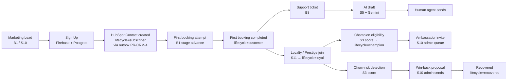
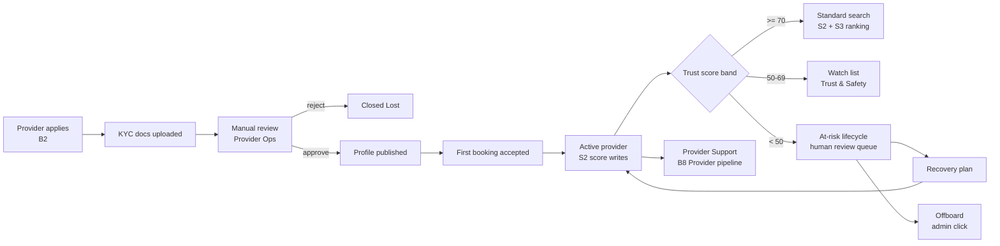
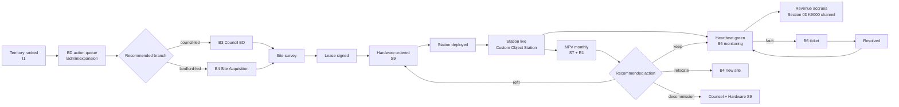
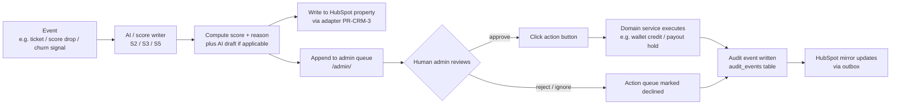

# PetWash HubSpot Master Operating System

**Status:** Spec only. No runtime change introduced by the PR that ships this document.

**Branch:** `claude/issue-153-hubspot-mos` (off post-#211 `main`).

**Owner:** CEO. Reviewed by Eng, Ops, Marketing, Counsel/CPA where indicated. Implementation PRs follow the appendix sequence.

**Companion documents (do NOT edit; cross-referenced only):**
- `docs/architecture/00-master-roadmap.md` — governance, 12-field PR template
- `docs/architecture/01-unified-payment-abstraction.md` — adapter pattern this spec mirrors
- `docs/architecture/02-wallet-redesign.md` — bucket model that gates lifecycle stages
- `docs/architecture/05-marketplace-payouts.md` — payout lifecycle that gates Provider scoring
- `docs/architecture/06-booking-consistency.md` — Postgres-as-truth (HubSpot is downstream cache)
- `docs/architecture/07-admin-observability.md` — 5-room admin model, mirrored as HubSpot Reports
- `docs/architecture/09-fraud-risk-matrix.md` — fraud signal store (consumed by Trust scoring)
- `docs/architecture/execution-pr-roadmap.md` — 12-field PR metadata template (§0.6)
- `docs/finance/00-platform-role-model.md` — legal-role matrix
- `docs/finance/02-money-object-model.md` — append-only ledger semantics
- `.claude/skills/petwash-platform/SKILL.md` — protected systems, Gemini guardrails
- `.claude/skills/petwash-pr-guardian/SKILL.md` — Gate 1 / 2 / 3 discipline

**Hard scope rules for this PR (the doc-only PR):**
- ❌ No runtime code change.
- ❌ No HubSpot API call (audit-only via repo reads).
- ❌ No schema migration / new column / new table.
- ❌ No new dependency.
- ❌ No `.env` / `.env.example` mutation.
- ❌ No live-money / wallet / Nayax / Tranzila / SUMIT / payout / refund / invoice change.
- ❌ No `/admin` or auth-surface change.
- ❌ No edits to `docs/architecture/*` (already merged via PR #211).
- ✅ Single new file at `docs/product/crm/hubspot-master-operating-system.md`.

---

## §0 — NON-NEGOTIABLE CRM / HUBSPOT RULES

> These rules are binding. Every PR-CRM-* PR (and every HubSpot
> configuration change made by a human operator outside of code) must
> comply. They were promoted to the top of this document so a reviewer
> cannot miss them. Their detailed reasoning + rollout-phase mapping
> lives in **Appendix S — CEO Additions, Round 001** at the end of
> this document; that appendix is the **source being promoted, not
> replaced**, and it remains intact as the historical audit trail.
>
> Cross-reference convention: items below are tagged `[→ S.x]` to point
> at the matching Appendix S section.

### Rule 1 — Source-of-truth precedence  [→ S.1]

The PetWash app and database remain the **source of truth** for every
canonical fact about the business:

- bookings
- wallet (every bucket per `docs/architecture/02-wallet-redesign.md`)
- payments (charges, captures, settlements, refunds, chargebacks)
- invoices / receipts / credit notes (per `docs/finance/02-money-object-model.md` numbering authority)
- pet profiles (per `docs/product/pet-profile-luxury-onboarding-master-plan.md`)
- providers (`providers`, `walkerProfiles`, `sitterProfiles`)
- stations / machines (K9000) and station heartbeats
- territory state
- audit logs (hash-chained `audit_events`, Part 9 of Financial Core Spec)
- KYC / compliance state (provider verification, biometric, document)
- financial events (P&L, VAT timing, withholding, Masav batches)

HubSpot is an **operating mirror and relationship cockpit**. It may
display, organise, score, summarise, and help manage relationships. It
**must not override** canonical platform truth on any field above.
Conflict resolution: PetWash database wins; HubSpot mirror is
reconciled to match; reconciliation is auditable.

### Rule 2 — Money firewall  [→ S.2]

HubSpot must NEVER move money, approve payouts, issue refunds, alter
wallet balances, create tax documents, reverse transactions, approve
financial settlement, or change provider payment status.

Any money-related action happens **only** through PetWash backend
services with all of:

- server-side authorisation (`requireAuth` / RBAC / second-admin where
  applicable)
- idempotency key (per PR-W4 / PR-J pattern)
- append-only audit log (hash-chained per Part 9)
- finance object-model compliance (canonical Money type, locked-nine
  fields, append-only ledger entries)
- CPA / counsel-approved flow where required (refunds, credit notes,
  payouts, withholding, clawbacks)

Adapter API surface forbids the symbols that would enable a violation:
`chargeCard`, `issueRefund`, `triggerPayout`, `creditWallet`,
`issueInvoice`, `voidTransaction`, `releaseEscrow`,
`approvePayoutBatch`, `mutateLedgerEntry`. Source-pin tests assert
their absence on `HubSpotAdapter`.

### Rule 3 — AI authority (precise carve-outs)  [→ S.6]

AI workflows in or around HubSpot (HubSpot AI / Breeze, custom LLM
calls per `docs/architecture/00-master-roadmap.md` governance, and the
internal Gemini integration per `petwash-platform` skill §3) MAY:

- summarise records, threads, pipelines, and reports
- detect risks (fraud, churn, machine failure, dispute volatility)
- suggest next actions to a human
- draft email / chat / workflow / educational copy
- classify leads (territory fit, franchise readiness)
- score opportunities (provider trust, territory, churn, loyalty
  upgrade likelihood)
- flag missing or anomalous data
- prepare reports (operational, executive, investor)

AI MUST NOT:

- approve providers (KYC outcome, marketplace activation)
- approve KYC results
- approve money movement (refund, payout, credit, invoice, wallet
  adjustment, payment release)
- approve refunds (any class)
- change legal terms or T&Cs
- commit municipal or landlord obligations
- sign contracts (any class)
- modify finance / tax records (any class)
- activate stations commercially
- override audit or compliance rules
- decide a chargeback's outcome
- write to any Postgres table on PetWash side that is not pre-classified
  as AI-writable

Every AI action is wrapped in an `ai_event` with:

```
ai_event { event_id, agent_class, proposed_action,
           human_decision: pending | approved_by_<admin> |
                           rejected_by_<admin>,
           approved_at?, audit_event_id (FK audit_events) }
```

It does not act until a human clicks. The click writes the
`audit_event` and hash-chains into Part 9.

### Rule 4 — CRM object model (locked enum)  [→ S.3]

The HubSpot account uses these object types and only these:

| HubSpot object class | Standard / Custom | PetWash entity it mirrors | Source of truth | Sync direction | Canonical id |
|---|---|---|---|---|---|
| Contact | Standard | App User (pet owner / customer / unauthenticated lead) | PetWash | PetWash → HubSpot | `appUserId` |
| Company | Standard | Brand retail partner / corporate customer / municipality entity / property landlord entity / supplier entity | PetWash | PetWash → HubSpot | `partnerId` / `municipalityId` / `landlordId` / `supplierId` (canonical) + `hubspotCompanyId` (mirror-side opaque) |
| Deal | Standard | Sales-pipeline records (B5 retail, B7 investor, S14 partnerships, S4 franchise) | HubSpot for the deal lifecycle; PetWash for any monetary outcome | mostly HubSpot-owned; PetWash receives final commercial state via webhook | `dealId` (canonical) + `hubspotDealId` (mirror) |
| Ticket / **Support Case** | Standard (renamed conceptually) | Support case (B8) — first-class concept; never confuse with bookings or KYC reviews | HubSpot for case lifecycle; PetWash for any underlying entity state | bidirectional within Phase 2 bounds | `supportCaseId` (canonical) + `ticketId` (HubSpot-side) |
| **Custom: Pet Profile** | Custom | Pet record (per `docs/product/pet-profile-luxury-onboarding-master-plan.md`) | PetWash | PetWash → HubSpot | `petId` |
| **Custom: Provider** | Custom | Marketplace provider (sitter / walker / groomer / driver / wash partner) | PetWash | PetWash → HubSpot | `providerId` |
| **Custom: Station** | Custom | Physical K9000 / wash kiosk site | PetWash | PetWash → HubSpot | `stationId` |
| **Custom: Territory** | Custom | Geographic territory pipeline (I1) | PetWash | PetWash → HubSpot (with HubSpot enrichment in Phase 3) | `territoryId` |
| **Custom: Municipal Lead** | Custom | Council / municipal opportunity (B3) | HubSpot pipeline; PetWash for any contractual outcome | mostly HubSpot-owned | `municipalityId` |
| **Custom: Franchise Lead** | Custom | Prospective franchisee (S4 / B7 overlap) | HubSpot pipeline; PetWash for franchise activation | mostly HubSpot-owned | `franchiseLeadId` |
| **Custom: Partner** | Custom | Brand / strategic partner pipeline (B5 + S14) | HubSpot pipeline; PetWash for contract execution | mostly HubSpot-owned | `partnerId` |
| **Custom: Landlord** | Custom | Property-landlord lead (B4) | HubSpot pipeline; PetWash for lease activation | mostly HubSpot-owned | `landlordId` |
| **Custom: Supplier** | Custom | Hardware / services supplier (S9) | HubSpot pipeline; PetWash for purchase order activation | mostly HubSpot-owned | `supplierId` |
| **Custom: Incident** | Custom | Operational incident (machine fault, dispute escalation, security event) | PetWash | PetWash → HubSpot | `incidentId` |
| **Custom: Maintenance Event** | Custom | Scheduled or reactive maintenance against a Station | PetWash | PetWash → HubSpot | `maintenanceEventId` |
| **Custom: Expansion Opportunity** | Custom | Specific opportunity tied to a Territory | HubSpot pipeline; PetWash for live commitment | mostly HubSpot-owned | `opportunityId` |

Forbidden mixing:
- A Provider is NOT a Contact.
- A Station is NOT a Company.
- A Pet Profile is NOT a Contact.
- A Municipal Lead is NOT a Company.
- Each custom object has exactly one canonical id from PetWash; HubSpot
  internal ids are treated as opaque.

### Rule 5 — Lifecycle maps  [→ S.4]

Each lifecycle below has its own pipeline. No mixing. PetWash event
flips the stage; HubSpot does not mutate PetWash state.

| Lifecycle | Mirrors | Source of truth |
|---|---|---|
| Customer / pet owner | App User profile + first-booking + retention signals | PetWash |
| **Pet Profile** | Pet record onboarding milestones (per `docs/product/pet-profile-luxury-onboarding-master-plan.md` PR-PET-* sequence) — **first-class lifecycle**, not derived from customer | PetWash |
| Provider | KYC + onboarding + booking volume + dispute / fraud signals (S2) | PetWash |
| Franchisee | S4 milestones (Inquiry → Sunset) | HubSpot pipeline; PetWash for activation |
| Municipality | B3 milestones (Outreach → Discontinued) | HubSpot pipeline; PetWash for any operational outcome |
| Landlord | B4 milestones (Identified → Renewing) | HubSpot pipeline; PetWash for lease activation |
| Corporate partner | B5 + S14 milestones (Prospect → Reviewing) | HubSpot pipeline; PetWash for contract execution |
| Support case | B8 ticket lifecycle (New → Closed → Reopened) | HubSpot for the case lifecycle; PetWash for any underlying state mutation |
| Machine site | S9 + R1 milestones (Site-survey → Decommissioned) | PetWash |
| Territory pipeline | I1 + S4 milestones (Identified → Re-evaluating) | PetWash |

### Rule 6 — Data hygiene + canonical IDs  [→ S.5]

**Canonical IDs (locked enum)** — every mirrored record carries exactly
one canonical PetWash id in a property whose name matches the id:

| Domain | Canonical id |
|---|---|
| App User | `appUserId` |
| Pet | `petId` |
| Provider | `providerId` |
| Station | `stationId` |
| Territory | `territoryId` |
| Booking | `bookingId` |
| Wallet account | `walletAccountId` |
| Incident | `incidentId` |
| Support case | `supportCaseId` |
| HubSpot Contact (mirror-side) | `hubspotContactId` |
| HubSpot Company (mirror-side) | `hubspotCompanyId` |
| HubSpot Deal (mirror-side) | `hubspotDealId` |

**Hygiene rules (locked):**

H-1. **No duplicate CRM identity.** A given canonical id resolves to
exactly one HubSpot object. Sync uses UPSERT on canonical-id property;
never INSERT-without-checking.

H-2. **Dedupe by canonical id first.** Email-match is a fallback only
when canonical id is not yet known.

H-3. **No CRM-only provider status.** Provider activation /
suspension / on-hold status is owned by PetWash. HubSpot can DISPLAY
the status (mirrored from PetWash) but cannot AUTHORITATIVELY hold it.

H-4. **No CRM-only booking status.** Booking lifecycle (`pending`,
`confirmed`, `in_progress`, `completed`, `cancelled`, `disputed`) is
owned by PetWash per `docs/architecture/06-booking-consistency.md`.
HubSpot mirrors only.

H-5. **No CRM-only station activation status.** Commercial activation
of a K9000 station happens in PetWash backend with admin click +
audit. HubSpot mirrors the state.

H-6. **No free-text finance state.** No HubSpot free-text field
contains wallet balance, payment status, refund amount, payout amount,
or any monetary-cents value as a primary record. Mirror display fields
are explicitly labelled `[mirror]` so support agents do not edit them
by hand.

H-7. **No PII duplication.** A single HubSpot object holds the
authoritative mirrored copy of an attribute; sibling objects reference
it by canonical id.

H-8. **Dedupe rules must be explicit per object class.** Each
PR-CRM-* runtime PR that touches sync includes a per-object dedupe
specification in its Gate-1 report; the spec is source-pin tested.

H-9. **CRM updates must not overwrite app truth without controlled
backend route.** Any HubSpot-side mutation that wants to flow back to
PetWash transits a typed, RBAC-gated, audit-logged backend route. Any
attempt to write directly to PetWash tables from HubSpot is blocked at
the database level (no HubSpot service-account credentials grant DML
on canonical tables).

H-10. **Property naming convention:** `petwash_<entity>_<field>` for
all custom-mirrored fields; HubSpot-native properties keep their
default names. Source-pin test asserts the prefix on every custom
property created by PR-CRM-* PRs.

H-11. **Timestamp suffix:** every timestamp property has a `_utc`
suffix and stores ISO 8601 UTC. Display layer translates to local
(default Asia/Jerusalem).

H-12. **Schema property additions** require a documented purpose, an
owning team, a freshness cadence, and a privacy classification.
Without all four, the property cannot be created.

### Rule 7 — Five-phase rollout (gated)  [→ S.7]

The 13 PRs in Appendix A regroup under the CEO 5-phase model:

| Phase | Scope | PR coverage |
|---|---|---|
| **Phase 0** docs / audit only | Document everything; no code touches HubSpot | `PR-CRM-0` (this spec), `PR-CRM-1` (repo audit + source-pin tests pinning current HubSpot state, including the 20 documented defects D-01..D-20) |
| **Phase 1** read-only mirror | PetWash → HubSpot one-way sync; no two-way; no AI | `PR-CRM-2` env-var + config-health, `PR-CRM-3` adapter (mock-mode default), `PR-CRM-4` Contact one-way sync, `PR-CRM-5` Provider custom-object one-way sync |
| **Phase 2** controlled two-way sync | Bounded write-back from HubSpot for non-money operations only | `PR-CRM-6` pipeline + lifecycle scaffolding spec, `PR-CRM-7` Provider-trust score writer (S2), `PR-CRM-8` Territory score writer (I1), `PR-CRM-9` Support ticket routing (B8) |
| **Phase 3** predictive intelligence | AI / scoring writes to HubSpot mirror; admin reviews; humans approve | `PR-CRM-10` KPI dashboard reads (S6), `PR-CRM-11` automation hooks |
| **Phase 4** franchise / global cockpit | Multi-region cockpit; franchise telemetry; investor view | `PR-CRM-12` AI workflow safety rails + future `PR-CRM-13..N` |

**Gating rules (locked):**

G-1. **Do not skip phases.** A Phase-N PR cannot ship before all
prior-phase PRs are merged AND the prior-phase soak / acceptance
criteria are met.

G-2. **No two-way sync until read-only mirror is verified.** Phase 1
must soak ≥ 30 days with reconciliation green (canonical-id dedupe
rate ≥ 99.9%) before any Phase-2 PR is opened.

G-3. **No AI actions until source-of-truth and permission rules are
locked.** Phase 3 cannot start until Rules 1, 2, 3, 6 above are
operationally proven over Phase 2 + CEO + counsel sign-off on the AI
carve-outs.

G-4. **Phase 3 → Phase 4** requires Provider Master Agreement,
Franchise Master Agreement, and CFO close-of-books reconciliation
against HubSpot reports for ≥ 90 days.

Each phase boundary is its own merge gate.

### Rule 8 — PR discipline  [→ S.8]

D-1. **Docs-only for spec PRs.** A spec PR (the document you are
reading + future spec deltas) introduces zero runtime change.

D-2. **Single-purpose runtime PRs.** No "connect HubSpot to
everything" PR. Each PR-CRM-* runtime PR touches at most one of:
`server/services/HubSpotAdapter.ts`, `server/jobs/hubspotSync*.ts`,
`server/routes/hubspot*.ts`, manual-setup-spec deltas in this doc.

D-3. **No runtime PR ships:**
- a database migration (separate schema-migration sub-PR)
- a finance / payment / payout / refund / invoice / tax / wallet /
  K9000 / provider-activation change (those changes live in their
  own PR classes per `docs/architecture/execution-pr-roadmap.md`)
- an auth / RBAC change (separate auth PR class)
- a hidden side effect (every behaviour change is declared in the
  Gate-1 report)
- a package / lockfile change (separate dependency PR class)
- a configuration change (separate config PR class)
- a HubSpot API call from a docs-only PR (zero by definition)

D-4. **Single-revert.** Every PR-CRM-* can be reverted with
`git revert` and the system returns to the prior known-good state.

---

These eight rules are non-negotiable. Any PR that contradicts them is
wrong and must be rejected at Gate 1. The detailed reasoning + rollout
phase mapping is preserved verbatim in **Appendix S — CEO Additions,
Round 001** at the end of this document, which remains the historical
audit trail of the round-001 promotion.

---

## Table of contents

- [0. Honest preamble — what we found, what is broken](#0-honest-preamble)
- [1. Repo audit — every concrete HubSpot file, line by line](#1-repo-audit)
- [2. Governing principles for the HubSpot OS](#2-governing-principles)
- [3. Locked vocabulary — terms used in this document](#3-locked-vocabulary)
- [PHASE 1 — Foundations (mapping + structure)](#phase-1)
  - [1.1 Map current pipelines per branch](#11-map-current-pipelines)
  - [1.2 Proposed ideal pipeline structure per branch](#12-proposed-pipeline-structure)
  - [1.3 Lifecycle stages per branch](#13-lifecycle-stages)
  - [1.4 Provider scoring architecture (S2)](#14-provider-scoring)
  - [1.5 Territory scoring architecture (I1)](#15-territory-scoring)
  - [1.6 Support ticket routing (B8)](#16-support-routing)
  - [1.7 Dashboard KPIs (S6)](#17-dashboard-kpis)
  - [1.8 Automation opportunities (cross-branch)](#18-automation-opportunities)
- [PHASE 2 — Operationalisation](#phase-2)
  - [2.1 HubSpot automations](#21-hubspot-automations)
  - [2.2 AI workflows (HubSpot AI / Breeze + custom AI)](#22-ai-workflows)
  - [2.3 Integrations matrix](#23-integrations-matrix)
  - [2.4 Reporting structure per audience](#24-reporting-structure)
  - [2.5 Operational dashboards (5-room mirror)](#25-operational-dashboards)
  - [2.6 Expansion intelligence](#26-expansion-intelligence)
- [PHASE 3 — Long-term architecture (predictive + scaled)](#phase-3)
  - [3.1 Predictive maintenance (S9)](#31-predictive-maintenance)
  - [3.2 AI support (B8 + S5)](#32-ai-support)
  - [3.3 AI provider ranking (S2 + booking outcomes)](#33-ai-provider-ranking)
  - [3.4 Franchise intelligence (S4)](#34-franchise-intelligence)
  - [3.5 Smart territory expansion (I1)](#35-smart-territory)
  - [3.6 Customer churn prediction (S3)](#36-churn-prediction)
  - [3.7 Station profitability prediction (R1 + S6 + S7)](#37-station-profitability)
- [4. End-to-end journey diagrams](#4-journey-diagrams)
- [5. Failure modes & rollback strategy](#5-failure-modes)
- [6. Open questions](#6-open-questions)
- [7. Out-of-scope (explicit)](#7-out-of-scope)
- [Appendix A — PR plan (PR-CRM-0 … PR-CRM-12)](#appendix-a-pr-plan)
- [Appendix B — Field & object dictionary (proposed)](#appendix-b-field-dictionary)
- [Appendix C — Manual HubSpot setup checklist](#appendix-c-manual-setup)
- [Appendix D — Source-pin test matrix for PR-CRM-1](#appendix-d-source-pin-tests)

---

## <a id="0-honest-preamble"></a>0. Honest preamble — what we found, what is broken

The CEO has just removed the prior programmer for messing up HubSpot integration. This section says what is actually present in the codebase today, plainly, with citations. No flattery.

### 0.1 What exists today

There is a HubSpot integration in the repo. It is small, partial, oddly authenticated, and operationally fragile. Concretely:

1. A single server-side helper `server/hubspot.ts` (310 lines) — it owns `getUncachableHubSpotClient`, `syncUserToHubSpot`, `trackHubSpotEvent`, plus an in-process retry queue. It uses **Replit's connector OAuth flow** (`process.env.REPLIT_CONNECTORS_HOSTNAME`, `process.env.REPL_IDENTITY`, `process.env.WEB_REPL_RENEWAL`) to fetch a HubSpot access token at request time. There is no documented fall-back when the platform is not Replit. (`server/hubspot.ts:4-50`)
2. A one-off setup script `server/create-hubspot-properties.ts` that creates a single property group `petwashinfo` with six contact properties: `petwash_uid`, `petwash_loyalty`, `petwash_reminders`, `petwash_marketing`, `petwash_consent`, `consent_timestamp`. (`server/create-hubspot-properties.ts:13-62`)
3. Three call-sites that fire `syncUserToHubSpot` on registration:
   - `/api/sessions/...` post-registration block in `server/routes.ts:1262-1278`
   - `server/routes/complete-registration.ts:134-151`
   - `server/routes/privilege-loyalty.ts:215-238`
4. Two HTTP endpoints that wrap the helper:
   - `POST /api/hubspot/sync-user` (`server/routes.ts:9514-9550`)
   - `POST /api/hubspot/track-event` (`server/routes.ts:9552-9577`)
5. Client-side wrappers:
   - `client/src/lib/hubspot.ts` calls the two endpoints above.
   - `client/src/lib/utils.ts:28-41` — `createHubSpotForm`, with **a hard-coded HubSpot Portal ID `46822710` and a hard-coded form GUID `9026e0ad-d0a2-43ad-9c81-67bb88e4b5b9`** baked into client source.
   - `client/src/main.tsx:16-41` — `_hsq` queue init + `trackHubSpotPageView` re-fired on `pushState` / `replaceState` / `popstate`.
   - `client/src/pages/Contact.tsx:39-47, 263-267` — embeds the form via `createHubSpotForm`.
   - `client/src/pages/SignUp.tsx:7, 544-560` — calls `syncUser` after sign-up.
6. `.env.example:80-82` declares two env vars: `HUBSPOT_PORTAL_ID`, `HUBSPOT_FORM_GUID`. Neither is consumed by `server/hubspot.ts` (the server uses the Replit connector instead).
7. `scripts/verify-env.ts:42` lists `HUBSPOT_PORTAL_ID` as optional.
8. `.github/workflows/petwash-ci.yml:270-282, 745-746` mounts `HUBSPOT_FORM_GUID` and `HUBSPOT_PORTAL_ID` from GCP Secret Manager into Cloud Run, with placeholders if absent.
9. `server/middleware/securityHeaders.ts:59-63, 136-140` whitelists HubSpot domains in CSP (`js.hubspot.com`, `forms.hubspot.com`, `track.hubspot.com`, `*.hubspot.com`).
10. `package.json:29` declares `@hubspot/api-client: ^13.4.0`. This is the only HubSpot dependency.

### 0.2 What is wrong with the existing integration

The list below is honest. Each item is a concrete defect or a structural problem.

| # | Defect | Citation | Impact |
|---|---|---|---|
| D-01 | **No Provider sync.** `syncUserToHubSpot` is called only in customer / prestige / generic registration paths. There is no companion `syncProviderToHubSpot`. Providers are invisible to the CRM. | `server/hubspot.ts:106-237` (only function) + `git grep` shows no provider call site | Branch B2 (Provider App Washers) is empty in the current CRM. The CEO's Hard Rule "do NOT mix providers and customers" is currently *enforced by absence*, not by structure. |
| D-02 | **All contacts get `lifecyclestage: 'subscriber'`.** Every sync — customer, prestige member, server-side safety net — sets the same lifecycle stage. There is no differentiation between Customer (B1), Provider (B2), Council lead (B3), Landlord (B4), Brand Partner (B5), Investor (B7). | `server/hubspot.ts:134` | All 8 branches collapse into one. The CEO's Hard Rule "do NOT collapse branches" is violated today. |
| D-03 | **Duplicate sync on the same registration event.** A new user can hit `/api/sessions` (`routes.ts:1265-1274`) AND `complete-registration` (`complete-registration.ts:135-151`) AND privilege-loyalty (`privilege-loyalty.ts:216-238`) in the same flow. There is no idempotency key beyond email — the helper handles 409 by updating, but that means three writes per registration, three notes per registration on the timeline. | three call sites cited above | Hits HubSpot daily-call quota faster than necessary; pollutes timeline. |
| D-04 | **`company` field hardcoded to `Pet Wash™`.** Every contact's `company` is set to the literal string ⁦Pet Wash™⁩ (with bidi marks). This collides with HubSpot's Company object semantics and with B4 (Property Landlord Locations) and B5 (Brand Retail Partners) which need real Company records. | `server/hubspot.ts:139` | The `company` field becomes meaningless for any future B2B work. |
| D-05 | **Hard-coded portal ID and form GUID in client code.** `46822710` and `9026e0ad-d0a2-43ad-9c81-67bb88e4b5b9`. These are committed in plaintext to the repo. They are not secrets — they are public IDs — but they bypass the `HUBSPOT_PORTAL_ID` / `HUBSPOT_FORM_GUID` env contract that the rest of the codebase claims to use. | `client/src/lib/utils.ts:33-34` | Re-pointing the form to a different HubSpot portal requires a code deploy, not a config flip. |
| D-06 | **Auth via Replit connector only.** `getAccessToken()` requires `REPLIT_CONNECTORS_HOSTNAME` + `REPL_IDENTITY` or `WEB_REPL_RENEWAL`. The CI workflow ships to Cloud Run, not Replit. There is no `HUBSPOT_PRIVATE_APP_TOKEN` path in the helper; the function will throw `'X_REPLIT_TOKEN not found'` on Cloud Run unless those env vars are also set there. | `server/hubspot.ts:11-19` vs `.github/workflows/petwash-ci.yml:745-746` (mounts only `HUBSPOT_FORM_GUID` and `HUBSPOT_PORTAL_ID`) | **NEEDS-DEEPER-TRACE** in production: there is a real risk that `syncUserToHubSpot` throws on every Cloud Run request and is silently swallowed by the `.catch(err => logger.warn(...))` fire-and-forget pattern at every call site. |
| D-07 | **In-process retry queue is a memory leak vector.** `setInterval(...)` at module scope (`server/hubspot.ts:86-103`) holds tasks in a `Map<string, RetryTask>`. On Cloud Run cold-start eviction, the queue dies silently. There is no persistence, no DLQ, no operator visibility. | `server/hubspot.ts:60-103` | Failed retries vanish on instance scale-down. |
| D-08 | **Fire-and-forget at every call site.** All three call sites use `.catch(err => logger.warn(...))` — no audit-event written, no row in `audit_events`, no metric, no alert. Compare with `petwash-platform` skill §2 "Every money mutation must have an audit log" — CRM mutations are *adjacent* to money (loyalty, prestige) and silently fail. | `server/routes.ts:1276-1278`, `server/routes/complete-registration.ts:141-143`, `server/routes/privilege-loyalty.ts:227-229` | Operations cannot tell whether HubSpot is healthy without reading logs by hand. |
| D-09 | **No webhook receiver.** HubSpot can push events back (lifecycle stage change, deal stage change, contact merge, GDPR delete). The repo has zero `/api/hubspot/webhook` route. | absence (verified by `grep -ri 'hubspot/webhook'` and `grep -ri 'verifyWebhook' server/`) | Bi-directional sync is impossible today. Marketing changes a stage in HubSpot — Postgres never hears about it. |
| D-10 | **No webhook signature verification.** Even if a webhook receiver were added, there is no `X-HubSpot-Signature` validator anywhere in `server/middleware/`. | absence | Future receiver would be open to replay / spoofing. |
| D-11 | **No object-type separation.** Contacts only. There are no Companies, no Deals, no Tickets, no Custom Objects (Stations, Pets, Bookings, Provider Trust Score) defined or written. | `server/create-hubspot-properties.ts` creates only contact properties | All 8 branches × 14 systems collapse into a single Contact-shaped surface. |
| D-12 | **No correlation between HubSpot contact ID and Postgres user ID.** `petwash_uid` is written *to* HubSpot, but the Postgres `users` table has no `hubspot_contact_id` column. The integration is one-way and forgetful. | `server/hubspot.ts:145` writes; `shared/schema.ts` has no inbound column (verified by absence in this PR class — schema not touched) | Future bi-directional sync, dedup, or backfill cannot use a stable cross-ID key. |
| D-13 | **No env-config validator for HubSpot.** Compare with `server/lib/payment-provider-mode.ts` which fail-closes Tranzila/Nayax when secrets are absent (per PR-CI-PAYMENT-MODE #203). HubSpot has no equivalent — it just throws at runtime. | absence | Mock-mode equivalent ("ok:false" rule from `petwash-platform` §2) is not honoured. |
| D-14 | **PII in HubSpot timeline notes.** `trackHubSpotEvent` posts a HubSpot Note containing `JSON.stringify(properties, null, 2)` as the body. Properties may include `country`, `language`, `tier`, `petsCount`. There is no PII redaction layer. | `server/hubspot.ts:272-284` | Israeli Privacy Protection Law (חוק הגנת הפרטיות) and GDPR-adjacent exposure if EU residents enrol. |
| D-15 | **No GDPR / consumer-protection delete path.** HubSpot stores email, phone, DoB, country. The repo has no `deleteHubSpotContact(email)` for `right-to-erasure` requests. | absence | Counsel risk. |
| D-16 | **`InvestorPresentation.tsx:343` advertises "HubSpot integration" as a platform capability.** It is currently the bare contact-sync above. Not a CRM. Not the multi-layer enterprise OS the CEO wants. | `client/src/pages/InvestorPresentation.tsx:343` | Mismatch between investor narrative and reality. |
| D-17 | **No tests for HubSpot integration.** `server/tests/` directory has 0 files matching `hubspot`. Zero source-pin tests, zero regression coverage. | `grep -rni hubspot /home/user/petwash-marketplace/server/tests/` returns empty | Any refactor risks silent regression. |
| D-18 | **Hard-coded company display name with bidi control marks.** `⁦Pet Wash™⁩` has Unicode `U+2066` and `U+2069` left-to-right embedding marks baked in. Not all HubSpot reports/exports tolerate them. | `server/hubspot.ts:139` | Cosmetic + reporting glitch. |
| D-19 | **`ProgrammaticMarketingService.ts` references HubSpot in a comment but does not consume the SDK.** It is a separate marketing engine that re-implements segmentation in-house. | `server/services/ProgrammaticMarketingService.ts:4` | Drift risk: two parallel marketing brains, neither authoritative. |
| D-20 | **Ad-hoc property names without governance.** `petwash_uid`, `petwash_loyalty` etc. are ad-hoc. No naming convention spec, no field dictionary, no review process. The CEO's Hard Rule "do NOT create random fields without purpose" is violated by construction — every new property added by a developer with API access will compound the mess. | `server/create-hubspot-properties.ts:13-62` | Long-term schema rot. |

### 0.3 What does NOT exist

The 14 intelligence/system layers (S2..S14, I1) are entirely **absent** from the repo. There is no S2 Provider Trust Score writer, no I1 Territory Score writer, no S6 KPI Command Center, no S10 Marketing Campaign Engine, no S11 Loyalty Membership Engine wired to HubSpot. The 8 branches as named by the CEO (B1..B8) are not represented as pipelines, custom object types, or distinct lifecycle structures. The HubSpot account itself may have manually-built pipelines — the CEO will know — but the codebase neither reads nor writes them.

This document is therefore **not** a refactor of an existing CRM. It is the **first** master spec.

### 0.4 Honest verdict

The current state is: a small "drop a contact into HubSpot when someone signs up" hack. It is not a CRM. It is not multi-layer. It is not enterprise. It will not scale to Uber/Airbnb/Rover/DoorDash level without a structural rebuild that:

- Separates the 8 branches as **distinct HubSpot pipelines** with their own lifecycle stages and their own custom-object backing.
- Replaces the in-process retry queue with a Postgres-backed outbox + a dedicated cron consumer.
- Replaces Replit-only auth with a Private App Token in GCP Secret Manager.
- Adds bidirectional webhook sync with signature verification and event-id dedup (mirrors `PR-NAYAX-1d` / Section 09).
- Treats HubSpot as a **downstream cache and CRM surface**, not as a source of truth. Postgres remains source of truth (per `docs/architecture/06-booking-consistency.md`).
- Layers the 14 system writers (S2..S14, I1) as **read-only score writers** that mirror to HubSpot custom properties for Marketing/Ops/CEO visibility, not as decision engines that move money.

The rest of this document specifies that rebuild.

---

## <a id="1-repo-audit"></a>1. Repo audit — every concrete HubSpot file, line by line

### 1.1 Files and their roles

| File | Role | Lines | Status |
|---|---|---|---|
| `server/hubspot.ts` | SDK-facing helper: `getAccessToken`, `getUncachableHubSpotClient`, `syncUserToHubSpot`, `trackHubSpotEvent`, in-process retry queue | 310 | Partial; Replit-only auth (D-06); leaks (D-07); customer-only (D-01, D-02) |
| `server/create-hubspot-properties.ts` | One-off CLI to create contact custom properties | 113 | Six properties created; no Company/Deal/Ticket/CustomObject equivalent (D-11, D-20) |
| `client/src/lib/hubspot.ts` | Thin client wrappers around `/api/hubspot/sync-user` and `/api/hubspot/track-event` | 60 | Acceptable surface; depends on broken server (D-08) |
| `client/src/lib/utils.ts:28-41` | `createHubSpotForm` form-embed helper | 14 | Hard-coded portal ID & form GUID (D-05) |
| `client/src/main.tsx:16-41` | `_hsq` page-view tracker | 26 | Acceptable; depends on HubSpot tracking script being loaded by HTML shell |
| `client/src/pages/Contact.tsx:39-47, 263-267` | Embeds the contact form on `/contact` | ~15 | Has a "native fallback" form path if HubSpot doesn't load — good defensive UX |
| `client/src/pages/SignUp.tsx:7, 544-560` | Calls `syncUser` after Firebase sign-up | ~17 | Duplicate-sync risk (D-03) |
| `server/routes.ts:1262-1278` | Post-registration sync inside the `/api/sessions` flow | 17 | Duplicate-sync risk (D-03) |
| `server/routes.ts:9514-9577` | `POST /api/hubspot/sync-user` and `POST /api/hubspot/track-event` HTTP endpoints | 64 | Unauthenticated routes — anyone can write to your CRM by POSTing to this endpoint. **NEEDS-DEEPER-TRACE** to confirm whether a global middleware (`validateFirebaseToken` etc.) is mounted upstream. |
| `server/routes/complete-registration.ts:134-151` | Server-side safety-net sync | 18 | Duplicate-sync risk (D-03) |
| `server/routes/privilege-loyalty.ts:215-238` | Prestige member sync (the comment "previously invisible to CRM" hints at a prior bug) | 24 | OK in intent; mixes prestige loyalty into base Contact (S11 leakage) |
| `server/middleware/securityHeaders.ts:59-63, 136-140` | CSP allowlist for HubSpot script + iframe origins | 9 | Acceptable |
| `server/services/ProgrammaticMarketingService.ts:4` | Comment-only mention; service is an **alternative** marketing brain, not a HubSpot consumer | 1 | D-19 — drift risk |
| `package.json:29` | `@hubspot/api-client: ^13.4.0` dependency | 1 | OK |
| `.env.example:80-82` | `HUBSPOT_PORTAL_ID`, `HUBSPOT_FORM_GUID` | 3 | Two env vars; no `HUBSPOT_PRIVATE_APP_TOKEN` declared |
| `scripts/verify-env.ts:42` | Env sanity-check entry (optional) | 1 | OK — but only one of two declared vars listed |
| `.github/workflows/petwash-ci.yml:270-282, 745-746` | Secret-Manager bootstrap + Cloud Run env mount for `HUBSPOT_FORM_GUID` and `HUBSPOT_PORTAL_ID` | 14 | Mounts the wrong pair (D-06: real auth needs a private-app token) |

### 1.2 Files NOT touching HubSpot (intentional negative findings)

To prevent the false claim "this codebase already has a CRM":

- `server/services/AuditLedgerService.ts` — **NOT** wired to HubSpot. No Note / Engagement is created on audit-event write.
- `server/services/BookingLifecycleService.ts` — **NOT** wired to HubSpot. Bookings are not Deals.
- `server/services/WalletService.ts` — **NOT** wired to HubSpot. Wallet movements are not Engagements.
- `server/jobs/*` — no HubSpot-syncing cron exists.
- `shared/schema.ts` — no `hubspot_contact_id`, `hubspot_company_id`, `hubspot_deal_id`, `hubspot_ticket_id` columns on any table. **Confirmed by absence; do NOT add in this PR class.** Any new column lives in PR-CRM-1 audit follow-ups, gated by a separate schema-migration PR.
- No Hubspot SDK import in any test file under `server/tests/`.

### 1.3 Citation table (every claim in §0 above mapped to file:line)

| Claim | Citation |
|---|---|
| Replit-only OAuth | `server/hubspot.ts:11-50` |
| In-memory retry queue | `server/hubspot.ts:60-103` |
| Hardcoded `lifecyclestage: 'subscriber'` | `server/hubspot.ts:134` |
| Hardcoded `company: ⁦Pet Wash™⁩` | `server/hubspot.ts:139` |
| 6 custom contact properties only | `server/create-hubspot-properties.ts:13-62` |
| Customer registration sync — `/api/sessions` | `server/routes.ts:1262-1278` |
| Customer registration sync — `complete-registration` | `server/routes/complete-registration.ts:134-151` |
| Prestige sync | `server/routes/privilege-loyalty.ts:215-238` |
| HTTP endpoints | `server/routes.ts:9514-9577` |
| Hardcoded portal/form ID in client | `client/src/lib/utils.ts:33-34` |
| `_hsq` page-view tracker | `client/src/main.tsx:16-41` |
| Two env vars declared | `.env.example:80-82` |
| CI Secret Manager bootstrap | `.github/workflows/petwash-ci.yml:270-282, 745-746` |
| CSP allowlist | `server/middleware/securityHeaders.ts:59-63, 136-140` |
| SDK dependency | `package.json:29` |
| Investor-deck claim | `client/src/pages/InvestorPresentation.tsx:343` |

---

## <a id="2-governing-principles"></a>2. Governing principles for the HubSpot OS

The 8 principles below are the binding rules the OS is built under. If a future PR conflicts with one, the PR is wrong.

### 2.1 Postgres is source of truth. HubSpot is a downstream cache + CRM surface.

Per `docs/architecture/06-booking-consistency.md` — Postgres holds the authoritative state of every booking, payout, wallet, station, audit event. HubSpot **mirrors** state for sales/ops/marketing visibility. HubSpot **never** writes back into Postgres without going through a webhook receiver that produces an event whose business logic is implemented in PetWash code.

Implication: Marketing changes a deal stage in HubSpot → webhook → Postgres receives a `crm_event_received` row → an audit event is written → a domain service decides whether the change is allowed.

### 2.2 The 8 branches are 8 distinct pipelines. They never share lifecycle stages, deal stages, or tickets.

The CEO's Hard Rule "do NOT collapse branches together" is enforced by giving each branch its own:
- HubSpot pipeline (Deal pipeline) where appropriate
- HubSpot lifecycle stage set (per object type)
- HubSpot Custom Object (where Contacts/Companies/Deals/Tickets do not naturally fit)
- HubSpot view, dashboard, and team assignment

| Branch | Primary HubSpot object | Pipeline name (proposed) |
|---|---|---|
| B1 Customer App Pet Owners | Contact (lifecycle: Lead → Subscriber → Customer → Loyal → Champion → Churn-Risk → Recovered) | n/a (Contact lifecycle, not deal pipeline) |
| B2 Provider App Washers | Custom Object `Provider` + Deal pipeline `Provider Onboarding` | `provider_onboarding_pipeline` |
| B3 Councils Municipal Leads | Company + Deal pipeline `Council BD` | `council_bd_pipeline` |
| B4 Property Landlord Locations | Company + Deal pipeline `Site Acquisition` | `site_acquisition_pipeline` |
| B5 Brand Retail Partners | Company + Deal pipeline `Brand Partnership` | `brand_partnership_pipeline` |
| B6 Operations Station Network | Custom Object `Station` + Ticket pipeline `Station Ops` | `station_ops_pipeline` |
| B7 Investor Funding Growth | Company + Deal pipeline `Investor Funding` (private team only) | `investor_funding_pipeline` |
| B8 Support Retention Trust Safety | Ticket pipeline `Customer Support` + Ticket pipeline `Provider Support` | `customer_support_pipeline`, `provider_support_pipeline` |

### 2.3 The 14 system layers are score-writers, not decision engines.

Per `petwash-platform` skill §3 "Gemini is an analyst, never an executive." S2 Provider Trust score, I1 Territory score, S3 Customer Lifecycle score, S13 Competition Watch index — every one of them computes a **number and a reason string** that lands on a HubSpot custom property. **None** of them releases money, approves a provider, refunds a customer, or auto-pays a payout. The action surface for every score is a human admin in the PetWash admin (not HubSpot) clicking a button that writes an audit event.

### 2.4 Customers and providers are never mixed on the same HubSpot object.

The CEO's Hard Rule "do NOT mix providers and customers" is enforced by:
- Customers live as **Contacts** with `lifecyclestage` ∈ {lead, subscriber, customer, loyal, champion, churn-risk, recovered}.
- Providers live as a **Custom Object** `Provider` (separate object type — not Contact). Each Provider has 1..N **associated Contacts** (the human(s) representing the provider business). The Custom Object holds business-grade fields (KYC status, trust score, payout state) that have no place on a Contact.
- A user who is *both* a customer and a provider has two records: a Contact (customer side) and a `Provider` custom-object record (provider side), associated. Multi-role disallowance per `docs/finance/00-platform-role-model.md §0.1.2`.

### 2.5 Infrastructure (R1 stations) and Support (B8 tickets) are never mixed.

Stations live as a custom object `Station`. Station-down tickets live in pipeline `Station Ops` (B6). Customer support tickets live in `Customer Support` (B8). Provider support tickets live in `Provider Support` (B8). They share zero lifecycle stages.

### 2.6 No random fields without purpose.

Every HubSpot custom property MUST appear in **Appendix B field dictionary** of this document with: name, label, type, owning system layer, write authority (which Postgres service writes it), refresh cadence, downstream consumer. Properties not in the dictionary are forbidden and the PR-CRM-6 setup script will not create them.

### 2.7 Automation-ready, AI-ready, investor-ready, legal-ready.

- **Automation-ready** = every state change a HubSpot workflow could fire on is also emitted as a structured event in PetWash (so we can replay).
- **AI-ready** = every Contact / Provider / Station carries enough structured fields that a downstream model (LLM or classical) can consume without re-joining external data.
- **Investor-ready** = the 5-room dashboard mirror (§2.5) renders the metrics any due diligence needs in <60s.
- **Legal-ready** = every contact field has a documented retention policy; every webhook write is signed; every deletion follows the consumer-protection / GDPR-adjacent path.

### 2.8 No live-money side effect from any HubSpot pipeline.

HubSpot can change a deal stage from "Closed Won" to "Closed Lost" all day long. **Nothing** in PetWash code triggers a refund, payout, wallet credit, voucher issuance, or invoice on a HubSpot stage change. The only money path is the existing Tranzila / SUMIT / Nayax pipelines. HubSpot stage changes are signals; humans (and only humans) decide the money action in `/admin`.

This is the bright line that the prior programmer is reported to have crossed. The OS makes it impossible to cross again, by construction: the HubSpot adapter abstraction (PR-CRM-3) has no `chargeCard`, `issueRefund`, `triggerPayout` method on it, ever.

---

## <a id="3-locked-vocabulary"></a>3. Locked vocabulary — terms used in this document

| Term | Meaning |
|---|---|
| **Branch** | One of B1..B8. The CEO's "branches" of the platform. Each has its own pipeline. |
| **System layer** | One of S2..S14 or I1. Cross-cutting intelligence engine. |
| **Pipeline** | A HubSpot Deal or Ticket pipeline. Has stages. Stages are not lifecycle stages. |
| **Lifecycle stage** | A HubSpot Contact / Company lifecycle field value. Set by automations or score writers. |
| **Custom Object** | A HubSpot CRM object type beyond Contact / Company / Deal / Ticket. Used for Provider, Station, Pet, Booking, Trust Score record. |
| **Adapter** | The PetWash side abstraction in front of `@hubspot/api-client` (PR-CRM-3). Mock-mode default. |
| **Outbox** | Postgres table holding pending HubSpot writes (replaces in-memory retry queue, D-07). |
| **Webhook receiver** | PetWash route accepting signed HubSpot webhook callbacks; produces a `crm_event_received` row, an audit event, and (optionally) a domain action. |
| **Score writer** | A PetWash service that computes a number + reason and writes it to a HubSpot custom property via the adapter. Read-only on the HubSpot side. |
| **Action queue** | A queue of human-decision items surfaced in the PetWash admin (not HubSpot) for actions a score writer recommended. |
| **Source-pin test** | A test that locks the *current* behaviour against unintended drift. Mandatory for every runtime PR. |

---

## <a id="phase-1"></a>PHASE 1 — Foundations (mapping + structure)

### <a id="11-map-current-pipelines"></a>1.1 Map current pipelines per branch

The 8 branches × the lifecycle stages each one runs (or does not run today). Every "today" cell is a fact about the codebase; every "target" cell is a proposal.

| Branch | What is in HubSpot today (codebase view) | Citation | What it should be (target) |
|---|---|---|---|
| B1 Customer | Contact created on registration with `lifecyclestage='subscriber'`. Single property group `petwashinfo`. | `server/hubspot.ts:106-237`, `server/create-hubspot-properties.ts:13-62` | 7-stage Contact lifecycle (see 1.3.1) + Customer Onboarding deal pipeline (optional) + ticket links to B8 |
| B2 Provider | **Nothing.** No provider sync. | absence (D-01) | Custom Object `Provider`. 9-stage Deal pipeline `Provider Onboarding`. Ticket queue link to B8 Provider Support. |
| B3 Councils | **Nothing.** | absence | Company + 7-stage Deal pipeline `Council BD`. |
| B4 Landlords | **Nothing.** | absence | Company + 8-stage Deal pipeline `Site Acquisition` (depends on Hardware S9). |
| B5 Brand Partners | **Nothing.** | absence | Company + 6-stage Deal pipeline `Brand Partnership`. |
| B6 Station Ops | **Nothing in HubSpot.** Postgres has `pet_wash_stations` and `station_heartbeat` (per `petwash-platform` skill §1 row 11). | Cited via skill, not direct grep this PR | Custom Object `Station`. Ticket pipeline `Station Ops` for incidents. Mirror of station heartbeat to HubSpot for visibility. |
| B7 Investor | **Nothing.** | absence | Company + 5-stage Deal pipeline `Investor Funding`, private team. |
| B8 Support | **Nothing structured.** A "Note" is created on the Contact for every `trackHubSpotEvent` call. | `server/hubspot.ts:272-284` | 2 Ticket pipelines: `Customer Support`, `Provider Support`. Note objects continue but are limited to engagement events, not support tickets. |

**Verdict:** Today, 7 of 8 branches are empty. The 1 branch that exists (B1) is malformed (D-01 .. D-04, D-08, D-13, D-14).

### <a id="12-proposed-pipeline-structure"></a>1.2 Proposed ideal pipeline structure per branch

Each pipeline below is a separate HubSpot pipeline (Deal pipeline or Ticket pipeline) created manually by Ops per **Appendix C** and read by PetWash code starting in PR-CRM-6. Stage IDs are HubSpot-internal; the names are the contract.

#### 1.2.1 B1 Customer App Pet Owners — *Customer Onboarding Deal pipeline* (optional secondary; primary tracking is the Contact lifecycle in §1.3.1)

| # | Stage name | Entry trigger | Exit trigger | SLA | Owner role |
|---|---|---|---|---|---|
| 1 | Lead Captured | website form submission OR app waitlist | profile completed | n/a | Marketing |
| 2 | Profile Completed | `complete-registration` returns success | first booking attempted OR first wash session | 30d | Lifecycle Marketing |
| 3 | First Booking Attempted | booking row inserted | booking confirmed | 7d | Lifecycle Marketing |
| 4 | First Booking Confirmed | booking status → `confirmed` | first booking completed | 30d | Lifecycle Marketing |
| 5 | Activated Customer | first booking status → `completed` | 90 days inactive OR loyalty join | n/a | Retention |
| 6 | Loyal Customer | second completed booking within 60d OR loyalty join | 180 days inactive | n/a | Retention |
| 7 | Champion | NPS ≥ 9 OR referred ≥ 1 OR ≥ 10 completed | 365 days inactive | n/a | Lifecycle Marketing |
| 8 | Churn-Risk | 90 days inactive OR support escalation | win-back booking OR explicit unsubscribe | n/a | Retention |
| 9 | Closed Lost | 365 days inactive AND no win-back | revival event | n/a | Auto-archive |

#### 1.2.2 B2 Provider App Washers — *Provider Onboarding Deal pipeline*

| # | Stage name | Entry trigger | Exit trigger | SLA | Owner role |
|---|---|---|---|---|---|
| 1 | Application Submitted | provider sign-up form submitted | KYC docs uploaded | 7d | Provider Ops |
| 2 | KYC Docs Submitted | required documents in storage | manual review starts | 3d | Provider Ops |
| 3 | KYC Under Review | reviewer assigned | approve / reject | 5d | Provider Ops |
| 4 | KYC Approved | approval audit event written (per `petwash-platform` skill §2) | first profile published | 7d | Provider Ops |
| 5 | Profile Published | provider visible in marketplace search | first booking accepted | 30d | Provider Success |
| 6 | First Booking Accepted | first acceptance event | first booking completed | 14d | Provider Success |
| 7 | Active Provider | ≥ 1 completed booking | 60 days inactive OR risk flag | n/a | Provider Success |
| 8 | At-Risk Provider | trust score drop > N (S2) OR dispute open OR 60d inactive | recovery OR offboard | n/a | Trust & Safety |
| 9 | Offboarded | manual offboard action | re-onboard | n/a | Provider Ops |

#### 1.2.3 B3 Councils Municipal Leads — *Council BD pipeline*

| # | Stage | Entry | Exit | SLA |
|---|---|---|---|---|
| 1 | Identified | territory shortlist (I1) | first contact | 14d |
| 2 | Contacted | outreach event logged | meeting booked | 30d |
| 3 | Meeting Held | meeting note added | proposal sent | 14d |
| 4 | Proposal Sent | doc shared | feedback OR signed | 30d |
| 5 | Negotiating | feedback received | signed OR lost | 60d |
| 6 | Signed | contract executed | site live | 90d |
| 7 | Site Live | first station deployed | n/a | n/a |

#### 1.2.4 B4 Property Landlord Locations — *Site Acquisition pipeline*

| # | Stage | Entry | Exit | SLA |
|---|---|---|---|---|
| 1 | Site Identified | territory candidate flagged | property contacted | 14d |
| 2 | Property Contacted | outreach logged | site survey scheduled | 14d |
| 3 | Site Survey | survey scheduled | survey complete | 14d |
| 4 | Survey Complete | survey doc filed | offer sent | 7d |
| 5 | Offer Sent | offer attached | offer accepted / lost | 30d |
| 6 | Lease Signed | lease executed | hardware ordered | 30d |
| 7 | Hardware Deployed | station shipped | station live | 30d |
| 8 | Station Live | activation event | n/a | n/a |

#### 1.2.5 B5 Brand Retail Partners — *Brand Partnership pipeline*

| # | Stage | Entry | Exit | SLA |
|---|---|---|---|---|
| 1 | Partner Identified | shortlist | first contact | 14d |
| 2 | Pitched | pitch deck sent | response | 21d |
| 3 | Negotiating | term sheet draft | term sheet signed / lost | 45d |
| 4 | Activated | campaign live | first redemption | 30d |
| 5 | Active Partnership | redemption volume tracked | renewal / churn | n/a |
| 6 | Churned | end of term, no renewal | revival | n/a |

#### 1.2.6 B6 Operations Station Network — *Station Ops Ticket pipeline*

Ticket pipeline (not Deal). Stations themselves are a Custom Object; tickets are the incidents.

| # | Stage | Entry | Exit | SLA |
|---|---|---|---|---|
| 1 | New | offline / fault detected (heartbeat or alarm) | triaged | 15m |
| 2 | Triaged | severity + class assigned | dispatched OR remote-resolved | 30m |
| 3 | Dispatched | technician en route | on-site | 4h (urban) / 24h (rural) |
| 4 | On-Site | technician on station | resolved | 2h |
| 5 | Resolved | station heartbeat returns to green | post-mortem (if P0/P1) | 24h |
| 6 | Post-Mortem | per Section 09 fraud / incident | n/a | n/a |
| 7 | Closed | post-mortem signed off | n/a | n/a |

#### 1.2.7 B7 Investor Funding Growth — *Investor Funding pipeline*

Restricted-team pipeline. Visibility limited to CEO + CFO + Board observer team.

| # | Stage | Entry | Exit | SLA |
|---|---|---|---|---|
| 1 | Identified | target list | first contact | 30d |
| 2 | Initial Meeting | meeting held | data room shared | 14d |
| 3 | Data Room | shared | term sheet | 45d |
| 4 | Term Sheet | issued | closed / lost | 60d |
| 5 | Closed | wired | n/a | n/a |

#### 1.2.8 B8 Support Retention Trust & Safety — *Customer Support* + *Provider Support* Ticket pipelines

Two ticket pipelines. Same stage shape; topic / severity / vertical drives routing (see §1.6).

**Customer Support pipeline:**

| # | Stage | Entry | Exit | SLA (P0 / P1 / P2 / P3) |
|---|---|---|---|---|
| 1 | New | ticket created | triaged | 5m / 15m / 1h / 4h |
| 2 | Triaged | severity + topic + tier assigned | first reply | 15m / 1h / 4h / 24h |
| 3 | Awaiting Customer | reply sent | customer responded OR auto-close | 48h |
| 4 | Awaiting Internal | escalation | resolved | per topic |
| 5 | Resolved | resolution sent | satisfaction survey | 7d |
| 6 | Closed | survey returned OR 7d auto | n/a | n/a |

**Provider Support pipeline** — same stages; SLAs differ (P0 = 5m, P1 = 30m, P2 = 2h, P3 = 8h) since provider downtime affects revenue.

### <a id="13-lifecycle-stages"></a>1.3 Lifecycle stages per branch

#### 1.3.1 Contact lifecycle (B1)

HubSpot lifecycle field values used. **Mapped to PetWash domain events** so that score writers can set them deterministically.

| Stage | PetWash trigger | Reverse trigger |
|---|---|---|
| `lead` | Marketing event (form fill, ad click) before any account exists | account created → `subscriber` |
| `subscriber` | Account created (Firebase user written to Postgres) | first booking attempt → `customer-prospect` |
| `customer-prospect` | First booking attempted but not yet completed | first completion → `customer` |
| `customer` | First booking / wash session completed | 90d inactive → `churn-risk`; loyalty join → `loyal` |
| `loyal` | ≥ 2 completed bookings within 60d OR loyalty join | 180d inactive → `churn-risk` |
| `champion` | NPS ≥ 9 OR referrer of ≥ 1 OR ≥ 10 completed | 365d inactive → `churn-risk` |
| `churn-risk` | 90d inactive (S3 score writer) | win-back event → `customer` / `loyal` / `champion` (whichever fits prior) |
| `recovered` | win-back event after `churn-risk` | 90d inactive → `churn-risk` |
| `closed-lost` | 365d inactive AND no win-back AND explicit unsubscribe | re-engagement → `subscriber` |

#### 1.3.2 Provider lifecycle (B2 — on the `Provider` custom object)

Stored as `provider_lifecycle_stage` (custom property) on the `Provider` custom object.

| Stage | Trigger | Reverse |
|---|---|---|
| `applied` | provider sign-up form | docs uploaded |
| `kyc-pending` | docs uploaded | review starts |
| `kyc-review` | reviewer assigned | approve / reject |
| `kyc-approved` | approval audit event | profile published |
| `published` | provider visible in marketplace | first acceptance |
| `first-booking` | first booking accepted | first completion |
| `active` | ≥ 1 completed booking | 60d inactive OR risk flag |
| `at-risk` | trust score drop OR dispute OR 60d inactive | recovery / offboard |
| `offboarded` | offboard action | reapply |

#### 1.3.3 Company lifecycle (B3, B4, B5, B7)

Generic 5-stage funnel: `prospect → engaged → in-discussion → committed → active`. Pipeline-specific deal stages (§1.2.3 .. §1.2.5, §1.2.7) drive the actual progression.

#### 1.3.4 Ticket lifecycle (B6, B8)

`new → triaged → in-progress → awaiting → resolved → closed`. SLA per pipeline.

### <a id="14-provider-scoring"></a>1.4 Provider scoring architecture (S2)

S2 produces a single score `provider_trust_score ∈ [0, 100]` plus a `provider_trust_reason` string and a `provider_trust_components` JSON snapshot. It is **read** by:
- The marketplace ranking service (PetWash, not HubSpot — ranking is a Postgres concern).
- HubSpot Provider records (mirrored via PR-CRM-7 score writer for Marketing/Ops visibility).
- The B8 Provider Support routing engine (high-trust providers get human triage faster).

**Score is informative, never punitive without human review.** Per `petwash-platform` skill §3: AI / score = analyst, not executive.

#### 1.4.1 Inputs

| Input | Source | Weight | Refresh |
|---|---|---|---|
| Completion rate (last 90d) | Postgres `bookings` table | 25% | hourly |
| On-time arrival rate (last 90d) | Postgres `booking_events` (per `06-booking-consistency.md`) | 15% | hourly |
| Customer rating average (last 90d) | Postgres `reviews` | 15% | hourly |
| Cancellation-by-provider rate (last 90d) | Postgres `bookings` cancelled_by | 10% | hourly |
| Dispute rate (last 90d) | Postgres `disputes` (per `05-marketplace-payouts.md` §6) | 10% | hourly |
| KYC freshness (days since last verification) | Postgres `provider_kyc_snapshots` (Section 05 PR-PAYOUT-1 immutable snapshot) | 5% | daily |
| Insurance / license validity | Postgres `provider_documents` | 5% | daily |
| Risk-signal count (last 30d) | Postgres `risk_signal` table (per `09-fraud-risk-matrix.md` PR-FRAUD-1) | 10% | hourly |
| Velocity-cap trips (last 30d) | Postgres `risk_signal` (per Section 09) | 5% | hourly |

Total: 100%.

#### 1.4.2 Refresh cadence

- **Hot-path components (completion, on-time, rating, cancellation, dispute, risk-signal, velocity)**: hourly cron `s2-trust-score-hot.ts`.
- **Cold-path components (KYC freshness, insurance/license)**: daily cron `s2-trust-score-cold.ts`.
- **On-event** (booking completed, dispute opened, risk signal raised): incremental update via outbox.

The cron is **read-only on Postgres**, **write-only on HubSpot** for the mirrored property. No Postgres writes (the score lives in `provider_trust_scores` which is its own append-only table per Section 05 §1.5 immutability convention).

#### 1.4.3 Score → action mapping (advisory)

| Score band | Marketplace effect (Postgres) | HubSpot Provider lifecycle | Admin action surface |
|---|---|---|---|
| 90–100 | Top-of-search default | `active` (champion sub-tag) | n/a |
| 70–89 | Standard ranking | `active` | n/a |
| 50–69 | Mid-ranking; soft alert | `active` (watch sub-tag) | Watch list in admin |
| 30–49 | Lower-ranked; review queue | `at-risk` | Mandatory human review within 7d |
| 0–29 | Suppressed from search; no auto-suspend | `at-risk` (suppressed sub-tag) | Mandatory human review within 24h |

**Suppression is not suspension.** Suspension requires a human admin click. Per `petwash-platform` skill §3: AI never bans.

#### 1.4.4 Who reads the score

| Reader | Surface |
|---|---|
| Marketplace ranking service | Postgres-side; HubSpot is downstream cache |
| Trust & Safety admin | `/admin/trust-safety` (existing admin room) |
| Provider success team | HubSpot Provider record property `provider_trust_score` |
| B8 Support routing | HubSpot Ticket workflow reads the property |
| Investor reporting | S6 KPI dashboard aggregates |

#### 1.4.5 Failure mode + fallback

- If S2 cron fails for > 4 hours: marketplace ranking falls back to last-known-good score (held in Postgres). HubSpot property goes stale; the property carries a `provider_trust_score_as_of` timestamp so consumers can reason about freshness.
- If a score writer regresses: the previous version is `git revert`-able; the underlying data lives in Postgres untouched.

### <a id="15-territory-scoring"></a>1.5 Territory scoring architecture (I1)

I1 produces, per geographic territory (proposed unit: Israeli statistical area / `אזור סטטיסטי` codes; deferred deeper unit decision to Open Question 6.4):
- `territory_score ∈ [0, 100]`
- `territory_propensity ∈ [0, 1]` (probability of profitable station within 24 months)
- `territory_components` JSON
- `territory_recommended_action ∈ {none, survey, contact-council, contact-landlord, deploy}`

#### 1.5.1 Inputs

| Input | Source | Weight | Refresh |
|---|---|---|---|
| Pet density (estimated from registrations + 3rd-party demographic data) | derived | 20% | weekly |
| Existing PetWash customers in territory | Postgres `users.address` | 15% | daily |
| Median household income (3rd-party) | external dataset | 10% | quarterly |
| Council openness signal (B3 deal stages reached) | HubSpot pipeline read-back | 10% | daily |
| Property availability (B4 site survey results) | HubSpot pipeline read-back | 10% | daily |
| Competitor density (S13 watch index) | external scrape | 10% | weekly |
| Existing station saturation (within 5 km radius) | Postgres `pet_wash_stations` | 10% | daily |
| Average customer lifetime value in territory (S3) | derived | 10% | weekly |
| Regulatory friction indicator | counsel-curated table | 5% | quarterly |

Total: 100%.

#### 1.5.2 Refresh cadence

- Daily cron `i1-territory-score-hot.ts` for the daily-refresh inputs.
- Weekly cron `i1-territory-score-weekly.ts` for the weekly inputs.
- Quarterly batch for regulatory + income table.

#### 1.5.3 Output → action surface

A ranked **action queue** in `/admin/expansion` (PetWash admin, not HubSpot). Each row has a "Promote to BD pipeline" button that:
1. Writes an audit event.
2. Creates a HubSpot Company + Deal in pipeline `Council BD` (B3) or `Site Acquisition` (B4) depending on `territory_recommended_action`.
3. Hands off to the BD team via assignment.

#### 1.5.4 Who reads

- CEO via S6 KPI room.
- BD team via HubSpot deal pipelines (B3 / B4).
- Franchise pipeline (S4).

#### 1.5.5 Failure mode + fallback

- If 3rd-party demographic feed is stale > 30d: weight is **excluded** and remaining weights renormalised. The score carries `territory_score_excluded_components` so the reader knows.
- If the cron fails: action queue freezes (read-only); BD team continues working from the last good queue.

### <a id="16-support-routing"></a>1.6 Support ticket routing (B8)

Routing decision tree, evaluated in HubSpot workflows (or PetWash code if a workflow path doesn't fit). The decision is a 4-tuple: `topic`, `severity`, `vertical`, `customer-tier`.

#### 1.6.1 Topics

| Topic code | Topic | Routes to |
|---|---|---|
| `payment` | failed charge / refund / dispute | Finance Support team |
| `booking` | scheduling, change, cancellation | Customer Support team |
| `provider-quality` | bad behaviour, missed appointment | Trust & Safety |
| `station-down` | physical station fault | Station Ops (B6) |
| `account` | login, profile, KYC | Customer Support (KYC sub-team for KYC) |
| `loyalty` | points, prestige, e-gift | Loyalty Support (S11) |
| `legal` | privacy, GDPR, takedown | Counsel Liaison |
| `safety` | incident involving pet / human | Trust & Safety + Counsel Liaison (P0 always) |

#### 1.6.2 Severity matrix

| Severity | Definition | First-reply SLA (customer) | First-reply SLA (provider) |
|---|---|---|---|
| P0 | safety incident, money-loss in flight, data breach suspected | 5m | 5m |
| P1 | service blocked (cannot pay, cannot login, cannot complete booking) | 15m | 30m |
| P2 | partial degradation (one feature broken, soft fix exists) | 1h | 2h |
| P3 | informational, FAQ, improvement | 4h | 8h |

#### 1.6.3 Vertical

`pet-wash-station`, `pet-sitter`, `dog-walker`, `groomer`, `transport`, `daycare`, `loyalty`, `pet-finder`, `none/general`. Determines which support sub-team owns the ticket and which knowledge base article set the AI assistant draws from (S5).

#### 1.6.4 Customer tier

`free`, `customer`, `loyal`, `champion`, `prestige`, `partner-staff`, `provider`, `internal`. Determines which queue the ticket lands in (champions / prestige get a fast queue), which auto-replies are allowed, and whether a "white-glove" human-first flow is triggered.

#### 1.6.5 Routing matrix

| Topic × Severity | Customer | Provider |
|---|---|---|
| payment × P0 | Finance Support P0 + Counsel notify | Finance Support P0 |
| payment × P1..P3 | Finance Support | Finance Support |
| booking × P0 | Customer Support P0 + Trust & Safety | Provider Support P0 |
| booking × P1..P3 | Customer Support | Provider Support |
| provider-quality × P0..P3 | Trust & Safety | Trust & Safety |
| station-down × P0..P3 | Station Ops (B6) — not B8 | Station Ops (B6) |
| account × KYC | Customer Support KYC | Provider Support KYC |
| loyalty × any | Loyalty Support | Loyalty Support |
| legal × any | Counsel Liaison | Counsel Liaison |
| safety × any | Trust & Safety P0 | Trust & Safety P0 |

#### 1.6.6 AI-assist (advisory)

- HubSpot AI / Breeze suggests a draft reply based on S5 knowledge base.
- Suggested reply has `wired: true / fallback: false / generatedAt / ttlSeconds` per `petwash-platform` skill §3.
- A human agent ALWAYS clicks Send. AI never sends.

#### 1.6.7 Refunds / credits from a support ticket

The agent proposes the refund/credit in a **PetWash admin** action surface (not in HubSpot). HubSpot only reflects the outcome via webhook receiver. **Per Hard Rule 2.8: HubSpot never triggers money.**

### <a id="17-dashboard-kpis"></a>1.7 Dashboard KPIs (S6)

S6 is the Executive KPI Command Center. The single source of truth lives in Postgres aggregates; HubSpot mirrors a subset for marketing-team visibility. The 5-room admin (`docs/architecture/07-admin-observability.md`) is the operational dashboard. S6 is the **executive** dashboard, with longer-time-horizon metrics.

#### 1.7.1 North-star metrics

| # | Metric | Definition | Target | Cadence |
|---|---|---|---|---|
| N1 | Active customers (28d) | distinct users with ≥ 1 wash or booking in last 28d | grows MoM | daily |
| N2 | Active providers (28d) | distinct providers with ≥ 1 completed booking in last 28d | grows MoM | daily |
| N3 | Stations live | count of stations in `live` state | grows MoM | daily |
| N4 | Net revenue (per Part 0.2 recognition) | recognised platform fee + recognised K9000 revenue | grows MoM | daily |
| N5 | Trust-account balance (Part 0.4.2) | sum of trust ledger | == bank trust balance ± 0 | daily |
| N6 | Provider trust score median | p50 across all `active` providers | rises QoQ | weekly |
| N7 | Customer NPS (rolling 90d) | survey-based | rises QoQ | weekly |

#### 1.7.2 Per-branch leading indicators

| Branch | Leading indicator | Definition | Cadence |
|---|---|---|---|
| B1 | new-subscriber rate | new contacts in last 28d / target | daily |
| B1 | activation rate | first-booking completed within 30d / new subscribers | weekly |
| B2 | provider funnel conversion | applied → active in 30d | weekly |
| B2 | provider churn (60d) | actives that fall to at-risk / total actives | monthly |
| B3 | council deals advanced | stages-advanced count last 28d | weekly |
| B4 | site-survey-to-live cycle time | days from `Survey Complete` to `Station Live` | per-deal |
| B5 | brand-redemption volume | redemptions per active partnership | weekly |
| B6 | station MTBF | mean time between failures per station | weekly |
| B6 | station MTTR | mean time to repair per ticket | weekly |
| B7 | term-sheets issued | last 90d | quarterly |
| B8 | support FRT (first-reply time) | per pipeline × severity | daily |
| B8 | CSAT (customer satisfaction) | survey | weekly |

#### 1.7.3 System-layer indicators

| Layer | Indicator | Cadence |
|---|---|---|
| S2 Trust | distribution of trust scores | weekly |
| S3 Lifecycle | churn-risk → recovered conversion | monthly |
| S7 Revenue | margin by channel | monthly |
| S9 Hardware | predicted-failure precision/recall | monthly |
| S10 Marketing | CAC by channel | monthly |
| S11 Loyalty | redemption ratio | monthly |
| S13 Competition | competitor-density change | monthly |
| S14 Partnerships | active partnerships | monthly |
| I1 Territory | territories ranked above threshold | monthly |

#### 1.7.4 Investor-grade view

A read-only HubSpot dashboard `Executive KPI` with N1..N7 + S2 distribution + I1 top 20 territories. Subscribers: CEO, CFO, Board observer team. Refresh: daily snapshot. **Never auto-shared externally.**

### <a id="18-automation-opportunities"></a>1.8 Automation opportunities (cross-branch)

Cross-branch automations that the OS enables. Each one specifies trigger, action, audit hook, and the human-in-the-loop guard where money or status is involved.

| # | Trigger | Action | Audit hook | Human-in-the-loop |
|---|---|---|---|---|
| A-01 | New customer Contact created | Send welcome email (S10) | audit_event `crm.contact_created` | n/a |
| A-02 | Customer reaches `loyal` lifecycle | Enrol in loyalty program (S11) — **proposes** in admin queue | audit_event `crm.loyalty_proposed` | yes (admin click writes the enrolment) |
| A-03 | Provider Deal moves to `KYC Approved` | Email provider; create initial Provider record property `published_at` candidate | audit_event `crm.provider_kyc_approved` | yes (publish is admin click) |
| A-04 | Provider trust score drops > 20 in 7d | Move Provider lifecycle to `at-risk`; create Trust & Safety review ticket | audit_event `crm.provider_trust_drop` | yes for any consequence beyond watch tag |
| A-05 | Station heartbeat missing > 1h during operating hours | Open Station Ops ticket P1 | audit_event `crm.station_offline_alert` | n/a (auto-open is fine; remediation requires human) |
| A-06 | Council Deal stagnant > 30d | Notify BD team via Slack | audit_event `crm.deal_stagnant` | n/a |
| A-07 | Customer churn-risk score > 0.7 (S3) | Suggest win-back campaign in S10 admin queue | audit_event `crm.churn_risk_proposed` | yes (admin sends) |
| A-08 | Brand redemption volume drops > 30% MoM | Notify partnerships team | audit_event `crm.partnership_drop` | n/a |
| A-09 | Investor Deal moves to `Term Sheet` | CEO + CFO + counsel notified via private channel | audit_event `crm.investor_term_sheet` | n/a |
| A-10 | NPS survey result < 3 | Open Customer Support ticket P1 + flag for retention | audit_event `crm.nps_low` | n/a |
| A-11 | New territory crosses score threshold | Add to BD action queue | audit_event `crm.territory_promoted` | yes (BD promotes to active deal) |
| A-12 | Support ticket SLA breach | Escalate to next tier; notify on-call | audit_event `crm.sla_breach` | n/a |
| A-13 | Provider 60d inactive | Move lifecycle to `at-risk`; suggest re-engagement | audit_event `crm.provider_inactive` | yes (re-engage outbound) |
| A-14 | Customer reaches `champion` | Trigger ambassador-program invite (S10) | audit_event `crm.champion_reached` | yes (admin sends) |
| A-15 | KYC document expiring in 30d | Notify provider; flag in KYC queue | audit_event `crm.kyc_expiring` | n/a (notification only) |

**Hard rule reiterated:** none of A-01..A-15 moves money. Loyalty enrolment that costs PetWash money goes through admin click. Win-back campaigns that issue a discount go through admin click in S10 admin surface, which writes the audit event and (if applicable) the wallet credit per Section 02 bucket model — that is the *only* path to money state.

---

## <a id="phase-2"></a>PHASE 2 — Operationalisation (the engine of the engine)

### <a id="21-hubspot-automations"></a>2.1 HubSpot automations

Workflow naming convention: `<branch-code>.<event-or-stage>.<action>`. Example: `B2.kyc_approved.email_provider`.

| Workflow | Trigger | Actions | Audit hook | Owning service (PetWash) |
|---|---|---|---|---|
| `B1.contact_created.welcome_email` | Contact lifecycle = `subscriber` | send email (HubSpot template `welcome_he` / `welcome_en`) + tag `welcome_sent_v1` | webhook back → `audit_event` row | `S10 Marketing Engine` |
| `B1.first_booking.thank_you_email` | Contact custom event `petwash_first_booking_completed` | email + add to `customer-onboarding-flow` segment | webhook | S10 |
| `B1.churn_risk.win_back_propose` | Contact lifecycle = `churn-risk` | add to `winback-2026-q3` static list (no email auto-send) | webhook | S10 (proposes to admin queue) |
| `B1.champion.ambassador_invite_propose` | Contact lifecycle = `champion` | add to `ambassador-candidates` list | webhook | S10 (admin sends) |
| `B2.application_received.email_acknowledge` | Provider Deal moved to `Application Submitted` | email + create internal task for ops | webhook | Provider Ops |
| `B2.kyc_approved.email_welcome_provider` | Provider Deal moved to `KYC Approved` | email + add to `provider-onboarding-flow` | webhook | Provider Ops |
| `B2.trust_drop.notify_ts_team` | Custom event `provider_trust_drop` | Slack notification + create T&S ticket | webhook | Trust & Safety |
| `B2.provider_inactive.email_check_in` | Provider lifecycle = `at-risk` AND `inactivity_days >= 60` | email + create Provider Success task | webhook | Provider Success |
| `B3.deal_stagnant.notify_bd` | Council Deal stagnant > 30d | Slack BD channel | webhook | BD |
| `B4.deal_stagnant.notify_bd` | Site Acquisition Deal stagnant > 30d | Slack BD channel | webhook | BD |
| `B6.station_down.open_ticket` | Custom event `station_offline_alert` | create Ticket in `Station Ops` pipeline + page on-call (P0/P1) | webhook | Station Ops |
| `B7.term_sheet.notify_ceo` | Investor Deal moved to `Term Sheet` | private email + Slack #ceo-investors | webhook | CEO Office |
| `B8.ticket_breach.escalate` | SLA breach in any support pipeline | re-assign + notify on-call | webhook | B8 |
| `B8.csat_low.create_review` | CSAT survey response < 3 | create T&S review ticket | webhook | T&S |
| `S2.score_drop.create_review` | Provider custom property `provider_trust_score` drops > 20 | create T&S ticket | webhook | T&S |
| `S3.churn_risk.email_re_engage` | Contact lifecycle = `churn-risk` | (paused — proposed only; admin enables per cohort) | webhook | S10 |
| `S6.daily_digest.email_executives` | Daily 08:00 IST cron | email N1..N7 snapshot | webhook | CEO Office |
| `I1.territory_promoted.assign_bd` | Custom event `territory_promoted` | create Council BD deal + assign | webhook | BD |
| `S11.tier_change.update_property` | Custom event `loyalty_tier_changed` | update Contact `petwash_loyalty_tier` property | webhook | S11 |

**Audit hook contract:** every workflow emits a webhook back to PetWash at `/api/hubspot/webhook` (PR-CRM-3 contract; not built yet) carrying the event payload. PetWash verifies the signature, dedups by event-id, writes a `crm_event_received` row, and writes an `audit_event` row referencing the workflow name. This is the only way Marketing actions become visible to Ops/CEO without log archaeology.

### <a id="22-ai-workflows"></a>2.2 AI workflows (HubSpot AI / Breeze + custom AI)

#### 2.2.1 HubSpot AI / Breeze allowed uses

| Use | Allowed? | Constraints |
|---|---|---|
| Suggest reply text in a support ticket | yes | human clicks Send; no money/status side effect |
| Summarise contact's history | yes | read-only; no PII export |
| Recommend lifecycle move | yes | recommendation only; admin promotes |
| Score lead | yes | score is mirror of S3 / S2; never authoritative |
| Auto-respond to a ticket | **NO** | violates `petwash-platform` §3 |
| Auto-issue refund | **NO** | violates `petwash-platform` §3 + Hard Rule 2.8 |
| Auto-approve provider | **NO** | violates `petwash-platform` §3 |
| Auto-ban customer | **NO** | violates `petwash-platform` §3 |
| Auto-merge contacts | **NO** at v1 | merges are audit-sensitive; admin click only |

#### 2.2.2 Custom AI (Gemini / Claude via `gemini-client.ts`)

Per `petwash-platform` skill §3 the existing PetWash AI rule:
- AI **populates UI**, never **state**.
- Every AI output object carries `wired`, `fallback`, `generatedAt`, `ttlSeconds`.
- 60s snapshot cache by default.
- Deterministic SQL fallback when AI is unavailable.

Custom AI surfaces relevant to this OS:

| Surface | Use | Output |
|---|---|---|
| Support draft reply (S5 brain) | Triaged ticket | suggested reply text + reasoning + cited KB articles |
| Provider risk explainer (S2) | Trust & Safety review | summary of trust score components in plain language |
| Territory rationale (I1) | BD action queue | summary of why a territory was ranked where it is |
| Churn-risk explainer (S3) | Retention queue | per-customer reason + win-back hypothesis |
| Provider re-engage draft (S2/S3) | Provider Success | suggested email; agent edits + sends |
| Loyalty promo brief (S11) | S10 marketing | suggested cohort + offer; CEO/CFO approves |

**LLM hand-off rule:** the LLM produces text; the LLM **does not** call the HubSpot adapter directly. A score writer / draft writer wraps the LLM and writes via the adapter, with audit events. This insulates the OS from prompt-injection-driven mutations.

**No autonomous money decisions.** Reiterated.

#### 2.2.3 PII redaction at LLM boundary

Before any contact data goes to an LLM:
- email → hashed
- phone → masked except last 2 digits
- name → first name only
- address → city + neighbourhood; never full street
- DoB → year only

This is a new redactor (PR-CRM-12 spec scope). The current `trackHubSpotEvent` Note write (`server/hubspot.ts:272-284`) does **not** sanitise — that's defect D-14, addressed by the redactor (which also runs on outbound HubSpot writes for non-essential fields).

### <a id="23-integrations-matrix"></a>2.3 Integrations matrix

How HubSpot connects to every other system. **One direction per row** so the data-flow is unambiguous.

| Source | Sink | Direction | Mechanism | Idempotency key | Failure mode |
|---|---|---|---|---|---|
| Postgres `users` | HubSpot Contact | one-way | adapter via outbox cron (PR-CRM-4) | `petwash_uid` | retry; outbox row stays until success or max-attempts |
| Postgres `providers` | HubSpot `Provider` custom object | one-way | adapter via outbox (PR-CRM-5) | `petwash_provider_id` | retry; outbox row |
| Postgres `pet_wash_stations` | HubSpot `Station` custom object | one-way | adapter via outbox + heartbeat-driven incremental | `petwash_station_id` | retry; staleness alert if > 6h |
| Postgres `bookings` | HubSpot **deals** (NOT v1) | one-way | **deferred to v2** — bookings sync as engagement events on the customer Contact only at v1 | n/a | n/a |
| Postgres `audit_events` | HubSpot Note on associated contact | one-way (selective; only customer-visible classes) | adapter via outbox; PII-redacted | `audit_event_id` | retry; replay-protected |
| Postgres `risk_signal` (Section 09) | HubSpot Provider custom property `risk_signal_count_30d` | one-way | S2 score writer cron | `provider_id` | last-known-good |
| Postgres `provider_trust_scores` | HubSpot Provider custom property `provider_trust_score` | one-way | S2 score writer cron | `provider_id` | last-known-good |
| Postgres `territory_scores` | HubSpot Company custom property `territory_score` (where Company == territory) | one-way | I1 score writer cron | `territory_id` | last-known-good |
| Postgres NPS responses | HubSpot Contact custom property `nps_score`, `nps_responded_at` | one-way | NPS service writer | `nps_response_id` | retry |
| HubSpot Contact lifecycle changes (Marketing) | Postgres `crm_event_received` table | webhook → outbox → audit event | webhook receiver (PR-CRM-3 spec) | HubSpot event-id | replay-protected; sig-verified |
| HubSpot Deal stage changes (Sales / BD) | Postgres `crm_event_received` table | webhook → outbox → audit event | same | same | same |
| HubSpot Ticket changes (Support) | Postgres `crm_event_received` table | webhook → outbox → audit event | same | same | same |
| HubSpot GDPR delete event | Postgres `gdpr_deletion_request` (NOT v1) | webhook | (deferred) | n/a | n/a |
| Firebase Auth | Postgres user row | existing — unchanged by this PR class | per existing code | n/a | n/a |
| Postgres → Firestore | per `06-booking-consistency.md` — **unchanged** | n/a | n/a | n/a | n/a |
| Cloud Run env (HUBSPOT_PRIVATE_APP_TOKEN) | server/services/HubSpotAdapter.ts | env | GCP Secret Manager | n/a | fail-closed (mock-mode) per PR-CI-PAYMENT-MODE pattern |
| Slack | HubSpot workflow webhook recipient | one-way | HubSpot-native | n/a | retry by HubSpot |
| PagerDuty | HubSpot workflow webhook recipient | one-way (P0 only) | HubSpot-native | n/a | redundancy via Slack |
| Mizrahi-Tefahot bank | **NOT connected to HubSpot** | n/a | money path stays in Section 03 / 05 | n/a | n/a |
| Nayax | **NOT connected to HubSpot** | n/a | money path stays in Section 03 | n/a | n/a |
| SUMIT / UPay | **NOT connected to HubSpot** | n/a | money path stays in Section 01 | n/a | n/a |
| Tranzila | **NOT connected to HubSpot** | n/a | money path stays in existing | n/a | n/a |

**Crucial negative finding:** there are **no** rows where HubSpot writes into a money path. That bright line is defended at the adapter API surface (PR-CRM-3): the adapter has no `chargeCard`, `issueRefund`, `triggerPayout`, `creditWallet` method.

### <a id="24-reporting-structure"></a>2.4 Reporting structure per audience

| Audience | Report | Cadence | Source | Where |
|---|---|---|---|---|
| **CEO** | Executive Daily Digest (N1..N7 + 3 alerts) | daily 08:00 IST | S6 + 5-room mirror | email + HubSpot dashboard `CEO-Daily` |
| CEO | Weekly Strategic Review (per-branch leading + S6 trend) | weekly Mon 08:00 | S6 | HubSpot dashboard `CEO-Weekly` |
| CEO | Monthly Investor Pack (N1..N7, NPS, payout volume) | monthly 1st | S6 + Section 05 + Section 03 | HubSpot dashboard `Investor-Monthly` |
| **CFO** | Daily Reconciliation Status | daily 09:00 | Section 03 + Section 05 — mirrored to a HubSpot dashboard | dashboard `CFO-Daily` |
| CFO | Trust-account balance & drift | daily 09:00 | Section 03 | dashboard `CFO-Daily` |
| CFO | Payout-batch status | per batch | Section 05 | dashboard `CFO-Payouts` |
| CFO | VAT period close (monthly) | monthly | Section 04 | exported per `07-admin-observability.md §3.5` |
| **Ops** | 5-room mirror — Reconciliation, Operations/Machines | 60s freshness | Section 07 rooms | HubSpot dashboard `Ops-Live` |
| Ops | Station MTBF / MTTR | weekly | B6 ticket pipeline | dashboard `Ops-Weekly` |
| Ops | Provider funnel | weekly | B2 + S2 | dashboard `Ops-Provider` |
| **Sec** | Fraud / Risk room mirror | 5min freshness | Section 09 | HubSpot dashboard `Sec-Live` (restricted) |
| Sec | Webhook signature failures | hourly | webhook receiver | dashboard `Sec-Webhooks` |
| Sec | Replay-attempt counter | hourly | Section 09 + dedup table | dashboard `Sec-Live` |
| **Marketing** | S10 campaign performance | daily | S10 | dashboard `Marketing-Daily` |
| Marketing | Lifecycle funnel | weekly | B1 lifecycle | dashboard `Marketing-Lifecycle` |
| Marketing | Loyalty engagement | weekly | S11 | dashboard `Marketing-Loyalty` |
| Marketing | Brand-partnership redemption | weekly | B5 | dashboard `Marketing-Partnership` |
| **Investors** | Monthly pack (subset of CEO Monthly) | monthly | S6 | PDF export from `Investor-Monthly` |
| **Counsel / CPA** | 7-year audit-export package | on-demand | per `07-admin-observability.md §3.5` | one-click export endpoint |

**Restricted dashboards (RBAC):** `Sec-Live`, `Investor-Monthly`, `B7 Investor Funding pipeline`. Per `petwash-platform` skill §2 admin-bypass rule, RBAC is enforced server-side; HubSpot teams + view permissions enforce the same on HubSpot side.

### <a id="25-operational-dashboards"></a>2.5 Operational dashboards (5-room mirror)

`docs/architecture/07-admin-observability.md §3.1` defines 5 admin rooms inside the PetWash admin. This OS **mirrors** them as HubSpot dashboards so that Ops/Marketing/Finance teams who live in HubSpot see the same numbers (read-only) without leaving HubSpot.

| Room (PetWash admin) | HubSpot mirror | Tiles | Freshness |
|---|---|---|---|
| Finance | dashboard `Finance-Live` | revenue today; VAT collected; refunds today; settlement matched/variant; trust-account balance | < 60s |
| Reconciliation | dashboard `Reconciliation-Live` | per-job last-run; variances open; alerts open | < 60s |
| Fraud / Risk | dashboard `Sec-Live` | flagged customers; flagged providers; replay attempts; velocity-cap trips | < 5min |
| Operations / Machines | dashboard `Ops-Live` | station heartbeats; offline machines; failed activations; mid-cycle aborts | < 60s |
| Provider Payouts | dashboard `Payouts-Live` | per-provider statement status; batch state; failed payouts | event-driven |

**The mirror is read-only.** Mutations always go through `/admin` per `07-admin-observability.md §3.4`. The HubSpot dashboard tiles open a deep-link into `/admin/<room>/...` for the action.

**Kill switches stay in `/admin`.** They are NOT mirrored as actionable HubSpot tiles, even read-only. `07-admin-observability.md §3.6` defines the kill-switch surface; HubSpot may **display** the current state (frozen/live) but cannot flip it. This is a hard boundary.

### <a id="26-expansion-intelligence"></a>2.6 Expansion intelligence

I1 + S4 produce a unified **expansion action queue** in `/admin/expansion`. Each row is one of:
- `survey-territory` (B4 candidate)
- `contact-council` (B3 candidate)
- `franchise-territory` (S4 candidate)
- `partner-brand` (S14 candidate)

Each row carries:
- territory id + label
- score + reason
- recommended branch (B3 / B4 / S4 / S14)
- recommended deal-pipeline stage entry
- BD owner (auto-assigned by territory cluster)
- last-evaluated timestamp

**The queue is not in HubSpot.** It is in PetWash admin. Promoting a row creates the HubSpot Company + Deal in the right pipeline. This is the choke point that prevents the queue from being reordered or short-circuited by Marketing without an audit event.

Cadence: queue refreshes daily; manual re-rank button writes audit event.

---

## <a id="phase-3"></a>PHASE 3 — Long-term architecture (predictive + scaled)

For each system below: data inputs, model class, refresh cadence, action surface, fallback.

### <a id="31-predictive-maintenance"></a>3.1 Predictive maintenance (S9)

**Objective:** predict station failures from telemetry before they happen.

**Data inputs:**
- Station heartbeat (every N seconds → Postgres `station_heartbeat`)
- Cycle-completion rate (per station per day)
- Mid-cycle abort count (per station per day)
- Detergent / water dispense anomalies (Nayax-side telemetry — read-only mirror per `06-booking-consistency.md`)
- Power / network outage events (cradlepoint logs)
- Weather (third-party; corrosion / electrical-fault correlation)
- Maintenance log (B6 ticket history)

**Model class:** rules-first heuristics (count-based thresholds + EWMA) at v1; gradient-boosted-tree class at v2 (deferred). The CEO's "rules-first" stance per `09-fraud-risk-matrix.md` is reused.

**Refresh cadence:** every 15 minutes for hot heuristics; daily for the model class when v2 lands.

**Action surface:**
- Score lands on Station custom object property `predicted_failure_risk` ∈ [0, 1].
- Above 0.6: open Station Ops Ticket P2 (Maintenance Watch).
- Above 0.85: open Ticket P1 (urgent visit) + page on-call.
- Auto-action stops at "open ticket". A human technician dispatches.

**Fallback when prediction fails:** fall back to last-known heuristic decision; if heuristic also fails, no auto-ticket created — Ops watches the manual heartbeat dashboard (`Ops-Live`). No silent failures.

### <a id="32-ai-support"></a>3.2 AI support (B8 + S5)

**Objective:** auto-triage and suggested-reply for support tickets.

**Data inputs:**
- Ticket text (PII-redacted before LLM)
- Customer / Provider history summary
- Knowledge base (S5 brain — articles, prior tickets, runbooks)
- Tier (customer-tier / provider-tier)
- Recent risk signals (Section 09)

**Model class:** retrieval-augmented LLM (Gemini per `petwash-platform` §3) for draft reply; classical classifier (regex + small model) for topic / severity / vertical detection.

**Refresh cadence:** per-ticket on creation + on each new customer reply.

**Action surface:**
- Auto-set topic, severity, vertical (advisory; agent overrides freely).
- Suggested reply with `wired:true / fallback:false / generatedAt / ttlSeconds`.
- Agent clicks Send (or edits + Send). Auto-issued credits: **never**. Auto-issued refunds: **never**.

**Fallback when prediction fails:**
- If LLM unavailable: fall back to deterministic SQL summary + boilerplate template.
- If classifier unavailable: route by topic-keyword heuristic; mark `triage_fallback: true`.
- Agent always has a path to handle the ticket without AI.

### <a id="33-ai-provider-ranking"></a>3.3 AI provider ranking (S2 + booking outcomes → continuous re-rank)

**Objective:** continuously re-rank providers in marketplace search such that high-trust + high-fit providers surface first.

**Data inputs:**
- S2 trust score (§1.4)
- Booking outcomes (completion, on-time, rating, dispute) — feedback loop
- Customer / provider geographic match
- Customer / provider service-type match
- Provider availability (per `06-booking-consistency.md` §3 — provider_availability nightly refresh)
- Customer past-provider preference (if any)

**Model class:** weighted linear combination at v1 (deterministic, auditable); learning-to-rank (LambdaMART class) at v2 (deferred). v1 weights are CEO-set and stored as config; v2 weights tuned offline and gated by champion/challenger A/B.

**Refresh cadence:**
- Score component recompute hourly (S2 cron).
- Ranking application: per-search-request (no caching) at v1.

**Action surface:**
- Marketplace search results.
- HubSpot Provider record's `provider_search_visibility_band` (informative).

**Fallback:**
- If S2 score stale > 24h: fall back to last-known-good score; mark stale in admin.
- If model fails: deterministic order = trust-score DESC, last-completed-booking ASC.
- Provider self-exclusion (PR-#2 self-exclusion #210 — preserved verbatim, sacred).

### <a id="34-franchise-intelligence"></a>3.4 Franchise intelligence (S4)

**Objective:** decide when to franchise a territory, where, and to whom.

**Data inputs:**
- I1 territory score
- Local-operator candidate signals (existing customers in territory who are also providers, or local entrepreneurs scraped from LinkedIn / Crunchbase — counsel review for legality)
- Capital available
- PetWash bandwidth (own ops vs franchise capacity)
- Regulatory friction (counsel-curated)

**Model class:** decision-rule + scoring. v1 deterministic; v2 LLM-summary recommendation drafted for CEO review.

**Refresh cadence:** quarterly (decision class).

**Action surface:**
- `/admin/franchise` action queue.
- Promotes to a Deal in pipeline `Franchise BD` (a sub-pipeline of B3 if the franchisee is a council, or B4 if a landlord, or a new pipeline if a pure operator — pinned in Open Question 6.5).

**Fallback:** no franchise auto-decisions. CEO + counsel always sign.

### <a id="35-smart-territory"></a>3.5 Smart territory expansion (I1 — automatic ranked candidate territories)

**Objective:** automatic, continually-updated, ranked list of candidate territories for the next station / next BD push.

**Data inputs:** see §1.5.1.

**Model class:** weighted linear combination v1; logistic-regression / propensity model v2 (deferred until ≥ 50 stations live so there is real label data).

**Refresh cadence:** daily hot, weekly cold.

**Action surface:**
- `/admin/expansion` queue (§2.6).
- Promotion to B3 or B4 Deal.

**Fallback:** queue is read-only when scoring fails; BD continues from last good queue.

### <a id="36-churn-prediction"></a>3.6 Customer churn prediction (S3)

**Objective:** predict at-risk customers; suggest interventions.

**Data inputs:**
- Last booking / wash recency
- Booking frequency trend (slope of last 12 weeks)
- NPS history
- Support ticket count + sentiment (S5 brain)
- Loyalty engagement
- Wallet balance (read; not modified)

**Model class:** rules-first v1 (recency-frequency-monetary buckets + manual thresholds); logistic regression v2; gradient-boosted-tree v3 (each gated by sufficient label data).

**Refresh cadence:**
- Hot: daily for recency-based churn signals.
- Cold: weekly for trend + sentiment.

**Action surface:**
- HubSpot Contact custom property `churn_risk_score`, `churn_risk_reason`.
- HubSpot Contact lifecycle moves to `churn-risk` above threshold.
- S10 marketing admin queue surfaces win-back proposals.

**Intervention rules:**
- Score 0.4–0.7: add to gentle-nudge campaign (admin enables per cohort).
- Score 0.7–0.85: priority outreach + offer eligibility check (admin sends).
- Score > 0.85: white-glove human re-engagement attempt.

**No automatic discount issuance.** Per Hard Rule 2.8.

**Fallback:** rules-first stays correct even if model fails; the score band is then deterministic, less precise but never wrong-direction.

### <a id="37-station-profitability"></a>3.7 Station profitability prediction (R1 + S6 + S7 — per-station NPV)

**Objective:** per-station Net Present Value forecast → which stations to keep, refit, relocate, decommission.

**Data inputs:**
- Per-station revenue (Postgres K9000 channel revenue; Section 03)
- Per-station OPEX (utilities, rent, maintenance — sourced from B4 + B6 + accounting)
- Per-station foot traffic (Nayax-side cycle counts; weather-adjusted)
- Territory score (I1)
- Local competitor density (S13)
- Hardware age (R1 station inventory)

**Model class:** discounted-cash-flow with sensitivity bands at v1; Monte-Carlo simulation at v2.

**Refresh cadence:** monthly.

**Action surface:**
- `/admin/stations` adds NPV column.
- HubSpot Station custom property `npv_forecast_24m`, `npv_forecast_band`, `recommended_action ∈ {keep, refit, relocate, decommission}`.
- Decommission/relocate: Hardware S9 + B6 + counsel-reviewed (lease constraints).

**Fallback:** when DCF inputs missing, fall back to TTM revenue heuristic + manual review.

---

## <a id="4-journey-diagrams"></a>4. End-to-end journey diagrams

### 4.1 Customer journey across branches



### 4.2 Provider journey across branches



### 4.3 Station lifecycle to revenue



### 4.4 AI suggestion to human decision



### 4.5 Pipeline sequence (top-down)

```
   Postgres source-of-truth
        │  (writes via existing services)
        ▼
   crm_outbox table  ──────►  HubSpot Adapter  ──────►  HubSpot API
        ▲                          │
        │                          │ (mock-mode default)
        │                          ▼
        │                    audit_event row
        │                          │
        │                          ▼
        │                   /admin observability
        │
   webhook receiver  ◄──────  HubSpot workflows
        │
        ▼
   crm_event_received table  →  audit_event row
                              →  domain service action (where allowed)
```

---

## <a id="5-failure-modes"></a>5. Failure modes & rollback strategy

| Failure | Effect | Detection | Mitigation | Rollback |
|---|---|---|---|---|
| HubSpot API down | outbox grows; no live writes | adapter latency metric + outbox depth alert | retry with backoff; surface staleness in HubSpot dashboards | system continues — Postgres remains source of truth |
| HubSpot rate-limit hit | 429 spike | adapter metric | exponential backoff + outbox queue | continue; no data loss |
| Webhook signature failure spike | possible attack OR vendor key rotation | webhook receiver metric | Sec alert; pause receiver until investigated | drop unsigned events |
| Webhook event-id replay | duplicate side effect attempted | dedup table | unique-constraint reject | n/a |
| Adapter token expired | all writes fail | health-check `/health/strict` includes HubSpot adapter mode | rotate token; re-mount via Secret Manager | system continues in mock mode (ok:false) per PR-CI-PAYMENT-MODE pattern |
| Score-writer cron fails | property goes stale | freshness alert (score `_as_of` ts older than 2x cadence) | last-known-good held; admin alerted | revert PR; data unchanged |
| Outbox worker crashes | writes stall | outbox-depth alert | restart worker; attempts increment | n/a |
| LLM PII leak | regulatory exposure | redactor unit-test source-pin | redactor v2 patches; audit prior writes | (irreversible: incident response) |
| HubSpot account-level mis-config (manual) | pipeline missing / stage missing | startup self-check (PR-CRM-2 config-health) | flip mode to mock; alert | manual fix in HubSpot |
| Bidi marks in `company` field | reporting glitch | source-pin test | replace with plain ASCII | revert PR-CRM-3 fix once test green |
| Customer-provider role conflation | data quality drift | startup invariant: a `Provider` cust-obj must have `petwash_provider_id`; a Contact must NOT have it | source-pin test | PR-CRM-1 audit identifies; PR-CRM-5 enforces |
| Auto-ban / auto-refund attempted | violates Hard Rule 2.8 | adapter API surface has no such method | impossible by construction | n/a |

---

## <a id="6-open-questions"></a>6. Open questions

1. **6.1** **HubSpot account topology** — single account v1 (per CEO outline); confirm.
2. **6.2** **HubSpot tier** — Marketing Hub Enterprise + Sales Hub Enterprise + Service Hub Enterprise + Operations Hub Pro is the assumed tier set for custom objects, programmable automations, AI/Breeze, and webhook quotas. Confirm with Marketing / Finance.
3. **6.3** **Auth migration timeline** — when to switch from Replit OAuth to HubSpot Private App Token. Recommend: PR-CRM-2 (config-health) first, PR-CRM-3 (adapter) second, deprecate Replit-OAuth path in PR-CRM-3 with mock-mode default.
4. **6.4** **Territory unit** — Israeli statistical area (אזור סטטיסטי) vs municipality vs custom polygon. Pin per CEO + BD.
5. **6.5** **Franchise pipeline placement** — sub-pipeline of B3, B4, or a new pipeline. CEO + counsel decide.
6. **6.6** **GDPR-adjacent erasure** — Israeli Privacy Protection Law erasure path. Counsel decides at what trigger HubSpot Contact is deleted vs anonymised.
7. **6.7** **Investor pipeline RBAC** — confirm "CEO + CFO + Board observer team only" team allow-list.
8. **6.8** **AI provider re-rank v2 timing** — when to ship learning-to-rank (model). Tied to label-data volume.
9. **6.9** **Bi-directional contact merge** — at v1 we ban auto-merge. When (if) we re-enable, the audit trail design must be approved.
10. **6.10** **PII redactor at LLM boundary** — what is the canonical hashing salt for emails (rotated annually? per quarter?).
11. **6.11** **Marketing consent capture** — `consent_timestamp` is set in `server/hubspot.ts:150`. The legal basis text + version pinning aren't captured. Counsel review.
12. **6.12** **Outbox table location** — same Postgres or sidecar Postgres? Default: same DB, separate schema.
13. **6.13** **Webhook IP allow-list** — HubSpot publishes a CIDR list; confirm with Ops + Sec for the receiver firewall.
14. **6.14** **Daily call quotas** — at v1 traffic, do we exceed HubSpot daily-call limit? Capacity-plan before PR-CRM-4 cutover.
15. **6.15** **Data residency** — HubSpot region for the account (EU vs US). Counsel + privacy-impact assessment.

---

## <a id="7-out-of-scope"></a>7. Out-of-scope (explicit)

- ❌ Customer-facing UI changes.
- ❌ HubSpot account creation / configuration (manual op task; this spec describes the target structure but the runtime PRs only READ).
- ❌ Live HubSpot API calls in mock mode (must return ok:false / no-op).
- ❌ Bulk historical import (separate data-migration PR class, NOT in PR-CRM-0..12).
- ❌ Multi-account HubSpot setup (single-account v1).
- ❌ Money state changes (refund, payout, wallet, invoice, credit-note).
- ❌ K9000 / Nayax / Tranzila / SUMIT runtime change.
- ❌ Schema migration in PR-CRM-0..2; first additive schema PR is gated by PR-CRM-1 audit findings.
- ❌ Auth-surface / `/admin` mount changes.
- ❌ CSP allowlist changes (already adequate per `server/middleware/securityHeaders.ts:59-63, 136-140`).
- ❌ `package.json` / lockfile changes (`@hubspot/api-client` already present at `package.json:29`).
- ❌ Stripe re-introduction (deprecated per `01-unified-payment-abstraction.md`).
- ❌ Webhook autonomous money actions (Hard Rule 2.8).
- ❌ Auto-ban / auto-refund / auto-payout from any HubSpot state change.
- ❌ Edits to `docs/architecture/*` (merged via PR #211).
- ❌ Edits to `docs/finance/*`.
- ❌ `.env` / `.env.example` mutation in this PR; `HUBSPOT_PRIVATE_APP_TOKEN` declaration deferred to PR-CRM-2.

---

## <a id="appendix-a-pr-plan"></a>Appendix A — PR plan (PR-CRM-0 … PR-CRM-12)

Every entry uses the locked 12-field metadata template from `docs/architecture/execution-pr-roadmap.md §0.6`. Single-purpose, source-pin tested, single-revert.

**Standing rules per PR (mirrored from `execution-pr-roadmap.md`):**
- **Source-pin tests** every runtime PR.
- **No fake success** — adapter mock-mode returns `ok:false` per PR-CI-PAYMENT-MODE.
- **Single-revert** — every PR can be reverted with `git revert`.
- **Family suite preserved** — `npx vitest run server/tests/*.regression.test.ts` must remain green.
- **tsc baseline preserved** — `npx tsc --noEmit | grep -c "error TS"` must not increase.
- **Audit trail** — PR body footer carries `Implements: docs/product/crm/hubspot-master-operating-system.md §<section>`.

---

### `PR-CRM-0` — docs/spec only (this document)

```
Objective:                 Land the HubSpot Master Operating System spec
                            as a single new doc; no runtime change.
Exact scope:               docs/product/crm/hubspot-master-operating-system.md (NEW)
Explicit out-of-scope:     no code, no schema, no env, no dep, no admin
                            change, no docs/architecture/* edit, no
                            docs/finance/* edit
Runtime risk:              none (docs only)
Fraud risk:                none
Migration risk:            none
Rollback strategy:         single-revert of the docs PR
Monitoring requirements:   none
Rollout order:             prerequisite: PR #211 merged (foundational arch)
                            blocks: PR-CRM-1
Dependency graph:          CEO sign-off on the spec
Docs-only vs runtime PR:   spec
Estimated blast radius:    zero — documentation
```

---

### `PR-CRM-1` — repo audit + source-pin tests pinning current HubSpot integration state

```
Objective:                 Add source-pin tests that lock the CURRENT
                            HubSpot integration behaviour against
                            unintended drift; produce an audit artifact
                            doc enumerating every defect (D-01..D-20)
                            so subsequent PRs cite by ID.
Exact scope:               server/tests/hubspotIntegration.regression.test.ts (NEW)
                            + docs/product/crm/audit-findings.md (NEW)
                            (audit log of D-01..D-20 with file:line + status)
                            + light-weight pure-function assertion tests
                            (no live HubSpot call; mocks the SDK)
Explicit out-of-scope:     no behaviour change, no fix, no schema, no env,
                            no admin change, no client change
Runtime risk:              none (tests + docs)
Fraud risk:                none
Migration risk:            none
Rollback strategy:         single-revert of the test PR
Monitoring requirements:   none yet
Rollout order:             prerequisite: PR-CRM-0
                            blocks: PR-CRM-2, PR-CRM-3
Dependency graph:          n/a
Docs-only vs runtime PR:   spec (tests are documentation of current shape)
Estimated blast radius:    new test file + new audit doc; zero source change
```

---

### `PR-CRM-2` — env-var manifest + config-health check (no HubSpot API call)

```
Objective:                 Declare the canonical HubSpot env-var manifest
                            (HUBSPOT_PRIVATE_APP_TOKEN, HUBSPOT_PORTAL_ID,
                            HUBSPOT_FORM_GUID, HUBSPOT_WEBHOOK_SECRET,
                            HUBSPOT_REGION) in .env.example commentary
                            and a server/lib/hubspot-mode.ts validator
                            that mirrors server/lib/payment-provider-mode.ts
                            patterns. Validator does NOT call HubSpot —
                            it only checks presence + format. Health surface
                            (/health) reports HUBSPOT_MODE = mock|live and
                            missing-secrets count, fail-closed semantics
                            when HUBSPOT_ENABLED=true.
Exact scope:               .env.example (extend HubSpot block)
                            + server/lib/hubspot-mode.ts (NEW)
                            + server/tests/hubspotMode.regression.test.ts (NEW)
                            + /health response extension (read-only)
Explicit out-of-scope:     no SDK install (already present),
                            no live calls, no client code,
                            no business-logic change,
                            no admin change
Runtime risk:              low (config-only; production fail-closed if
                            HUBSPOT_ENABLED=true and secrets missing,
                            mirroring PR-CI-PAYMENT-MODE rule)
Fraud risk:                none
Migration risk:            none
Rollback strategy:         single-revert; no schema; no live impact
                            unless HUBSPOT_ENABLED is flipped on
Monitoring requirements:   /health/strict reports HubSpot mode + missing
                            secrets
Rollout order:             prerequisite: PR-CRM-1
                            blocks: PR-CRM-3
Dependency graph:          GCP Secret Manager: HUBSPOT_* slots provisioned
                            (Ops, can be empty placeholders); Replit-only
                            secrets remain valid in parallel during the
                            transition; deprecation occurs in PR-CRM-3
Docs-only vs runtime PR:   runtime
Estimated blast radius:    1 new validator module + 1 env-doc extension
                            + 1 new test file + 1 health-route extension
```

---

### `PR-CRM-3` — HubSpot adapter abstraction (mock-mode default)

```
Objective:                 server/services/HubSpotAdapter.ts: introduce
                            the canonical adapter pattern that mirrors the
                            PaymentProvider pattern from
                            docs/architecture/01-unified-payment-abstraction.md.
                            Adapter is mock-mode default. Methods cover
                            CONTACT (create, update, search, addNote),
                            CUSTOM-OBJECT (read shape only at this PR;
                            write methods deferred to PR-CRM-5 onwards),
                            DEAL (read-only at this PR), TICKET (read-only),
                            WEBHOOK (verifyWebhook signature only; no
                            receiver yet — that is PR-CRM-9). The legacy
                            server/hubspot.ts is kept intact at this PR
                            and the adapter resolver chooses between
                            legacy + new based on HUBSPOT_USE_ADAPTER flag.
                            The adapter has NO chargeCard / issueRefund /
                            triggerPayout / creditWallet methods, by
                            construction, ever.
Exact scope:               server/services/HubSpotAdapter.ts (NEW)
                            + server/services/HubSpotAdapter.types.ts (NEW)
                            + server/lib/hubspot-mode.ts (extend resolver)
                            + server/tests/hubspotAdapter.regression.test.ts
                            (NEW)
Explicit out-of-scope:     no schema, no outbox table, no webhook receiver,
                            no provider sync (PR-CRM-5), no contact sync
                            cutover (PR-CRM-4), no admin change, no business-
                            logic call-site change
Runtime risk:              low (adapter is loaded but not consumed by
                            existing call sites yet; mock-mode default)
Fraud risk:                none
Migration risk:            none
Rollback strategy:         single-revert; legacy hubspot.ts still wired
                            at all 3 call sites
Monitoring requirements:   adapter-call metrics added (latency, error class,
                            mock-vs-live mode counter)
Rollout order:             prerequisite: PR-CRM-2
                            blocks: PR-CRM-4, PR-CRM-5, PR-CRM-9, PR-CRM-11
Dependency graph:          docs/product/crm/hubspot-master-operating-system.md
                            §2.3 + §0.4 signed off; CEO confirmed Hard Rule
                            2.8 enforced by API-surface design
Docs-only vs runtime PR:   runtime
Estimated blast radius:    new modules; no existing call site changed yet
```

---

### `PR-CRM-4` — Contact sync — Postgres customer → HubSpot contact, one-way, idempotent, audit-logged

```
Objective:                 Replace the in-memory retry queue (D-07) with
                            a Postgres-backed crm_outbox + a worker cron
                            that drains it via the adapter. Migrate the
                            three call sites in server/routes.ts:1262-1278,
                            server/routes/complete-registration.ts:134-151,
                            server/routes/privilege-loyalty.ts:215-238
                            from direct syncUserToHubSpot to enqueue-only.
                            Every enqueue produces an audit_event (closes
                            D-08). Contact lifecyclestage is set per
                            §1.3.1 (NOT a flat 'subscriber') — closes
                            D-02. Add hubspot_contact_id back-reference
                            on outbox row only — NOT on users table at
                            this PR (closes D-12 partially; full back-ref
                            is gated by a separate schema-migration PR).
                            company field removed from default mapping
                            (closes D-04, D-18). Customer-only path —
                            providers handled in PR-CRM-5.
Exact scope:               shared/schema-crm.ts (NEW; crm_outbox table)
                            + drizzle migration (separate sub-PR PR-CRM-4-SCHEMA)
                            + server/jobs/crm-outbox-worker.ts (NEW cron)
                            + server/services/CustomerCrmSyncService.ts (NEW)
                            + edit 3 call sites to use the new service
                            + audit-event wiring at each enqueue
                            + tests (regression source-pin)
Explicit out-of-scope:     no provider sync (PR-CRM-5), no webhook receiver
                            (PR-CRM-9), no live outbound call mutation —
                            adapter-mode flag stays mock at deploy
Runtime risk:              medium (touches three live registration paths;
                            wraps existing fire-and-forget with a more
                            durable enqueue, but flow remains non-blocking)
Fraud risk:                none
Migration risk:            schema migration is a SEPARATE PR (PR-CRM-4-SCHEMA);
                            this PR is runtime-only consuming a table that
                            must already exist
Rollback strategy:         single-revert; legacy syncUserToHubSpot
                            untouched, just bypassed; flag flip restores
Monitoring requirements:   outbox depth alert; per-attempt latency; per-
                            attempt error class; daily-quota counter
Rollout order:             prerequisite: PR-CRM-3 + PR-CRM-4-SCHEMA
                            blocks: PR-CRM-5, PR-CRM-9
Dependency graph:          Postgres schema for crm_outbox; CEO confirmed
                            lifecyclestage map per §1.3.1
Docs-only vs runtime PR:   runtime
Estimated blast radius:    3 call-site edits; 1 new service; 1 new cron;
                            no money path
```

---

### `PR-CRM-5` — Provider sync (similar shape, separate object type)

```
Objective:                 ProviderCrmSyncService writes to a HubSpot
                            Custom Object Provider via the adapter
                            (writes path enabled here for the first time).
                            Trigger: provider lifecycle transitions in
                            existing Postgres provider state machine.
                            Per Hard Rule 2.4, providers never live as
                            Contacts. Closes D-01.
Exact scope:               server/services/ProviderCrmSyncService.ts (NEW)
                            + extend crm_outbox to carry object_type
                              (separate sub-PR PR-CRM-5-SCHEMA if column
                               needed; otherwise serialise into payload)
                            + tests
                            + light-touch wiring at provider lifecycle
                              transition emit-points (no behaviour change
                              other than enqueue)
Explicit out-of-scope:     no UI, no provider-status mutation, no S2 score
                            yet (PR-CRM-7), no admin change
Runtime risk:              medium (introduces first writes to HubSpot
                            via adapter against a CUSTOM OBJECT — manual
                            HubSpot setup must have created the Provider
                            object per Appendix C)
Fraud risk:                none
Migration risk:            optional small schema add; if needed, separate
                            schema-migration sub-PR
Rollback strategy:         feature flag PROVIDER_CRM_SYNC_ENABLED=false
                            disables enqueue; existing data unaffected
Monitoring requirements:   per-provider sync latency; failure class;
                            schema-mismatch alert (HubSpot custom-object
                            schema vs adapter expectation)
Rollout order:             prerequisite: PR-CRM-4 + Provider custom object
                            created in HubSpot account (Ops manual task,
                            Appendix C)
                            blocks: PR-CRM-7, PR-CRM-9
Dependency graph:          Manual HubSpot account: Provider custom object
                            with the field set in Appendix B
Docs-only vs runtime PR:   runtime
Estimated blast radius:    new service + new lifecycle hook; no money
                            path; no Contact mutation
```

---

### `PR-CRM-6` — Pipeline + lifecycle scaffolding in HubSpot (manual setup spec — code reads but does not create)

```
Objective:                 Code reads pipeline + lifecycle stage IDs from
                            HubSpot at startup and validates against a
                            checked-in expected shape (Appendix C).
                            If the HubSpot account is missing any expected
                            pipeline / stage / property, the validator
                            logs a warning and runs in mock mode for the
                            affected branch. Code DOES NOT auto-create
                            pipelines (manual Ops task). This PR is the
                            "is the manual setup correct?" check.
Exact scope:               server/lib/hubspot-config-check.ts (NEW)
                            + integration into /health/strict
                            + tests with fixture HubSpot responses
Explicit out-of-scope:     no automatic creation of pipelines or fields
                            (CEO Hard Rule "do NOT create random fields
                            without purpose" — every property is review-
                            gated via Appendix B)
                            no UI; no admin change
Runtime risk:              low (read-only, runs at startup)
Fraud risk:                none
Migration risk:            none
Rollback strategy:         flag HUBSPOT_CONFIG_CHECK_ENABLED=false
                            disables the startup check; system continues
                            in mock mode
Monitoring requirements:   /health/strict reports HubSpot config drift
Rollout order:             prerequisite: PR-CRM-3 + manual HubSpot setup
                            (Appendix C) executed
                            blocks: PR-CRM-7..12
Dependency graph:          Manual HubSpot configuration completed by Ops
Docs-only vs runtime PR:   runtime
Estimated blast radius:    one new module + health-route extension
```

---

### `PR-CRM-7` — Provider-trust score writer (S2)

```
Objective:                 Implement S2 score writer per §1.4. Read-only
                            on Postgres; writes provider_trust_score,
                            provider_trust_score_as_of, provider_trust_reason,
                            provider_trust_components to HubSpot Provider
                            custom object via adapter. Hot-path cron hourly,
                            cold-path cron daily.
Exact scope:               server/jobs/s2-trust-score-hot.ts (NEW)
                            + server/jobs/s2-trust-score-cold.ts (NEW)
                            + server/services/ProviderTrustScoreService.ts
                              (NEW; pure function, deterministic v1 weights)
                            + Postgres provider_trust_scores table
                              (schema migration in separate sub-PR
                               PR-CRM-7-SCHEMA — append-only per Section 02
                               immutability convention)
                            + tests including ranking-stability source-pin
Explicit out-of-scope:     no marketplace ranking change (deferred to
                            independent PR; this writer only feeds the
                            score, does not change what the marketplace
                            does with it)
                            no auto-suspend; no auto-action — score is
                            advisory per Hard Rule 2.3
Runtime risk:              low (read-only on Postgres; HubSpot-write is
                            via outbox)
Fraud risk:                none (advisory score)
Migration risk:            schema-migration in sub-PR
Rollback strategy:         flag S2_TRUST_SCORE_ENABLED=false disables
                            the cron; downstream readers fall back to
                            last-known-good
Monitoring requirements:   per-provider score age; cron run latency;
                            distribution of scores; band-shift alert
                            (>10% movement in any band day-over-day)
Rollout order:             prerequisite: PR-CRM-5 + PR-CRM-6
                            blocks: PR-CRM-9 (Provider Support routing
                            consumes the score)
Dependency graph:          Section 09 risk_signal table existing or
                            mocked; Section 05 provider KYC snapshot
                            available
Docs-only vs runtime PR:   runtime
Estimated blast radius:    2 new crons + 1 new service + 1 new table
```

---

### `PR-CRM-8` — Territory-score writer (I1)

```
Objective:                 Implement I1 score writer per §1.5. Daily +
                            weekly + quarterly crons compute territory
                            score, propensity, components, recommended
                            action and write to HubSpot Company (where
                            Company == territory) custom properties.
                            Action queue surfaces in admin only; HubSpot
                            is the visibility layer.
Exact scope:               server/jobs/i1-territory-score-hot.ts (NEW)
                            + server/jobs/i1-territory-score-weekly.ts
                            + server/services/TerritoryScoreService.ts
                            + Postgres territory_scores table
                              (schema migration sub-PR PR-CRM-8-SCHEMA)
                            + tests
Explicit out-of-scope:     no admin queue UI in this PR (separate UX-
                            class PR); no automatic deal creation —
                            promotion is admin click per §2.6
                            no third-party demographic feed integration
                            in this PR (declared component; gated on
                            counsel + procurement)
Runtime risk:              low (read-only on Postgres; HubSpot-write
                            via outbox)
Fraud risk:                none
Migration risk:            schema in sub-PR
Rollback strategy:         flag I1_TERRITORY_SCORE_ENABLED=false
Monitoring requirements:   per-territory score freshness; component-
                            exclusion counter; cron latency
Rollout order:             prerequisite: PR-CRM-6
                            blocks: PR-CRM-11 (automation hooks consume)
Dependency graph:          Open Question 6.4 (territory unit) pinned;
                            Open Question 6.5 (franchise pipeline)
                            does not block this PR
Docs-only vs runtime PR:   runtime
Estimated blast radius:    2 new crons + 1 new service + 1 new table
```

---

### `PR-CRM-9` — Support ticket routing (B8)

```
Objective:                 Implement webhook receiver at /api/hubspot/webhook
                            with HubSpot signature verification + event-id
                            dedup. Implement B8 ticket routing logic
                            (§1.6) — both directions: PetWash-side ticket
                            creation in HubSpot (e.g. T&S review tickets)
                            AND inbound ticket-stage updates from HubSpot
                            recorded as crm_event_received rows + audit
                            events. AI draft-reply path is NOT in this
                            PR (gated on PR-CRM-12 LLM redactor).
Exact scope:               server/routes/hubspot-webhook.ts (NEW)
                            + server/services/CrmWebhookReceiver.ts
                            + Postgres crm_event_received table
                              (schema sub-PR PR-CRM-9-SCHEMA;
                               UNIQUE(event_id) for replay protection)
                            + server/services/SupportTicketRouter.ts
                              (consumes existing support state + S2
                               score for routing decision)
                            + tests (incl. signature-verify negative test
                              + replay-attempt test)
Explicit out-of-scope:     no AI draft-reply (PR-CRM-12)
                            no money-action on any ticket transition
                              (Hard Rule 2.8)
                            no auto-issued credits / refunds (forbidden)
                            no admin UI changes — admin queue surfaces
                              via existing /admin/support
Runtime risk:              medium (new public endpoint — signature verify
                            is the security boundary, mirrors PR-NAYAX-1d
                            pattern from Section 09)
Fraud risk:                medium (replay risk if dedup not strict;
                            mitigated by event-id UNIQUE constraint)
Migration risk:            schema sub-PR
Rollback strategy:         feature flag on the route; flip OFF;
                            inbound webhook handler returns 503 if
                            disabled; outbound side continues
Monitoring requirements:   per-event metrics, signature-failure metric,
                            replay-attempt metric, webhook receiver
                            latency
Rollout order:             prerequisite: PR-CRM-3 + PR-CRM-4 + PR-CRM-5
                            + PR-CRM-7 + manual HubSpot webhook URL
                            configured + IP allowlist (Open Question 6.13)
                            blocks: PR-CRM-12 (AI safety rails build on
                            the route)
Dependency graph:          Webhook URL configured at HubSpot side (Ops);
                            HubSpot-published IP CIDR list; webhook
                            secret in GCP Secret Manager
Docs-only vs runtime PR:   runtime
Estimated blast radius:    one new public endpoint + one new table
                            + new router service
```

---

### `PR-CRM-10` — KPI dashboard reads (S6)

```
Objective:                 Read S6 north-star + per-branch leading +
                            system-layer indicators from Postgres
                            aggregates and write daily snapshots to
                            HubSpot custom objects (one per metric, or
                            on a synthetic Metric custom object) so that
                            HubSpot dashboards can render the §1.7 tiles.
                            Dashboards themselves are configured in
                            HubSpot manually (Appendix C); this PR is
                            the data feed.
Exact scope:               server/jobs/s6-kpi-snapshot.ts (NEW)
                            + server/services/KpiSnapshotService.ts
                            + tests
                            + (optional) Postgres kpi_snapshot table
                              if not already present
Explicit out-of-scope:     no investor-pack PDF generation (separate
                            PR class); no real-time websocket push
                              (deferred per `07-admin-observability.md`
                               §5)
                            no money-state mutation
Runtime risk:              low (read-only on Postgres; outbound writes
                            are through outbox)
Fraud risk:                none
Migration risk:            optional small schema add
Rollback strategy:         flag S6_KPI_SNAPSHOT_ENABLED=false
Monitoring requirements:   per-metric staleness; cron latency
Rollout order:             prerequisite: PR-CRM-6
                            blocks: investor pack v1 (separate PR class)
Dependency graph:          existing Postgres aggregate views; if any
                            view is missing, gated on its standalone PR
Docs-only vs runtime PR:   runtime
Estimated blast radius:    one new cron + one new service
```

---

### `PR-CRM-11` — Automation hooks (workflow triggers from PetWash → HubSpot)

```
Objective:                 Wire the §2.1 workflows so that PetWash-side
                            domain events emit HubSpot custom events that
                            HubSpot workflows consume. This is the trigger
                            side; the workflow logic itself is configured
                            in HubSpot manually (Appendix C). Each emit
                            is audit-logged.
Exact scope:               server/services/CrmEventEmitter.ts (NEW)
                            + edits to existing emit points (booking
                              completed, NPS submitted, etc.) — minimal,
                              non-behavioural other than calling the
                              emitter alongside existing flows
                            + tests
Explicit out-of-scope:     no money-state mutation; no booking-state
                            mutation
                            no schema migration (the outbox is reused)
                            no admin UI change
Runtime risk:              medium (touches multiple existing services'
                            emit points; non-behavioural beyond enqueue;
                            still needs source-pin tests on each touched
                            service)
Fraud risk:                none
Migration risk:            none
Rollback strategy:         single feature flag CRM_EMIT_ENABLED=false
                            disables every new emit; legacy flow
                            unaffected
Monitoring requirements:   per-emit metric; per-event-name volume; alert
                            on unexpected event names (catches drift
                            from Appendix B dictionary)
Rollout order:             prerequisite: PR-CRM-4 + PR-CRM-9
                            blocks: PR-CRM-12
Dependency graph:          §2.1 workflow names fixed in HubSpot (Ops)
Docs-only vs runtime PR:   runtime
Estimated blast radius:    multiple existing services touched at emit
                            sites; each touch is additive (call the
                            emitter; do not change existing logic)
```

---

### `PR-CRM-12` — AI workflow safety rails (no autonomous money / payouts / refunds)

```
Objective:                 Land the PII-redactor at the LLM boundary
                            (§2.2.3); land an adapter-API-surface
                            invariant test that asserts the absence of
                            chargeCard / issueRefund / triggerPayout /
                            creditWallet methods (defensive, locks Hard
                            Rule 2.8); land an AI-draft-reply emitter
                            for the support pipeline (B8) that wraps
                            Gemini + writes a HubSpot Note (suggested
                            reply) tagged ai_draft=true, with wired/
                            fallback/generatedAt/ttlSeconds per
                            petwash-platform §3. Agents click Send.
                            AI never sends.
Exact scope:               server/lib/llm-redactor.ts (NEW)
                            + server/services/SupportAiDraftService.ts (NEW)
                            + server/tests/hubspotAdapterSurface.regression.test.ts
                              (NEW — invariant test for forbidden methods)
                            + server/tests/llmRedactor.regression.test.ts
                              (NEW)
                            + tests
Explicit out-of-scope:     no auto-send (forbidden by petwash-platform §3)
                            no autonomous money decisions (forbidden,
                              Hard Rule 2.8)
                            no auto-merge / auto-ban / auto-approve
                              (forbidden)
                            no PII storage outside HubSpot Notes that are
                              already PII-bearing on existing surface;
                              redactor only protects outbound LLM calls
                              and any new HubSpot Notes
Runtime risk:              medium (introduces LLM call paths; fallback
                            preserves existing manual flow; agent path
                            unchanged)
Fraud risk:                low (the only AI surface is a draft text;
                            human still acts)
Migration risk:            none
Rollback strategy:         flag SUPPORT_AI_DRAFT_ENABLED=false reverts
                            to manual; redactor remains as a defensive
                            module (no harm if unused)
Monitoring requirements:   per-LLM-call latency; per-call error class;
                            redactor unit-test coverage gates merge;
                            invariant-test gates merge
Rollout order:             prerequisite: PR-CRM-9 + PR-CRM-11
                            blocks: marketing AI campaigns (deferred PR
                            class)
Dependency graph:          Gemini API key in GCP Secret Manager (already
                            present per existing repo); counsel-approved
                            redactor field list (Open Question 6.10)
Docs-only vs runtime PR:   runtime
Estimated blast radius:    new redactor + new draft service +
                            invariant-test asset
```

---

### Summary table — all PRs

| PR | Class | Runtime risk | Fraud risk | Notes |
|---|---|---|---|---|
| `PR-CRM-0` | spec | none | none | this document |
| `PR-CRM-1` | spec | none | none | source-pin tests + audit doc |
| `PR-CRM-2` | runtime | low | none | mode/config validator only; mirrors PR-CI-PAYMENT-MODE |
| `PR-CRM-3` | runtime | low | none | adapter; mock-mode default; no money methods, by construction |
| `PR-CRM-4` | runtime + schema-migration sub-PR | medium | none | contact sync via outbox; closes D-02, D-04, D-07, D-08, D-18 |
| `PR-CRM-5` | runtime + schema-migration sub-PR (optional) | medium | none | provider sync; closes D-01 |
| `PR-CRM-6` | runtime | low | none | startup config check; closes D-13 partially |
| `PR-CRM-7` | runtime + schema-migration sub-PR | low | none | S2 trust score writer |
| `PR-CRM-8` | runtime + schema-migration sub-PR | low | none | I1 territory score writer |
| `PR-CRM-9` | runtime + schema-migration sub-PR | medium | medium | webhook receiver; sig-verify; dedup; ticket routing; closes D-09, D-10 |
| `PR-CRM-10` | runtime | low | none | KPI snapshot data feed |
| `PR-CRM-11` | runtime | medium | none | workflow-trigger emitter at multiple emit points |
| `PR-CRM-12` | runtime | medium | low | LLM redactor + AI draft + adapter-surface invariant; closes D-14 |

**Family rule reiterated:** every PR is single-purpose, source-pin tested, single-revert. **Schema-migration sub-PRs (PR-CRM-4-SCHEMA, -5-SCHEMA, -7-SCHEMA, -8-SCHEMA, -9-SCHEMA) are separate PRs with their own rollback plan, per `00-master-roadmap.md §0.2 Hard Rule 6`.**

---

## <a id="appendix-b-field-dictionary"></a>Appendix B — Field & object dictionary (proposed)

Every property in HubSpot lives here. Properties not in this table are forbidden (Governing Principle 2.6). Schema additions to this table go through their own spec-PR review.

### B.1 Contact custom properties (B1)

| Name | Label | Type | Owning system | Write authority | Refresh | Consumer |
|---|---|---|---|---|---|---|
| `petwash_uid` | PetWash User ID | string | Identity | CustomerCrmSyncService | per change | dedup, support, marketing |
| `petwash_membership_number` | Membership Number | string | Identity | CustomerCrmSyncService | per change | support |
| `petwash_consent` | Terms Accepted | bool | Legal | CustomerCrmSyncService | per change | counsel reports |
| `consent_timestamp` | Consent Date | datetime | Legal | CustomerCrmSyncService | per change | counsel |
| `consent_version` | Consent Version | string | Legal (Open Q 6.11) | CustomerCrmSyncService | per change | counsel |
| `petwash_loyalty` | Loyalty Member | bool | S11 | LoyaltyService | per change | S10, S11 |
| `petwash_loyalty_tier` | Loyalty Tier | enum | S11 | LoyaltyService | per change | S10, S11 |
| `petwash_reminders` | Wash Reminders | bool | S10 | CustomerCrmSyncService | per change | S10 |
| `petwash_marketing` | Marketing Consent | bool | S10 | CustomerCrmSyncService | per change | S10 |
| `petwash_pet_name` | Pet Name | string | B1 | CustomerCrmSyncService | per change | S10 |
| `petwash_pet_breed` | Pet Breed | string | B1 | CustomerCrmSyncService | per change | S10 |
| `petwash_pet_age` | Pet Age | string | B1 | CustomerCrmSyncService | per change | S10 |
| `petwash_pet_weight` | Pet Weight | string | B1 | CustomerCrmSyncService | per change | S10 |
| `nps_score` | Last NPS Score | number | S3 | NpsService | per response | S3, S6 |
| `nps_responded_at` | Last NPS Date | datetime | S3 | NpsService | per response | S3 |
| `churn_risk_score` | Churn Risk | number 0–1 | S3 | S3 cron | weekly | S10 |
| `churn_risk_reason` | Churn Risk Reason | string | S3 | S3 cron | weekly | retention |
| `last_completed_booking_at` | Last Booking | datetime | B1 | BookingLifecycleService → outbox | per completion | retention |
| `lifetime_completed_bookings` | Lifetime Bookings | number | B1 | BookingLifecycleService | per completion | retention |
| `customer_tier` | Customer Tier | enum | §1.6.4 | derived from lifecycle + loyalty | per change | B8 routing |

Existing properties carried over (already created in HubSpot): `petwash_uid`, `petwash_loyalty`, `petwash_reminders`, `petwash_marketing`, `petwash_consent`, `consent_timestamp` — `server/create-hubspot-properties.ts:13-62`.

### B.2 Provider custom object (B2)

Object name: `Provider`. Primary key: `petwash_provider_id`.

| Name | Label | Type | Owning system | Write authority |
|---|---|---|---|---|
| `petwash_provider_id` | Provider ID | string (PK) | Identity | ProviderCrmSyncService |
| `provider_business_name` | Business Name | string | B2 | ProviderCrmSyncService |
| `provider_contact_email` | Primary Contact Email | string | B2 | ProviderCrmSyncService |
| `provider_lifecycle_stage` | Lifecycle Stage | enum (§1.3.2) | B2 | ProviderCrmSyncService |
| `provider_kyc_status` | KYC Status | enum | B2 | KycService |
| `provider_kyc_verified_at` | KYC Verified At | datetime | B2 | KycService |
| `provider_trust_score` | Trust Score | number 0–100 | S2 | ProviderTrustScoreService (PR-CRM-7) |
| `provider_trust_score_as_of` | Trust Score As Of | datetime | S2 | same |
| `provider_trust_reason` | Trust Reason | string | S2 | same |
| `provider_trust_components` | Trust Components | json | S2 | same |
| `provider_completion_rate_90d` | Completion Rate 90d | number | S2 | same |
| `provider_on_time_rate_90d` | On-Time Rate 90d | number | S2 | same |
| `provider_avg_rating_90d` | Avg Rating 90d | number | S2 | same |
| `provider_dispute_rate_90d` | Dispute Rate 90d | number | S2 | same |
| `provider_payout_state` | Payout State | enum (Section 05) | S2 | mirror of `payouts` table |
| `provider_search_visibility_band` | Search Band | enum | S2/S3 | derived |
| `provider_inactivity_days` | Inactivity Days | number | B2 | derived |
| `provider_risk_signal_count_30d` | Risk Signals 30d | number | Section 09 | mirror |
| `provider_velocity_trips_30d` | Velocity Trips 30d | number | Section 09 | mirror |
| `provider_offboarded_at` | Offboarded At | datetime | B2 | admin click only |

### B.3 Station custom object (B6, R1)

Object name: `Station`. Primary key: `petwash_station_id`.

| Name | Label | Type | Owning system | Write authority |
|---|---|---|---|---|
| `petwash_station_id` | Station ID | string (PK) | R1 | StationCrmSyncService |
| `station_label` | Label | string | R1 | StationCrmSyncService |
| `station_address` | Address | string | R1 | StationCrmSyncService |
| `station_territory_id` | Territory | string | I1 | I1 writer |
| `station_state` | State | enum {planned, deployed, live, refit, decommissioned} | R1 | StationCrmSyncService |
| `station_heartbeat_state` | Heartbeat | enum {green, yellow, red, unknown} | B6 | heartbeat service |
| `station_heartbeat_as_of` | Heartbeat At | datetime | B6 | heartbeat service |
| `predicted_failure_risk` | Predicted Failure | number 0–1 | S9 | S9 cron (PR class deferred) |
| `npv_forecast_24m` | NPV 24m | number | S7/R1 | S7 writer |
| `npv_forecast_band` | NPV Band | enum {high, mid, low, negative} | S7 | derived |
| `recommended_action` | Recommended Action | enum {keep, refit, relocate, decommission} | S7 | derived |

### B.4 Company properties (B3, B4, B5, B7) and Territory (when Company == territory)

Generic Company properties + per-pipeline custom properties as needed (council ID, landlord ID, partner brand, investor stage). I1 territory properties:

| Name | Label | Type |
|---|---|---|
| `territory_score` | Territory Score | number 0–100 |
| `territory_propensity` | Propensity 24m | number 0–1 |
| `territory_components` | Components | json |
| `territory_recommended_action` | Recommended Action | enum |
| `territory_evaluated_at` | Evaluated At | datetime |

### B.5 Ticket custom properties (B6, B8)

| Name | Label | Type |
|---|---|---|
| `pw_topic` | Topic | enum (§1.6.1) |
| `pw_severity` | Severity | enum P0/P1/P2/P3 |
| `pw_vertical` | Vertical | enum (§1.6.3) |
| `pw_customer_tier` | Customer Tier | enum (§1.6.4) |
| `pw_postgres_correlation_id` | Postgres Correlation | string |
| `pw_audit_event_id` | Audit Event Id | string |
| `pw_ai_draft_present` | AI Draft Present | bool |

### B.6 Note (engagement) shape

Existing `trackHubSpotEvent` writes a Note (`server/hubspot.ts:272-284`). PR-CRM-4 / PR-CRM-12 replace the body shape:

```
[type=event_or_audit] [name=<event_name>] [redacted=true] [audit_event_id=<id>]
<one-line summary>
```

The full payload lives in the Postgres audit log; the HubSpot Note is a pointer. PII is NOT in the Note body.

---

## <a id="appendix-c-manual-setup"></a>Appendix C — Manual HubSpot setup checklist

This is the operator runbook for the HubSpot account configuration the codebase **reads** but does not create. All steps are manual and audited via the configuration self-check (PR-CRM-6). Owner: Ops + CEO.

### C.1 Account-level

- [ ] Single HubSpot account (Open Q 6.1 confirmed).
- [ ] Tier confirmed (Open Q 6.2): Marketing Hub Enterprise + Sales Hub Enterprise + Service Hub Enterprise + Operations Hub Pro (or equivalent).
- [ ] Region selected (Open Q 6.15). Recorded in `HUBSPOT_REGION` env.
- [ ] Private App created with scopes: `crm.objects.contacts.write`, `crm.objects.companies.write`, `crm.objects.deals.write`, `crm.objects.tickets.write`, `crm.schemas.custom.read`, `crm.schemas.custom.write` (one-time, for PR-CRM-3 setup; revocable), `crm.objects.custom.write`, `crm.lists.write`, `crm.properties.write` (one-time), `webhooks`.
- [ ] Private App token stored in GCP Secret Manager as `HUBSPOT_PRIVATE_APP_TOKEN`.
- [ ] Webhook secret stored as `HUBSPOT_WEBHOOK_SECRET`.
- [ ] Webhook URL `https://<api-host>/api/hubspot/webhook` registered in HubSpot. Disabled until PR-CRM-9.
- [ ] Webhook IP CIDR allow-list configured in Cloud Run / firewall (Open Q 6.13).
- [ ] Teams created: `provider-ops`, `provider-success`, `trust-safety`, `customer-support`, `finance-support`, `loyalty-support`, `bd-council`, `bd-landlord`, `marketing`, `sec`, `counsel-liaison`, `ceo-office`, `ceo-investors` (private), `franchise-bd`.
- [ ] RBAC: investor pipeline + sec dashboards restricted to allow-lists.

### C.2 Pipelines (per §1.2)

- [ ] Customer Onboarding Deal pipeline (B1, optional secondary)
- [ ] Provider Onboarding Deal pipeline (B2)
- [ ] Council BD Deal pipeline (B3)
- [ ] Site Acquisition Deal pipeline (B4)
- [ ] Brand Partnership Deal pipeline (B5)
- [ ] Station Ops Ticket pipeline (B6)
- [ ] Investor Funding Deal pipeline (B7) — restricted
- [ ] Customer Support Ticket pipeline (B8)
- [ ] Provider Support Ticket pipeline (B8)
- [ ] (Optional) Franchise BD pipeline (Open Q 6.5)

### C.3 Custom objects

- [ ] `Provider` (per Appendix B.2)
- [ ] `Station` (per Appendix B.3)
- [ ] (Deferred to v2) `Pet`, `Booking`

### C.4 Custom properties

- [ ] All Contact properties from Appendix B.1.
- [ ] All Provider properties from Appendix B.2.
- [ ] All Station properties from Appendix B.3.
- [ ] All Company territory properties from Appendix B.4.
- [ ] All Ticket properties from Appendix B.5.

### C.5 Workflows (§2.1)

- [ ] One workflow per row in §2.1 created with the canonical name.
- [ ] Each workflow's webhook-back step targets `/api/hubspot/webhook`.

### C.6 Dashboards

- [ ] CEO-Daily (§2.4)
- [ ] CEO-Weekly
- [ ] Investor-Monthly (restricted)
- [ ] CFO-Daily
- [ ] CFO-Payouts
- [ ] Ops-Live
- [ ] Ops-Weekly
- [ ] Ops-Provider
- [ ] Sec-Live (restricted)
- [ ] Sec-Webhooks
- [ ] Marketing-Daily
- [ ] Marketing-Lifecycle
- [ ] Marketing-Loyalty
- [ ] Marketing-Partnership
- [ ] Finance-Live (5-room mirror, §2.5)
- [ ] Reconciliation-Live
- [ ] Payouts-Live

### C.7 Sandbox / staging

- [ ] HubSpot Sandbox account configured for PR-CRM-3..12 testing. PetWash staging environment uses the sandbox tokens.
- [ ] Production cutover plan (per-PR feature flag flip; never global flip).

---

## <a id="appendix-d-source-pin-tests"></a>Appendix D — Source-pin test matrix for PR-CRM-1

PR-CRM-1 introduces a single test file `server/tests/hubspotIntegration.regression.test.ts` that locks the **current** behaviour against drift. Each test pins one observable fact:

| # | Test name | Pins | Failure mode if broken |
|---|---|---|---|
| 1 | `getAccessToken_throws_when_no_replit_env` | `server/hubspot.ts:11-19` (current Replit-only auth) | If someone "fixes" the auth path without upgrading the test, we want to know — the upgrade is PR-CRM-3. |
| 2 | `syncUserToHubSpot_default_lifecyclestage_is_subscriber` | `server/hubspot.ts:134` | Closes D-02 visibility — if the value changes without spec, fail. |
| 3 | `syncUserToHubSpot_company_field_default` | `server/hubspot.ts:139` (current bidi-mark string) | D-04, D-18 visibility. |
| 4 | `custom_property_set_is_petwashinfo_six_props` | `server/create-hubspot-properties.ts:13-62` | D-20 — properties must be added via spec, not ad-hoc. |
| 5 | `client_lib_uses_hardcoded_portal_id` | `client/src/lib/utils.ts:33-34` | D-05 visibility. |
| 6 | `three_call_sites_invoke_syncUserToHubSpot` | `server/routes.ts:1265`, `server/routes/complete-registration.ts:135`, `server/routes/privilege-loyalty.ts:216` | D-03 visibility — adding a 4th caller is a code-review trigger. |
| 7 | `endpoints_present_at_known_paths` | `server/routes.ts:9515`, `server/routes.ts:9553` | If these endpoints move, the upgrade path must update. |
| 8 | `csp_allows_hubspot_origins` | `server/middleware/securityHeaders.ts:59-63, 136-140` | Negative regression: tightening CSP must not silently break the form. |
| 9 | `env_example_declares_hubspot_block` | `.env.example:80-82` | Env contract source-pin. |
| 10 | `verify_env_lists_hubspot_portal_id` | `scripts/verify-env.ts:42` | Env contract source-pin. |
| 11 | `package_json_pins_hubspot_api_client` | `package.json:29` | Dep contract source-pin. |
| 12 | `no_hubspot_call_in_money_paths` | grep-based: `server/services/WalletService.ts`, `BillingLedger.ts`, payout path, refund path do not import `./hubspot` | Locks Hard Rule 2.8 today. Future runtime PRs must keep this property. |
| 13 | `no_provider_sync_helper_yet` | grep: no `syncProviderToHubSpot` in `server/hubspot.ts` | Locks D-01 visibility; PR-CRM-5 deletes this test when it lands. |
| 14 | `no_hubspot_webhook_route_yet` | grep: no `/api/hubspot/webhook` registration | Locks D-09 visibility; PR-CRM-9 deletes this test when it lands. |

These are intentionally fragile — they break the moment the next PR touches the relevant area. That is the point: every change is forced through the audit trail.

---

## <a id="appendix-e-deep-system-detail"></a>Appendix E — Deep system detail (S2 ... S14, I1)

This appendix provides the detailed per-system specification that `PHASE 1`, `PHASE 2`, and `PHASE 3` reference. Each system below is a **read-only score writer** or **action-queue producer**. None release money. None auto-suspend, auto-refund, or auto-payout. None merge contacts.

### E.1 S2 — Provider Trust and Risk Scoring (deep)

**Score equation (v1, deterministic):**

```
provider_trust_score =
    25 * completion_rate_90d
  + 15 * on_time_rate_90d
  + 15 * (avg_rating_90d / 5.0)
  + 10 * (1 - cancellation_by_provider_rate_90d)
  + 10 * (1 - dispute_rate_90d)
  +  5 * kyc_freshness_factor
  +  5 * insurance_validity_factor
  + 10 * (1 - normalised_risk_signal_count_30d)
  +  5 * (1 - normalised_velocity_trips_30d)
```

Where each input is clamped to `[0, 1]` before weighting.

**Component definitions:**

| Component | SQL-ish definition | Source |
|---|---|---|
| `completion_rate_90d` | `count(bookings where status='completed' AND provider_id=p AND completed_at > now()-interval'90d') / count(bookings where status in ('completed','cancelled_by_provider','no_show') AND provider_id=p AND completed_at > now()-interval'90d')` | Postgres `bookings` |
| `on_time_rate_90d` | `count(booking_events where type='provider_arrived' AND arrived_at <= scheduled_start_at + interval'10m') / count(applicable bookings)` | Postgres `booking_events` |
| `avg_rating_90d` | `avg(rating) where reviewed_at > now()-interval'90d' AND provider_id=p` | Postgres `reviews` |
| `cancellation_by_provider_rate_90d` | inverse of above | Postgres |
| `dispute_rate_90d` | `count(disputes where opened_at > now()-interval'90d' AND provider_id=p) / count(completed bookings)` | Postgres |
| `kyc_freshness_factor` | `1 - clamp((days_since_last_kyc_verified - 180) / 180, 0, 1)` (180d grace, ramps down to 0 at 360d) | per Section 05 PR-PAYOUT-1 immutable snapshot |
| `insurance_validity_factor` | `1.0` if all required documents valid AND not expired; `0.5` if one expiring within 30d; `0.0` if any expired | Postgres `provider_documents` |
| `normalised_risk_signal_count_30d` | `clamp(risk_signal_count_30d / 10, 0, 1)` (10+ signals = 1.0) | Postgres `risk_signal` (Section 09 PR-FRAUD-1) |
| `normalised_velocity_trips_30d` | `clamp(velocity_trips_30d / 5, 0, 1)` | same |

**Bootstrapping (insufficient history):**

- < 5 completed bookings: `completion_rate_90d`, `on_time_rate_90d`, `avg_rating_90d`, `cancellation_by_provider_rate_90d`, `dispute_rate_90d` are excluded; remaining weights renormalise to 100. Score is calculated but flagged `provider_trust_score_low_confidence=true` (a custom property).
- 5–15 completed: full formula applied; flag stays for 30d after threshold crossed (smooth transition).
- ≥ 15 completed: standard formula, no flag.

**Reason string format:**

`top-down list of contributing-component impact: e.g. "completion 22/25 | rating 12/15 | dispute 9/10 | risk-signals 8/10 | kyc 5/5 | velocity 4/5 | other 23/30 = 83/100"`. The reason string is human-readable and present on the HubSpot Provider record for any reviewer.

**Time-of-evaluation isolation:**

Trust score is derived from a snapshot — never from "now()" inside the formula. The cron pins `evaluated_at_ts` and uses it for every clamp and interval. This makes the score reproducible and auditable.

**Append-only history table:**

`provider_trust_scores` (Postgres) holds every score evaluation, never updates. Past scores are queryable. Mirrors Section 02 wallet-redesign immutability principle. Schema migration belongs to PR-CRM-7-SCHEMA.

**Score-version pinning:**

The formula is versioned. v1 = the equation above. v2 (deferred) introduces ML weights. The version is recorded as a column on `provider_trust_scores`. A future challenger formula runs in shadow mode for 30d before promotion.

### E.2 I1 — Territory Expansion (deep)

**Score equation (v1):**

```
territory_score =
    20 * pet_density_z
  + 15 * existing_customer_density_z
  + 10 * median_income_z
  + 10 * council_openness_z
  + 10 * property_availability_z
  + 10 * (1 - competitor_density_z)
  + 10 * (1 - station_saturation_z)
  + 10 * customer_lifetime_value_z
  +  5 * (1 - regulatory_friction_z)
```

Where each input is normalised to a z-score across territories then clamped to `[0, 1]` before weighting.

**Component definitions:**

| Component | Definition |
|---|---|
| `pet_density_z` | per-territory pet population estimate (3rd-party + customer registrations as proxy) |
| `existing_customer_density_z` | `count(customers in territory) / territory_population` |
| `median_income_z` | 3rd-party demographic feed |
| `council_openness_z` | derived from B3 deal stage history (0 if no contact, 1 if Site Live nearby) |
| `property_availability_z` | derived from B4 site survey results |
| `competitor_density_z` | scrape (S13 watch index) |
| `station_saturation_z` | `count(petwash_stations within 5km) / area_km2` |
| `customer_lifetime_value_z` | from S3 LTV per-territory |
| `regulatory_friction_z` | counsel-curated table |

**Action recommendation:**

```
if score >= 75 AND property_availability_z >= 0.6: action = 'deploy'
elif score >= 60 AND council_openness_z >= 0.5: action = 'contact-council'
elif score >= 50 AND property_availability_z >= 0.4: action = 'contact-landlord'
elif score >= 40: action = 'survey'
else: action = 'none'
```

**Refresh cadences:**

| Component | Cadence |
|---|---|
| pet_density, existing_customer_density, council_openness, property_availability, station_saturation | daily |
| competitor_density, customer_lifetime_value | weekly |
| median_income, regulatory_friction | quarterly |

**Stale-component handling:**

If any component's source feed is stale > 2x its expected cadence, the component is **excluded** from the formula and remaining weights renormalise. The exclusion is recorded on `territory_score_excluded_components`.

### E.3 S3 — Customer Lifecycle Growth Engine (deep)

S3 owns:
- Lifecycle stage assignment (§1.3.1)
- Churn-risk score (§3.6)
- Lifetime-value forecast (per customer)
- Win-back propensity score (per customer)
- Cohort definition (per acquisition channel × month)

**Lifetime-value forecast (v1):**

```
ltv_forecast =
    sum(historical_completed_revenue_per_customer)
  + projected_remaining_lifetime_months * avg_monthly_revenue * retention_factor
```

Where:
- `projected_remaining_lifetime_months = clamp(36 - months_since_acquisition, 0, 36)` (capped 3-year horizon).
- `retention_factor = 1 - churn_risk_score`.

**Churn-risk score (v1, rules-first):**

```
churn_risk_score = clamp(
    0.4 * (recency_days / 180)
  + 0.3 * (1 - frequency_trend_slope_normalised)
  + 0.2 * (1 - nps_score / 10) // when present; else excluded
  + 0.1 * support_complaint_indicator,
  0, 1)
```

Where:
- `recency_days` = days since last booking / wash session.
- `frequency_trend_slope_normalised` = slope of booking-count over last 12 weeks, normalised against population.
- `support_complaint_indicator` = `1.0` if any P0/P1 ticket open in last 30d, `0.5` if any open in 90d, `0.0` otherwise.

**Win-back propensity (v1):**

```
winback_propensity =
    0.5 * past_recovery_history_factor
  + 0.3 * loyalty_engagement_factor
  + 0.2 * tenure_factor
```

Where:
- `past_recovery_history_factor = 1.0` if customer was previously `churn-risk → recovered`, else `0.5`.
- `loyalty_engagement_factor` = ratio of points earned to points-eligible bookings, last 365d.
- `tenure_factor = clamp(months_since_acquisition / 12, 0, 1)`.

**Refresh:**

| Score | Cadence |
|---|---|
| Churn-risk hot | daily |
| Churn-risk cold (NPS, sentiment) | weekly |
| LTV | weekly |
| Win-back propensity | weekly |
| Cohort definition | monthly |

### E.4 S4 — Franchise Expansion Engine

**Decision matrix (v1):**

| Condition | Recommendation |
|---|---|
| Territory score ≥ 70 AND PetWash bandwidth `low` AND local-operator candidate score ≥ 60 | `franchise` |
| Territory score ≥ 70 AND PetWash bandwidth `medium-or-high` | `own-ops` |
| Territory score 50–69 AND local-operator candidate present | `franchise-light` (managed franchise) |
| Otherwise | `defer` |

**Local-operator candidate score:**

| Component | Weight |
|---|---|
| Existing PetWash relationship (provider, customer, partner) | 40 |
| Local pet-industry experience (CV scan, counsel-reviewed) | 20 |
| Capital available (declared, not verified) | 20 |
| Regulatory clean (counsel-checked) | 20 |

**Refresh:** quarterly.

**Action surface:** `/admin/franchise` queue. Promotion creates a Deal in pipeline `Franchise BD` (Open Q 6.5).

### E.5 S5 — AI Knowledge Base Brain

**Knowledge base shape:**

| Class | Source | Usage |
|---|---|---|
| Public KB articles | Postgres `kb_articles` (existing or future) | customer self-serve, B8 AI draft |
| Internal runbooks | Postgres `runbooks` | ops, T&S, B6, finance |
| Prior tickets (anonymised) | redacted via §2.2.3 redactor | retrieval-augmented generation |
| Policy documents | Postgres `policies` (legal, refund, dispute, KYC) | counsel-reviewed corpus |
| Provider knowledge | partner-curated | Provider Support |

**Retrieval (v1):**

Vector similarity over the redacted corpus. Top-k retrieval for a given query (ticket text or admin question). LLM synthesises the answer with citations to source documents. Output object: `{ answer, citations[], confidence, wired, fallback, generatedAt, ttlSeconds }`.

**Confidence threshold:**

If `confidence < 0.5`: do not auto-populate suggested reply; show "no good draft" + raw citations. The agent writes from scratch.

### E.6 S6 — Executive KPI Command Center (deep)

**Metric definitions table (canonical):**

| Code | Name | Definition (precise) | Period | Target | Owner |
|---|---|---|---|---|---|
| N1 | Active customers (28d) | `count(distinct user_id where last_booking_or_wash_at >= now() - 28d)` | rolling 28d | grow MoM | CEO |
| N2 | Active providers (28d) | `count(distinct provider_id where any booking completed in last 28d)` | rolling 28d | grow MoM | Provider Ops |
| N3 | Stations live | `count(stations where state='live')` | snapshot | grow MoM | Hardware |
| N4 | Net revenue | sum of recognised platform fee + recognised K9000 revenue per Part 0.2 | period | grow MoM | CFO |
| N5 | Trust-account balance | sum of trust-state ledger entries (Part 0.4.2) | snapshot | == bank trust balance ± 0 | CFO |
| N6 | Provider trust median | p50 of `provider_trust_score` over `active` providers | snapshot | rise QoQ | T&S |
| N7 | Customer NPS (90d) | `avg(nps_score) where responded_at >= now() - 90d` | rolling 90d | rise QoQ | Retention |
| L1 | Customer activation rate | `count(first_completion within 30d of signup) / count(signups in window)` | weekly | track | Retention |
| L2 | Provider funnel conversion | `applied → active in 30d` | weekly | track | Provider Ops |
| L3 | Provider churn 60d | `count(active → at-risk in 60d) / count(active at start)` | monthly | track | Provider Success |
| L4 | Booking completion rate | `count(completed) / count(confirmed)` | weekly | rise | Ops |
| L5 | NPS response rate | `count(responded) / count(invited)` | weekly | track | Retention |
| L6 | Station MTBF | `mean(time_between_failures)` per station | weekly | rise | Ops |
| L7 | Station MTTR | `mean(time_to_repair)` per ticket | weekly | fall | Ops |
| L8 | First-Reply Time customer | `p50(first_reply_at - created_at)` per pipeline | daily | < SLA | B8 |
| L9 | First-Reply Time provider | same | daily | < SLA | B8 |
| L10 | CSAT | `avg(csat_response) where ticket closed in window` | weekly | rise | B8 |
| L11 | Refund rate | `count(refunds) / count(completions)` | weekly | track | Finance |
| L12 | Dispute rate | `count(disputes) / count(completions)` | weekly | track | T&S |
| L13 | Wallet top-up volume | `sum(top_up_amount)` | daily | track | Finance |
| L14 | Wallet redemption volume | `sum(redemptions)` | daily | track | Finance |
| L15 | Loyalty redemption ratio | `sum(redemptions) / sum(points_earned)` | monthly | track | S11 |
| L16 | CAC by channel | `sum(channel_spend) / count(customers acquired via channel)` | monthly | fall | S10 |
| L17 | LTV / CAC | aggregate LTV (S3) / aggregate CAC | monthly | rise | CEO |
| L18 | Margin by channel | per-channel revenue minus per-channel COGS | monthly | track | S7 |
| L19 | Predicted-failure precision | `count(true_positive) / count(predicted_positive)` | monthly | rise | S9 |
| L20 | Predicted-failure recall | `count(true_positive) / count(actual_positive)` | monthly | rise | S9 |

**Aggregation owner:** Postgres views (existing or to be added in their own schema-migration sub-PRs as needed). KpiSnapshotService (PR-CRM-10) reads the views and writes daily/weekly snapshots to HubSpot.

### E.7 S7 — Revenue Model Control

**Per-channel margin computation (v1):**

| Channel | Revenue source | COGS source |
|---|---|---|
| K9000 (Pet Wash sells) | recognised K9000 channel revenue (Part 0.2.2) | machine OPEX (utilities, rent, maintenance, supplies, payment-fee) |
| Marketplace (sitter / walker / groomer / transport / daycare / Walk My Pet / PetTrek / Sitter Suite) | recognised platform fee (Part 0.2.1) | platform OPEX (support, fraud-mitigation, payment-fee) |
| Loyalty / e-gift | redemption-funded (Part 0.2.4) | promotional cost — net of breakage |
| Brand partnerships | revenue share | partnership management cost |

**Refresh:** monthly close (CFO sign-off).

**Action surface:** `/admin/revenue` margin dashboard + HubSpot `CFO-Daily` mirror. Decision-grade reports (e.g. price changes) are CEO + CFO sign-off; never automated.

### E.8 S8 — Legal Compliance Control

S8 surfaces (read-only via HubSpot custom objects) the legal-compliance state of the platform. Sources:

- Provider Master Agreement signature state per provider (`05-marketplace-payouts.md` PR-PAYOUT-1)
- Customer T&Cs version pinning + consent timestamps (`Appendix B.1` `consent_version`, `consent_timestamp`)
- VAT obligation map current values (`docs/finance/00-platform-role-model.md §0.7`)
- 7-year retention warm-tier status (`docs/architecture/08-production-hardening.md` PR-HARDEN-3)
- SHAAM digital signature state (`docs/architecture/04-israeli-compliance.md` PR-COMPLIANCE-2)

**Tickets in B8 with topic `legal`** are linked to the relevant S8 surface so counsel can navigate the legal context of each ticket.

### E.9 S9 — Supplier Hardware Control

S9 owns:
- Hardware inventory (tied to R1 Custom Object `Station`)
- Predictive maintenance (§3.1)
- Supplier relationship (Company in HubSpot, B5-adjacent — but a separate sub-pipeline `Supplier Management` if volume justifies)

**Predicted-failure model v1 (rules):**

```
predicted_failure_risk =
    0.4 * (mid_cycle_abort_rate_7d / threshold_abort)
  + 0.3 * (heartbeat_yellow_minutes_7d / threshold_yellow)
  + 0.2 * (cycles_since_last_maintenance / threshold_cycles)
  + 0.1 * environmental_factor
  // clamped [0, 1]
```

**Environmental factor:** weather corrosion + temperature stress + vibration (per supplier datasheet, when available).

**Refresh:** every 15 minutes.

**Action thresholds:** §3.1.

### E.10 S10 — Marketing Campaign Engine

**Campaign types:**

| Type | Trigger | Channel | Audit |
|---|---|---|---|
| Welcome | Contact created | Email + SMS (consent-gated) | per send |
| Onboarding nurture | Contact lifecycle = `subscriber` | Email | per send |
| Win-back | Contact lifecycle = `churn-risk` AND admin promotes cohort | Email + SMS | per send + per cohort approval |
| Ambassador | Contact lifecycle = `champion` AND admin sends | Email | per send + per cohort approval |
| Loyalty offer | S11 tier change AND admin sends | Push + Email | per send |
| Brand partnership | B5 partnership active | varies | per send |
| Re-engagement (provider) | B2 inactivity ≥ 60d | Email + push | per send |

**Per-campaign approval flow:**

1. S10 cron + S3 / S2 score writers populate the campaign action queue in `/admin/marketing-queue`.
2. Marketing admin reviews cohort + offer.
3. CFO co-approves any campaign that issues monetary credit.
4. Send button writes audit event + (if monetary) wallet credit per Section 02 bucket model.
5. HubSpot list updates + workflow fires the email / SMS.

**No silent automated send of monetary credit.** Hard Rule 2.8.

**A/B testing (v1):**

Two-arm A/B with deterministic split (hash of `petwash_uid`). Results aggregated weekly into `Marketing-Daily` dashboard.

**Holdout group:**

10% of any campaign cohort is held out for unbiased lift estimation. Hold-out is a permanent segment per campaign; never re-targeted by the same campaign.

### E.11 S11 — Loyalty Membership Engine

S11 already has live code (`server/routes/privilege-loyalty.ts`, `prestige-pass.ts`). The OS does NOT modify the underlying loyalty engine; it only **mirrors** the customer's loyalty state to HubSpot for Marketing visibility.

**Mirrored properties (B.1):**

- `petwash_loyalty` (bool)
- `petwash_loyalty_tier` (enum: bronze, silver, gold, platinum, prestige)
- `petwash_points_balance` (number — read-only mirror; HubSpot never adjusts)
- `petwash_loyalty_joined_at` (datetime)
- `petwash_prestige_joined_at` (datetime)
- `petwash_loyalty_tier_changed_at` (datetime)

**Tier-change automation (A-02 of §1.8):**

When tier changes in Postgres → outbox writes the new tier to HubSpot → HubSpot workflow `S11.tier_change.update_property` fires → optionally sends a tier-up congratulatory email (S10 owns content).

**No HubSpot path issues points or credits.** Points are issued by `LoyaltyService` in PetWash; HubSpot reflects the result.

### E.12 S12 — Data AI Product Roadmap

S12 is a meta-system: the planning/governance surface for the model-class upgrades described in PHASE 3. Expressed as a HubSpot Deal pipeline `Data-AI Roadmap` with stages:

| Stage | Meaning |
|---|---|
| Hypothesis | research question logged |
| Spec drafted | spec PR opened (per `00-master-roadmap.md`) |
| Sandbox | model trained in sandbox |
| Shadow | shadow-mode run alongside v1 |
| Champion | promoted to canonical formula |
| Retired | replaced by next version |

This is a private team pipeline (CEO + Eng + Data Lead).

### E.13 S13 — Competition Market Watch

Inputs:
- Public pricing pages (counsel-reviewed scrape)
- Press releases / funding rounds (manual + counsel-reviewed scrape)
- Customer-mentions in support tickets and reviews (NLP extraction with PII redaction)
- Provider mentions of competitor platforms (NLP extraction with PII redaction)

Output:
- Per-territory `competitor_density_z` (consumed by I1)
- Per-vertical `competitor_pricing_index` (consumed by S7)
- Quarterly competitive-landscape report (consumed by CEO + S6)

Refresh: weekly.

Action surface: `/admin/competition` dashboard. CEO uses for pricing decisions, BD uses for territory selection.

### E.14 S14 — Strategic Partnerships Pipeline

S14 is the strategic equivalent of B5 (Brand Retail Partners) but for non-retail strategic deals (insurance, vet networks, large pet-event organisers, government / municipal partnerships above the per-territory level).

Pipeline `Strategic Partnerships`:

| Stage | Meaning |
|---|---|
| Identified | candidate partnership noted |
| Aligning | mutual-fit conversation |
| Term sheet | drafted |
| Signed | executed |
| Active | live partnership |
| Retired | end of term |

Restricted to CEO + CFO + counsel-reviewed.

---

## <a id="appendix-f-cross-branch-data-flows"></a>Appendix F — Cross-branch data flows (matrix)

How a single domain event ripples through the 8 branches and the 14 system layers. Read top-to-bottom: which branches/systems consume the event, and what they do.

### F.1 "Customer completes first booking"

| Reader | Action |
|---|---|
| B1 lifecycle | move to `customer` |
| B8 | none unless ticket open |
| S2 | inputs to provider score (provider's completion rate ↑) |
| S3 | LTV recompute on next cron; lifecycle flag |
| S6 | N1 + N4 + L4 increment |
| S7 | revenue line entered (per Part 0.2.1 / 0.2.2) |
| S10 | trigger thank-you email |
| S11 | points awarded if eligible (LoyaltyService) |
| HubSpot | Contact lifecycle update + Note `event=first_booking_completed` (PII-redacted) |

### F.2 "Provider raises a dispute"

| Reader | Action |
|---|---|
| B2 lifecycle | possibly → `at-risk` (S2 score drops) |
| B8 | open T&S Provider Support ticket P1 |
| S2 | input to dispute_rate_90d |
| S3 | NPS impact for affected customer (if any) |
| S6 | L12 increment |
| S8 | counsel monitors dispute volume |
| HubSpot | new Ticket; Note linked to Provider record |

### F.3 "Station goes offline > 1h during operating hours"

| Reader | Action |
|---|---|
| B6 | open `Station Ops` Ticket P1 |
| R1 | station state may flip to `degraded` |
| S6 | L6 / L7 trend impact |
| S9 | predicted-failure-risk recompute |
| S7 | revenue forecast impact (per-station) |
| HubSpot | Ticket created in B6 pipeline; Station custom object property updated |

### F.4 "Council BD meeting held in territory T"

| Reader | Action |
|---|---|
| B3 | Deal advances to `Meeting Held` |
| I1 | `council_openness_z` for territory T increases |
| S4 | Franchise candidate evaluation re-runs at next quarterly cadence |
| S6 | per-branch leading indicator (B3 deals advanced) increments |
| HubSpot | Deal stage change → webhook back → audit event |

### F.5 "Customer NPS = 9"

| Reader | Action |
|---|---|
| B1 lifecycle | move toward `champion` (subject to other conditions) |
| S3 | NPS feed; churn-risk recompute |
| S6 | N7 update |
| S10 | ambassador-program candidacy evaluated |
| HubSpot | Contact custom property `nps_score` updated |

### F.6 "KYC document expiring in 30 days"

| Reader | Action |
|---|---|
| B2 | provider notified; lifecycle remains; flag `kyc_expiring_soon` |
| S2 | `kyc_freshness_factor` already declining; score continues smoothly |
| S6 | counsel queue increments |
| S8 | counsel cohort review |
| HubSpot | Provider custom property `provider_kyc_expires_at` lit; workflow `B2.kyc_expiring.email_provider` fires |

### F.7 "Brand partnership redemption volume drops 30% MoM"

| Reader | Action |
|---|---|
| B5 | Deal advances toward `Churned` (if trend confirms) |
| S6 | per-branch indicator |
| S10 | re-engagement plan considered |
| S14 | partnership health flag |
| HubSpot | dashboard `Marketing-Partnership` tile |

### F.8 "Customer files chargeback"

| Reader | Action |
|---|---|
| B1 | lifecycle marked `dispute-active` (sub-tag) |
| B8 | open Finance Support ticket P0 |
| S2 | provider's `dispute_rate_90d` impacted (if marketplace booking) |
| S6 | L12 increment |
| S8 | counsel notification (chargeback volume threshold) |
| Section 09 | risk-signal added |
| Section 03 | reconciliation job catches | per-event |
| HubSpot | Note + Ticket created; **no automated refund or payout reversal** — that path is the existing PR-NAYAX-2a / PR-COMPLIANCE-3 flow with human review |

---

## <a id="appendix-g-sla-and-routing-detail"></a>Appendix G — SLA and routing detail (B8)

Detailed routing matrix expanding §1.6.5.

### G.1 Routing decision tree (text)

```
1. Is it a safety incident? (topic=safety OR severity=P0 from a money-loss / data-breach trigger)
   → route: Trust & Safety + Counsel Liaison; SLA: 5m
2. Is the topic 'station-down'?
   → route: Station Ops (B6 pipeline, NOT B8); SLA per severity
3. Is the topic 'legal'?
   → route: Counsel Liaison; SLA per severity
4. Is the topic 'payment'?
   → route: Finance Support; SLA per severity
5. Is the topic 'loyalty'?
   → route: Loyalty Support; SLA per severity
6. Is the customer a provider?
   → route: Provider Support (B8 pipeline `Provider Support`); SLA per severity
7. Otherwise
   → route: Customer Support (B8 pipeline `Customer Support`); SLA per severity
```

### G.2 Tier-based queue priority

Within a given (topic × severity), customer tier determines queue priority:

| Tier | Priority | Notes |
|---|---|---|
| internal | top | staff testing |
| partner-staff | high | brand-partner support staff |
| prestige | high | premium loyalty |
| champion | high | NPS-9 + referrer |
| provider | high (in Provider Support pipeline) | revenue-affecting |
| loyal | mid | tier 2 |
| customer | mid | tier 3 |
| free | base | tier 4 |

### G.3 SLA breach actions

| Breach | Action |
|---|---|
| First-reply SLA breach | escalate to next tier; notify on-call; ticket flagged |
| Resolution SLA breach (P0/P1 only) | page on-call; CTO/CFO notified |
| Repeated breach (same agent, 3 in week) | manager notified |
| Repeated breach (same customer, 2 tickets) | retention escalation |

### G.4 Auto-close rules

| Stage | Auto-close after | Final action |
|---|---|---|
| Awaiting Customer | 7d no response | resolved + survey send |
| Resolved (no survey) | 7d no survey response | closed |
| Closed | n/a | n/a |

Auto-close is allowed (no money side effect). The Hard Rule 2.8 line is at money / status decisions, not at lifecycle housekeeping.

---

## <a id="appendix-h-pii-and-retention"></a>Appendix H — PII inventory and retention

### H.1 PII inventory in HubSpot

| Field | Sensitivity | Source |
|---|---|---|
| email | high (identifier) | Postgres users.email |
| phone | high | Postgres users.phone |
| firstname / lastname | medium | Postgres users.first_name / last_name |
| date_of_birth | high | Postgres users.dob |
| country | low | Postgres users.country |
| address | high (when populated; v1 we do not sync address) | n/a v1 |
| pet name / breed / age / weight | low (about the pet, not the human) | Postgres pets table |
| consent flags / consent_timestamp | medium (legal evidence) | Postgres |
| loyalty tier / points balance | medium | Postgres |
| nps_score | low | Postgres |
| any data inside Notes | varies | engagement payloads |

### H.2 Retention policy

| Class | Retention |
|---|---|
| financial-record-related (audit + invoice + receipt) | 7 years (Israeli tax retention; per `08-production-hardening.md` PR-HARDEN-3) |
| consent records | 7 years |
| support tickets | 7 years (linked to financial records often) |
| marketing-only contact data (no transactions) | 24 months from last engagement, then archived per consumer-protection rules |
| AI draft-reply Notes | 90 days then archived |
| Webhook event-id rows | 90 days (replay-window-safe) |

### H.3 Right-to-erasure

Per Israeli Privacy Protection Law (חוק הגנת הפרטיות) and GDPR-adjacent practice:

- Customer requests erasure → admin click in `/admin/privacy` writes audit event → triggers anonymisation of the Postgres user row → triggers a HubSpot Contact deletion call via the adapter (the only "delete" method ever called; subject to legal hold rules).
- Legal-hold customers (active disputes, ongoing investigations) are flagged; anonymisation defers; counsel notifies customer.
- Financial records are NEVER deleted (Section 04 + Part 9.2 retention), only anonymised at the customer link.

### H.4 Data residency

HubSpot region selected via `HUBSPOT_REGION` (Open Q 6.15). For Israeli data subjects, EU region is the default recommendation (per privacy-impact assessment to be completed by counsel pre-cutover).

---

## <a id="appendix-i-runtime-quotas"></a>Appendix I — HubSpot runtime quotas and capacity

### I.1 Current observable quota inputs (codebase view)

| Source | Limit class | Mechanism today |
|---|---|---|
| `@hubspot/api-client` | per-app rate-limit | adapter retries on 429 (`server/hubspot.ts:95-98`); in-memory only (D-07) |
| HubSpot Private App | daily call limit | undocumented in repo; needs vendor-side config check |
| Webhook receiver | inbound burst | n/a — no receiver yet |

### I.2 Capacity plan (v1)

Estimated calls per active customer per month:

| Event | Calls / customer / month |
|---|---|
| Registration | 2 (sync + event note) |
| Booking attempts | 5 (event notes only when relevant) |
| Booking completion | 5 |
| Loyalty / prestige updates | 3 |
| Lifecycle stage transitions | 1 |
| NPS responses | 0.3 |
| Win-back / re-engagement (cohort) | 1 |

≈ 17 calls / customer / month. At 100,000 active customers: ~1.7M calls / month → ~57k / day. Fits within HubSpot Enterprise daily quota; **revisit on every order-of-magnitude growth**. Budgeted in PR-CRM-4 outbox-depth alerts (depth > 30k = capacity-plan trigger).

### I.3 Webhook inbound capacity

- Estimated workflow webhook rate: ~5k / day at v1 traffic.
- Receiver budget: 50 req/s peak.
- Backed by Postgres write; outbox decouples receiver from downstream domain action.

### I.4 Cold-storage exit ramp

If HubSpot becomes a binding-cost ceiling, the OS exit-ramp is straightforward because Postgres holds source-of-truth: cancel HubSpot → adapter goes mock → marketing dashboards rebuild on existing 5-room mirror. This vendor-portability property is a deliberate design constraint and informs every architectural choice in this document.

---

## <a id="appendix-j-handoff-from-prior-implementation"></a>Appendix J — Handoff from prior implementation

The CEO has fired the prior programmer. This appendix is the handoff manual for the next engineer reading the existing code.

### J.1 What is OK to keep

| File | Disposition |
|---|---|
| `server/middleware/securityHeaders.ts:59-63, 136-140` | KEEP. CSP allowlist is correct for the form embed. |
| `client/src/main.tsx:16-41` | KEEP for v1. Page-view tracking via `_hsq` is a client-side only concern and works as designed. |
| `client/src/lib/hubspot.ts` | KEEP for v1; transitions to use the adapter via the existing `/api/hubspot/sync-user` endpoint when PR-CRM-4 lands. |
| `client/src/pages/Contact.tsx:39-47, 263-267` | KEEP. The native fallback form is good defensive UX. |
| `package.json:29` | KEEP. SDK is on a current major version. |
| `.env.example:80-82` | KEEP entry; EXTEND in PR-CRM-2 with `HUBSPOT_PRIVATE_APP_TOKEN`, `HUBSPOT_WEBHOOK_SECRET`, `HUBSPOT_REGION`. |
| `.github/workflows/petwash-ci.yml:270-282, 745-746` | KEEP secret-bootstrap; EXTEND in PR-CRM-2 to bootstrap the new vars. |
| `scripts/verify-env.ts:42` | KEEP; EXTEND in PR-CRM-2 to list the new env vars. |

### J.2 What to wrap (not delete)

| File | Disposition |
|---|---|
| `server/hubspot.ts` | WRAP. PR-CRM-3 introduces an adapter; PR-CRM-4 migrates call sites to the adapter; the legacy file stays for one cycle and is deleted in a final cleanup PR after the cutover soaks. |

### J.3 What to fix

| Issue | Fix in PR |
|---|---|
| D-01 No Provider sync | PR-CRM-5 |
| D-02 Hard-coded `lifecyclestage='subscriber'` | PR-CRM-4 |
| D-03 Duplicate sync at three call sites | PR-CRM-4 (centralised via service) |
| D-04 Hardcoded company field | PR-CRM-4 (drop the field default) |
| D-05 Hard-coded portal/form ID in client | not in PR-CRM-0..12; declare env-driven in PR-CRM-2 manifest; client move is a separate UX-class PR |
| D-06 Replit-only auth | PR-CRM-2 + PR-CRM-3 (introduces private-app-token path) |
| D-07 In-process retry queue | PR-CRM-4 (Postgres outbox) |
| D-08 Fire-and-forget no audit | PR-CRM-4 (audit-logged enqueue) |
| D-09 No webhook receiver | PR-CRM-9 |
| D-10 No webhook signature verification | PR-CRM-9 |
| D-11 No object-type separation | PR-CRM-5 + manual setup Appendix C |
| D-12 No back-reference in Postgres | PR-CRM-4 (outbox row carries it; full back-ref column in a later separate schema-migration PR) |
| D-13 No env validator | PR-CRM-2 |
| D-14 PII in Notes | PR-CRM-12 (redactor) |
| D-15 No GDPR delete | deferred (Appendix H.3); separate PR class |
| D-16 Investor-deck mismatch | not a code defect; resolved by shipping the OS |
| D-17 No tests | PR-CRM-1 (source-pin) |
| D-18 Bidi marks in company | PR-CRM-4 (drop default) |
| D-19 Drift with ProgrammaticMarketingService | governance ticket; review whether to retire ProgrammaticMarketingService once S10 + HubSpot reach parity |
| D-20 Ad-hoc properties | Appendix B + PR-CRM-6 (config check) |

### J.4 What NOT to change

- `server/services/WalletService.ts`, `server/services/BillingLedger.ts`, `server/services/AuditLedgerService.ts`, `server/routes/k9000*.ts`, `server/routes/nayax-monyx-events.ts`, any Tranzila / SUMIT path: per `petwash-platform` skill §2 these are protected. The OS does not touch them. The only audit-trail touchpoint is the `audit_event` write that PR-CRM-4 / PR-CRM-9 add when CRM activity is logged.
- Schema migrations beyond the per-PR sub-PRs in Appendix A.
- `/admin` mounts and RBAC.
- `package.json` beyond what is already there.

---

## <a id="appendix-k-glossary"></a>Appendix K — Glossary

| Term | Meaning |
|---|---|
| Hard Rule | A binding rule from §2 that no PR may violate. |
| Governing Principle | Same. |
| 12-field metadata | The per-PR template from `00-master-roadmap.md §0.6`. |
| Source-pin test | A test that locks current behaviour; intentionally fragile. |
| Outbox | Postgres table holding pending HubSpot writes. |
| Inbox | (deferred name) the receiver-side equivalent for inbound webhooks; in this spec called `crm_event_received`. |
| Adapter | `server/services/HubSpotAdapter.ts` (PR-CRM-3). |
| Score writer | A cron service that computes a number + reason and writes to a HubSpot custom property. |
| Action queue | A queue of human-decision items in `/admin/<room>` that a score writer recommended. |
| Mock mode | Adapter responds with `ok:false` and writes nothing live. Default. |
| Live mode | Adapter responds with `ok:true` after a real HubSpot API call. |
| Cutover | The smallest possible flag flip from mock to live; per-PR, never global. |
| Deal | HubSpot Deal object — used for sales pipelines (B1..B5, B7). |
| Ticket | HubSpot Ticket object — used for support and ops pipelines (B6, B8). |
| Custom object | HubSpot CRM object beyond Contact/Company/Deal/Ticket. Used for Provider, Station. |
| Pipeline | A linear sequence of stages. Each branch has at most one Deal pipeline + at most two Ticket pipelines (B8). |
| Lifecycle stage | A HubSpot Contact / Company lifecycle field value. Distinct from pipeline stage. |
| Workflow | A HubSpot automation. |
| Webhook | Inbound HTTP callback from HubSpot to PetWash. |
| Engagement | A HubSpot timeline item (Note, Call, Email, Meeting, Task). |
| Trust score | S2 output; provider's trust on a 0–100 scale. |
| Territory score | I1 output; territory ranking on a 0–100 scale. |
| Churn-risk score | S3 output; per-customer 0–1 probability. |
| LTV | S3 output; expected total customer revenue over horizon. |
| NPV | S7 output; per-station 24-month forecast. |
| Champion | Customer lifecycle stage. NPS ≥ 9 or referrer or ≥ 10 completed. |
| Loyal | Customer lifecycle stage. ≥ 2 completions in 60d or loyalty join. |
| Prestige | Highest-tier loyalty membership. Distinct from champion. |
| Active provider | Provider lifecycle stage. ≥ 1 completed booking; not at-risk; not offboarded. |
| At-risk | Provider lifecycle stage. Trust drop, dispute open, or 60d inactive. |
| Action surface | The screen / queue / button where a human decides on the system's recommendation. |
| Wired | Output object flag indicating the value is real (not mock / fallback). Per `petwash-platform` §3. |
| Fallback | Output object flag indicating the value is from a deterministic SQL path because AI / live source was unavailable. |
| GeneratedAt / TtlSeconds | Metadata on AI output objects so callers can reason about freshness. |

---

## <a id="appendix-l-acceptance-tests"></a>Appendix L — Acceptance test matrices per PR (PR-CRM-1 … PR-CRM-12)

For each runtime PR in Appendix A, this table fixes the **acceptance tests** that must pass at merge. Tests below are in addition to the source-pin tests in Appendix D for PR-CRM-1.

### L.1 PR-CRM-2 acceptance tests

| Test | Pins |
|---|---|
| `hubspot_mode_returns_mock_when_token_absent` | mock-mode default per Hard Rule + PR-CI-PAYMENT-MODE pattern |
| `hubspot_mode_returns_live_when_token_present` | live mode resolution |
| `hubspot_mode_failclose_when_enabled_but_secrets_missing` | fail-closed on `HUBSPOT_ENABLED=true` + missing secrets |
| `health_strict_reports_hubspot_mode` | observability surface |
| `validator_does_not_call_hubspot` | no live call from validator (assert with mocked fetch) |
| `env_example_block_present` | contract |
| `verify_env_lists_new_keys` | contract |

### L.2 PR-CRM-3 acceptance tests

| Test | Pins |
|---|---|
| `adapter_default_mode_is_mock` | mode default |
| `adapter_mock_mode_returns_ok_false` | PR-CI-PAYMENT-MODE rule preserved |
| `adapter_does_not_expose_chargeCard` | invariant lock for Hard Rule 2.8 |
| `adapter_does_not_expose_issueRefund` | invariant lock |
| `adapter_does_not_expose_triggerPayout` | invariant lock |
| `adapter_does_not_expose_creditWallet` | invariant lock |
| `adapter_verifyWebhook_rejects_invalid_signature` | webhook security boundary |
| `adapter_verifyWebhook_dedupes_replayed_event_id` | replay protection |
| `adapter_resolver_chooses_legacy_when_USE_ADAPTER_false` | back-compat |
| `adapter_resolver_chooses_new_when_USE_ADAPTER_true` | flag flip |
| `adapter_methods_are_idempotent_on_retry` | retry semantics |

### L.3 PR-CRM-4 acceptance tests

| Test | Pins |
|---|---|
| `outbox_row_written_on_enqueue` | durability |
| `outbox_worker_drains_in_order_per_petwash_uid` | per-customer ordering |
| `outbox_max_attempts_respected` | DLQ semantics |
| `audit_event_written_on_enqueue` | closes D-08 |
| `audit_event_written_on_drain_success` | closes D-08 |
| `audit_event_written_on_drain_permanent_failure` | closes D-08 |
| `lifecyclestage_set_per_section_1_3_1` | closes D-02 |
| `company_field_not_set_to_hardcoded_string` | closes D-04 |
| `no_bidi_marks_in_company_field` | closes D-18 |
| `customer_only_path_does_not_invoke_provider_helper` | provider isolation |
| `customer_completion_event_appends_redacted_note` | PII safety smoke |
| `existing_three_call_sites_now_call_service` | scope check |
| `legacy_helper_still_present` | back-compat for one cycle |

### L.4 PR-CRM-5 acceptance tests

| Test | Pins |
|---|---|
| `provider_sync_writes_to_custom_object_not_contact` | Hard Rule 2.4 |
| `provider_record_has_petwash_provider_id` | PK contract |
| `provider_lifecycle_field_present` | §1.3.2 |
| `provider_kyc_status_mirrored` | KYC contract |
| `provider_payout_state_mirrored_read_only` | Section 05 boundary |
| `provider_sync_disabled_flag_off_when_FALSE` | rollback safety |

### L.5 PR-CRM-6 acceptance tests

| Test | Pins |
|---|---|
| `config_check_detects_missing_pipeline` | governance |
| `config_check_detects_missing_property` | Appendix B contract |
| `config_check_detects_missing_custom_object` | Appendix B.2 / B.3 |
| `health_strict_reports_config_drift` | observability |
| `system_continues_in_mock_mode_when_drift_present` | safety |
| `config_check_does_not_create_anything` | Hard Rule (no random fields) |

### L.6 PR-CRM-7 acceptance tests

| Test | Pins |
|---|---|
| `score_formula_v1_matches_appendix_e_1` | formula lock |
| `score_clamped_zero_to_hundred` | bounds |
| `score_low_confidence_flag_when_under_5_completions` | bootstrap |
| `score_excludes_stale_components` | freshness contract |
| `score_does_not_auto_suspend_provider` | Hard Rule 2.3 |
| `score_writer_writes_via_outbox_only` | data-flow |
| `score_writer_does_not_modify_postgres_provider_state` | read-only contract |

### L.7 PR-CRM-8 acceptance tests

| Test | Pins |
|---|---|
| `territory_score_formula_v1_matches_appendix_e_2` | formula lock |
| `territory_recommended_action_logic_matches_e_2` | action mapping |
| `stale_components_excluded` | freshness |
| `score_writer_does_not_create_deals` | Hard Rule 2.6 (admin promotes) |

### L.8 PR-CRM-9 acceptance tests

| Test | Pins |
|---|---|
| `webhook_signature_verify_rejects_unsigned` | security |
| `webhook_signature_verify_rejects_wrong_secret` | security |
| `webhook_event_id_unique_constraint_rejects_replay` | replay protection |
| `webhook_writes_crm_event_received_row` | durability |
| `webhook_writes_audit_event` | observability |
| `support_router_decides_per_section_1_6` | routing matrix |
| `support_router_does_not_issue_credit` | Hard Rule 2.8 |
| `support_router_does_not_issue_refund` | Hard Rule 2.8 |
| `webhook_route_returns_503_when_disabled` | rollback safety |

### L.9 PR-CRM-10 acceptance tests

| Test | Pins |
|---|---|
| `kpi_snapshot_writes_n1_through_n7` | metric contract |
| `kpi_snapshot_writes_l1_through_l20` | metric contract |
| `kpi_snapshot_does_not_compute_npv` | NPV is S7, not S6 |
| `kpi_snapshot_handles_view_absence` | resilience |

### L.10 PR-CRM-11 acceptance tests

| Test | Pins |
|---|---|
| `emit_called_on_booking_completion` | wiring |
| `emit_called_on_nps_response` | wiring |
| `emit_called_on_loyalty_tier_change` | wiring |
| `emit_does_not_change_existing_service_behavior` | non-behavioural |
| `emit_disabled_flag_off_when_FALSE` | rollback safety |

### L.11 PR-CRM-12 acceptance tests

| Test | Pins |
|---|---|
| `redactor_hashes_email` | PII contract |
| `redactor_masks_phone_to_last_two` | PII contract |
| `redactor_first_name_only` | PII contract |
| `redactor_address_to_neighbourhood` | PII contract |
| `redactor_dob_to_year` | PII contract |
| `support_ai_draft_does_not_send` | Hard Rule (AI never sends) |
| `support_ai_draft_includes_wired_fallback_generatedAt_ttlSeconds` | `petwash-platform` §3 |
| `adapter_surface_invariant_test_present` | Hard Rule 2.8 lock |
| `support_ai_draft_falls_back_to_template_when_llm_unavailable` | resilience |

### L.12 Cross-PR family tests (must remain green for every PR in the class)

| Test | Source |
|---|---|
| `npx vitest run server/tests/*.regression.test.ts` | `00-master-roadmap.md` standing rule |
| `npx tsc --noEmit` error count not increased | `00-master-roadmap.md` |
| `server/tests/configHealth.regression.test.ts` | existing (PR-CI-PAYMENT-MODE) |
| `server/tests/financeIdentity.regression.test.ts` | existing |
| `server/tests/auditChainVerify.regression.test.ts` | existing |
| `server/tests/envExampleDocs.regression.test.ts` | existing |

If any cross-PR test goes red, the PR is wrong; do not merge with a workaround.

---

## <a id="appendix-m-action-queue-specs"></a>Appendix M — Action queue specifications

The OS surfaces multiple **action queues** in `/admin`. Each queue is the **only** place a recommendation becomes a real action; HubSpot displays the recommendation but does not act on it. This appendix specifies each queue's shape.

### M.1 `/admin/expansion` — territory promotion queue (I1 + S4)

| Column | Type | Source |
|---|---|---|
| Territory ID | string | I1 |
| Territory label | string | I1 |
| Score | number 0–100 | I1 |
| Propensity 24m | number 0–1 | I1 |
| Recommended action | enum {survey, contact-council, contact-landlord, deploy, none} | I1 |
| Recommended branch | enum {B3, B4, S4-franchise} | derived |
| BD owner (auto-assigned) | string | territory cluster mapping |
| Last evaluated | datetime | I1 |
| Status | enum {pending, in-review, promoted, declined, deferred} | admin |

**Actions:**
- Promote → creates a HubSpot Deal in the recommended pipeline; writes audit event.
- Defer → flag the row for next quarterly review.
- Decline (with reason) → audit event; row stays archived.

### M.2 `/admin/marketing-queue` — campaign cohort approvals (S10)

| Column | Type |
|---|---|
| Campaign name | string |
| Type | enum (welcome, win-back, ambassador, loyalty offer, brand, re-engagement) |
| Cohort size | number |
| Cohort definition | string (rules) |
| Per-customer estimated cost (if monetary) | money |
| Total estimated cost (if monetary) | money |
| Holdout group (10%) | bool |
| Marketing approver | string |
| CFO co-approver (if monetary) | string |
| Approved at | datetime |

**Actions:**
- Approve → writes audit event; HubSpot list updated; workflow fires.
- Decline → audit event.
- Modify cohort → re-route through approval.

### M.3 `/admin/trust-safety` — provider review queue (S2)

| Column | Type |
|---|---|
| Provider ID | string |
| Provider business name | string |
| Trust score | number 0–100 |
| Score change (last 7d) | number |
| Reason string | string |
| Recent risk signals | list |
| Recommended action | enum {watch, soft-suspend, escalate, no-action} |
| T&S reviewer | string |
| Decision | enum {keep-active, watch-list, suppress-from-search, suspend, offboard} |

**Decisions are admin clicks; never auto-applied.** Per Hard Rule 2.3.

### M.4 `/admin/retention` — customer churn-risk queue (S3)

| Column | Type |
|---|---|
| Customer ID | string |
| Customer name (first only — internal display) | string |
| Tier | enum |
| Churn-risk score | number 0–1 |
| Reason | string |
| Last booking | datetime |
| Lifetime bookings | number |
| Win-back propensity | number 0–1 |
| Recommended intervention | enum {gentle-nudge, priority-outreach, white-glove, no-action} |
| Retention owner | string |
| Status | enum {pending, contacted, recovered, lost} |

### M.5 `/admin/franchise` — franchise candidate queue (S4)

| Column | Type |
|---|---|
| Territory ID | string |
| Territory score | number |
| PetWash bandwidth | enum |
| Local-operator candidate (if any) | string |
| Candidate score | number |
| Recommended | enum {franchise, own-ops, franchise-light, defer} |
| Reviewer | string |
| Decision | enum |

### M.6 `/admin/stations` — station NPV review queue (S7 + R1)

| Column | Type |
|---|---|
| Station ID | string |
| Label | string |
| Territory | string |
| Live since | datetime |
| TTM revenue | money |
| TTM OPEX | money |
| NPV 24m | money |
| NPV band | enum |
| Recommended action | enum {keep, refit, relocate, decommission} |
| Counsel sign-off (decommission/relocate) | bool |

### M.7 `/admin/competition` — S13 watch dashboard

Read-only dashboard. No action queue per se; the dashboard feeds CEO + S6 + I1 + S7.

### M.8 Common action-queue invariants

- Every action queue row has a `last_evaluated_at` and a `evaluator_version` so future audits can reproduce the recommendation.
- Every admin action on a queue row writes an audit event with the same `audit_event_id` referenced on the HubSpot side (Note + Ticket properties).
- No queue auto-actions.
- No queue can be reordered without a recorded admin click + reason.
- Queues that recommend **monetary** actions require CFO co-approval (S10 marketing-queue, retention monetary credit).

---

## <a id="appendix-n-cross-spec-citation-index"></a>Appendix N — Cross-spec citation index

Where this OS plugs into the prior architecture pack (PR #211).

| This OS section | References |
|---|---|
| §0 | `petwash-platform` §1, §2, §3; existing repo (citations in §1.3) |
| §2.1 | `06-booking-consistency.md §1.1`, `00-master-roadmap.md §0.2` |
| §2.2 | §1.2 of this doc + Hard Rule 2.4 |
| §2.3 | `petwash-platform` §3 |
| §2.4 | `00-finance/00-platform-role-model.md §0.1.2` (multi-role disallowance) |
| §2.5 | `00-master-roadmap.md §0.2` |
| §2.6 | `00-master-roadmap.md §0.2` Hard Rule 1, 2, 3 |
| §2.7 | `00-master-roadmap.md §0.6` (12-field), `petwash-platform` §3 |
| §2.8 | `petwash-platform` §2 (protected systems), §3 (Gemini guardrails) |
| §1.4 (S2 inputs) | `05-marketplace-payouts.md §6` (disputes), `09-fraud-risk-matrix.md` (risk_signal), `05-marketplace-payouts.md` PR-PAYOUT-1 (KYC snapshot) |
| §1.5 (I1 inputs) | (this doc — independent) |
| §1.7 (KPIs) | `finance/00-platform-role-model.md §0.2` (revenue recognition), `07-admin-observability.md §3.1` (5 rooms) |
| §3.1 (predictive maintenance) | `petwash-platform` §1 row 11 (station-heartbeat-monitor) |
| §3.2 (AI support) | `petwash-platform` §3 (Gemini guardrails) |
| §3.3 (AI ranking) | PR-#2 self-exclusion (#210) preserved |
| §3.4 (Franchise) | `00-master-roadmap.md` |
| §3.5 (Smart territory) | I1 |
| §3.6 (Churn) | `petwash-platform` §3 (Gemini analyst) |
| §3.7 (Station NPV) | `finance/00-platform-role-model.md §0.2.2` (gross revenue stance for K9000) |
| §5 failure modes | `09-fraud-risk-matrix.md` patterns |
| Appendix A PR-CRM-2 | `01-unified-payment-abstraction.md` PR-UPAY-2 (mirrored mode-validator pattern), PR-CI-PAYMENT-MODE (#203) |
| Appendix A PR-CRM-3 | `01-unified-payment-abstraction.md` PR-UPAY-3 (adapter pattern source) |
| Appendix A PR-CRM-9 | `09-fraud-risk-matrix.md` PR-FRAUD-5 (event-id dedup), `03-nayax-reconciliation.md` PR-NAYAX-1d (webhook patterns) |
| Appendix H retention | `08-production-hardening.md` PR-HARDEN-3 (warm tier) |
| Appendix H erasure | `04-israeli-compliance.md` (counsel context) |

---

## <a id="appendix-o-investor-narrative"></a>Appendix O — Investor-narrative alignment

The investor presentation (`client/src/pages/InvestorPresentation.tsx:343`) advertises "HubSpot integration." This OS aligns the narrative with reality.

### O.1 Honest current claim

"PetWash uses HubSpot today as a contact-database safety-net for new sign-ups; the HubSpot Operating System is the multi-layer enterprise CRM specification that takes the platform to Uber/Airbnb/Rover/DoorDash scale."

### O.2 Forward-looking claim (post-PR-CRM-12)

"PetWash operates an enterprise HubSpot Operating System with 8 distinct branches (customer, provider, council, landlord, brand, station, investor, support) and 14 system layers (territory, trust, lifecycle, franchise, knowledge, KPI, revenue, legal, hardware, marketing, loyalty, data-AI, competition, partnerships) — Postgres remains source-of-truth, HubSpot is the visibility + workflow layer, and AI is advisory across the entire surface."

### O.3 What the OS makes investable

- **Operational moat:** S2 trust + I1 territory + S3 lifecycle scoring is a continuously-improving competitive asset.
- **Compliance moat:** Israeli-tax-aware lifecycle (per `finance/00-platform-role-model.md`) wired through HubSpot for counsel + CPA visibility.
- **Marketplace data flywheel:** every booking improves provider rank, every wash improves territory data, every NPS improves churn prediction.
- **Vendor portability:** Postgres source-of-truth means HubSpot is replaceable without surgery — derisks vendor lock-in.
- **AI-adjacent without AI-risk:** AI is everywhere advisory, never executive. Money paths are humans-only. This is defensible to insurers, auditors, and regulators.

### O.4 What the OS does NOT make investable

- Auto-money: the OS will never auto-issue refunds or trigger payouts from a CRM event. If an investor expects "smart automation" to mean "AI moves money", they will be told no.
- Surveillance: PII redaction at the LLM boundary is a hard rule. PetWash will not sell or train on customer data.
- Dark patterns: no auto-charge, no opt-in-by-default beyond regulatory-permitted defaults, no consent dark-patterns.

---

## <a id="appendix-p-launch-checklist"></a>Appendix P — Launch checklist (per-PR Gate 1 cribsheet)

Each PR in PR-CRM-1 .. PR-CRM-12 begins with a Gate-1 report per `petwash-pr-guardian` skill. The 7-question template is reproduced here pre-filled for each PR so the merging engineer can verify quickly.

### P.1 Common Gate-1 answers (apply to every PR-CRM-x)

```
1. Requested:           YES (CEO commissioned the master spec; per-PR work
                            authorised against this spec's PR plan)
2. Right branch:        claude/issue-153-hubspot-mos-pr-<n> off main
3. One PR purpose:      see Appendix A entry for the specific PR
4. Protected systems:   wallet/finance/Nayax/Tranzila/SUMIT/K9000/admin/auth
                            all OUT OF SCOPE for every PR-CRM-x. PR is
                            BLOCKED if it touches any.
5. Needs approval:      YES — explicit CEO go for the specific PR (the
                            spec approval is necessary but not sufficient)
6. Tests required:      see Appendix L.<n> for the specific PR;
                            tsc + vitest baselines preserved per
                            `00-master-roadmap.md` standing rules
7. Rollback risk:       see Appendix A entry for the specific PR
```

### P.2 PR-CRM-1 Gate-1 specifics

```
3. One PR purpose:      "Source-pin tests + audit findings doc"
4. Protected systems:   none (test files only)
5. Needs approval:      yes (test additions touch the existing area)
6. Tests required:      Appendix D matrix
7. Rollback risk:       LOW (single revert)
```

### P.3 PR-CRM-2 Gate-1 specifics

```
3. One PR purpose:      "HubSpot env-mode validator (no API call)"
4. Protected systems:   none
5. Needs approval:      yes
6. Tests required:      Appendix L.1
7. Rollback risk:       LOW (single revert; no live impact unless
                            HUBSPOT_ENABLED is flipped on, which is a
                            separate decision)
```

### P.4 PR-CRM-3 Gate-1 specifics

```
3. One PR purpose:      "HubSpot adapter abstraction; mock-mode default"
4. Protected systems:   none (legacy hubspot.ts unchanged; no money path)
5. Needs approval:      yes
6. Tests required:      Appendix L.2 — INCLUDING the adapter-surface
                            invariant tests that lock Hard Rule 2.8
7. Rollback risk:       LOW — legacy path still wired
```

### P.5 PR-CRM-4 Gate-1 specifics

```
3. One PR purpose:      "Customer Postgres → HubSpot sync via outbox,
                            audit-logged"
4. Protected systems:   AUDIT logging is touched (additive only); not
                            wallet, not Nayax, not admin
5. Needs approval:      YES (touches three live registration paths)
6. Tests required:      Appendix L.3 + cross-PR family
7. Rollback risk:       MEDIUM — three call sites changed; flag flip
                            reverts to legacy
```

### P.6 PR-CRM-5 Gate-1 specifics

```
3. One PR purpose:      "Provider sync via Custom Object Provider"
4. Protected systems:   none (provider state unchanged in Postgres)
5. Needs approval:      yes (writes a new HubSpot object class for the
                            first time)
6. Tests required:      Appendix L.4
7. Rollback risk:       MEDIUM — flag-gated; rollback returns to no
                            provider sync
```

### P.7 PR-CRM-6 Gate-1 specifics

```
3. One PR purpose:      "Startup config-check; reads HubSpot account
                            shape; reports drift"
4. Protected systems:   none
5. Needs approval:      yes
6. Tests required:      Appendix L.5
7. Rollback risk:       LOW — flag disables check
```

### P.8 PR-CRM-7 Gate-1 specifics

```
3. One PR purpose:      "S2 provider trust score writer"
4. Protected systems:   none (read-only on Postgres)
5. Needs approval:      yes — score has downstream marketplace effect
                            (search ranking) — this PR only WRITES the
                            score; the marketplace consumer is a separate
                            PR
6. Tests required:      Appendix L.6
7. Rollback risk:       LOW — flag disables cron; data tables unaffected
```

### P.9 PR-CRM-8 Gate-1 specifics

```
3. One PR purpose:      "I1 territory score writer"
4. Protected systems:   none
5. Needs approval:      yes
6. Tests required:      Appendix L.7
7. Rollback risk:       LOW
```

### P.10 PR-CRM-9 Gate-1 specifics

```
3. One PR purpose:      "Webhook receiver + signature verify + dedup +
                            B8 ticket routing"
4. Protected systems:   AUTH boundary — webhook receiver is a public
                            endpoint; signature verify is the security
                            primitive. Counsel + Sec review the
                            signature-verify implementation.
5. Needs approval:      YES — public endpoint, security boundary
6. Tests required:      Appendix L.8 — INCLUDING negative tests
                            (unsigned, wrong secret, replay)
7. Rollback risk:       MEDIUM — flag returns 503; receiver disabled
```

### P.11 PR-CRM-10 Gate-1 specifics

```
3. One PR purpose:      "S6 KPI snapshot data feed"
4. Protected systems:   none (read-only views consumed)
5. Needs approval:      yes
6. Tests required:      Appendix L.9
7. Rollback risk:       LOW
```

### P.12 PR-CRM-11 Gate-1 specifics

```
3. One PR purpose:      "PetWash → HubSpot domain-event emitter wired at
                            existing emit points"
4. Protected systems:   touches existing services (booking lifecycle,
                            NPS, loyalty); NON-BEHAVIOURAL — emit only;
                            no money state, no booking state, no admin
                            state changed
5. Needs approval:      YES (touches multiple services even if non-
                            behavioural)
6. Tests required:      Appendix L.10
7. Rollback risk:       MEDIUM — single flag disables every emit
```

### P.13 PR-CRM-12 Gate-1 specifics

```
3. One PR purpose:      "LLM redactor + AI draft for B8 + adapter
                            invariant test"
4. Protected systems:   none (no money path; no auto-send; no admin
                            change)
5. Needs approval:      YES (introduces LLM-on-PII path; counsel review
                            recommended before merge)
6. Tests required:      Appendix L.11 — INCLUDING the adapter-surface
                            invariant test (locks Hard Rule 2.8 for ever)
7. Rollback risk:       LOW — flag disables AI draft; redactor is
                            standalone module
```

---

## <a id="appendix-q-roi-and-cost-model"></a>Appendix Q — Cost model (informative)

This section is informative for CEO + CFO planning; it does not bind any PR.

### Q.1 HubSpot tier estimate (annual, ILS)

Indicative only — bind via vendor procurement before commitment:

| Hub | Tier | Order-of-magnitude annual cost (ILS) |
|---|---|---|
| Marketing Hub | Enterprise | high five-figure to low six-figure |
| Sales Hub | Enterprise | mid five-figure |
| Service Hub | Enterprise | mid five-figure |
| Operations Hub | Pro | low to mid five-figure |
| Marketplace App contacts add-on (per 1k contacts above tier limit) | per-contact | scales with N1 |

Total: revisit at procurement; budget as a CFO line.

### Q.2 Engineering cost estimate

| PR class | Eng-weeks (estimate) |
|---|---|
| PR-CRM-0 (this doc) | 1 (CEO + Eng review) |
| PR-CRM-1 | 0.5 |
| PR-CRM-2 | 0.5 |
| PR-CRM-3 | 1.5 |
| PR-CRM-4 | 1.5 |
| PR-CRM-5 | 1 |
| PR-CRM-6 | 0.5 |
| PR-CRM-7 | 1 |
| PR-CRM-8 | 1 |
| PR-CRM-9 | 1.5 |
| PR-CRM-10 | 1 |
| PR-CRM-11 | 1 |
| PR-CRM-12 | 1.5 |
| **Total** | **~13 eng-weeks** |

Plus Ops time for manual HubSpot setup (Appendix C): ~2 ops-weeks. Plus counsel review for redactor + retention + erasure: ~1 counsel-week. Plus CPA review for VAT-related lifecycle stages: ~0.5 CPA-weeks.

### Q.3 Operational cost (annual)

| Item | Cost class |
|---|---|
| HubSpot tier | per Q.1 |
| Cloud Run additional load (cron + outbox + webhook receiver) | low (< $100/mo) |
| Postgres storage growth (outbox + crm_event_received + score history) | low (< $100/mo) |
| Sentry / monitoring quota uplift | minimal |
| LLM call budget for support AI draft (Gemini) | scales with B8 ticket volume; budget cap per `petwash-platform` §3 |

### Q.4 Expected ROI levers

Informative only. CEO sets targets:

- **Activation rate uplift** from S10 nurture flows (target: +X pp).
- **Churn-risk recovery** from S3-driven win-back (target: +Y pp recovered).
- **Provider trust uplift** via S2-driven coaching (target: +Z pp completion-rate).
- **Territory expansion velocity** from I1 + BD (target: 2x current cadence).
- **Support FRT** improvement via AI draft (target: -A% FRT for P2/P3).

---

## <a id="appendix-r-roadmap-after-pr-crm-12"></a>Appendix R — Roadmap after PR-CRM-12

Once PR-CRM-12 lands, the OS is at v1. Subsequent PR classes (each their own spec PR + runtime PRs):

| Class | Owner | Trigger |
|---|---|---|
| PR-CRM-DATA-MIGRATION-* | Eng + Ops | bulk historical import once v1 stable |
| PR-CRM-MULTI-ACCOUNT-* | Eng | regional expansion (Open Q 6.15) |
| PR-CRM-S9-PREDICTIVE-V2-* | Eng + Data | once ≥ 50 stations live |
| PR-CRM-S2-MODEL-V2-* | Eng + Data | once label data sufficient |
| PR-CRM-S3-MODEL-V2-* | Eng + Data | once label data sufficient |
| PR-CRM-S7-MONTECARLO-* | Eng + CFO | when DCF inputs reliable |
| PR-CRM-WS-FANOUT-* | Eng | when polling latency unacceptable |
| PR-CRM-MOBILE-ADMIN-* | Eng + UX | when admin team needs mobile |
| PR-CRM-CUSTOM-REPORTS-* | Eng + Marketing | when stakeholder asks |
| PR-CRM-MULTI-CURRENCY-* | Eng + Counsel | cross-border launch (per `10-global-scaling.md`) |

Each follows the same 12-field template. Each is single-purpose, source-pin tested, single-revert. Each respects Hard Rules and Governing Principles.

---

## Final notes

This document is the master spec only. It approves nothing for production. Each subsequent PR (`PR-CRM-1` … `PR-CRM-12`) is its own decision, gated by the Guardian skill (Gate 1 / 2 / 3) and the per-PR 12-field metadata. No HubSpot API call is made by the PR that ships this document. No money flow is touched by any PR in this class. No `/admin` surface is changed by any PR in this class. No schema migration is performed without its own dedicated sub-PR and rollback plan.

If a future PR contradicts any **Hard Rule** (§2.1 .. §2.8) or any **Governing Principle** (§2), that PR is wrong and must be rejected. The Hard Rules are the binding contract.

— end of master spec —

---

# Appendix S — CEO Additions, Round 001

This appendix appends 8 reinforcing items the CEO transmitted after the
spec was authored. They sharpen the existing rules and pin the rollout
phases. No content above is replaced; this appendix is the binding
overlay.

## S.1 — HubSpot is the operating MIRROR, not the source of truth

PetWash app and database remain the source of truth for:

- bookings (Postgres `bookings` per docs/architecture/06-booking-consistency.md)
- wallet (Postgres `wallet_*` per docs/architecture/02-wallet-redesign.md)
- payments (Postgres `nayaxTransactions`, `pwPayments`, the canonical
  Money type per docs/finance/02-money-object-model.md)
- pet profiles (the consolidated canonical schema per
  docs/product/pet-profile-luxury-onboarding-master-plan.md once
  PR-PET-* lands)
- providers (`providers`, `walkerProfiles`, `sitterProfiles`)
- machines / K9000 stations + station heartbeats
- territory state
- audit logs (`audit_events`, hash-chained per Part 9 of the Financial
  Core Spec)

HubSpot **mirrors** these for human operability (reporting, support,
marketing, pipelines). It is read-mostly with a strictly bounded
write-back surface (Phase 2 controlled two-way; never autonomous money;
see S.2 below).

Source-of-truth precedence rule, in writing:
> When PetWash database state and HubSpot mirror state disagree, the
> PetWash database wins. The mirror is reconciled to match. The
> reconciliation is auditable. There is no scenario in which HubSpot
> overrides PetWash for any field listed above.

This pins Hard Rule 2.1 ("source of truth precedence") and aligns the
rest of this spec.

## S.2 — HubSpot must NEVER trigger autonomous money movement

No payouts, refunds, credits, invoices, or wallet changes may originate
from HubSpot without server-side authorisation and audit trail.

Concrete enforcement:

| Money operation | Authoritative actor | HubSpot's role |
|---|---|---|
| Wallet top-up | PetWash + verified Nayax/UPay/SUMIT txn (PR-J-style verifier) | Read-only display |
| Wallet redemption | PetWash booking flow + lock-token + ledger | Read-only display |
| Refund | PetWash refund route through `PaymentProvider.refund()` adapter (PR-NAYAX-2a) | Read-only display + admin queue trigger (NEVER direct call) |
| Provider payout | PetWash Masav generator (PR-PAYOUT-8/9a/9b) | Read-only display |
| Invoice / receipt issuance | PetWash `TaxDocumentService` + Israeli numbering authority | Read-only display |
| Promo / loyalty credit | PetWash loyalty engine | Read-only display |
| Refund credit | PetWash credit-note flow (PR-COMPLIANCE-3 / -3-PARTIAL) | Read-only display |

The CRM adapter (PR-CRM-3) must NOT export any of these methods.
Source-pin test asserts the adapter's interface forbids them by name
(`chargeCard`, `issueRefund`, `triggerPayout`, `creditWallet`,
`issueInvoice` — these symbols MUST NOT exist on the adapter
surface). PR-CRM-3 spec already references this; S.2 makes it
authoritative.

## S.3 — Strict object model (locked enum)

The HubSpot account uses these object types and only these:

| HubSpot object class | Standard or Custom | PetWash entity it mirrors | Canonical id |
|---|---|---|---|
| Contact | Standard | Pet owner / customer / unauthenticated lead | `appUserId` |
| Company | Standard | Brand retail partner / corporate customer / municipality entity / property landlord entity / supplier entity | `companyId` (HubSpot-side) + `partnerId` / `municipalityId` / `landlordId` / `supplierId` (canonical) |
| Deal | Standard | Sales-pipeline records (B5 retail, B7 investor, S14 partnerships, S4 franchise) | `dealId` |
| Ticket | Standard | Support case (B8) | `ticketId` |
| **Custom: Provider** | Custom | Marketplace provider (sitter / walker / groomer / driver / wash partner) | `providerId` |
| **Custom: Station** | Custom | Physical K9000 / wash kiosk site | `stationId` |
| **Custom: Territory** | Custom | Geographic territory pipeline (I1) | `territoryId` |
| **Custom: Municipal Lead** | Custom | Council / municipal opportunity (B3) | `municipalityId` |
| **Custom: Franchise Lead** | Custom | Prospective franchisee (S4 / B7 overlap) | `franchiseLeadId` |
| **Custom: Partner** | Custom | Brand / strategic partner pipeline (B5 + S14) | `partnerId` |
| **Custom: Landlord** | Custom | Property-landlord lead (B4) | `landlordId` |
| **Custom: Supplier** | Custom | Hardware / services supplier (S9) | `supplierId` |
| **Custom: Incident** | Custom | Operational incident (machine fault, dispute escalation, security event) | `incidentId` |
| **Custom: Maintenance Event** | Custom | Scheduled or reactive maintenance against a Station | `maintenanceEventId` |
| **Custom: Expansion Opportunity** | Custom | Specific opportunity tied to a Territory (e.g. "Mall X site at Tel Aviv North") | `opportunityId` |

Forbidden mixing:
- A Provider is NOT a Contact. A Provider has its own custom object,
  even if the human behind the provider also exists as a Contact for
  email / marketing purposes. Contacts ↔ Provider is a one-to-many
  association (a person can be associated with multiple providers,
  e.g. multi-business operators), audited by canonical ids.
- A Station is NOT a Company. A Station has its own custom object even
  if the location is owned by a Landlord (Company) and operated by a
  Franchisee (Custom: Franchise Lead → graduated).
- A Municipal Lead is NOT a Company directly. A Council / Municipality
  may be represented by a Company AND by a Custom Municipal Lead
  object pinned to a Territory; the two associate, they don't merge.

Cardinality + ownership:
- Each custom object has exactly one canonical id from the PetWash
  database (the rightmost column above). HubSpot may also generate
  its own internal id — it is treated as opaque.
- The canonical id is the join key for every reconciliation.
- A canonical id is never re-used across object classes.

This pins and extends §3 of the original spec where it spoke about
custom objects in passing. S.3 is the binding object inventory.

## S.4 — Lifecycle mapping (10 lifecycles)

Each of the following has a HubSpot lifecycle stage progression that
mirrors a PetWash lifecycle. Stages are write-back-blocked from
HubSpot; the PetWash event causes the stage flip.

| Lifecycle | HubSpot stages (target) | PetWash event that flips stage |
|---|---|---|
| Customer | Lead → Subscriber → MQL → SQL → Opportunity → Customer → Loyal → Churned | first booking attempt → first paid → loyalty tier ascend → cancellation / dormancy |
| Pet owner | Stub → Profiled → Photo-uploaded → Identified-via-Pet-ID → Multi-pet → Family-account | Pet Profile spec PR-PET-* milestones |
| Provider | Application → Identity-verified → KYC-approved → Onboarded → Active → On-hold → Suspended → Churned → Re-activated | KYC + onboarding flow + bookings volume + dispute / fraud signals (S2) |
| Franchisee | Inquiry → Qualified → MOU-signed → Territory-assigned → Stations-procured → Live → Performing → Renewal-due → Sunset | S4 Franchise Engine milestones |
| Municipality | Outreach → Initial-meeting → Pilot-proposed → Pilot-running → Pilot-evaluated → Contract-negotiating → Contract-signed → Operational → Renewing → Discontinued | B3 Municipal Leads milestones |
| Landlord | Identified → First-contact → Site-walked → LOI-signed → Lease-negotiating → Lease-signed → Site-prep → Operational → Renewing | B4 Property pipeline |
| Corporate partner | Prospect → Qualified → Pitched → Aligned → Contract-drafting → Contract-signed → Active → Reviewing | B5 + S14 |
| Support case | New → Triaged → Assigned → In-progress → Awaiting-customer → Awaiting-internal → Resolved → Closed → Reopened | B8 ticket lifecycle |
| Machine site | Site-survey → Approved → Procured → Installed → Commissioning → Operational → Maintenance → Out-of-service → Decommissioned | S9 + R1 |
| Territory pipeline | Identified → Scored → Validated → Pilot-eligible → Active → Saturated → Re-evaluating | I1 + S4 |

Each lifecycle has its own pipeline (no mixing). Lifecycle transitions
fire HubSpot workflows that update properties on the relevant object;
they do NOT mutate PetWash state. PetWash state mutations flow the
other way (PetWash → HubSpot mirror), via the PR-CRM-3 adapter.

Source-pin test asserts that each lifecycle has at least the listed
stages and at most the listed stages plus N (configurable, with
amendment audit).

## S.5 — Data hygiene rules (locked)

H1. **Canonical IDs.** Every custom-object record stores its canonical
PetWash id in a property whose name matches the canonical id name from
S.3. Never store the same id under a different name.

H2. **Dedupe by canonical id.** Sync MUST attempt match by canonical
id first. HubSpot's email-match is a fallback only when canonical id
is not yet known.

H3. **No duplicate CRM identity.** A given canonical id resolves to
exactly one HubSpot object. The sync layer enforces this via UPSERT
on canonical-id property; never INSERT-without-checking.

H4. **No free-text finance state.** No HubSpot free-text field shall
contain wallet balance, payment status, refund amount, payout amount,
or any cents value as a primary record. These appear only in
read-only mirrored display fields populated from PetWash and clearly
labelled `[mirror]` so support agents do not edit them by hand.

H5. **No PII duplication.** A single HubSpot object holds the
authoritative mirrored copy of an attribute; sibling objects reference
it by canonical id.

H6. **Schema property additions.** New HubSpot properties added in
the future require a documented purpose, an owning team, a freshness
cadence, and a privacy classification. Properties without all four
are forbidden. (Closes the prior programmer's "create random fields"
mess.)

H7. **Property naming.** PetWash-canonical: `petwash_<entity>_<field>`
for all custom-mirrored fields. HubSpot-native properties keep their
default names. Source-pin test asserts the prefix on every custom
property created by PR-CRM-* PRs.

H8. **No timestamp ambiguity.** Every timestamp property has a `_utc`
suffix and stores ISO 8601 UTC. Display layer translates to local
(default Asia/Jerusalem). Mirrors the PetWash UTC-on-disk rule.

## S.6 — AI guardrails (precise carve-outs)

AI in the HubSpot stack (HubSpot AI / Breeze + any custom LLM
integration via the docs/architecture/00-master-roadmap.md governance)
MAY:

- summarise records / threads / pipelines
- score (provider trust, territory readiness, churn risk, loyalty
  upgrade likelihood)
- suggest next actions to a human
- draft email / chat / workflow copy
- detect risk signals and flag them for human review

AI MUST NOT:

- approve any money operation (refund, payout, credit, invoice issue,
  payment release, wallet adjustment)
- approve any legal-status change (KYC verification result, contract
  terms, T&C acceptance, dispute resolution)
- activate / deactivate a provider in the marketplace
- commit to a municipal contract or a partnership term
- modify a contract field
- issue a Pet ID / Pet Passport without human admin click
- decide a chargeback's outcome
- write to any Postgres table on PetWash side that isn't pre-classified
  as AI-writable (read-side mirror only)

Every AI action is wrapped in an `ai_event` record with: event_id,
agent_class (`hubspot_breeze` | `custom_llm` | `rule_engine`),
proposed_action, human_decision (`pending` | `approved_by_<admin>` |
`rejected_by_<admin>`), approved_at, audit_event_id.

A pending AI suggestion is visible in the relevant admin queue
(per docs/architecture/07-admin-observability.md). It does not act
until a human clicks. The click writes the audit_event. The
audit_event hash-chains into the Part 9 audit chain.

This codifies the Gemini-as-analyst rule from
`.claude/skills/petwash-platform/SKILL.md §3` for the HubSpot context.

Source-pin test asserts no AI workflow includes any of the forbidden
verbs in its action list (`approve`, `release`, `pay`, `credit`,
`charge`, `issue`, `void`, `activate-provider`, `commit-contract`).

## S.7 — Five-phase rollout (Phase 0 → Phase 4)

The 12 PRs in Appendix A regroup under the CEO's 5-phase model:

| Phase | Aim | PR coverage |
|---|---|---|
| **Phase 0** — docs/audit only | Document everything; no code touches HubSpot | PR-CRM-0 (this spec) + PR-CRM-1 (repo audit + source-pin tests pinning current HubSpot state, including the 20 documented defects D-01..D-20) |
| **Phase 1** — read-only mirror | PetWash → HubSpot one-way sync; no two-way; no AI | PR-CRM-2 (env-var + config-health), PR-CRM-3 (adapter abstraction, mock-mode default), PR-CRM-4 (Contact one-way sync), PR-CRM-5 (Provider custom-object one-way sync) |
| **Phase 2** — controlled two-way workflow | Bounded write-back from HubSpot for non-money operations only (e.g. ticket-status → support reply, lifecycle stage → marketing trigger). Money operations remain blocked. | PR-CRM-6 (pipeline + lifecycle scaffolding spec; manual HubSpot setup + source-pin tests on schema), PR-CRM-7 (provider-trust score writer S2), PR-CRM-8 (territory score writer I1), PR-CRM-9 (support ticket routing B8) |
| **Phase 3** — predictive intelligence | AI / scoring engines write to HubSpot mirror; admin reviews; humans approve actions | PR-CRM-10 (KPI dashboard reads S6), PR-CRM-11 (automation hooks workflow triggers PetWash → HubSpot) |
| **Phase 4** — franchise / global operating cockpit | Multi-region cockpit; franchise telemetry; investor view | PR-CRM-12 (AI workflow safety rails; final guardrails before Phase-4 cockpit lands) + future PR-CRM-13..N for global / multi-tenant |

Phase progression is gated:
- Phase 0 → Phase 1 requires audit findings reviewed and remediation
  PRs (separate class) for the 20 defects.
- Phase 1 → Phase 2 requires Phase 1 to soak ≥ 30 days with
  reconciliation green (canonical-id dedupe rate ≥ 99.9%).
- Phase 2 → Phase 3 requires CEO + counsel sign-off on AI carve-outs
  (S.6 above) operationally proven.
- Phase 3 → Phase 4 requires Provider Master Agreement, Franchise
  Master Agreement, and CFO close-of-books reconciliation against
  HubSpot reports for ≥ 90 days.

Each phase boundary is its own merge gate. No Phase-N PR ships before
Phase-(N-1) is closed.

## S.8 — Single-purpose PR rule

No "connect HubSpot to everything" PR. Every PR-CRM-* shipped is
single-purpose. The PR-CRM-* specs in Appendix A already conform; S.8
is the binding rule:

- One PR touches at most one custom object's sync logic, OR one
  pipeline / lifecycle scaffolding, OR one workflow group.
- A PR that combines (Contact sync + Provider sync) is split.
- A PR that combines (sync + workflow + dashboard) is split into
  three.
- A PR that combines (Phase-N + Phase-(N+1)) is rejected at Gate 1.

Source-pin test in PR-CRM-* family asserts the diff touches no more
than one of the following surfaces:

- `server/services/HubSpotAdapter.ts`
- `server/jobs/hubspotSync*.ts`
- `server/routes/hubspot*.ts`
- HubSpot manual-setup spec deltas in this doc

A PR that touches multiple of these is split. Reviewer enforces.

---

## CEO additions — sign-off note

Items S.1 through S.8 above are the binding overlay on the 3,369-line
master spec. Where any earlier prose contradicts them, the items
above prevail. The original spec text remains for context and
implementation guidance.

— end of CEO Additions, Round 001 —
