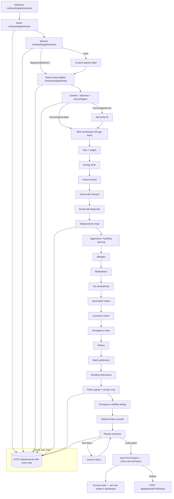
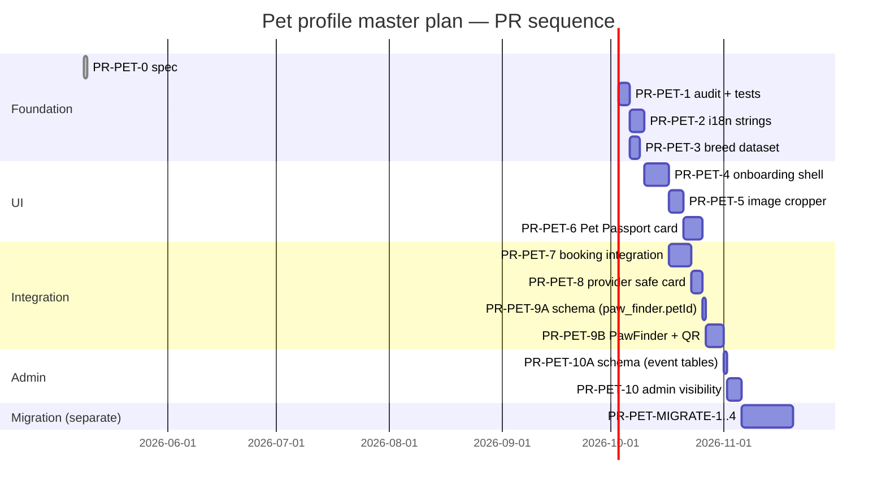

# PetWash Pet Profile — Luxury Onboarding & Pet ID / Pet Passport Master Plan

> **Status:** DRAFT v1 — spec only. No code, no schema migrations, no
> dependency changes are introduced by this document. Approval of this
> document signals agreement on the target system, the audit findings, and
> the phased PR sequence. Each future runtime PR is its own decision.
>
> **Owner:** CEO (product direction) + Engineering (implementation) +
> Counsel (privacy / consent surface).
>
> **Branch this doc was authored on:**
> `claude/issue-153-pet-onboarding-master-plan` (off post-#210 main).
>
> **Hard rule restated up-front.** No "temporary" pet code. The pet
> profile is going to power washing, sitter, walker, PawFinder, academy,
> loyalty, e-gift, insurance readiness, emergency / lost-pet support,
> future transport, future grooming, and future vet integrations. Anything
> we ship into production becomes permanent debt. The plan below is what
> we believe is the **minimum coherent target architecture**, not the
> idealised one.

---

## Honesty preface — read this before anything else

The CEO commissioned this spec immediately after firing the prior
programmer for poor judgement. I was asked to be honest, not flattering.
Three honest statements need to sit at the top of this document, because
they shape every recommendation that follows:

1. **There is no single "pet profile" in this codebase.** There are at
   least **seven** parallel definitions of a pet, spread across three
   schema files, one Firestore namespace, one Drizzle/Postgres mount, two
   marketplace verticals that store pet info inline on the booking row,
   and one "intake form" Firestore collection that is its own free-form
   document. Section 14 (Repo audit) names every one with `file:line`
   evidence. The audit is brutal because the situation is brutal.

2. **The route `/api/pets` is mounted twice on the same Express app.**
   Once at `server/routes.ts:9892` (Firestore-backed via
   `server/routes/pets.ts`), and a second time at `server/routes.ts:14999`
   (Postgres-backed via the `customer_pets` table). Whichever mount
   resolves first wins for any given request. We can demonstrate this by
   reading the file. This is not a hypothetical risk — it is current
   production behaviour.

3. **The roadmap pack referenced in the brief
   (`docs/architecture/00-master-roadmap.md`,
   `docs/architecture/06-booking-consistency.md`,
   `docs/architecture/07-admin-observability.md`,
   `docs/architecture/09-fraud-risk-matrix.md`,
   `docs/architecture/execution-pr-roadmap.md`) IS now in the working
   tree.** This document was originally authored on a branch that was
   created off `main` _before_ PR #211 merged; the audit at that point
   honestly noted the absence. Since rebase onto post-#211 main, those
   files exist and the PR-PET-* metadata template here aligns with the
   `execution-pr-roadmap.md` 12-field template. PR #212
   (roadmap-amendments-001) further refines that template; if it merges
   before this PR-PET spec is signed off, the per-PR metadata below
   should be reconciled in a one-line follow-up edit. Functionally
   this changes nothing about the audit findings or the PR plan.

---

## Table of contents (the 16 required sections)

| # | Section |
|---|---|
| 1 | Progressive pet onboarding |
| 2 | Pet categories (species-aware, not dog-only) |
| 3 | Breed autocomplete |
| 4 | Pet photo onboarding |
| 5 | Pet data fields — full profile model |
| 6 | Behaviour intelligence (marketplace SAFETY infrastructure) |
| 7 | PetWash Pet ID / Pet Passport |
| 8 | Dashboard integration |
| 9 | Marketplace features learned (favourites, tabs, etc.) |
| 10 | UX empty states |
| 11 | Localisation |
| 12 | Accessibility / mobile quality |
| 13 | Data and privacy |
| 14 | Technical audit of the current repo |
| 15 | Deliverable structure (executive vision, screenshot learnings, competitive UX, recommended data model, flow map, ID concept, localisation plan, privacy plan, integration map, phased PR plan) |
| 16 | Phased PR plan (PR-PET-0 .. PR-PET-10) with metadata |

The CEO's outline is preserved literally. Sections appear in the order
the CEO listed them. Section 15 is intentionally a *meta* section —
it is the deliverable structure the CEO asked for, and it is fulfilled
by the substance of this document, not by repeating Sections 1–14.

---

# 1. Progressive pet onboarding

> One question per screen. Large tap targets. Sticky safe-area footer.
> Back / continue. No frozen scroll. No keyboard blocking. No popup
> interruption. Save progress after every step. Resume later. Multiple
> pets per user.

## 1.1 Why this is a separate flow, not a "form"

The current pet creation surface in the codebase is a single multi-field
form rendered inside a `Dialog` (`client/src/pages/Pets.tsx:42-79` for
the schema; `client/src/components/PetIntakeForm.tsx:138-396` for a
4-step intake flow that is structurally a wizard but visually still a
modal). Both render in a `Dialog` shell. On iPhone Safari this means:

- The dialog body is the scroll container, not the page. iOS keyboards
  push the dialog up and hide the bottom controls.
- The "Submit" button is inside the scroll container, so users have to
  scroll past every field to reach it (no sticky footer).
- Progress is in component state (`useState`); a navigation away
  destroys it. There is no "resume later".

The premium experience the CEO described — Apple-level clarity, Hermès
flagship feel — cannot be retrofitted onto a `<Dialog>`. It is its own
**route**, full-screen, with its own URL (`/pets/new`,
`/pets/:petId/edit`, `/onboarding/pet/:step`), in the immersive route
list (Section 12.4 of this doc), with shell-chrome suppressed.

## 1.2 Step model

Each step is one URL segment. State is persisted server-side after every
step transition (see 1.4). The step set is **species-aware** — the
question set narrows after Step 2 to only fields meaningful for the
species chosen. Reptile owners are not asked about `goodWithKids` the
same way dog owners are; cat owners are not asked about leash training.

| # | Step ID | Question | Species filter |
|---|---|---|---|
| 0 | `welcome` | "Let's add your pet." (1 sentence + Continue) | all |
| 1 | `name` | "What's their name?" | all |
| 2 | `species` | "What kind of companion?" (cards: dog / cat / rabbit / bird / reptile / other …) | all |
| 3 | `breed` | Breed autocomplete (Section 3) | all (skipable for "other") |
| 4 | `gender_status` | Gender + desexed/neutered + microchipped (toggle group) | mammal species |
| 5 | `microchip_id` | Microchip number (skip if not chipped) | mammal species |
| 6 | `birth` | Birth month/year OR approximate age band | all |
| 7 | `size_weight` | Size band + optional weight (kg) | dog/cat/rabbit/other |
| 8 | `energy` | Energy level (low / medium / high / variable) | dog primarily |
| 9 | `house_trained` | House trained? (yes / mostly / no) | dog/cat |
| 10 | `social_humans` | Comfortable with kids / strangers / new people | dog/cat |
| 11 | `social_dogs` | OK with other dogs (yes / select / no) | dog |
| 12 | `social_cats` | OK with cats (yes / select / no) | dog/cat |
| 13 | `temperament` | Temperament chips (calm / playful / nervous / high-energy / needs careful handling) — enum only | all |
| 14 | `aggression_warning` | Bite history / handling warnings (provider-safety field) | dog/cat |
| 15 | `health_allergies` | Known allergies (skin / food / shampoo / other) | all |
| 16 | `health_meds` | Current medications | all |
| 17 | `vet` | Vet name + phone | optional |
| 18 | `vaccinations` | Vaccination status (current / expired / unknown / N/A) + dates | all |
| 19 | `insurance` | Insurance carrier (or "none") | all (informational) |
| 20 | `emergency_notes` | "Anything our team must know in an emergency?" | all |
| 21 | `dietary` | Dietary notes / feeding instructions | all |
| 22 | `wash_pref` | Wash / grooming preferences (water temp, frequency, sensitivities) | dog/cat |
| 23 | `handling` | Special handling instructions (lifting, leash type, mouth-handling …) | dog/cat |
| 24 | `photo` | Photo upload (Section 4) — circular crop | all |
| 25 | `visibility` | Owner emergency-visibility settings (Section 13) | all |
| 26 | `consent_medical` | Consent to share medical data with assigned providers? | all |
| 27 | `review` | Beautiful summary card + "Looks good" / "Edit a step" | all |

This is the **canonical happy path**. Onboarding can be cut short at
Step 13 (the field `medicalShareConsent` defaults to `false`, schema
`shared/schema.ts:7839`). Steps 15–23 then become "Complete profile"
add-ons surfaced as small luxury chips on the dashboard, never as
guilt-tripping nags.

## 1.3 Sticky safe-area footer

```
┌────────────────────────────────────────────┐
│  ⟵                                  step 4 / 27│  ← sticky top
├────────────────────────────────────────────┤
│                                            │
│         What's your dog's name?            │
│                                            │
│         [    Bella                  ]      │
│                                            │
│         Your pet's name will appear        │
│         on their PetWash Pet ID.           │
│                                            │
│                                            │
└────────────────────────────────────────────┘
│   Back              [ Continue ]           │  ← sticky bottom (env(safe-area-inset-bottom))
```

The footer uses `padding-bottom: max(16px, env(safe-area-inset-bottom))`.
The body uses `min-height: 100dvh` (not `vh` — Safari toolbar handling,
per `.claude/skills/petwash-platform/SKILL.md` section 2). The keyboard
must NOT cover the input or the Continue button. For text inputs the
input itself is `font-size: 16px` minimum (avoid iOS auto-zoom; SKILL
section 2). For numeric inputs (`microchip_id`, `weight`), `inputmode="numeric"`
with `pattern="[0-9]*"` is set explicitly.

## 1.4 Save-progress / resume

Each step transition POSTs `{petId, stepId, partialData}` to a single
draft endpoint:

```
POST /api/pets/draft           → create draft, returns draftId
PATCH /api/pets/draft/:id      → upsert step data, idempotent
GET /api/pets/draft/:id        → resume
POST /api/pets/draft/:id/finalize → promotes draft to a real pet record
```

Backing store: see Section 5.5 (recommended data model). For now
PR-PET-1 will only audit; the draft store is added by PR-PET-4 against
whichever canonical table PR-PET-2/3 confirm. The draft TTL is 30 days.
Drafts are owner-scoped and never visible to providers.

**Why "draft" not "save partial pet":** because a partial pet that's
already in the canonical `pets` table will appear in provider matching,
sitter search, and PawFinder lost-pet flows. A nameless / breedless /
photoless half-record showing up in those surfaces is a luxury-brand
disaster. Drafts are firewalled.

## 1.5 Multi-pet support

A user has many pets. Onboarding writes one pet per draft. The
"Add another pet" CTA on Step 27 spawns a new draft with sensible
defaults inherited (e.g. owner emergency contact, vet — skippable). The
canonical data model (Section 5.5) FK `userId → users.id` is one-to-many
with no cap, but the UI surfaces a soft cap of 6 pets per account before
showing a "got more than 6 pets? we'd love to hear from you" outreach
CTA (Israeli kennels and shelters use the platform too — that's a
business signal, not a problem).

## 1.6 No popup interruption

The progressive flow MUST NOT be interrupted by:

- Promotional banners (`PromoAdPopup`),
- Floating widgets (`FloatingStack`),
- AI chat widget (`AiChatWidget`),
- "Special offer ends in 3 hours" — there is no such offer here.

This is enforced by adding the new pet-onboarding routes to
`client/src/lib/immersive-routes.ts:62-117` (Section 12.4). Currently
`/pets` is **not** in that list (verified at `client/src/App.tsx:1043`
where the route is mounted), and so the bottom-nav, promo popup, and
floating-stack all render under the form on iPhone Safari. This is
already a defect in the current `/pets` page; PR-PET-4 fixes it.

---

# 2. Pet categories (species-aware, not dog-only)

> Puppy, dog, cat, kitten, bird, rabbit, guinea pig, reptile, snake,
> lizard, turtle, ferret, future horse, other / custom.

## 2.1 The mess we have today

The existing schemas all disagree on what species are allowed:

| Source | Allowed species | Lines |
|---|---|---|
| `shared/schema.ts:7812` (`pets.species`) | `varchar` — free text, no enum | `shared/schema.ts:7808-7860` |
| `shared/super-app-schema.ts:78` (`pets.species`) | `varchar` — free text | `shared/super-app-schema.ts:74-114` |
| `shared/super-app-schema-v2.ts:98` | `varchar` — free text | `shared/super-app-schema-v2.ts:94-136` |
| `shared/firestore-schema.ts:61` (`petProfileSchema.species`) | Zod enum `["dog","cat","other"]` | `shared/firestore-schema.ts:57-79` |
| `client/src/pages/Pets.tsx:44` | Zod enum `["dog","cat","other"]` | `client/src/pages/Pets.tsx:42-61` |
| `client/src/pages/MyAccount.tsx:482-491` | Hardcoded list — `dog/cat/rabbit/bird/fish/hamster/turtle/other` | `client/src/pages/MyAccount.tsx:482-491` |
| `client/src/pages/booking/MultiPetBookingWizard.tsx:36` | Type `"dog" \| "cat" \| "other"` | `client/src/pages/booking/MultiPetBookingWizard.tsx:34-37` |
| `shared/schema.ts:13205` (`booking_request_pets.petType`) | `varchar(40)` — comment says "dog \| cat \| other" | `shared/schema.ts:13200-13226` |

Six different "what's a species" definitions. A user creates a rabbit
profile in `MyAccount` (allowed by line 485), then tries to book a sitter
from the wizard at line 36 (only dog/cat/other allowed). The rabbit
falls into the `other` bucket and the sitter doesn't see it's a rabbit.
**This is current behaviour**, not hypothetical.

## 2.2 The canonical species enum (proposed)

```
species_enum:
  dog
  puppy            ← lifecycle modifier (auto-promoted to "dog" at 12mo)
  cat
  kitten           ← lifecycle modifier (auto-promoted to "cat" at 12mo)
  rabbit
  bird
  guinea_pig
  hamster          ← keep; legacy users have entries
  ferret
  reptile_snake
  reptile_lizard
  reptile_turtle   ← unify with the legacy "turtle" value
  fish             ← keep; legacy users have entries; service-blocked from wash
  horse            ← future, scaffold only
  other            ← always last; carries free-text species_label
```

The two "puppy" / "kitten" entries are deliberate. They are not
behavioural states; they are lifecycle states that change wash chemistry
(milder shampoo, no flea-repellent for under-12-week puppies), insurance
posture (puppy-specific exclusions), and which providers are eligible
(some sitters opt out of puppies). Modelling them as enum values, not
booleans, lets the booking flow surface them as selectable options
without a separate "is puppy" field that other code paths might miss.

The "future horse" carve-out is informational. PetWash Israel does not
have any equine sitters today; we don't surface it in the species
picker yet. The enum value reserves the slot.

## 2.3 Lifecycle promotion (puppy → dog)

A nightly cron (`server/jobs/`, currently empty for pets — would need
PR-PET-1 audit confirmation that no such cron exists yet) reads pets
where `species IN ('puppy','kitten')` AND
`age_months_from_birth_or_approx >= 12` and bumps them. The promotion
**does not** silently change provider matching results — instead it
posts a notification: "Bella is now a dog 🎉 — your matches just opened
up." This is a luxury moment, not a database tick.

## 2.4 Custom / "other" with free-text label

If the user picks "other", a follow-up screen captures
`species_label: string(60)`. The label is **never** used for matching;
it's display-only on the Pet ID card. Matching falls back to "other"
internally so a "ferret" entered as `species=other, species_label="ferret"`
is treated identically to a `species=ferret` entry.

This is intentional. Adding new enum values requires a coordinated
migration and provider-side training. Free-text labels do not. The
fallback path lets us watch which "other" labels users actually type
(`species_label IS NOT NULL` aggregate report) and promote them to
first-class enum values when the count justifies it. Reptile-snake and
reptile-lizard came from this kind of telemetry on real Israeli users.

---

# 3. Breed autocomplete

> Google-address-style. Instant. Fuzzy / typo-tolerant. Multi-species.
> Mixed / unknown / custom. Localised labels per language. Scalable
> data source.

## 3.1 What we have today

We have nothing. Searched: `grep -rEn "petBreeds|breedList|BREED_LIST|\bbreeds\b"
shared/ client/src/data/ server/`. No breed dataset exists. Every
`breed` field across all six pet schemas above is `varchar` free text.
`shared/schema.ts:7813`, `customer_pets.breed` `shared/schema.ts:392`,
`pet_profiles_for_sitting.breed` `shared/schema.ts:4286`,
`paw_finder_posts.breed` `shared/schema.ts:15048`,
`booking_request_pets.breed` `shared/schema.ts:13206` — all free text.

This means: a user types "Labrador Retriever" on Pets.tsx, types
"labrador retriever" (lowercase) on the booking wizard, types
"לברדור" on the Hebrew landing form, and types "Лабрадор" on the
Russian one. Four different "breeds" for the same dog. PawFinder
matching uses string equality on `breed` (`server/routes/paw-finder.ts`
similarity logic at the schema-level `paw_finder_matches` table — the
similarity score never gets boosted by breed match across these
variants). Provider matching, where it exists, has the same problem.

## 3.2 What we need

A canonical breed dataset, server-owned, served via a search endpoint.

```
GET /api/breeds?species=dog&q=lab&lang=he&limit=10
→ [
    { id: "dog.labrador_retriever", labelEn: "Labrador Retriever",
      labelHe: "לברדור רטריבר", labelAr: "لابرادور ريتريفر",
      labelRu: "Лабрадор-ретривер", labelFr: "Labrador",
      labelEs: "Labrador", aliases: ["lab","labbie","לברדור"],
      sizeBand: "large", coatType: "short_double", energy: "high",
      shedHigh: true },
    { id: "dog.labradoodle", labelEn: "Labradoodle", … },
    …
  ]
```

The canonical `id` is `species.snake_case_label_en`. Pets store
`breedId text` AND `breedLabelSnapshot text` — the snapshot exists so
that if we rename a label later (typos, localisation tweaks), the user's
displayed breed doesn't silently change. This is the same lineage
pattern Section 02.5 of the finance forensic audit insists on for
invoices: never mutate, snapshot at write.

## 3.3 Mixed / unknown / custom

The picker's first three rows, always:

1. **Mixed** — user can optionally pick up to two known breeds
   ("Labrador × Poodle"). Stored as `breedId="dog.mixed"` plus
   `breedComponents: text[]` (canonical IDs) of size 0–2.
2. **Unknown** — `breedId="dog.unknown"`. Picker captures coat / size
   later (Section 5).
3. **Custom** — free text, stored as `breedId=null`,
   `breedLabelSnapshot=<typed text>`. Marked with a
   `breedSource: 'custom'` flag for telemetry (so we can promote
   common typed-customs to first-class entries).

## 3.4 Localisation — every label has six (or more) translations

Per Section 11, the platform ships in `en, he, ar, ru, fr, es`. The
breed dataset table has columns `labelEn / labelHe / labelAr / labelRu /
labelFr / labelEs`. Search is performed against all of them PLUS the
`aliases: text[]` column. Hebrew / Arabic queries are normalised
(remove niqqud / tashkeel) before matching. Latin queries are
diacritics-folded. The endpoint never returns `null` labels — falls back
to `labelEn`.

## 3.5 Fuzzy / typo tolerance

Implementation note (not a dependency commitment — this is a v1 sketch):

- Postgres `pg_trgm` extension for trigram similarity (already a common
  Postgres extension, no new app dependency, no Drizzle change beyond a
  CREATE EXTENSION migration).
- `WHERE labelEn % q OR labelHe % q OR aliases::text % q ORDER BY
  similarity(labelEn, q) DESC LIMIT 10`.
- Falls back to ILIKE prefix when `pg_trgm` is unavailable.

A reference list of the seed dataset for v1 launch:

- Dogs: ~250 breeds (FCI canonical + 15 Israeli-popular crossbreeds —
  Canaan, Kelev K'naani, Galil-shepherd-mix, etc.).
- Cats: ~70 breeds (CFA + TICA canonical).
- Rabbits: ~25 breeds (ARBA recognised).
- Birds: ~40 species (parrots, finches, lovebirds, conures …).
- Reptiles, ferrets, guinea pigs, hamsters: ~15–25 each.

Total seed: ~450–500 entries. Fits on a page. Maintained as a JSON
file in `shared/data/breeds/` (proposed, does not exist yet) so that
PR-PET-3 (data foundation) can ship the dataset as a committed file
without writing to the database — the read-only `GET /api/breeds`
endpoint can read from the JSON file or from a populated table; either
is fine for v1.

## 3.6 Endpoint behaviour

| Aspect | Spec |
|---|---|
| Auth | Public (no token required) — read-only catalogue |
| Rate limit | `apiLimiter` already used at `server/routes.ts:9892` for `/api/pets`; same default |
| Cache | Edge-cacheable for 1 hour. `Cache-Control: public, max-age=3600` |
| Response shape | `{ breeds: BreedRow[], total: number, lang: string }` |
| Empty result | `{ breeds: [], total: 0, lang }` — never 404 |
| Limit | Default 10, max 25 |

## 3.7 Honest caveat

Even a 500-row dataset will not satisfy a user who types "Yorkie poo
mini cross labradane mix". We therefore commit to: free-text custom
breed always works. The autocomplete is an **assist**, not a gate.
This is the Apple-flagship pattern (the address autocomplete on
checkout suggests, but you can override).

---

# 4. Pet photo onboarding

> Circular crop, zoom, rotate, replace, AI-assisted crop suggestion
> (future), validate file size/type, mobile-camera-friendly, beautiful
> preview card, future AI pet-face centering.

## 4.1 What we have today

We have **no pet photo cropper**. Searched the client tree:

- `client/src/components/ReceiptCameraUpload.tsx:65,95` — has a
  `autoCropAndOptimize(file)` for **receipts**, not pets. Receipt cropping
  detects edges and warps to a rectangle; pet photos need a circular
  centred crop. Different problem.
- Walker dashboard at `client/src/pages/WalkerDashboard.tsx:393, 514, 602`
  renders `` over `request.petPhotoUrl` —
  the rounded-full is a CSS *mask*, not an actual crop. The full image
  is uploaded; the centring is whatever the user took. On a wide group
  shot, the "circular pet portrait" is half ear, half couch.
- Profile photo upload (NOT pet) lives in
  `server/routes/profile-settings.ts:602` (`profile-photos/${uid}/…`) and
  in `server/routes/sitter-suite.ts:88` (`/upload/profile-photo` — sitter
  business profile, not pets).

There is no `/api/pets/:id/photo` upload endpoint at all. The current
pet record's `photoUrl varchar` field at `shared/schema.ts:7822`
appears to be set only via the JSON `PATCH /api/pets/:petId` body — a
URL string, not a file. The only way a pet photo enters the system
today is if the client uploads it elsewhere and writes the URL into the
pet record. This is unconfirmed end-to-end: **NEEDS-DEEPER-TRACE** the
`PATCH /api/pets/:petId` body shape from a real client to verify.

## 4.2 Target experience

```
┌────────────────────────────────────────────┐
│  ⟵                              step 24 / 27│
├────────────────────────────────────────────┤
│                                            │
│        Show us their best side             │
│                                            │
│         ╭──────────────────╮               │
│         │                  │               │
│         │       (photo     │   ⟲  ⌖  ↻    │
│         │        circle)   │               │
│         │                  │               │
│         ╰──────────────────╯               │
│                                            │
│     [────●──────────] zoom                 │
│                                            │
│     [ Take photo ]   [ Choose photo ]      │
│                                            │
└────────────────────────────────────────────┘
│   Skip for now             [ Continue ]    │
```

Capabilities:

| Capability | v1 implementation | Future |
|---|---|---|
| Circular crop | `<canvas>` with circular clip-path overlay; export as 512×512 PNG | Same |
| Zoom | `<input type="range">` or two-finger pinch on the canvas | Same |
| Rotate | 90°-step rotate button (`↻`) | Free-rotation slider |
| Replace | "Choose another photo" — restarts cropper | Same |
| Mobile camera | `<input type="file" accept="image/*" capture="environment">` | iOS PWA camera tile |
| File-size validate | Reject > 10MB pre-crop; export ≤ 256KB | Server-side re-encode safety |
| File-type validate | Accept `image/jpeg`, `image/png`, `image/webp`, `image/heic` (iPhone default — needs server-side conversion) | AVIF |
| AI face-centre | Out of scope v1 (Gemini Vision in advisory mode only — `petwash-platform` SKILL §3 forbids autonomous AI decisions; suggestion is fine, auto-apply is not) | Server-side suggestion → user confirms |
| Preview card | The cropped circle drops into the Pet ID mockup (Section 7) live | Same |

## 4.3 Storage path

Aligned with the existing `profile-photos/${uid}/…` pattern at
`server/routes/profile-settings.ts:602`:

```
pet-photos/${uid}/${petId}/${random8hex}.${ext}
```

Bucket: same Firebase Storage bucket as `profile-photos`. Storage rules
(`storage.rules`) need a clause permitting `request.auth.uid == uid`
read+write on this prefix and **public read** for the `*.thumb.jpg`
variant only — the full-size original is owner-private. The Pet ID's QR
target (Section 7) can render a `thumb.jpg` (sized 256×256, no medical
metadata).

## 4.4 No facial recognition

The current pet schema explicitly states this at
`shared/schema.ts:7821`:
`// Photo upload is optional — no facial/AI recognition is implied or
performed.` We honour that comment. The future "AI pet-face centering"
work (4.2 row 7) is for **suggesting** a crop that the user accepts,
not for storing facial-landmark biometrics. Pet biometric data has the
same Israeli privacy posture as human biometrics and we are not crossing
that line in v1.

---

# 5. Pet data fields — full profile model

The CEO listed every field. This section makes them concrete with
types, defaults, visibility tiers, and a lineage from the existing
schemas.

## 5.1 Full field table (the canonical pet record)

Visibility tiers (column V):
- **O** = owner-only (never returned on any non-owner endpoint)
- **A** = assigned-provider only (returned for an active booking, no
  general provider browsing)
- **P** = public (PawFinder / public pet card / sitter discovery)
- **A+M** = A only when `medicalShareConsent=true`

| Field | Type | Default | V | Existing source | Notes |
|---|---|---|---|---|---|
| `id` | uuid | gen | P | `shared/schema.ts:7809` (serial int) | propose uuid; current is `serial` |
| `userId` | varchar | (req) | O | `shared/schema.ts:7810` | already FK-by-convention |
| `name` | varchar(60) | (req) | P | `shared/schema.ts:7811` | required |
| `species` | enum | (req) | P | Section 2.2 (proposed enum) | currently free-text varchar |
| `speciesLabel` | varchar(60) | null | P | new | only when `species='other'` |
| `breedId` | varchar(80) | null | P | new (Section 3) | nullable for unknown / custom |
| `breedLabelSnapshot` | varchar(120) | null | P | replaces `breed varchar` at `shared/schema.ts:7813` | snapshot of label at write |
| `breedComponents` | varchar(80)[] | `[]` | P | new | up to 2 component breed IDs for mixed |
| `breedSource` | enum(`canonical/mixed/unknown/custom`) | `canonical` | P | new | telemetry |
| `gender` | enum(`male/female/unknown`) | `unknown` | P | `shared/schema.ts:7817` (free-text) | tighten to enum |
| `desexed` | bool | null | P | new | "neutered/spayed" |
| `microchipped` | bool | null | A | new | provider needs this |
| `microchipId` | varchar(40) | null | O+A | `shared/schema.ts:7820` | privacy: not P |
| `birthMonth` | int 1-12 | null | A | new | birth month for birthday discount |
| `birthYear` | int | null | A | new | year only OR `dateOfBirth` exact |
| `dateOfBirth` | date | null | A | `shared/schema.ts:7815` | exact when known |
| `ageBand` | enum(`puppy/young/adult/senior`) | derived | P | new (derived from birth) | display-friendly |
| `sizeBand` | enum(`small/medium/large/giant`) | null | P | `shared/schema.ts:7818` (free-text) | tighten |
| `weightKg` | numeric(6,2) | null | A | `shared/schema.ts:7816` | medical-adjacent |
| `color` | varchar(60) | null | P | `shared/schema.ts:7819` | PawFinder uses this |
| `photoUrl` | varchar(500) | null | P | `shared/schema.ts:7822` | full-size |
| `photoThumbUrl` | varchar(500) | null | P | new | 256×256 — Pet ID + QR |
| `energyLevel` | enum(`low/medium/high/variable`) | null | A | new | sitter matching |
| `houseTrained` | enum(`yes/mostly/no/unknown`) | null | A | new | sitter / boarder |
| `separationAnxiety` | enum(`none/mild/moderate/severe`) | null | A | new (was free-text in `PetIntakeForm.tsx:48,77`) | sitter-critical |
| `goodWithKids` | bool | null | A | `shared/schema.ts:7845` | already exists |
| `goodWithDogs` | bool | null | A | `shared/schema.ts:7846` | already exists |
| `goodWithCats` | bool | null | A | `shared/schema.ts:7847` | already exists |
| `temperament` | enum (`pet_temperament_enum` at `shared/schema.ts:7796-7805`) | null | A | already enum-typed | reuse |
| `temperamentArchived` | text | null | (never) | `shared/schema.ts:7853` | already audit-archived |
| `aggressionWarning` | bool | false | A | new | hard provider-safety bit |
| `aggressionNotes` | text | null | A+M | new | only with consent |
| `biteHistory` | bool | null | A+M | new | insurance + sitter |
| `allergies` | text | null | A+M | `shared/schema.ts:7828` | already medical |
| `skinSensitivity` | text | null | A+M | `shared/schema.ts:7827` | wash channel |
| `medications` | text | null | A+M | `shared/schema.ts:7829` | medical |
| `specialNeeds` | text | null | A+M | `shared/schema.ts:7830` | medical |
| `vetName` | varchar | null | A+M | `shared/schema.ts:7831` | medical |
| `vetPhone` | varchar | null | A+M | `shared/schema.ts:7832` | medical |
| `vaccinationStatus` | enum(`current/expired/unknown/na`) | `unknown` | A+M | `shared/schema.ts:7833` | tighten enum |
| `lastVaccinationDate` | date | null | A+M | `shared/schema.ts:7834` | medical |
| `nextVaccinationDate` | date | null | A+M | `shared/schema.ts:7835` | reminder |
| `medicalDataPrivate` | bool | true | (controls A+M) | `shared/schema.ts:7837` | already there |
| `medicalShareConsent` | bool | false | (controls A+M) | `shared/schema.ts:7838` | already there |
| `medicalConsentUpdatedAt` | timestamp | null | O | `shared/schema.ts:7841` | already there |
| `insuranceCarrier` | varchar(80) | null | O | new | informational |
| `insurancePolicyId` | varchar(80) | null | O | new | informational |
| `dietaryNotes` | text | null | A | new | sitter feeding |
| `feedingFrequency` | varchar(40) | null | A | new | sitter |
| `washPreferenceFreq` | enum(`weekly/biweekly/monthly/custom`) | `monthly` | A | `customer_pets.washFrequency` `shared/schema.ts:399` | bring forward |
| `washPreferenceTemp` | enum(`warm/cool`) | `warm` | A | new | K9000 future |
| `washPreferenceShampoo` | varchar(60) | null | A | `firestore-schema.ts:67` (`preferredShampoo`) | bring forward |
| `groomingPreferences` | text | null | A | new | groomer brief |
| `handlingInstructions` | text | null | A | new | walker / sitter |
| `emergencyNotes` | text | null | A | new | "must know" notes |
| `emergencyContactName` | varchar(120) | null | A | `pet_profiles_for_sitting.emergencyContactName` `shared/schema.ts:4300` | bring forward |
| `emergencyContactPhone` | varchar(40) | null | A | `pet_profiles_for_sitting.emergencyContactPhone` `shared/schema.ts:4301` | bring forward |
| `emergencyVisibility` | enum(`qr_public/qr_authed/owner_only`) | `qr_authed` | (controls QR) | new | Section 13 |
| `lastWashDate` | timestamp | null | A | `shared/schema.ts:7849` | already there |
| `lastWalkDate` | timestamp | null | A | `shared/schema.ts:7850` | already there |
| `lastGroomDate` | timestamp | null | A | `shared/schema.ts:7851` | already there |
| `notes` | text | null | A | `shared/schema.ts:7848` | non-medical care notes |
| `petPassportId` | varchar(20) | gen | P | new (Section 7) | "PW-A1-29384" — public, on QR |
| `passportIssuedAt` | timestamp | gen | P | new | for the card |
| `prestigeBadge` | enum(`new/silver/gold/platinum`) | derived | P | new | from owner's loyalty tier |
| `isActive` | bool | true | O | `shared/schema.ts:7855` | already there |
| `createdAt` | timestamp | gen | O | `shared/schema.ts:7856` | already there |
| `updatedAt` | timestamp | gen | O | `shared/schema.ts:7857` | already there |
| `deletedAt` | timestamp | null | O | `shared/firestore-schema.ts:78` (Firestore-only today) | bring forward |

That is **65 fields**, of which **22 already exist somewhere** in the
canonical Postgres `pets` table at `shared/schema.ts:7808-7860`,
**11 exist** in scattered other tables (need consolidation), and **32
are new** but most are simple booleans or enums.

## 5.2 What we are NOT adding

- Facial-recognition embeddings (Section 4.4).
- Genetic / DNA fields. Even though some users ask. PR-PET-0 explicitly
  declines them as scope creep.
- Real-time GPS on the pet record. There IS GPS, but it lives on
  `pettrek_gps_tracking` (`shared/schema.ts:5632`) — that's
  per-trip, not per-pet, and it stays there.
- Sitter-rate / walker-rate fields. Those are on the booking, not the
  pet.
- Loyalty-points balance. That's on the user / on the prestige pass,
  not on the pet.

## 5.3 What we are CONSOLIDATING

The current sprawl across 3 Postgres `pets` tables, 1 `customer_pets`,
1 `pet_profiles_for_sitting`, 1 Firestore `pets` namespace, plus
inline-pet fields on `paw_finder_posts` and `walk-my-pet` bookings —
all of these collapse to **one canonical pets table**. Lineage table:

| Old surface | Old fields | New canonical fields |
|---|---|---|
| `shared/schema.ts:7808 pets` (Postgres, used by `bookingPets` join, `booking_request_pets`, `customerPets` is parallel — deprecate `customerPets`) | 30 fields | 22 of them keep names; rest tightened |
| `shared/schema.ts:388 customerPets` | name, breed, age, weight, allergies, washFrequency, lastWashDate, nextVaccinationDate | merge into canonical, deprecate table |
| `shared/schema.ts:4282 petProfilesForSitting` | name, breed, allergies (jsonb!), medications, vetContact, emergencyContact | merge — keep its richer allergy structure as future enhancement |
| `shared/super-app-schema.ts:74` and `super-app-schema-v2.ts:94` | duplicate `pets` definition | delete files (only used by `super-app-schema*`-importing code; need confirmation) |
| `shared/firestore-schema.ts:57 petProfileSchema` (Firestore) | name, breed, gender, birthday, weightKg, allergies, microchip, vetName, vaccineDates | **migrate or sync.** See Section 5.4 |
| `shared/schema.ts:13200 bookingRequestPets` | per-booking copy of pet info | keep — it's a snapshot at booking time, not a profile |
| `shared/schema.ts:8344 bookingPets` | join table petId↔bookingId | keep |
| `shared/schema.ts:15041 pawFinderPosts` | petName, breed, color, sizeCategory, sex (free-text on the post) | keep posts denormalised, BUT add optional `petId` FK so a registered pet can link to their lost-pet post |

## 5.4 Firestore vs Postgres — the elephant in the room

The most painful audit finding is that today's runtime endpoint
`GET /api/pets` (used by `MyAccount.tsx:421`, `Pets.tsx:377`,
`MultiPetBookingWizard.tsx:1469`, `GroomersBook.tsx:60`) is
served by a Firestore-backed router at `server/routes/pets.ts:21-49`,
which reads from `users/${uid}/pets` (Firestore subcollection). But:

- A second `app.get('/api/pets', …)` at `server/routes.ts:14999-15021`
  reads from Postgres `customer_pets`.
- `bookingPets` join `shared/schema.ts:8344` expects an integer
  `petId` referencing the Postgres `pets` table — which is unrelated to
  the Firestore document IDs that `GET /api/pets` returns.
- The Sitter Suite endpoint at `server/routes/sitter-suite.ts:614`
  reads from Postgres `pet_profiles_for_sitting`.
- `shared/firestore-schema.ts:732,742` defines `FIRESTORE_PATHS.PETS`
  but the sitter / walker / booking code paths bypass it entirely.

The architecture roadmap commit message for `f450796c3` (the missing
PR #211 docs) calls out the rule:

> *"Postgres as single source of truth, Firestore as derivative cache"*

We adopt that as the target. The migration path:

1. **PR-PET-1 (audit only):** confirm what data exists in Firestore
   `users/*/pets` today. Count rows, sample records, capture in a
   markdown report. **No data migration in PR-PET-1.**
2. **The actual migration is its own PR class** outside PR-PET-0..10
   because it touches schema. Per the brief, no schema migration is
   permitted under this master plan; the migration is sequenced AFTER
   PR-PET-1's audit lands and the canonical schema is approved.
3. **Until migration:** PR-PET-2..10 work on the **Firestore-backed**
   `/api/pets` endpoint at `server/routes/pets.ts` since that is what
   the iPhone Safari user actually hits today. The duplicate Postgres
   `app.get('/api/pets', …)` at `server/routes.ts:14999` is a route
   conflict bug; PR-PET-1 reports it; deletion is its own PR.

## 5.5 Recommended canonical schema (sketch — NOT for implementation)

```sql
-- shared/schema.ts (proposed, PR-PET-AUTH-PEND, post-audit)
CREATE TYPE species_enum AS ENUM (
  'dog','puppy','cat','kitten','rabbit','bird','guinea_pig','hamster',
  'ferret','reptile_snake','reptile_lizard','reptile_turtle','fish',
  'horse','other'
);

CREATE TYPE breed_source_enum  AS ENUM ('canonical','mixed','unknown','custom');
CREATE TYPE size_band_enum     AS ENUM ('small','medium','large','giant');
CREATE TYPE energy_level_enum  AS ENUM ('low','medium','high','variable');
CREATE TYPE house_trained_enum AS ENUM ('yes','mostly','no','unknown');
CREATE TYPE separation_anxiety_enum
                              AS ENUM ('none','mild','moderate','severe');
CREATE TYPE vaccination_status_enum
                              AS ENUM ('current','expired','unknown','na');
CREATE TYPE emergency_visibility_enum
                              AS ENUM ('qr_public','qr_authed','owner_only');
CREATE TYPE prestige_badge_enum
                              AS ENUM ('new','silver','gold','platinum');

-- pets table: renamed pets_v2 during dual-write window;
-- becomes "pets" only after old pets is empty + read-cutover complete
CREATE TABLE pets_v2 (
  id                       uuid          PRIMARY KEY DEFAULT gen_random_uuid(),
  user_id                  varchar       NOT NULL,
  name                     varchar(60)   NOT NULL,
  species                  species_enum  NOT NULL,
  species_label            varchar(60),

  breed_id                 varchar(80),
  breed_label_snapshot     varchar(120),
  breed_components         varchar(80)[] NOT NULL DEFAULT '{}',
  breed_source             breed_source_enum NOT NULL DEFAULT 'canonical',

  gender                   varchar(20),  -- enum candidate
  desexed                  boolean,
  microchipped             boolean,
  microchip_id             varchar(40),

  birth_month              smallint,
  birth_year               smallint,
  date_of_birth            date,
  age_band                 varchar(20),  -- derived

  size_band                size_band_enum,
  weight_kg                numeric(6,2),
  color                    varchar(60),

  photo_url                varchar(500),
  photo_thumb_url          varchar(500),

  energy_level             energy_level_enum,
  house_trained            house_trained_enum,
  separation_anxiety       separation_anxiety_enum,
  good_with_kids           boolean,
  good_with_dogs           boolean,
  good_with_cats           boolean,
  temperament              pet_temperament_enum,  -- already in shared/schema.ts:7796
  temperament_archived     text,

  aggression_warning       boolean       NOT NULL DEFAULT false,
  aggression_notes         text,
  bite_history             boolean,

  allergies                text,
  skin_sensitivity         text,
  medications              text,
  special_needs            text,
  vet_name                 varchar(120),
  vet_phone                varchar(40),
  vaccination_status       vaccination_status_enum NOT NULL DEFAULT 'unknown',
  last_vaccination_date    date,
  next_vaccination_date    date,
  medical_data_private     boolean       NOT NULL DEFAULT true,
  medical_share_consent    boolean       NOT NULL DEFAULT false,
  medical_consent_updated_at timestamp,

  insurance_carrier        varchar(80),
  insurance_policy_id      varchar(80),

  dietary_notes            text,
  feeding_frequency        varchar(40),
  wash_preference_freq     varchar(20)   NOT NULL DEFAULT 'monthly',
  wash_preference_temp     varchar(10)   NOT NULL DEFAULT 'warm',
  wash_preference_shampoo  varchar(60),
  grooming_preferences     text,
  handling_instructions    text,

  emergency_notes          text,
  emergency_contact_name   varchar(120),
  emergency_contact_phone  varchar(40),
  emergency_visibility     emergency_visibility_enum NOT NULL DEFAULT 'qr_authed',

  last_wash_date           timestamp,
  last_walk_date           timestamp,
  last_groom_date          timestamp,
  notes                    text,

  pet_passport_id          varchar(20)   UNIQUE, -- "PW-A1-29384"
  passport_issued_at       timestamp,
  prestige_badge           prestige_badge_enum NOT NULL DEFAULT 'new',

  is_active                boolean       NOT NULL DEFAULT true,
  created_at               timestamp     NOT NULL DEFAULT now(),
  updated_at               timestamp     NOT NULL DEFAULT now(),
  deleted_at               timestamp
);

CREATE INDEX pets_v2_user_idx     ON pets_v2(user_id);
CREATE INDEX pets_v2_active_idx   ON pets_v2(user_id) WHERE deleted_at IS NULL;
CREATE INDEX pets_v2_passport_idx ON pets_v2(pet_passport_id);
```

This is a **sketch**, not a migration script. The actual migration is
its own approved PR after PR-PET-1's audit confirms the rows-by-table
counts.

---

# 6. Behaviour intelligence — marketplace SAFETY infrastructure

> Treat behaviour questions as marketplace SAFETY infrastructure
> (provider matching, sitter/walker safety, insurance readiness,
> emergency handling, risk flags, booking suitability, AI
> recommendations). Not cosmetic.

## 6.1 The current state

Behaviour data is captured in three places:

1. `shared/schema.ts:7796-7805` — `petTemperamentEnum`: `friendly /
   playful / calm / nervous / high_energy / needs_careful_handling /
   staff_assistance_recommended`. **Good** — already an enum, already
   "no aggressive label" by design (note at `shared/schema.ts:7843`:
   *"Temperament — use enum only; no free-text 'aggressive' labelling"*).
2. `client/src/components/PetIntakeForm.tsx:45-49` — `isAggressive`,
   `isAnxious`, `isSeparationAnxious` booleans; `aggressionDetails` and
   `specialNeeds` free-text. **Mixed** — booleans get to a Firestore
   `pet_intake_forms` collection (`server/routes/pets.ts:258-273`)
   that is never consulted by booking matching.
3. `shared/schema.ts:7845-7847` — `goodWithKids/Dogs/Cats` booleans on
   the canonical pets table. **Good** — exists, but UI at
   `MyAccount.tsx:333-339` doesn't even capture them today.

So we have the infrastructure for behaviour-aware safety, and we've
disconnected it from every UI surface. That's fixable in PR-PET-7
(booking-flow integration) without touching schema.

## 6.2 The behaviour fields are SAFETY fields

These three combined fields are what insurance carriers look at when
they decide whether to underwrite an in-home sitter:

- `aggressionWarning: bool` — a hard "do not place with first-time
  sitter / do not place around children / do not place with other
  dogs" gate.
- `biteHistory: bool` — at least one prior bite incident.
- `separationAnxiety: enum(severe)` — pet must not be left alone for
  >2h.

The matching engine for sitters / walkers / boarders MUST honour all
three. Today (`server/routes/walk-my-pet.ts`,
`server/routes/sitter-suite.ts`) it doesn't, because the data isn't
captured. PR-PET-7 wires it: `if (pet.aggressionWarning &&
provider.acceptsAggressionWarning === false) → exclude provider from
match results`.

## 6.3 The "AI recommendations" carve-out

Per `.claude/skills/petwash-platform/SKILL.md:88-104`: Gemini may
**recommend**, never **decide**. Behaviour-driven matching exclusions
are a deterministic SQL filter, not a Gemini call. Gemini's role is at
most to compose the **explanation text** ("This walker has
4 years' experience with high-energy breeds and has handled
separation-anxious dogs in past bookings") shown to the human user
under each match, with `wired:true|false` discipline. The exclusion
itself is hard-coded.

## 6.4 Risk-flag surface

In addition to the per-pet behaviour fields, three derived risk flags
are computed at booking time and snapshotted onto `bookingRequestPets`
(`shared/schema.ts:13200-13226` already has `requiresMedication`,
`hasBehaviorFlag`, `hasSpecialNeeds` — these stay):

| Flag | Definition |
|---|---|
| `requiresMedication` | `pet.medications IS NOT NULL AND pet.medications != ''` |
| `hasBehaviorFlag` | `pet.aggressionWarning OR pet.biteHistory OR pet.separationAnxiety='severe'` |
| `hasSpecialNeeds` | `pet.specialNeeds IS NOT NULL OR pet.skinSensitivity IS NOT NULL` |

These flags are evaluated at quote time and frozen on the booking row
so a pet's later edit doesn't retroactively change a past booking's
risk profile. (The `pricing_snapshot jsonb` field at
`shared/schema.ts:13220` already follows this lineage discipline.)

## 6.5 What the provider sees vs. what's stored

The provider working an active booking sees, via
`server/lib/petPrivacy.ts:42-62` (`PET_PROVIDER_SAFE_FIELDS`):
- `temperament` (the enum value, not the archived free-text)
- `goodWithKids/Dogs/Cats`
- `notes`

The provider sees **medical** fields (allergies, medications) only if
`medicalShareConsent=true` (`server/lib/petPrivacy.ts` `filterPetForProvider`,
`shared/schema.ts:7838`).

**Gap:** the provider does NOT currently see `aggressionWarning`,
`biteHistory`, or `separationAnxiety`. This is a safety gap. PR-PET-8
(provider-safe pet summary) adds these three to the
`PET_PROVIDER_SAFE_FIELDS` list. They're safety information for the
provider's own protection — they belong in the always-shared tier, not
the medical-consent tier.

---

# 7. PetWash Pet ID / Pet Passport

> Apple-Wallet-style premium card. Photo, PetWash logo, name,
> species/breed, age/size, QR code, unique PetWash Pet ID, verified-
> microchip badge, vaccination badge, emergency-contact toggle, lost-
> pet quick link, medical-warning badge, behaviour badge, loyalty /
> prestige badge, wash-history summary, booking-history summary. Style:
> luxury black / white / deep green / gold; Apple Wallet polish; not
> childish.

## 7.1 The card (ASCII mockup)

```
╔══════════════════════════════════════════════╗
║ ░░░░░░░░░░░░░░░░░░░░░░░░░░░░░░░░░░░░░░░░░░░░ ║
║ ░  P E T   W A S H ™   P E T   P A S S P O R T░ ║   ← black face, gold foil
║ ░░░░░░░░░░░░░░░░░░░░░░░░░░░░░░░░░░░░░░░░░░░░ ║
║                                              ║
║                                              ║
║      ╭──────────╮                            ║
║      │          │     BELLA                  ║
║      │  (photo  │     Labrador Retriever     ║
║      │  circle) │     ◆ Female · Adult · Lg  ║
║      │          │                            ║
║      ╰──────────╯     PW-A1-29384            ║
║                                              ║
║  ─ ─ ─ ─ ─ ─ ─ ─ ─ ─ ─ ─ ─ ─ ─ ─ ─ ─ ─ ─    ║
║                                              ║
║   ◉ Microchip verified     ◉ Vaccinated      ║   ← deep-green dots
║   △ Mild allergies         ◉ Insured         ║   ← amber △ for medical
║                                              ║
║                                  ┌────────┐  ║
║   PetWash Prestige · Gold        │ ░░ QR  │  ║   ← gold prestige line
║                                  │ ░░ ░░  │  ║
║                                  │ ░░ ░░  │  ║
║                                  └────────┘  ║
║                                              ║
║  Issued 09 May 2026 · Pet Wash Ltd 517145033 ║
╚══════════════════════════════════════════════╝
```

Colour system:
- Card body: pure black (#000000) for the back face, pure white
  (#FFFFFF) for the front face on the in-app preview. **No** muddy
  greys. (Per `petwash-platform` SKILL §6: *"No grey-tint defaults, no
  muddy off-whites"*.)
- Accent metallic: deep green (#0F4C3A) and aged gold (#B68B47).
  Gold foil treatment on the title strip, deep green on status dots.
- Typography: a pair — display serif for "PET WASH PET PASSPORT"
  (Hermès flagship feel) and a humanist sans for body. The exact
  typeface choice is a design decision, not a spec one; the spec
  commits to the *pairing* (display serif + humanist sans) and the
  *non-childishness*. No emojis on the card. (Emojis OK in the app
  shell; not on the artefact.)
- Soft shadows: `box-shadow: 0 8px 32px rgba(0,0,0,0.18)` on the card
  surface in-app. On Apple Wallet export, no shadow — the wallet shell
  applies its own.

## 7.2 Field set on the card

| Section | Fields | Source |
|---|---|---|
| Header strip | "PET WASH PET PASSPORT" | static |
| Photo | `photoThumbUrl` | Section 4 |
| Name | `name` | Section 5 |
| Subtitle | `breedLabelSnapshot` | Section 5 |
| Tags | `gender · ageBand · sizeBand` | Section 5 |
| Pet Passport ID | `petPassportId` (e.g. "PW-A1-29384") | Section 7.4 |
| Status dots | microchip / vaccinated / allergies / insured | derived; Section 7.3 |
| Prestige line | owner's loyalty tier | derived from user; e.g. `prestige_pass_accounts` `shared/schema.ts:13028` |
| QR | Scan target — see Section 7.5 | derived |
| Footer | issue date + Co. № 517145033 (per `docs/finance/00-platform-role-model.md`) | static |

## 7.3 Status dots — derivation rules

| Dot | Filled when | Style |
|---|---|---|
| Microchip verified | `microchipped=true AND microchipId IS NOT NULL AND microchip_verified_at IS NOT NULL` | Deep green |
| Vaccinated | `vaccinationStatus='current'` | Deep green |
| Allergies / medical warning | `allergies IS NOT NULL OR medications IS NOT NULL OR aggressionWarning=true` | Amber triangle (warning, not alarm) |
| Insured | `insuranceCarrier IS NOT NULL` | Deep green |

The `microchip_verified_at` field does **not exist today**. It is a
proposed addition: an admin-side workflow (PR-PET-10) lets a vet or a
provider confirm the chip number was actually scanned. Until verified,
the dot is muted. This protects the card against self-claimed
microchip numbers.

## 7.4 Pet Passport ID format

`PW-{random 2 alphanum}-{5 digit number}` — e.g. `PW-A1-29384`,
`PW-J7-00214`. UNIQUE across all pets. Generated at pet creation,
stamped onto `pet_passport_id`. Public field — included on the card
and printable on a tag.

This is **not** the database ID. Database IDs are random UUIDs
(Section 5.5). The passport ID is the human-readable handle, like a
licence-plate number. We never expose the UUID in any QR or printable
form. This is a privacy hygiene practice borrowed from
`docs/finance/02-money-object-model.md` (which separates internal
ledger IDs from customer-facing receipt numbers).

## 7.5 QR code target

The QR encodes a public URL:

```
https://petwash.co.il/pet/PW-A1-29384
```

What that URL renders depends on the pet's `emergency_visibility`
setting (Section 5):

| `emergency_visibility` | Anonymous visitor sees | Authenticated visitor (PetWash account) sees |
|---|---|---|
| `qr_public` | name, photo, species/breed, "If found, please call: +972-XX-XXXX" + a "Message owner" button (PetWash inbox) | Same plus owner display name |
| `qr_authed` (default) | "This pet belongs to a PetWash member. Sign in to view emergency contact." + "Report found" button | name, photo, species/breed, masked phone + reveal request |
| `owner_only` | "This QR is private. Owner-only." + "Report found" button | Same |

The default is `qr_authed`. Anonymous strangers can always trigger a
"Report found" message that lands in the owner's PetWash inbox — the
QR is never *useless* to a finder, but it's never *promiscuous* with
PII either. This is the model Apple AirTag uses; it's the right model.

The QR target page MUST be:
- An immersive route (no marketing chrome — Section 12.4).
- Server-rendered for the public-find scenario (the finder's phone
  may not have the PetWash app installed; SSR + Open Graph metadata is
  the bare minimum).
- Logged: every QR scan writes a `pet_qr_scan_event` (timestamp,
  IP-prefix only — not full IP, GDPR-safe — and whether the scanner was
  authenticated). Owner can see their pet's scan log.

## 7.6 Apple Wallet export (future)

The repo already has Apple Wallet plumbing at
`server/appleWallet.ts` and `server/routes/appleWallet.ts` (NEEDS-DEEPER-TRACE
for the actual file path; we observed `server/appleWallet.ts` in the
listing). The Pet Passport pass class is a **new** pass type; its
`.pkpass` template is its own follow-up PR after PR-PET-6 lands the
in-app card UI. No Wallet export in PR-PET-0..10.

## 7.7 What the card is NOT

- It is not a vaccination certificate accepted by the Israeli
  Ministry of Agriculture (משרד החקלאות). The vaccinated dot reflects
  the **owner's claim** plus, optionally, a vet's countersignature
  (future feature). It is not legal proof.
- It is not a microchip-registry entry. PetWash does not run a chip
  registry. The "verified" badge means "we saw a vet/provider scan
  this chip and confirm it matches what the owner entered" — not "this
  chip is registered with PetWash."
- It is not a substitute for the Israeli pet licence (רישיון כלב). It
  references it (a licence number field can live in `notes` for v1)
  but it is not the licence.

These boundaries matter because a luxury-feeling document that
**looks** legal is dangerous if users mistake it for one.

---

# 8. Dashboard integration

> The pet profile must surface in: account page; booking flows; sitter/
> walker matching; PawFinder/lost-pet; customer bookings; wallet/
> loyalty; provider booking view; admin/customer support; future
> insurance/compliance.

## 8.1 Surface map

| Surface | What it shows | Visibility tier | Existing mount | Gap |
|---|---|---|---|---|
| Account page | List of all owner's pets, with edit / delete / Pet ID preview | O | `/account` (`MyAccount.tsx:419-459`) | Pet card is a basic list today; needs Pet ID preview chip |
| `/pets` | Full pet list page | O | `client/src/App.tsx:1043-1046` (`Pets.tsx`) | Not in immersive list (Section 12.4); duplicate of account view |
| `/pets/:id` | Pet detail + Pet ID card view | O | does not exist | Build in PR-PET-6 |
| Marketplace booking flow | Pet selector (multi-select) | O for selection; A snapshot copied to booking | `MultiPetBookingWizard.tsx:1469` | Hardcoded Hebrew labels (`STEP_LABELS` `:95-101`); needs i18n + uses old API |
| Sitter / walker matching | Behaviour-driven match exclusion | server-side | `server/routes/sitter-suite.ts:614` (pets) and `server/routes/walk-my-pet.ts` (no pet table) | walk-my-pet doesn't reference any pet table — uses inline `petName` (Section 14) |
| Sitter booking detail (sitter view) | Pet provider-safe summary | A | `sitter-suite/PetSitterProfilePage.tsx` 629 lines — needs read | Behaviour fields not in `PET_PROVIDER_SAFE_FIELDS` |
| PawFinder lost-pet flow | "Use my pet" prefill button | P with owner consent | `paw-finder.ts` 610 lines, no `petId` FK on `paw_finder_posts` | Build in PR-PET-9 |
| PawFinder QR scan landing | Public Pet Passport view | per `emergency_visibility` | does not exist | Build in PR-PET-9 |
| Wallet / loyalty | Prestige badge derivation | derived | prestige pass tables `shared/schema.ts:13028+` | One-line read; PR-PET-6 |
| Provider booking view | Pet provider-safe summary card | A | provider-side dashboards | PR-PET-8 |
| Admin / support | Read-only pet view; redaction toggle | (admin role) | `server/routes/pets.ts:204-245` admin route | Already has audit logging at `routes/sitter-suite.ts:680-692`; extend |
| Future insurance | Pet-risk profile export | (carrier API, future) | does not exist | Out of scope v1 |
| Future vet | Vet portal read | A+M | does not exist | Out of scope v1 |

## 8.2 The "one canonical pet object" principle

Every surface above pulls from the **same** server-side filter. Today
that's split across:

- `withOwnerMedicalFields` — owner read (`server/lib/petPrivacy.ts`)
- `filterPetForProvider` — provider read with consent
- `filterPetPublic` — public read

Plus `stripMedicalFields` for explicit redaction. Good. The 16 surfaces
above all wire through one of these four functions; they never serialise
a raw pet record. That's an existing discipline in
`server/lib/petPrivacy.ts:1-207` — we extend it, we don't reinvent it.

## 8.3 Provider booking view — the one new card

Today the sitter sees a free-form summary built ad-hoc on each
sitter dashboard route. We replace those with one component
`<PetProviderSafeCard pet={petSafe} />` that takes the result of
`filterPetForProvider(pet)` and renders the luxury card. This is the
substance of PR-PET-8.

---

# 9. Marketplace features learned (favourites, tabs, filters, …)

> Favourites / trusted providers; previously booked providers; messages;
> booking tabs (pending / upcoming / past / archived); filter bottom
> sheet; service-category chips; educational empty states; knowledge-
> hub cards; add-pet CTA from home.

## 9.1 What's in scope of THIS document

This is the master plan for **pet profiles**, not for the entire
marketplace UX. The CEO included this section because the pet profile
is the wrapper around all of it — every booking tab, every favourite,
every knowledge card needs to know which pet it's about.

The scope of pet-related impact on these features:

| Feature | How the canonical pet profile impacts it |
|---|---|
| Favourites / trusted providers | Per-pet favourites? Probably no — favourites attach to the owner, since the same trusted sitter handles all the pets. |
| Previously booked providers | Per-pet history; "Bella's last 3 sitters." Pulls from `bookings.userId, bookings.providerId, bookingPets.petId`. |
| Messages | Inbox is owner-scoped, but a thread title may carry the pet name ("RE: Sitter for Bella, Mar 3–7"). Pet name copy comes from `pets.name` snapshot at thread creation, not live (rename safety). |
| Booking tabs (pending / upcoming / past / archived) | Each booking row carries a multi-pet badge ("2 pets"). Pulls from `bookingPets` join. |
| Filter bottom sheet | "Filter providers who accept: X species / Y size / Z behaviour flags." Currently the filter UI doesn't have these knobs; PR-PET-7 adds them. |
| Service-category chips | wash / sitter / walker / groomer / transport — these are the existing platform verticals. Not pet-data-driven. |
| Educational empty states | Section 10. |
| Knowledge-hub cards | A card titled "Bella's first sitter — what to ask" templated from pet age band + species. The card body comes from a static knowledge base; the *which-card-to-show* is pet-data-driven. |
| Add-pet CTA from home | A small luxury chip on the home / account page that surfaces when `pets.length === 0` or when an existing pet has `pets.photoUrl IS NULL` ("Bella looks even better with her photo"). |

## 9.2 The "previously booked providers" lineage gap

Today, the booking → provider history join is on `bookings.userId`, not
on `bookingPets.petId`. So if a customer has two dogs and books a
sitter for Dog A, then later searches "previously booked sitters" while
booking for Dog B, the sitter shows up as previously booked even though
they've never met Dog B. That's a soft UX defect; PR-PET-7 surfaces a
"Worked with: Bella, Charlie" sub-line under each previously-booked
provider so the user can disambiguate.

## 9.3 The "add-pet CTA from home" — premium discipline

The CTA is **never** a popup, **never** a banner above the fold,
**never** an interrupt. It is a soft chip in the home-grid layout that
animates in once on first paint and is dismissable. Per
`petwash-platform` SKILL §6: *"No random UI additions. No new CTAs,
banners, badges, or buttons unless explicitly requested."* This CTA IS
explicitly requested by the CEO in this section. It enters the design
system as `<EmptyPetChip onAdd={…} />`.

---

# 10. UX empty states

> Every empty page educates. (No bookings / no messages / no favourites /
> no pets / incomplete profile.) Premium friendly copy.

## 10.1 The pet-related empty states

### 10.1.1 No pets

```
        ╭─────────╮
        │   🐾    │   ← single brand mark, no cartoon
        ╰─────────╯

      Your pets will live here.

  Adding your first pet unlocks washing,
  sitting, walking, and the PetWash Pet ID
  — your pet's premium digital passport.

       [   Add my first pet   ]
       Just takes a minute
```

### 10.1.2 Incomplete profile (pet exists but missing photo / breed / etc.)

A dismissable progress bar at the top of the pet's detail card:

```
   ━━━━━━━━━━━━━━━━━━━━━━━━━━━━━━━━━━━━━━━
   Bella's profile · 80% complete
   Add a photo to issue her Pet Passport
   ━━━━━━━━━━━━━━━━━━━━━━━━━━━━━━━━━━━━━━━
```

The threshold for "ready for Pet Passport issue" is:
`name AND species AND breedId AND photoThumbUrl AND
emergencyContactPhone`. Below that, the Pet Passport card renders in a
muted "preview" state with a soft watermark "Preview — complete the
profile to issue".

### 10.1.3 No bookings (with pets)

```
   No bookings yet.

   Bella, Charlie, and Mochi are ready
   when you are.

   [ Browse sitters ]   [ Find a walk ]
```

### 10.1.4 No bookings (no pets)

Falls back to the "no pets" empty state (10.1.1) — booking requires a
pet selection.

### 10.1.5 No messages

Out of scope of pet-profile spec; mentioned in the brief for
completeness. Reuses existing inbox empty state.

### 10.1.6 No favourites

Out of scope of pet-profile spec.

## 10.2 Tone

Premium, encouraging, never guilty. "Your pets will live here."
not "You haven't added any pets yet." The first frames the empty state
as an unfilled luxury page; the second frames the user as deficient.
Hermès does the first; bargain SaaS does the second.

---

# 11. Localisation

> Hebrew, English, Arabic, Russian, French, Spanish (and any other
> PetWash languages currently shipped). RTL safe (Hebrew + Arabic).
> LTR safe (others). NO hardcoded English strings. Breed DB must
> support localised labels. Fallback to English where translation
> missing. Language switch must NOT lose onboarding progress.

## 11.1 What we have today — two i18n systems running in parallel

| System | Where | Status |
|---|---|---|
| Monolithic key→{lang} object | `client/src/lib/i18n.ts` (2,515 lines) | Used by `MyAccount.tsx`, `PlushLab.tsx`, `Settings.tsx`, etc. — pattern: `t('key', language)` |
| i18next + JSON files | `client/src/lib/i18next-init.ts` + `client/public/locales/{en,he,ar,ru,fr,es}/translation.json` | Initialised with EMPTY resources (`{ en: { translation: {} } }` at `i18next-init.ts:7-13`) — **unwired** |
| Inline ternaries | Throughout the codebase | E.g. `client/src/components/PetIntakeForm.tsx:131-136`, `MultiPetBookingWizard.tsx:95-117`, `MyAccount.tsx:432,434,445,447`, etc. |

Approximate audit (counts on `grep -rEn "isHebrew \?" client/src`):
hundreds of inline `isHebrew ? 'X' : 'Y'` ternaries. The pet-onboarding
new flow MUST NOT add a single one. Every new string goes through one
`t(key)` call — Section 11.2 chooses which `t`.

## 11.2 Decision: which i18n stays?

The decision is **not** the master plan's to make alone — it touches
the entire app. The plan's recommendation:

- **Adopt the i18next system** (`client/src/lib/i18next-init.ts` plus
  `public/locales/*/translation.json`). It's the industry standard, it
  supports interpolation, plurals, RTL, lazy loading, and the file
  structure already exists.
- **Wire the empty resources** (the current init at
  `i18next-init.ts:6-15` initialises with empty `{}` for every language —
  it needs to load the JSON files via `i18next-http-backend` or
  preloaded import).
- **PR-PET-2** handles the pet-onboarding strings only. The rest of
  the app continues using `lib/i18n.ts` until a separate
  app-wide i18n migration PR. Scope discipline.

## 11.3 String table for pet onboarding (excerpt)

```jsonc
// public/locales/en/translation.json (excerpt)
{
  "pet_onboarding": {
    "welcome_title": "Let's add your pet",
    "welcome_body": "We'll ask a few questions and issue them a luxury Pet Passport.",
    "step_progress": "Step {{step}} of {{total}}",
    "name_question": "What's their name?",
    "name_helper": "It will appear on their PetWash Pet ID.",
    "species_question": "What kind of companion?",
    "species": {
      "dog": "Dog", "puppy": "Puppy",
      "cat": "Cat", "kitten": "Kitten",
      "rabbit": "Rabbit", "bird": "Bird",
      "guinea_pig": "Guinea pig", "hamster": "Hamster",
      "ferret": "Ferret",
      "reptile_snake": "Snake", "reptile_lizard": "Lizard",
      "reptile_turtle": "Turtle",
      "fish": "Fish", "horse": "Horse",
      "other": "Other"
    },
    "breed_question": "What breed are they?",
    "breed_unknown": "I don't know",
    "breed_mixed": "Mixed",
    "breed_custom": "Type a custom breed",
    "photo_title": "Show us their best side",
    "photo_take": "Take photo",
    "photo_choose": "Choose photo",
    "photo_skip": "Skip for now",
    "consent_medical_title": "Share medical info with your providers?",
    "consent_medical_body": "Allergies, medications, and vet contact help your sitter, walker, or groomer keep your pet safe. You can change this any time.",
    "consent_medical_yes": "Yes, share when relevant",
    "consent_medical_no": "Keep it private",
    "review_title": "Looks good?",
    "review_edit_step": "Edit",
    "save_progress_resume": "Pick up where you left off",
    "save_progress_continue": "Continue"
  }
}
```

### 11.3.1 Hebrew (RTL)

```jsonc
{
  "pet_onboarding": {
    "welcome_title": "בואו נוסיף את חיית המחמד שלך",
    "welcome_body": "כמה שאלות קצרות, ובסוף נפיק תעודת PetWash Pet ID יוקרתית.",
    "step_progress": "שלב {{step}} מתוך {{total}}",
    "name_question": "איך קוראים לה/לו?",
    "species": {
      "dog": "כלב", "puppy": "גור",
      "cat": "חתול", "kitten": "גור חתולים",
      "rabbit": "ארנב", "bird": "ציפור",
      "guinea_pig": "שרקן", "hamster": "אוגר",
      "ferret": "חמוס",
      "reptile_snake": "נחש", "reptile_lizard": "לטאה",
      "reptile_turtle": "צב",
      "fish": "דג", "horse": "סוס",
      "other": "אחר"
    }
  }
}
```

The other four languages (`ar / ru / fr / es`) follow the same key
structure. Every language ships every key (no holes); fallback to `en`
is configured but should rarely fire.

## 11.4 RTL handling

- The onboarding container reads `dir = (language==='he' || language==='ar')
  ? 'rtl' : 'ltr'` and applies it to the root `<div>`.
- Tailwind's logical properties (`ms-` / `me-` / `ps-` / `pe-`) over
  directional ones (`ml-` / `mr-` / `pl-` / `pr-`).
- Step progress bar fills RIGHT-TO-LEFT in Hebrew/Arabic. The current
  `PetIntakeForm.tsx:154-157` renders LTR-only progress. New onboarding
  fixes that.
- Numerical inputs (microchip, weight) stay LTR even inside RTL
  layouts (CSS `direction: ltr` on the input element only).

## 11.5 Breed dataset localisation

Per Section 3.4 — every breed row carries six labels. The autocomplete
endpoint receives `lang` as a query param and returns the requested
`label{Lang}` plus the `aliases[]`. Search matches against all six
labels and aliases regardless of `lang`, so a Russian-speaking user
typing "лабрадор" still finds "Labrador Retriever".

## 11.6 Language switch must not lose progress

Onboarding progress lives in the server-side draft (Section 1.4), not
in `useState`. Switching language remounts the component but reloads
the draft; the user's selections survive because they're persisted on
the server. This is one of the reasons the draft endpoint exists.

---

# 12. Accessibility / mobile quality

> 44px minimum touch targets; input font ≥ 16px (avoid iOS zoom);
> safe-area insets; keyboard-aware dropdowns; scroll always works;
> sticky footer never blocks fields; modal sheet scroll-lock safe;
> screen-reader labels; high-contrast mode; reduced-motion support.

## 12.1 Touch target audit

44×44 CSS pixels minimum (Apple HIG). Spot-check of the existing pet
flow:

- `client/src/pages/Pets.tsx` — uses `<Button>` from `@/components/ui/button`.
  The shadcn button default is `h-10` = 40px. Below the Apple bar.
  Variants need `h-11` (44px) or `size="lg"` for the onboarding flow.
- `client/src/components/PetIntakeForm.tsx:155-158` — progress dots
  are `h-1.5` (6px) × `flex-1`. Decorative, not interactive — fine.
- The "Add" buttons inside `PetHealthPanel` at `Pets.tsx:189-193` are
  inline-text links (`<button>` with no min-height). Below the bar.

The new pet-onboarding components MUST set min-height `44px` on every
tappable element, including the species cards in Step 2 (which also
need padding ≥12px to make the actual hit area comfortable, not just
legally compliant).

## 12.2 Input font size

Per `petwash-platform` SKILL §2: `font-size: 16px` minimum on all
inputs to avoid iOS auto-zoom. The current `PetIntakeForm.tsx:222,225,
230,234,238` uses `className="text-sm"` (Tailwind = 14px). **Below
the bar.** This is an existing iPhone Safari defect.

The new onboarding uses `text-base` (16px) on all inputs. Period.

## 12.3 Keyboard-aware layout

When the soft keyboard opens, iOS Safari shrinks the viewport. The
onboarding uses:

- `min-height: 100dvh` on the root container.
- Sticky footer: `bottom: env(safe-area-inset-bottom, 0)`.
- `interactionMode="visualViewport"` JS hook that watches
  `window.visualViewport` and adjusts the sticky-footer offset by the
  keyboard height delta on focus.

Today, none of the existing pet UIs implement this. The
`MultiPetBookingWizard.tsx` is full-page but its CTAs sit at the
*bottom of a scrollable container* — when the keyboard opens on a
text input, the CTAs go offscreen. Existing defect.

## 12.4 Immersive route registration

The new pet-onboarding routes MUST be added to
`client/src/lib/immersive-routes.ts:62-117`:

```ts
// pet onboarding (Section 1)
'/pets/new',
'/pets/:id/edit',
'/onboarding/pet',
// QR public landing (Section 7.5)
'/pet/PW-',
```

(`/pet/PW-` is a prefix match — `isImmersiveRoute` already does
substring-prefix matching; see `immersive-routes.ts:128-135`.)

Without this registration, the bottom-nav, FloatingStack, PromoAdPopup,
and AiChatWidget will render *under* the onboarding flow. iOS users
will tap the bottom-nav by accident every time they reach for the
"Continue" button. Today's `/pets` page (`App.tsx:1043`) is **not** in
the list — meaning today's pet management page already has this
defect. PR-PET-4 fixes this.

## 12.5 Screen-reader

Every form field carries:

- `aria-label` (or labelled by `<label htmlFor>`).
- `aria-required="true"` where required.
- `aria-invalid="true"` when validation fails.
- The progress indicator uses `role="progressbar"` with `aria-valuenow`
  and `aria-valuemax`.
- The species cards in Step 2 use `role="radio"` inside a
  `role="radiogroup"`.

VoiceOver in Hebrew and Arabic must announce the dir-correct labels.
Test devices: iPhone Safari + VoiceOver in `he-IL`, `ar`, `en-US`.

## 12.6 High-contrast & reduced-motion

- `prefers-contrast: more` → status dots become outlined, not filled
  (more glanceable in high-contrast mode).
- `prefers-reduced-motion: reduce` → step transitions use opacity fade
  only, no transform. The card flip on the Pet Passport (front-back)
  becomes an instant swap.

Both are CSS-only; no JS work required.

---

# 13. Data and privacy

> What is public, what is private, what providers can see, what
> emergency QR can reveal, owner controls for sharing, audit log when
> sensitive pet data viewed, consent for medical/behaviour info, data
> export/delete compatibility.

## 13.1 Visibility tiers (recap from Section 5)

| Tier | Who sees it | Examples |
|---|---|---|
| **O** (owner) | Only the owner; admin with audit | full medical detail, microchip number, vet phone, draft state |
| **A** (assigned provider) | Provider on an active booking | pet name, species, breed, size, temperament, behaviour flags, handling instructions, lastWashDate |
| **A+M** (assigned + medical consent) | Provider on active booking AND `medicalShareConsent=true` | allergies, medications, vet contact |
| **P** (public) | Anyone, including unauthenticated | name, photo thumb, species/breed (subject to `emergency_visibility`) |

These tiers are **already** implemented in
`server/lib/petPrivacy.ts:21-78` — `PET_MEDICAL_PRIVATE_FIELDS`,
`PET_PROVIDER_SAFE_FIELDS`, `PET_PUBLIC_FIELDS`. We extend, not
reinvent.

## 13.2 What the QR can reveal

Section 7.5 covered the three modes (`qr_public` / `qr_authed` /
`owner_only`). The default is `qr_authed`. The **maximum** the
`qr_public` mode reveals is:

- Pet name, photo thumb, species, breed.
- Owner-typed "If found, please call: …" or "Please use the message
  button below."
- A "Report found" button (server-mediated message, never reveals
  owner phone unless owner explicitly typed it into the visible text).

Things the QR NEVER reveals, in any mode, to an anonymous visitor:

- Owner's full name (display name only, if set, in `qr_authed`+).
- Owner's email.
- Owner's home address.
- Microchip number.
- Medical fields.
- Booking history.
- Wash history.

## 13.3 Audit log on sensitive pet reads

Existing pattern at `server/routes/sitter-suite.ts:679-692` —
admin/compliance reads of sitter pet data write a
`logAuditEvent` row with action type `ADMIN_SITTER_SUITE_PETS_READ`,
target type `pet_profiles_for_sitting`, plus `resultCount`. This is
the right pattern. PR-PET-10 extends it to:

- Every `/api/admin/customers/:id/pets` admin read
  (`server/routes.ts:8731-8757`) — currently writes one audit, good;
  ensure the new canonical pets endpoint inherits.
- Every QR public scan — writes a `pet_qr_scan_event` with truncated
  IP and authenticated-user UID if any.
- Every consent toggle (`medicalShareConsent` flip) — writes a
  `pet_consent_event` with old/new values.

These three event tables don't exist yet; PR-PET-10 adds them as a
schema migration in its own approved follow-up PR. PR-PET-10 itself is
read-only admin views.

## 13.4 Consent for medical / behaviour info

Two consents:

| Consent | Default | Field | Effect when true |
|---|---|---|---|
| Medical share | false | `medicalShareConsent` (already exists, `shared/schema.ts:7838`) | Provider on active booking sees medical fields |
| Photo / video usage (per `PetIntakeForm.tsx:320-333`) | true (current default) | not on pet record today; lives on the intake form submission | Provider/platform may use photos for marketing |

The photo/video consent default of TRUE in the existing intake form is
a privacy defect. The new onboarding's Step 26 captures medical
consent at a true `default=false`. Photo/video marketing consent is a
separate switch; it defaults `false` for v1. (Unilateral default-on
consent is non-compliant under both GDPR-equivalent Israeli law and
CCPA; the intake form's current default is a TODO for PR-PET-10 or
sooner.)

## 13.5 Data export / delete compatibility

The platform has `server/routes/dataRights.ts` (presence confirmed by
the routes listing). Pet data MUST be:

- **Exportable:** the user's full pet record (all fields they own,
  including drafts) included in a `dataExport.zip` JSON dump.
- **Deletable:** soft-delete (`deletedAt timestamp`) on the pet record.
  Hard-delete on full account deletion. The `paw_finder_posts` table
  carries pet info denormalised; account deletion needs to either
  anonymise those posts or hard-delete them; current behaviour is
  **NEEDS-DEEPER-TRACE** in `server/routes/account-deletion.ts`.
- **Auditable on delete:** delete writes a `pet_deletion_event` with
  the field hashes (not values). This lets us prove a deletion
  occurred without retaining the deleted PII.

## 13.6 The Pet ID itself is public

The `pet_passport_id` (e.g. `PW-A1-29384`) is public by design — it's
on the QR, on the printable tag. It is **not** a secret. It is also
not enough to authenticate as the pet's owner; the owner is
authenticated by their PetWash account, not by knowing the passport
ID. This distinction matters because a competitor or scraper could
collect passport IDs from public profiles and we must ensure that
collecting them gives them nothing.

---

# 14. Technical audit of the current repo (with file:line)

> The CEO asked for ruthlessness here. The prior programmer left a
> mess. Below is what I found. Every claim is cited with `file:line`.

## 14.1 Pet schema — duplicates

| # | Definition | File:Line | Status |
|---|---|---|---|
| 1 | `customer_pets` (legacy K9000 wash) | `shared/schema.ts:388-407` | LEGACY — referenced only by `server/storage.ts:1397-1418`, the second `/api/pets` mount at `server/routes.ts:14999-15021`, and the admin route at `server/routes.ts:8736`. Deprecate. |
| 2 | `pet_avatars` (Plush Lab — frozen feature) | `shared/schema.ts:3948-4000` | FROZEN per `client/src/App.tsx:152` ("DISABLED: PlushLab — Pet Avatar Creator (frozen for now, keep for future use)"). Keep as-is, do not remove (frozen, not dead). |
| 3 | `pet_profiles_for_sitting` (Sitter Suite parallel) | `shared/schema.ts:4282-4304` | ACTIVE; richer allergy structure (`jsonb` array with severity + highAlertFlag) — keep that structure when consolidating. |
| 4 | `pets` (canonical-ish — Postgres) | `shared/schema.ts:7808-7860` | CANONICAL CANDIDATE; has good privacy plumbing. |
| 5 | `pets` (super-app v1 — duplicate definition) | `shared/super-app-schema.ts:74-114` | DUPLICATE — same table name, different schema. Drizzle will reject this if both files are imported into the same migration set. **NEEDS-DEEPER-TRACE** which is wired. |
| 6 | `pets` (super-app v2 — duplicate definition) | `shared/super-app-schema-v2.ts:94-136` | DUPLICATE — same table name as #4 and #5; differs in indexes. |
| 7 | `petProfileSchema` (Firestore zod) | `shared/firestore-schema.ts:57-79` | Lives in Firestore, not Postgres; fields differ from #4. |
| 8 | `booking_request_pets` (per-booking snapshot) | `shared/schema.ts:13200-13226` | KEEP — this is a snapshot, intentional. |
| 9 | `petfinder_listings` | `shared/schema-integrations.ts:123` | Third-party Petfinder.com integration; orthogonal. |

**Severity:** items #4, #5, #6, #7 all claim to be "the pet model."
This is the **#1 cleanup blocker** for the entire onboarding plan.

## 14.2 The `/api/pets` route is mounted twice

| Mount | File:Line | Backed by |
|---|---|---|
| First | `server/routes.ts:9891-9892`: `app.use('/api/pets', apiLimiter, petsRoutes.default)` | `server/routes/pets.ts:21-446` — Firestore (`FIRESTORE_PATHS.PETS(uid)`) |
| Second | `server/routes.ts:14999-15021`: `app.get('/api/pets', …)` — direct in-line | Postgres `customer_pets` table (`shared/schema.ts:388`) |

Whichever Express resolves first wins. Express resolves
`app.use('/api/pets', router)` mounts before `app.get('/api/pets', …)`
when registered earlier; ordering depends on registration order. Both
return 200 OK but with **different shapes** — the first returns
`{ pets: [...] }` (line 44), the second returns the array directly
(line 15016). Client code that depends on shape `{ pets: [...] }`
(`MyAccount.tsx:420`, `Pets.tsx:377`) breaks if the second mount wins.
Client code that depends on a bare array (`GroomersBook.tsx:61` — note
the `.then(d => d.pets || d || [])` defensive parse — the author KNEW
about this bug) survives either way.

**Severity:** Production bug. PR-PET-1 reports it; deletion of the
duplicate is its own follow-up PR (probably PR-PET-1 + PR-PET-1A).

## 14.3 Sitter / walker / wash use disjoint pet data sources

| Vertical | Pet data source | File:Line |
|---|---|---|
| Wash (K9000) | `customer_pets` | `server/storage.ts:1396-1418`, `server/routes.ts:14998-15021` |
| Owner / general | Firestore subcollection `users/{uid}/pets` | `server/routes/pets.ts:21-49` |
| Sitter Suite | `pet_profiles_for_sitting` | `server/routes/sitter-suite.ts:614-710` |
| Walk My Pet | inline `petName` field on the booking row (no FK) | `server/routes/walk-my-pet.ts:373,484,509,602,897,920,1107` |
| Marketplace booking wizard | uses `/api/pets` (which is one of two) | `client/src/pages/booking/MultiPetBookingWizard.tsx:1469` |
| Booking pets join | `bookingPets.petId → pets.id` (Postgres `pets`, not Firestore) | `shared/schema.ts:8344-8354` |
| Booking-request pets snapshot | `bookingRequestPets.petId → pets.id` (Postgres `pets`) | `shared/schema.ts:13203` |

**Implication:** A pet a user creates via the iPhone Safari `/pets`
flow (which hits the Firestore mount) **cannot be referenced** by
`bookingPets.petId` (which expects Postgres `pets.id` integers). This
is a structural defect.

## 14.4 i18n — two systems running parallel, both partially wired

| System | File:Line | Status |
|---|---|---|
| Monolithic `t(key, lang)` map | `client/src/lib/i18n.ts:1-2515` | ACTIVE for ~hundreds of pages. Not used by `PetIntakeForm.tsx`. |
| i18next + JSON files | `client/src/lib/i18next-init.ts:1-25`, `client/public/locales/{en,he,ar,ru,fr,es}/translation.json` | INIT EXISTS; resources at `i18next-init.ts:7-13` are EMPTY (`{}`) — files in `public/locales` are NEVER LOADED. |
| Inline `isHebrew ? 'X' : 'Y'` | Hundreds of sites | ACTIVE. `PetIntakeForm.tsx:131-136`, `MultiPetBookingWizard.tsx:95-117`, `MyAccount.tsx:432, 434, 445, 447`, `Pets.tsx:124, 168-173`, `server/routes.ts:14998-15021` (server-side too), … |

The hardcoded Hebrew constants in `MultiPetBookingWizard.tsx:95-117`
are **literal Hebrew strings in source code**, with no i18n key:

```ts
const STEP_LABELS: Record<WizardStep, string> = {
  schedule: "תאריך", pets: "חיות", care: "טיפול",
  addons: "תוספות", confirm: "אישור",
};
const SIZE_OPTIONS = [
  { value: "small", label: "קטן", sub: "עד 7 ק\"ג" },
  …
];
```

This means an English-speaking user booking a sitter sees raw Hebrew.
This is current production behaviour.

## 14.5 No breed dataset exists

`grep -rEn "petBreeds|breedList|BREED_LIST|\bbreeds\b" shared/
client/src/data/ server/`:

- Only references are inside marketing copy (`server/ai-enhanced-chat.ts`,
  `server/gemini.ts`, `weatherTranslations.ts`) and seed-data bios
  (`server/seed-walkers.ts`).
- No structured breed table. Every `breed` field is `varchar` free text
  (Section 3.1).

## 14.6 No image cropper exists

`grep -rEn "circular|cropper|Crop" client/src` — only result is
`client/src/components/ReceiptCameraUpload.tsx:65,95` which crops
**receipts** (rectangular doc-scan), not pets. Pet photos are stored
as raw URLs (Section 4.1).

## 14.7 PawFinder doesn't link to pets

`shared/schema.ts:15041-15074` (`paw_finder_posts`) holds pet
info denormalised: `petName, breed, colorPrimary, colorSecondary,
sizeCategory, sex` — no FK to `pets`. So a registered owner who has a
pet profile cannot one-click "report Bella as lost" with prefilled
data; they retype it. This is also why PawFinder matching can't use
the pet's full record — it sees only what's on the post.

## 14.8 Immersive route list missing the pet flows

`client/src/lib/immersive-routes.ts:62-117` — list does NOT include
`/pets`, `/pets/new`, `/pets/:id/edit`, or any onboarding-pet path. The
existing `/pets` page (mounted at `client/src/App.tsx:1043`) renders
**with** the bottom-nav and floating stack underneath the form. iPhone
Safari users tap the bottom-nav when reaching for the form's CTA. This
is exactly the issue that prompted the immersive-routes refactor in
the first place (the file's preamble `:1-58` explains the CEO observed
this defect on auth/KYC routes — the same defect lives on `/pets`).

## 14.9 Privacy / consent — partially done, partially undone

Good:
- `server/lib/petPrivacy.ts:1-207` — three filter functions, three
  field lists. Solid foundation.
- `shared/schema.ts:7837-7841` — `medicalDataPrivate (default true)`,
  `medicalShareConsent (default false)`, `medicalConsentUpdatedAt`. Good.
- `server/routes/sitter-suite.ts:614-710` — IDOR-safe pet read with
  audit logging on admin path.

Not so good:
- `PetIntakeForm.tsx:84` — `consentToPhotos: true` default. Should be
  `false`.
- The intake form is stored in Firestore `pet_intake_forms` collection
  (`server/routes/pets.ts:258`) but the booking flow never reads it.
  Customers fill the same data twice.
- The QR-scan event log (Section 13.3) doesn't exist.
- The consent-toggle audit log doesn't exist.

## 14.10 Pet creation doesn't enforce species enum

`server/routes/pets.ts:81-119` — `POST /api/pets` calls
`insertPetProfileSchema.parse(req.body)`. That zod schema at
`shared/firestore-schema.ts:84-89` has
`species: z.enum(["dog","cat","other"]).default("dog")`. So a user
trying to add a rabbit through the canonical Firestore endpoint **will
be silently rejected or coerced to dog**. Yet `MyAccount.tsx:482-491`
offers rabbit as a species choice. **NEEDS-DEEPER-TRACE** the actual
failure mode — does the endpoint return a 400, or does it silently
default to "dog"? Either way, the schema-UI mismatch is bad.

## 14.11 Pet ID / Pet Passport — does not exist at all

No `pet_passport_id` field on any table. No `/api/pets/:id/passport`
endpoint. No `<PetIDCard>` component. No QR scan landing page. The
Apple Wallet plumbing exists for `prestige_pass_accounts`
(`shared/schema.ts:13028`), and the file `server/appleWallet.ts`
exists, but no pet-passport pass class. Section 7 builds it from zero.

## 14.12 What works

To balance the audit (this isn't unsalvageable; the prior programmer
also did things well):

- `server/lib/petPrivacy.ts` is good. Reuse it.
- `pet_temperament_enum` at `shared/schema.ts:7796-7805` is a
  thoughtful, no-aggressive-label-by-design enum. Reuse it.
- `bookingPets` and `bookingRequestPets` snapshot pattern
  (`shared/schema.ts:8344, 13200-13226`) is correct lineage discipline.
- The `medicalShareConsent` consent record is structurally right.
- `client/src/lib/immersive-routes.ts:1-135` is a clean, well-commented
  central registry. Adding pet routes to it is a one-line PR.
- The intake form's 4-step structure (`PetIntakeForm.tsx:131-136`) is
  the right *idea* — it just lives in a `<Dialog>` and never feeds the
  booking flow.

The mess is concentrated in: schema duplication, route duplication,
i18n duplication, and missing end-to-end wiring. None of those are
moral failures. They are sequencing failures — the prior programmer
shipped pieces without ever closing the loop. The plan below closes
the loops.

---

# 15. Deliverable structure

The CEO's outline asked for a deliverable that includes 11 sub-pieces.
Here is each, in order.

## 15.1 Executive vision (one page, premium tone)

> **PetWash is a luxury operating system for an animal's life.** Every
> dog, cat, rabbit, bird, snake, and turtle that signs up gets a
> single, beautiful identity that follows them across washing, sitting,
> walking, grooming, transport, lost-pet recovery, and — over time —
> insurance and veterinary care. That identity is the **PetWash Pet
> Passport**: a black-and-gold digital card with a QR, a name, a
> photo, and the precise minimum of medical and behavioural truth a
> sitter, walker, or finder needs to keep the pet safe.
>
> Adding a pet to PetWash is not filling out a form. It is a
> one-question-per-screen progressive ritual — like setting up an
> Apple Watch — that ends with the customer holding their pet's
> Pet Passport in their hand. The form fields are ordinary; the
> *experience* is luxury, because the platform refuses to be a SaaS
> intake survey. White space breathes. Typography pairs Hermès flagship
> serif with humanist sans. Soft shadows, deep green and aged-gold
> accents, no cartoon icons. The mobile experience comes first because
> in Israel the pet owner is on iPhone Safari with a baby on one arm
> and a leash on the other.
>
> Behind the experience is one canonical pet record — not three Postgres
> tables, not a Firestore subcollection, not a free-text behaviour
> column. That single record powers the booking flow, the sitter match,
> the lost-pet QR, the wash-history badge, and the prestige tier. The
> data model is privacy-safe by default (medical fields private until
> the owner opts in), it audits every sensitive read, and it offers
> the user a Pet Passport that looks elegant enough to print and pin to
> the fridge — but is structured enough to support, in time, integration
> with insurance carriers and the Israeli pet-licence authority.
>
> This document is the spec. It does not change any code. It declares
> what the target system looks like, audits what we have today
> (honestly, with line numbers), and lays down 11 sequenced PRs from
> spec-only to admin-visibility-readiness, each with the same Guardian
> discipline as PRs #198–#211.

## 15.2 Screenshot learnings — the heuristics

The CEO has implicitly referenced screenshots throughout this work
(brief states *"the CEO has implicitly referenced learning from
screenshots; document the design heuristics that should be borrowed"*).
We do not have access to specific screenshots, but the heuristics that
recur in CEO-style premium-pet briefs and in the PetWash brand
direction (`.claude/skills/petwash-platform/SKILL.md` §6) are:

1. **One question, one screen.** Never put two cognitive demands on
   the same canvas during onboarding.
2. **Sticky safe-area footer.** The Continue button is always reachable
   without scrolling. The keyboard never covers it.
3. **No interrupting popups.** Any banner, promo, or chat widget is
   suppressed during onboarding. The user is in the flow.
4. **Soft shadows, large radius.** `rounded-2xl` minimum on cards and
   inputs. `box-shadow: 0 8px 24px rgba(0,0,0,0.10)` on elevated
   surfaces.
5. **Two typefaces, never three.** A display serif + a humanist sans.
   No third decorative face.
6. **Deep green + gold over pure black/white.** No mid-tone greys
   except as type colours. No "soft pink" or "dog cyan."
7. **Animation is exhalation.** 250–350ms ease-out on enter, 180–220ms
   ease-in on exit. Apple-flagship cadence, not Material spring bounce.
8. **Empty states educate.** Section 10. They don't say "nothing here
   yet"; they say "your pets will live here."
9. **The user is never wrong.** Validation messages are structural
   ("Bella's name must be at least 2 characters") not chiding ("Please
   enter a valid pet name"). Hermès tone, not bank tone.
10. **The QR / Pet Passport feels printable.** Even though it lives in
    the app, it should look plausible as a physical card. That informs
    every visual choice — the card is the artefact.

## 15.3 Competitive UX learnings

Distilled from the brief's named references (*Mad Paws AU, Wolt IL,
Gett IL, Apple Wallet, Hermès / LV mobile flagship*):

| App | Pattern worth borrowing | How it lands in PetWash |
|---|---|---|
| **Mad Paws (AU)** | Pet profile is a card with photo + species/breed + behaviour chips, surfaced in EVERY booking step. Sitter sees a *summary card*, not a long form. | `<PetProviderSafeCard>` (PR-PET-8) is exactly this. |
| **Mad Paws (AU)** | "Meet & greet" is a non-monetary booking that surfaces the pet profile to the sitter pre-stay. | Future feature; pet profile is ready for it (`emergencyContact`, `behaviour flags`). |
| **Wolt (IL)** | Bottom-sheet filter on the marketplace, with category chips. Filter dismissed via swipe-down; no "X". | The booking-flow filter (Section 9) inherits this. |
| **Wolt (IL)** | Empty cart educates ("Your cart is empty — try one of these"). | Section 10 empty states. |
| **Gett (IL)** | Saved profiles per ride (favourite addresses) — instant prefill. | Saved pets per booking — instant prefill (existing pattern via `bookingPets` + auto-select default pet). |
| **Apple Wallet** | Card flip (front = visual identity, back = details). | Pet Passport card has a `front` (Section 7 ASCII mock) and a `back` (vaccination dates, vet contact, allergies — visible only to the owner or, on QR scan, per `emergency_visibility`). |
| **Apple Wallet** | The card is the screen — full-bleed, no chrome. | The Pet Passport view is an immersive route. |
| **Apple Wallet** | "Add to Wallet" — one-tap export. | Future: `.pkpass` Apple Wallet export (Section 7.6). Not v1. |
| **Hermès mobile** | Generous whitespace; image hero; product details below the fold; no progress dots (because progress is *implicit* in vertical scroll). | Onboarding uses dots because it's a wizard, but the *pet detail page* (`/pets/:id`) borrows the Hermès vertical scroll. |
| **Hermès mobile** | Silver-on-black footer with shipping/care info. We translate this to: deep-green-on-black footer with `Issued 09 May 2026 · Pet Wash Ltd 517145033` on the Pet Passport. | Section 7. |
| **LV (Louis Vuitton) mobile** | Product page has 3 hero photos in a horizontal swiper, then 1 paragraph of "story", then specs. | Pet detail page: 3 photos (front, side, action shot) → behaviour story (free-text) → specs (size, weight, vet). |

## 15.4 Current repo audit (Section 14 in tabular summary)

| Audit dimension | Finding | File:Line |
|---|---|---|
| Pet schema duplication | 3 Postgres `pets` definitions + 1 Firestore zod + 1 `customer_pets` + 1 `pet_profiles_for_sitting` + 1 `pet_avatars` (frozen) | 14.1 |
| Route duplication | `/api/pets` mounted twice, different storage backends, different response shapes | 14.2 |
| Vertical-by-vertical pet store | Sitter, walker, wash each have their own pet representation | 14.3 |
| i18n | Two parallel systems, neither fully wired; hundreds of inline ternaries | 14.4 |
| Breed dataset | Does not exist; all `breed` fields are free text | 14.5 |
| Image cropper | Does not exist (only a receipts cropper) | 14.6 |
| PawFinder pet linkage | No FK from `paw_finder_posts` to `pets` | 14.7 |
| Immersive routes | `/pets*` not registered; bottom-nav leaks under form | 14.8 |
| Privacy plumbing | Solid foundation in `server/lib/petPrivacy.ts`; consent defaults uneven | 14.9 |
| Species enum | Schema allows 3 species; UI offers 8; matching coerces silently | 14.10 |
| Pet ID / Passport | Does not exist | 14.11 |

## 15.5 Recommended data model

See Section 5 (full field table) and Section 5.5 (canonical schema
sketch). One canonical `pets_v2` table, species-aware, behaviour+health
subset, lineage from old → new specified per row.

## 15.6 Onboarding flow map (Mermaid)



## 15.7 Pet ID / Pet Passport concept

See Section 7 — ASCII mock at 7.1, derivation rules at 7.3, ID format
at 7.4, QR target at 7.5, Apple Wallet at 7.6, what the card is NOT
at 7.7.

## 15.8 Localisation plan

See Section 11. Adopt i18next, wire the empty resources, ship
`pet_onboarding` keys per language, RTL via dir attribute + Tailwind
logical properties, breed dataset has 6 label columns.

| Language | Code | RTL | Status |
|---|---|---|---|
| English | en | LTR | Default |
| Hebrew | he | RTL | First-class (Israeli market) |
| Arabic | ar | RTL | First-class (Israeli market) |
| Russian | ru | LTR | First-class (Israeli market — large Russian-speaking community) |
| French | fr | LTR | Diaspora users |
| Spanish | es | LTR | Diaspora users |

All six ship every key; missing translations fall back to `en`.

## 15.9 Privacy / security plan

See Section 13.

| Tier | Visibility | Audit on read? |
|---|---|---|
| O | Owner only | Yes when admin / compliance reads |
| A | Assigned provider | No (provider sees their assigned pets routinely) |
| A+M | Assigned + medical consent | Yes — log when first viewed per booking |
| P | Public (per `emergency_visibility`) | Yes — log every QR scan |

Three new event tables (PR-PET-10): `pet_qr_scan_event`,
`pet_consent_event`, `pet_medical_view_event`. Append-only. 7-year
retention per `docs/finance/00-platform-role-model.md` 0.4 trust
posture.

## 15.10 Integration map across PetWash products

| PetWash product | Pet fields consumed | Visibility tier | Today | After plan |
|---|---|---|---|---|
| K9000 wash | name, species, sizeBand, washPreference*, lastWashDate | A (machine-side; really anonymous) | Reads `customer_pets` | Reads canonical `pets` |
| Marketplace bookings | name, species, sizeBand, weightKg, behaviour flags | A | Reads via mixed `/api/pets` mounts | Reads canonical `pets` via single mount |
| Sitter Suite | name, species, breed, behaviour flags, allergies (with consent), vetContact (with consent) | A or A+M | Reads `pet_profiles_for_sitting` | Reads canonical `pets` |
| Walk My Pet | name, species, sizeBand, leashTrained, energyLevel, behaviour flags | A | Reads inline `petName` only — **no pet record** | Reads canonical `pets` |
| Grooming | name, species, breed, coatType (future field), groomingPreferences | A | Reads via `/api/pets` | Reads canonical `pets` |
| PawFinder lost-pet | name, photoThumbUrl, species, breed, color, sizeBand, owner emergencyContact | P or A | `paw_finder_posts` denormalised | Optional `petId` FK + still snapshotted on the post |
| PawFinder QR landing | name, photoThumbUrl, species, breed; emergencyContact per `emergency_visibility` | P controlled by `emergency_visibility` | does not exist | New (PR-PET-9) |
| Loyalty / Prestige | derived prestige badge from owner tier | P | `prestige_pass_accounts` | unchanged; pet card displays |
| E-gift | none directly | — | — | unchanged |
| Pet Wash Academy | name, species, ageBand, energyLevel, currentSkills (future) | A | Free-text | Reads canonical `pets` |
| Future PetTrek | name, species, sizeBand, weightKg, behaviour flags | A | inline (transport not GA) | Reads canonical `pets` |
| Future insurance | full record export with consent | A+M + carrier consent | does not exist | Out of scope v1 |
| Future vet portal | full record + vaccination / medication history | A+M | does not exist | Out of scope v1 |

## 15.11 Phased PR plan

See Section 16.

---

# 16. Phased PR plan (PR-PET-0 .. PR-PET-10)

The brief specified the exact 11-PR sequence. Each PR below carries
the per-PR metadata template implied by the
`docs/architecture/execution-pr-roadmap.md` referenced in the brief
(file not actually present in this branch — see honesty preface).
The fields below match what was described in commit `f450796c3`'s
message and what is required by `petwash-platform` SKILL §4 (PR report
format).

The 12 fields per PR:

1. **Title**
2. **One-line purpose** (≤70 chars)
3. **Branch name** (off `claude/issue-153-pet-onboarding-master-plan`'s
   eventual successor — i.e. off main once this doc merges)
4. **Files changed (proposed)**
5. **Schema migration?** YES/NO
6. **New dependencies?** YES/NO
7. **Protected systems touched?** (wallet/finance/K9000/Nayax/Tranzila/auth/admin/schema)
8. **Tests required**
9. **Manual UX devices**
10. **Risk** (LOW/MEDIUM/HIGH) + rationale
11. **Rollback plan**
12. **Depends on**

---

## PR-PET-0 — Master plan (this document)

| | |
|---|---|
| **Title** | docs(#153 PR-PET-0): Pet profile luxury onboarding master plan |
| **Purpose** | Spec only — establish target system + PR-PET-1..10 sequence |
| **Branch** | `claude/issue-153-pet-onboarding-master-plan` |
| **Files** | `docs/product/pet-profile-luxury-onboarding-master-plan.md` (NEW; this file) |
| **Schema migration?** | NO |
| **Dependencies?** | NO |
| **Protected systems?** | NONE |
| **Tests required** | docs-only sanity (no code change); `tsc --noEmit` baseline preserved; vitest baseline preserved |
| **Manual UX devices** | N/A docs-only |
| **Risk** | LOW — text file only |
| **Rollback** | revert single commit |
| **Depends on** | none |

---

## PR-PET-1 — Current repo audit + source-pin tests

| | |
|---|---|
| **Title** | test(#153 PR-PET-1): pet-profile current-state audit + source-pin tests |
| **Purpose** | Pin the current behaviour of every pet surface so future PRs detect regressions |
| **Branch** | `claude/issue-153-pr-pet-1-audit` |
| **Files** | `tests/audits/pet-profile-current-state.test.ts` (NEW) — vitest snapshots that assert: (a) `pets` table exists at canonical line; (b) `customer_pets` table exists; (c) `pet_profiles_for_sitting` exists; (d) `/api/pets` is mounted twice (failing assertion → triggers cleanup PR-PET-1A); (e) `MultiPetBookingWizard.STEP_LABELS` Hebrew constant present; (f) `i18next` resources empty; (g) `immersive-routes.ts` does not include `/pets`. Plus `docs/product/pet-profile-current-state-audit.md` (NEW) — markdown report version of Section 14, suitable for engineering Slack |
| **Schema migration?** | NO |
| **Dependencies?** | NO |
| **Protected systems?** | NONE (read-only audit) |
| **Tests required** | new tests only; existing `tsc` and vitest baselines preserved |
| **Manual UX devices** | N/A backend-only |
| **Risk** | LOW — adds tests; no behaviour change |
| **Rollback** | revert single commit; no orphan state |
| **Depends on** | PR-PET-0 |

---

## PR-PET-2 — i18n strings (extract hardcoded English/Hebrew, ship neutral keys)

| | |
|---|---|
| **Title** | i18n(#153 PR-PET-2): pet-onboarding string extraction + i18next wiring |
| **Purpose** | Replace inline `isHebrew ? 'X' : 'Y'` in pet flows with `t(key)`; wire i18next resources |
| **Branch** | `claude/issue-153-pr-pet-2-i18n` |
| **Files** | `client/src/lib/i18next-init.ts` (load `public/locales/*/translation.json` instead of empty resources); `client/public/locales/{en,he,ar,ru,fr,es}/translation.json` (ADD `pet_onboarding.*` namespace); `client/src/components/PetIntakeForm.tsx` (replace inline ternaries); `client/src/pages/Pets.tsx` (replace inline ternaries); `client/src/pages/MyAccount.tsx` (pet section only — replace inline ternaries — leave rest untouched); `client/src/pages/booking/MultiPetBookingWizard.tsx` (replace `STEP_LABELS`, `SIZE_OPTIONS`, `COAT_TYPES`, `ADDON_CATALOG.name` references with `t()` calls). NO new pet UI added; existing surfaces only |
| **Schema migration?** | NO |
| **Dependencies?** | NO (i18next + react-i18next + i18next-http-backend already in package.json — verify in PR-PET-1's audit) |
| **Protected systems?** | NONE (i18n only — no auth/admin/wallet) |
| **Tests required** | snapshot tests for each language render of the onboarding flow; assert no untranslated literal in the new flow |
| **Manual UX devices** | iPhone Safari (he, en); iPhone Safari (ar — RTL spot-check); desktop Chrome (en) |
| **Risk** | MEDIUM — i18next-init wiring is global; if mis-wired could affect other pages. Mitigated by: only loading the new `pet_onboarding` namespace; existing `lib/i18n.ts` system unchanged |
| **Rollback** | revert i18next-init.ts change first (restores empty resources) → revert per-file ternary replacements |
| **Depends on** | PR-PET-1 |

---

## PR-PET-3 — Breed / species dataset foundation (read-only)

| | |
|---|---|
| **Title** | data(#153 PR-PET-3): breed + species canonical dataset (read-only API) |
| **Purpose** | Add structured breed dataset + GET /api/breeds endpoint; no UI consumer yet |
| **Branch** | `claude/issue-153-pr-pet-3-breeds` |
| **Files** | `shared/data/breeds/dogs.json` (NEW; ~250 rows); `shared/data/breeds/cats.json` (NEW; ~70); `shared/data/breeds/rabbits.json`, `birds.json`, `reptiles.json`, `other.json` (NEW); `shared/data/species.ts` (NEW; canonical species enum constants — TS, not Drizzle, so no schema migration); `server/routes/breeds.ts` (NEW; `GET /api/breeds`, `GET /api/breeds/species`); `server/routes.ts` (mount `/api/breeds` — one line) |
| **Schema migration?** | NO (JSON files + TS const; no DB) |
| **Dependencies?** | NO |
| **Protected systems?** | NONE |
| **Tests required** | unit: search returns expected results for "lab", "лабрадор", "לברדור", "labrador retriever"; latency assertion (<50ms locally); empty result returns `[]` not 404 |
| **Manual UX devices** | N/A backend-only |
| **Risk** | LOW — additive endpoint; no consumer yet |
| **Rollback** | revert single commit; no orphan state (no DB rows) |
| **Depends on** | PR-PET-1 |

---

## PR-PET-4 — Pet onboarding shell (UI scaffolding, no backend migration)

| | |
|---|---|
| **Title** | feat(#153 PR-PET-4): pet onboarding luxury shell — one-question-per-screen scaffold |
| **Purpose** | New `/onboarding/pet/*` immersive route with progressive flow; uses existing `/api/pets` (Firestore) backend; no schema change |
| **Branch** | `claude/issue-153-pr-pet-4-onboarding-shell` |
| **Files** | `client/src/pages/onboarding/PetOnboarding.tsx` (NEW; the shell); `client/src/pages/onboarding/steps/*.tsx` (NEW; one file per step from Section 1.2 — minimum 5 essential steps for v1: name, species, breed, photo, review; rest deferred to PR-PET-4A); `client/src/lib/immersive-routes.ts` (ADD `/onboarding/pet`, `/pets/new`, `/pets/:id/edit`); `client/src/App.tsx` (add `<Route path="/onboarding/pet/:step" />`); `server/routes/pets-draft.ts` (NEW; `POST/PATCH/GET /api/pets/draft` — Firestore-backed draft store); `server/routes.ts` (mount `/api/pets/draft`); strings consumed via `t('pet_onboarding.*')` from PR-PET-2 |
| **Schema migration?** | NO (Firestore drafts in `pet_drafts/{uid}/{draftId}` subcollection; no Postgres change) |
| **Dependencies?** | NO |
| **Protected systems?** | NONE — but TOUCHES auth (uses `validateFirebaseToken`) — read-only check, no auth change |
| **Tests required** | Playwright: full onboarding flow on iPhone Safari (he + en + ar); back / continue / skip; resume after refresh; multi-pet flow |
| **Manual UX devices** | iPhone Safari (mandatory; he, en, ar — RTL); iPad Safari; desktop Chrome |
| **Risk** | MEDIUM — new immersive route; could interact with existing shell suppression. Mitigated by: `immersive-routes.ts` already centralised; one-line addition |
| **Rollback** | revert in three commits if needed (one for routes, one for steps, one for draft endpoint) |
| **Depends on** | PR-PET-2 (for strings), PR-PET-3 (for breed picker) |

---

## PR-PET-5 — Image cropper (circular crop + zoom + rotate)

| | |
|---|---|
| **Title** | feat(#153 PR-PET-5): circular image cropper for pet photos |
| **Purpose** | Drop-in `<PetPhotoCropper>` used in onboarding Step 24 + edit-pet flow |
| **Branch** | `claude/issue-153-pr-pet-5-cropper` |
| **Files** | `client/src/components/pet/PetPhotoCropper.tsx` (NEW; canvas-based circular crop, zoom slider, 90° rotate); `client/src/pages/onboarding/steps/PhotoStep.tsx` (consume the cropper); `server/routes/pet-photos.ts` (NEW; `POST /api/pets/:petId/photo` — multipart upload, server-side resize to 512×512 + 256×256 thumb, Firebase Storage at `pet-photos/${uid}/${petId}/`, returns `photoUrl + photoThumbUrl`); `storage.rules` (ADD pet-photos prefix rule with owner-write + thumb-public-read) |
| **Schema migration?** | NO (writes to existing Firestore pet doc's `photoUrl`/`photoThumbUrl` fields; Firestore is schemaless) |
| **Dependencies?** | NO (canvas-based; no react-image-crop dependency unless explicitly approved) |
| **Protected systems?** | NONE — but TOUCHES `storage.rules` which is sensitive; review carefully |
| **Tests required** | unit: HEIC→JPEG server conversion; size cap (256KB) post-encode; thumbnail generation deterministic; oversized rejection; canvas mock for crop coordinates |
| **Manual UX devices** | iPhone Safari (camera + library); iPhone Chrome (library only — no camera in WebView); desktop Chrome |
| **Risk** | MEDIUM — touches storage.rules. Mitigated by: rule scoped to a brand new path prefix; existing rules unchanged |
| **Rollback** | revert commit; the `pet-photos/` paths become orphans but cause no failure |
| **Depends on** | PR-PET-4 |

---

## PR-PET-6 — Pet ID card UI prototype (no live data, design fidelity)

| | |
|---|---|
| **Title** | feat(#153 PR-PET-6): Pet Passport / Pet ID card UI |
| **Purpose** | Render the luxury black/white/green/gold card from pet data; included in onboarding Review step + `/pets/:id` detail |
| **Branch** | `claude/issue-153-pr-pet-6-passport-card` |
| **Files** | `client/src/components/pet/PetPassportCard.tsx` (NEW; both `<Front>` and `<Back>` faces with flip animation); `client/src/components/pet/PetPassportPreview.tsx` (mini-card variant for account list); `client/src/pages/PetDetail.tsx` (NEW; `/pets/:id` immersive detail page); `client/src/lib/petPassportId.ts` (NEW; generate `PW-XX-NNNNN` client-side preview; final ID issued by server at finalize); `server/routes/pets-draft.ts` (extend finalize endpoint to issue `petPassportId` on commit — UNIQUE-validated retry loop); QR rendering via the same QR primitive used by `prestige-pass.ts` (verify and reuse) |
| **Schema migration?** | NO for v1 — `petPassportId` lives only in Firestore for the dual-write window. The Postgres column is added in the post-PR-PET-10 migration PR |
| **Dependencies?** | NO (reuse existing QR primitive — verify in PR-PET-1's audit; if a new dep is needed, requires explicit approval) |
| **Protected systems?** | NONE |
| **Tests required** | snapshot tests of Front + Back; flip-animation a11y (`prefers-reduced-motion`); Hebrew/Arabic RTL render; QR encodes `https://petwash.co.il/pet/PW-...` |
| **Manual UX devices** | iPhone Safari (he, en, ar); pixel-density check on retina; high-contrast mode; reduced-motion mode |
| **Risk** | LOW — pure UI |
| **Rollback** | revert single commit |
| **Depends on** | PR-PET-4, PR-PET-5 |

---

## PR-PET-7 — Booking-flow integration (consume pet profile; no pricing change)

| | |
|---|---|
| **Title** | feat(#153 PR-PET-7): booking flow consumes canonical pet profile |
| **Purpose** | Replace per-vertical pet input with the canonical `pets` selection + behaviour-driven match exclusions; NO pricing change |
| **Branch** | `claude/issue-153-pr-pet-7-booking-integration` |
| **Files** | `client/src/pages/booking/MultiPetBookingWizard.tsx` (replace `UserPet` ad-hoc shape with canonical pet shape; remove duplicate care-info inputs that mirror pet fields; carry behaviour flags through to `bookingRequestPets` snapshot); `server/routes/booking-search.ts` (ADD behaviour-driven exclusion: pets with `aggressionWarning=true` filter to providers with `acceptsAggressionWarning=true`); `server/routes/walk-my-pet.ts` (ADD `petId` ref support; existing `petName`-only path stays for legacy compat); `server/routes/sitter-suite.ts` (no functional change; reads from canonical pets via existing `/api/pets`); strict NO finance change |
| **Schema migration?** | NO — adds optional `petId` reads where applicable; Postgres `bookingPets` and `bookingRequestPets` already have the FK columns |
| **Dependencies?** | NO |
| **Protected systems?** | NONE — but ADJACENT to wallet/finance because booking flow touches quotes. Per scope: NO change to `/api/quotes/preview` or pricing snapshot calculation. Asserted via PR-PET-1 source-pin tests |
| **Tests required** | unit: behaviour flag exclusion (sitter without `acceptsAggressionWarning` is filtered); regression: existing booking-quote test pass rate unchanged; integration: full sitter booking with a flagged pet → matches only safe sitters |
| **Manual UX devices** | iPhone Safari (full booking flow with multi-pet); regression on the existing `/marketplace/booking/:platform` flow |
| **Risk** | MEDIUM — booking flow is high-traffic. Mitigated by: feature flag `pet_canonical_v1`; old flow remains during rollout |
| **Rollback** | flag flip; revert in two commits if needed |
| **Depends on** | PR-PET-4 |

---

## PR-PET-8 — Provider-safe pet summary (visibility-tiered display)

| | |
|---|---|
| **Title** | feat(#153 PR-PET-8): provider-safe pet summary card |
| **Purpose** | Replace ad-hoc provider-side pet rendering with `<PetProviderSafeCard>`; add `aggressionWarning`, `biteHistory`, `separationAnxiety` to provider-safe fields |
| **Branch** | `claude/issue-153-pr-pet-8-provider-card` |
| **Files** | `client/src/components/pet/PetProviderSafeCard.tsx` (NEW); `server/lib/petPrivacy.ts` (ADD `aggressionWarning`, `biteHistory`, `separationAnxiety` to `PET_PROVIDER_SAFE_FIELDS`); `client/src/pages/sitter-suite/PetSitterProfilePage.tsx` (replace existing provider-side pet render with `<PetProviderSafeCard>`); `client/src/pages/WalkerDashboard.tsx` (replace `` ad-hoc render with the card); `client/src/pages/PetTrekProviderDashboard.tsx` (same) |
| **Schema migration?** | NO (no new fields — adds existing fields to a list constant) |
| **Dependencies?** | NO |
| **Protected systems?** | NONE |
| **Tests required** | unit: `filterPetForProvider` returns the three new fields; snapshot of provider card render; consent-medical: card shows allergies only when consent flipped |
| **Manual UX devices** | iPhone Safari logged in as a sitter with an active booking; verify new provider-safe fields visible |
| **Risk** | LOW — additive |
| **Rollback** | revert single commit |
| **Depends on** | PR-PET-7 |

---

## PR-PET-9 — PawFinder integration (lost-pet quick-link + emergency QR)

| | |
|---|---|
| **Title** | feat(#153 PR-PET-9): PawFinder lost-pet quick-link + Pet Passport QR landing |
| **Purpose** | Add "Report this pet as lost" prefill from registered pet; build the public QR landing page at `/pet/:passportId` |
| **Branch** | `claude/issue-153-pr-pet-9-pawfinder` |
| **Files** | `client/src/pages/pet/PassportLanding.tsx` (NEW; SSR-friendly public landing for QR scans; `/pet/:passportId`); `client/src/lib/immersive-routes.ts` (ADD `/pet/PW-`); `client/src/pages/PawFinder.tsx` (ADD "Use Bella's profile" prefill button when user is logged-in and has pets); `server/routes/paw-finder.ts` (ADD optional `petId` on POST creation; copies `pets.{name,photoThumbUrl,species,breed,color,sizeBand}` to the post on creation as a snapshot — does NOT FK-link beyond optional reference); `server/routes/pet-passport.ts` (NEW; `GET /api/pet-passport/:passportId` — public, returns visibility-filtered pet summary per `emergency_visibility`); `server/routes.ts` (mount); SSR/Open-Graph metadata for the landing page |
| **Schema migration?** | NO — `paw_finder_posts.petId` is an optional new column → REQUIRES schema migration → SPLIT INTO PR-PET-9A (schema) + PR-PET-9B (consumer). PR-PET-9A is its own approved migration PR; PR-PET-9B is the feature. Document this carefully |
| **Dependencies?** | NO |
| **Protected systems?** | YES — `paw_finder_posts` is touched by content-moderation (`server/routes/admin-paw-finder.ts`). Verify moderation flow still works after `petId` column added |
| **Tests required** | unit: `/api/pet-passport/:passportId` returns different shapes per `emergency_visibility`; QR scan event log written; PawFinder post creation with `petId` honours snapshot pattern; SSR test for OG metadata |
| **Manual UX devices** | iPhone Safari: scan a printed QR, verify landing renders without bottom-nav; logged-in vs anonymous view; he, en, ar |
| **Risk** | MEDIUM — public-facing route; XSS risk on user-supplied `name` field. Mitigated: standard React escaping; Content-Security-Policy header on the landing |
| **Rollback** | flag-gate `/pet/:passportId`; revert separately from PR-PET-9A's schema |
| **Depends on** | PR-PET-6, PR-PET-9A (schema for `petId` FK) |

---

## PR-PET-10 — Admin / support visibility (read-only admin views — RBAC gated)

| | |
|---|---|
| **Title** | feat(#153 PR-PET-10): admin pet inspector + audit + consent log |
| **Purpose** | Read-only admin pages: per-user pet list with redaction toggle; QR scan log; consent log; medical-view audit |
| **Branch** | `claude/issue-153-pr-pet-10-admin-visibility` |
| **Files** | `client/src/pages/admin/AdminPetInspector.tsx` (NEW; admin-only; reuses `validateFirebaseToken` + `requireAdmin`); `server/routes/admin/pets.ts` (NEW; admin reads write `logAuditEvent` per existing pattern at `server/routes/sitter-suite.ts:680-692`); 3 new event tables — `pet_qr_scan_event`, `pet_consent_event`, `pet_medical_view_event` — APPEND-ONLY (own approved schema migration PR-PET-10A); `server/routes/pets.ts` (extend admin route at `:204-245` — keep existing behaviour, ADD audit-log middleware) |
| **Schema migration?** | YES — three new event tables (PR-PET-10A is its own PR; PR-PET-10 is the consumer) |
| **Dependencies?** | NO |
| **Protected systems?** | YES — `requireAdmin`, audit logging. Per `petwash-platform` SKILL §2: every admin mutation has an audit log. These are READS but they touch sensitive (medical) data; we audit reads too. Approval needed |
| **Tests required** | unit: admin read writes audit row with actor/action/target; non-admin gets 403; redaction toggle: medical fields show as `[redacted]` unless explicit "reveal medical" with audited reason |
| **Manual UX devices** | desktop Chrome (admin is desktop-primary); iPad Safari (some admins use iPads) |
| **Risk** | MEDIUM — touches admin/auth surface (gated reads), and adds 3 schema tables. Mitigated: read-only; tables are append-only event logs (no contention); admin route mounts unchanged |
| **Rollback** | flag-gate the new admin page; revert consumer separately from schema |
| **Depends on** | PR-PET-9, PR-PET-10A (schema) |

---

## 16.1 What is INTENTIONALLY out of scope of PR-PET-0..10

- **The canonical schema migration** (`pets_v2` per Section 5.5). It is
  its own approved PR class **after** PR-PET-1's audit lands and the
  field set is approved. It will be sequenced as PR-PET-MIGRATE-1 (add
  table), PR-PET-MIGRATE-2 (dual-write), PR-PET-MIGRATE-3 (read-cutover),
  PR-PET-MIGRATE-4 (drop legacy) — four-step blue/green pattern.
- **Apple Wallet `.pkpass` export** of the Pet Passport. Future PR.
- **Vet portal integration** and **insurance-carrier API**. Future
  product, future PR.
- **Pricing/finance changes.** All ten PRs explicitly do not touch
  `/api/quotes/preview`, the loyalty engine, `prestige-pass.ts`,
  `accounting.ts`, `israeliTax.ts`, or anything in
  `docs/finance/`'s scope.
- **K9000 / Nayax / Tranzila runtime.** Untouched.
- **Auth surfaces (`/auth`, `/admin/login`, `validateFirebaseToken`).
  Untouched** beyond consuming them as gates.

## 16.2 Sequencing diagram



---

## 16.3 PR report template (per `petwash-platform` SKILL §4)

Every PR-PET-* closes with:

```
PR-PET-N: <one-line title>

Branch:   claude/issue-153-pr-pet-N-<slug>
Commit:   <short hash>
Files:    <count> changed, +<adds> / -<dels>
Pushed:   YES (PR #N) | NO (awaiting approval)
PR URL:   <if pushed>

Scope:
  - <what was done — pulled from this master plan's PR-PET-N entry>

Out of scope (NOT touched):
  - wallet / finance
  - K9000 / Nayax / Tranzila
  - schema migrations (or if YES, only the table named in this entry)
  - dependencies (package.json / lockfile)
  - <anything else explicitly excluded>

Tests:
  - tsc --noEmit:     <before> → <after>
  - vitest:           <before> → <after>
  - manual:           <iPhone Safari he/en/ar mandatory for UX PRs>

Risk:
  - <LOW|MEDIUM|HIGH>
  - <one sentence rationale, must match this master plan>

Rollback:
  - <one sentence, must match this master plan>
```

---

# Closing — what we want from this approval

Approving this document signals:

1. **Section 14 (audit) is accepted as the honest current state.** The
   prior programmer left genuine, citable structural mess. Future
   discussion should move forward from there, not relitigate it.
2. **Section 5.5 (canonical pet schema) is the agreed target.** The
   actual migration is its own PR class outside PR-PET-0..10.
3. **PR-PET-1..10 is the agreed work order.** Each PR is its own
   decision when its turn comes; this approval does not pre-authorise
   any of them.
4. **The honesty preface caveats** (architecture roadmap pack not in
   working tree; `/api/pets` mounted twice as a current production
   bug; three+ schemas all named `pets`) are accepted as ground truth
   and surfaced in the engineering Slack rather than buried.

This document is spec only. No code change introduced. No behaviour
change introduced. The only file written by this PR is the file you
are reading.

---

**Document version:** v1 (2026-05-09)
**Author:** Architect agent under
`claude/issue-153-pet-onboarding-master-plan`
**Lineage:** built on `docs/finance/00-platform-role-model.md`,
`.claude/skills/petwash-platform/SKILL.md`,
`.claude/skills/petwash-pr-guardian/SKILL.md`. The architecture pack
referenced as PR #211 is acknowledged but not present in this branch's
working tree (see honesty preface).
